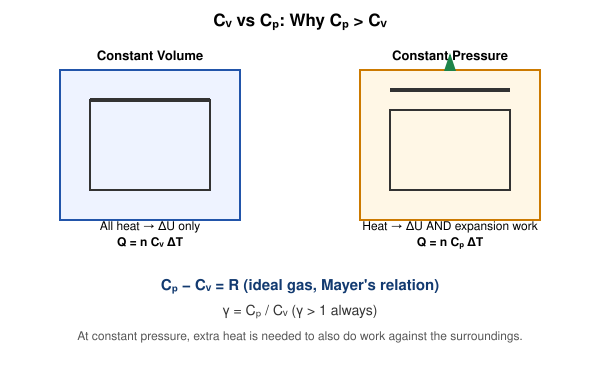

# 8. Difference Between the Two Specific Heats of a Gas

## Learning Objectives

- Define molar specific heats $C_V$ and $C_P$, and distinguish them from specific (per-unit-mass) heat capacities.
- Derive Mayer's relation $C_P - C_V = R$ for an ideal gas.
- Define and interpret the adiabatic index $\gamma = C_P/C_V$.
- Compute $C_V$, $C_P$, and $\gamma$ for monatomic and diatomic ideal gases.

## Definition

> The **molar specific heat at constant volume**, $C_V$, is the heat required to raise the temperature of one mole of a substance by one kelvin while its volume is held constant.
>
> The **molar specific heat at constant pressure**, $C_P$, is the heat required to raise the temperature of one mole of a substance by one kelvin while its pressure is held constant.

$$
C_V = \left(\frac{\partial Q}{\partial T}\right)_V, \qquad C_P = \left(\frac{\partial Q}{\partial T}\right)_P
$$

## Physical Meaning / Intuition

At constant volume, all the heat supplied goes exclusively into raising internal energy (no work is done). At constant pressure, the gas is free to expand, so *some* of the supplied heat is diverted into doing external work against the surroundings — meaning **more heat is required** to achieve the same 1 K rise. This is the physical root of $C_P > C_V$.

## Important Terminology

| Term | Meaning |
|---|---|
| Molar heat capacity | Heat capacity per mole ($\mathrm{J\,mol^{-1}K^{-1}}$) |
| Specific heat capacity | Heat capacity per unit mass ($\mathrm{J\,kg^{-1}K^{-1}}$) |
| Mayer's relation | $C_P - C_V = R$ for an ideal gas |
| Adiabatic index $\gamma$ | $C_P/C_V$, governs adiabatic P–V relations |

**Molar vs specific:** If $M$ is the molar mass (kg/mol), the specific heat $c$ (per kg) and molar heat capacity $C$ (per mole) are related by $C = Mc$. Problems must be checked carefully for which is being used/asked.

## Mathematical Formulation

### Derivation of Mayer's Relation

Start from the First Law in differential form for one mole of ideal gas:

$$
dQ = dU + P\,dV
$$

**At constant volume** ($dV=0$): $dQ = dU$, so by definition,
$$
C_V = \left(\frac{\partial U}{\partial T}\right)_V
$$
Since for an ideal gas $U=U(T)$ only, this partial derivative equals the ordinary derivative:
$$
C_V = \frac{dU}{dT}
$$

**At constant pressure:** Starting again from $dQ = dU + P\,dV$, and dividing by $dT$ at constant $P$:
$$
C_P = \left(\frac{\partial U}{\partial T}\right)_P + P\left(\frac{\partial V}{\partial T}\right)_P
$$
Because $U$ depends on $T$ alone for an ideal gas, $\left(\frac{\partial U}{\partial T}\right)_P = \frac{dU}{dT} = C_V$ as well. From the ideal gas law $PV=RT$ (one mole), differentiating at constant $P$:
$$
P\,dV = R\,dT \quad\Rightarrow\quad P\left(\frac{\partial V}{\partial T}\right)_P = R
$$

Therefore:
$$
C_P = C_V + R
$$

$$
\boxed{C_P - C_V = R} \qquad \text{(Mayer's Relation, per mole, ideal gas)}
$$

### The Adiabatic Index

$$
\gamma = \frac{C_P}{C_V}
$$

Since $C_P = C_V+R$, we have $\gamma = 1 + R/C_V$, so $\gamma$ is always $>1$.

### Values from Equipartition (recall Topic 2)

| Gas type | $C_V$ | $C_P = C_V+R$ | $\gamma=C_P/C_V$ |
|---|---|---|---|
| Monatomic ($f=3$) | $\tfrac32R$ | $\tfrac52R$ | $5/3 \approx 1.67$ |
| Diatomic ($f=5$) | $\tfrac52R$ | $\tfrac72R$ | $7/5 = 1.4$ |

## Explanation of Variables

| Symbol | Meaning | SI unit |
|---|---|---|
| $C_V$ | Molar specific heat at constant volume | $\mathrm{J\,mol^{-1}K^{-1}}$ |
| $C_P$ | Molar specific heat at constant pressure | $\mathrm{J\,mol^{-1}K^{-1}}$ |
| $R$ | Universal gas constant | $\mathrm{J\,mol^{-1}K^{-1}}$ |
| $\gamma$ | Adiabatic index (heat capacity ratio) | dimensionless |
| $M$ | Molar mass | kg/mol |
| $c_V, c_P$ | Specific heats per unit mass | $\mathrm{J\,kg^{-1}K^{-1}}$ |

## SI Units and Dimensions

$$
[C_V]=[C_P]=[R] = \mathrm{M\,L^2\,T^{-2}\,\Theta^{-1}\,mol^{-1}}
$$

## Assumptions and Conditions of Validity

- Mayer's relation $C_P-C_V=R$ is derived **specifically for an ideal gas** — real gases show small deviations because $U$ depends weakly on volume too.
- $C_V$ and $C_P$ are treated as temperature-independent constants in this simplified (equipartition) treatment; in reality, vibrational modes cause $C_V$, $C_P$ (and hence $\gamma$) to increase gradually with temperature for polyatomic/diatomic gases.
- The per-mole formulas require conversion (via molar mass $M$) if working with specific (per-mass) heat capacities.

## Physical Interpretation

$\gamma$ is not just an abstract ratio — it directly sets how "steeply" pressure falls during adiabatic expansion ($PV^\gamma=\text{const}$, Topic 5) and appears in the speed of sound in a gas, $v_s=\sqrt{\gamma RT/M}$ (a connection worth noting, though outside this syllabus's direct derivation scope). A larger $\gamma$ (fewer active degrees of freedom, as in monatomic gases) means the gas's pressure is more sensitive to compression/expansion.

## Important Laws / Theorems / Principles

- **Mayer's Relation**: $C_P - C_V = R$ (ideal gas, per mole).
- **Equipartition Theorem** (Topic 2) supplies the specific numeric values of $C_V$, $C_P$ for monatomic/diatomic gases.

## Worked Numerical Examples

### Problem 1 (Easy)
**Given:** For a monatomic ideal gas, $C_V = 12.47\ \mathrm{J\,mol^{-1}K^{-1}}$.
**Required:** Find $C_P$ and $\gamma$.
**Formula:** $C_P = C_V+R$; $\gamma=C_P/C_V$
**Calculation:**
$$
C_P = 12.47 + 8.314 = 20.78\ \mathrm{J\,mol^{-1}K^{-1}}
$$
$$
\gamma = \frac{20.78}{12.47} = 1.666 \approx \frac{5}{3}
$$
**Answer:** $C_P \approx 20.8\ \mathrm{J\,mol^{-1}K^{-1}}$, $\gamma \approx 1.67$.
**Physical interpretation:** This matches the theoretical monatomic-gas value exactly, confirming $f=3$ translational degrees of freedom.

### Problem 2 (Moderate)
**Given:** A diatomic gas has $\gamma = 1.4$.
**Required:** Find $C_V$ and $C_P$ in terms of $R$, then numerically.
**Formula:** From $\gamma = C_P/C_V$ and $C_P-C_V=R$: solve simultaneously.
**Calculation:**
$$
C_P = \gamma C_V \quad\Rightarrow\quad \gamma C_V - C_V = R \quad\Rightarrow\quad C_V(\gamma-1)=R \quad\Rightarrow\quad C_V = \frac{R}{\gamma-1}
$$
$$
C_V = \frac{8.314}{1.4-1} = \frac{8.314}{0.4} = 20.79\ \mathrm{J\,mol^{-1}K^{-1}}
$$
$$
C_P = \gamma C_V = 1.4 \times 20.79 = 29.10\ \mathrm{J\,mol^{-1}K^{-1}}
$$
**Answer:** $C_V \approx 20.8\ \mathrm{J\,mol^{-1}K^{-1}}$, $C_P\approx 29.1\ \mathrm{J\,mol^{-1}K^{-1}}$.
**Physical interpretation:** These values match the theoretical diatomic-gas prediction $C_V=\tfrac52R\approx20.8$, $C_P=\tfrac72R\approx29.1$, confirming internal consistency.

### Problem 3 (Exam-level — specific heat conversion)
**Given:** Nitrogen gas ($M = 0.028$ kg/mol, diatomic, $C_V = \tfrac52R$) is heated by 5000 J at constant volume, for a sample of mass 0.056 kg.
**Required:** Find the temperature rise, using specific heat per unit mass.
**Formula:** $c_V = C_V/M$; $\Delta Q = m c_V \Delta T \Rightarrow \Delta T = \Delta Q/(mc_V)$
**Calculation:**
$$
C_V = \tfrac52(8.314) = 20.785\ \mathrm{J\,mol^{-1}K^{-1}}
$$
$$
c_V = \frac{20.785}{0.028} = 742.3\ \mathrm{J\,kg^{-1}K^{-1}}
$$
$$
\Delta T = \frac{5000}{(0.056)(742.3)} = \frac{5000}{41.57} = 120.3\ \mathrm{K}
$$
**Answer:** $\Delta T \approx 120\ \mathrm{K}$.
**Physical interpretation:** Correctly converting between molar and mass-specific heat capacities is essential — using $C_V$ directly with a mass in kg (forgetting the $M$ conversion) is a very common and serious error.

## Conceptual Example

Two identical containers of the same ideal gas, one rigid (sealed, constant volume) and one fitted with a frictionless piston open to atmosphere (constant pressure), are each supplied with exactly the same amount of heat. The rigid container's gas temperature rises *more*, because none of its absorbed heat is diverted into expansion work — directly illustrating $C_P>C_V$ without any calculation.

## Common Mistakes

- Using $C_V$ or $C_P$ (molar) directly with a mass in kilograms instead of converting via molar mass $M$.
- Forgetting that Mayer's relation is per-mole; if working with specific heats per unit mass, the correct relation is $c_P - c_V = R/M$.
- Assuming $\gamma$ is a universal constant across all gases — it depends on the gas's molecular structure (monatomic vs diatomic vs polyatomic).
- Reversing $C_P$ and $C_V$ in the ratio $\gamma$ (always $C_P/C_V$, always $>1$).

## Exam Essentials

- Mayer's relation: $C_P-C_V=R$ (per mole, ideal gas) — know the full derivation.
- $\gamma = C_P/C_V$, values $5/3$ (monatomic), $7/5$ (diatomic).
- Distinguish molar vs specific heat capacities and the $M$ conversion factor.

## Possible Exam Questions

- Derive Mayer's relation $C_P - C_V = R$ for an ideal gas starting from the First Law. (derivation — very commonly asked)
- Why is $C_P$ always greater than $C_V$ for a gas? Explain physically. (conceptual)
- Calculate $C_V$ and $C_P$ for a diatomic ideal gas using the equipartition theorem, and verify Mayer's relation. (derivation + numerical)
- A gas has $C_P = 29\ \mathrm{J\,mol^{-1}K^{-1}}$ and $\gamma=1.4$. Find $C_V$ and identify whether the gas is likely monatomic or diatomic. (numerical + conceptual)
- Distinguish between molar heat capacity and specific heat capacity, with the conversion relation. (short)

## Summary

$C_V$ and $C_P$ are the molar heat capacities of a gas at constant volume and constant pressure respectively; because constant-pressure heating must additionally supply expansion work, $C_P$ always exceeds $C_V$, related exactly by Mayer's relation $C_P-C_V=R$ for an ideal gas. Their ratio, the adiabatic index $\gamma=C_P/C_V$, takes the characteristic values $5/3$ for monatomic and $7/5$ for diatomic ideal gases, and governs adiabatic P–V behavior.

## References

- Halliday, Resnick & Walker, *Fundamentals of Physics*.
- Zemansky & Dittman, *Heat and Thermodynamics*.
- Schroeder, D.V., *An Introduction to Thermal Physics*.
