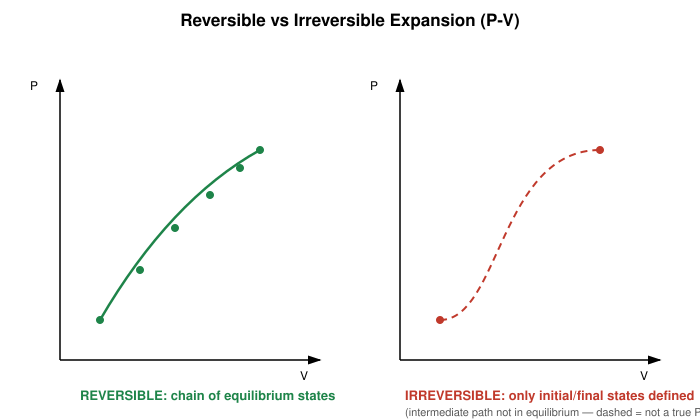
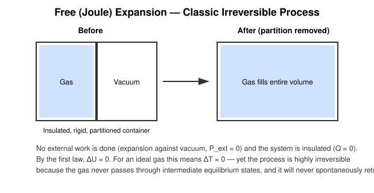

# 9. Reversible and Irreversible Processes

## Learning Objectives

- Define reversible and irreversible processes.
- Explain the role of quasi-static evolution, thermal/mechanical equilibrium, and infinitesimal driving forces.
- Identify common sources of irreversibility: friction, dissipation, finite temperature-difference heat transfer, free expansion.
- Explain why a truly reversible process is an idealization, never perfectly realized.

## Definition

> A **reversible process** is one that can be exactly reversed, restoring both the system *and* its surroundings to their original states, with no net change anywhere in the universe. It proceeds through an unbroken sequence of equilibrium states.
>
> An **irreversible process** is any process that cannot be so reversed — after it occurs, the system and surroundings cannot both be returned to their initial states without some permanent change (typically, an increase in entropy) somewhere in the universe.

## Physical Meaning / Intuition

Reversibility is about *retraceability*, not just "can the system go back to where it started." A gas can certainly be pushed back to its original volume after a free expansion — but doing so requires external work and produces waste heat elsewhere, leaving a permanent footprint in the surroundings. A reversible process leaves absolutely no such footprint.

## Important Terminology

| Term | Meaning |
|---|---|
| Quasi-static process | Occurs so slowly that the system remains arbitrarily close to equilibrium at every instant |
| Thermal equilibrium | No net heat flow — system and surroundings at (nearly) the same temperature |
| Mechanical equilibrium | No net unbalanced force — system and surroundings at (nearly) the same pressure |
| Infinitesimal driving force | The process proceeds under an imbalance that can be made arbitrarily small |
| Dissipation | Conversion of organized (mechanical) energy into disorganized thermal energy, e.g. via friction |
| Free expansion | Gas expansion into a vacuum, with no opposing external pressure |

## Reversible Process — Conditions

A process is reversible only if **all** of the following hold, at every instant:

1. It is **quasi-static** — infinitely slow, so the system passes through a continuum of equilibrium states.
2. It proceeds under an **infinitesimal** driving force / gradient (infinitesimal pressure difference for mechanical work, infinitesimal temperature difference for heat transfer).
3. There is **no dissipative effect** — no friction, no viscosity losses, no electrical resistance, no free expansion.
4. The system is in (or infinitesimally close to) both **thermal** and **mechanical equilibrium** with its surroundings throughout.

## Irreversible Process — Sources

| Source of irreversibility | Example |
|---|---|
| Friction / viscosity | Piston rubbing against cylinder walls |
| Finite temperature-difference heat transfer | Hot object placed in contact with a much colder one |
| Free (unresisted) expansion | Gas rushing into a vacuum |
| Inelastic deformation | Plastic deformation of a solid |
| Mixing of dissimilar substances | Diffusion of two gases into each other |
| Rapid, non-quasi-static compression/expansion | Sudden, violent piston motion |

## Mathematical / Formal Characterization

For a **reversible** process, the work and heat exchanges can be computed directly using the system's *own* instantaneous $P$ and $T$:

$$
dW_{\text{rev}} = P\,dV, \qquad dQ_{\text{rev}} = T\,dS
$$

(the second relation introduces entropy $S$, developed fully in Part 2, but is mentioned here for completeness).

For an **irreversible** process, no such simple relation using the *system's* $P$ generally holds; instead, external constraint values (e.g. $P_{\text{ext}}$, fixed and possibly very different from the system's own pressure) must be used, and intermediate states are typically **not** even well-defined equilibrium states.

## Free Expansion — A Canonical Irreversible Process

A gas is confined to one half of an insulated, rigid, partitioned container, with vacuum on the other side. When the partition is removed:

- No external work is done, since there is no opposing pressure: $W=0$ ($P_{\text{ext}}=0$).
- No heat is exchanged (insulated): $Q=0$.
- By the First Law: $\Delta U = Q - W = 0$; for an ideal gas this implies $\Delta T = 0$.

Yet this process is **highly irreversible**: the gas will never spontaneously return to occupying only half the container. There is no sequence of equilibrium states describing the expansion (it happens through wildly non-uniform, turbulent intermediate states), so it cannot be plotted as a continuous curve on a P–V diagram — only the well-defined initial and final equilibrium points can be marked.

## Equilibrium-State Path Comparison

A reversible expansion/compression traces a continuous, well-defined curve through a dense sequence of equilibrium points on the P–V diagram. An irreversible process connects only the initial and final equilibrium points — any curve drawn "through" the intermediate region is not physically meaningful, since the gas is not in a uniform equilibrium state during the process.

## Comparison Table

| Reversible | Irreversible |
|---|---|
| Infinitely slow (quasi-static) | Finite (often rapid) rate |
| Passes through a continuous sequence of equilibrium states | Passes through non-equilibrium intermediate states |
| No friction/dissipation | Involves friction, turbulence, or other dissipation |
| Driving force is infinitesimal | Driving force is finite |
| Can be exactly reversed, restoring system AND surroundings | Cannot restore both system and surroundings without external change |
| Idealization; only approximated in practice | The norm for real, naturally occurring processes |
| Entropy of the universe unchanged | Entropy of the universe increases |

## Explanation of Variables

| Symbol | Meaning |
|---|---|
| $P_{\text{ext}}$ | External pressure opposing/driving the process |
| $S$ | Entropy (introduced formally in Part 2) |

## Assumptions and Conditions of Validity

- Reversibility is a **limiting idealization** — strictly zero-friction, infinitely-slow processes do not occur in nature; real "reversible" processes are only approximated by sufficiently slow, well-lubricated, small-gradient operations.
- The First Law ($\Delta Q=\Delta U+W$) applies to *both* reversible and irreversible processes — it places no restriction on reversibility. It is the **Second Law** (Part 2) that formally distinguishes them via entropy.

## Physical Interpretation

Why does reversibility matter practically? Because **reversible processes extract the maximum possible work** from a given change of state (or require the minimum possible work input to drive a compression) — irreversibilities (friction, finite-gradient heat flow) always represent *wasted* potential for useful work. This is precisely why idealized reversible cycles (developed in Part 2 via the Carnot cycle) serve as the theoretical upper bound against which real engines are judged.

## Important Laws / Theorems / Principles

- A reversible process is the thermodynamic idealization analogous to "frictionless" in mechanics — an unreachable but extremely useful theoretical limit.
- Every real, spontaneous process in nature is, strictly, irreversible to some degree (this connects directly to the Second Law's entropy statement, covered in Part 2).

## Worked Numerical Examples

### Problem 1 (Easy/Conceptual-Numerical)
**Given:** An ideal gas undergoes free expansion from $V_1=2\times10^{-3}$ m³ to $V_2=6\times10^{-3}$ m³ inside an insulated rigid container.
**Required:** Find $Q$, $W$, and $\Delta U$.
**Formula:** Free expansion: $W=0$ (no opposing pressure), $Q=0$ (insulated).
**Calculation:**
$$
W=0,\qquad Q=0,\qquad \Delta U = Q-W = 0
$$
**Answer:** $Q=0$, $W=0$, $\Delta U=0$.
**Physical interpretation:** Despite a large volume change, none of the ordinary "process" quantities are nonzero — free expansion is thermodynamically deceptive: it looks quiet in terms of $Q$, $W$, $\Delta U$, yet is one of the most irreversible processes possible.

### Problem 2 (Moderate — reversible vs irreversible work comparison)
**Given:** An ideal gas at $P_1=3\times10^5$ Pa, $V_1=1\times10^{-3}$ m³ expands to $V_2=2\times10^{-3}$ m³ (a) reversibly and isothermally, (b) irreversibly against a constant external pressure $P_{\text{ext}}=1\times10^5$ Pa. Given $T$ constant with $nRT = P_1V_1 = 300$ J.
**Required:** Compare work done by the gas in each case.
**Formula:** (a) $W_{\text{rev}} = nRT\ln(V_2/V_1)$; (b) $W_{\text{irrev}} = P_{\text{ext}}(V_2-V_1)$
**Calculation:**
$$
W_{\text{rev}} = 300 \times \ln(2) = 300 \times 0.693 = 207.9\ \mathrm{J}
$$
$$
W_{\text{irrev}} = (1\times10^5)(2\times10^{-3}-1\times10^{-3}) = (1\times10^5)(1\times10^{-3}) = 100\ \mathrm{J}
$$
**Answer:** $W_{\text{rev}} \approx 208\ \mathrm{J}$ vs $W_{\text{irrev}} = 100\ \mathrm{J}$.
**Physical interpretation:** The reversible process extracts substantially more work for the *same* volume change — direct numerical confirmation that reversible processes are maximally work-efficient.

### Problem 3 (Exam-level)
**Given:** A block slides down a rough incline, converting some gravitational PE into heat via friction, rather than entirely into kinetic energy.
**Required:** Explain, without detailed calculation, why this process is irreversible, and identify the "wasted" energy channel.
**Formula/Reasoning:** Compare total energy input (loss in PE) to useful output (final KE); any deficit appears as frictional heat.
**Calculation:** Conceptual — $\Delta PE = \Delta KE + Q_{\text{friction}}$, with $Q_{\text{friction}} > 0$ representing dissipated energy that cannot be spontaneously reclaimed to push the block back uphill.
**Answer:** The process is irreversible because kinetic friction dissipates part of the mechanical energy into disordered thermal energy in the incline and block surfaces — reversing the block's motion afterward would require an external energy input strictly greater than the frictional heat generated, so the universe (block + incline + surroundings) cannot be restored to its exact original state.
**Physical interpretation:** This models exactly why "reversible" is such a strong, idealized condition — the mere presence of any friction anywhere in the process is enough to make the whole process irreversible.

## Conceptual Example

Slowly compressing a gas using an infinite series of infinitesimally-heavier weights placed one at a time on a frictionless piston (theoretically) approximates a reversible process — at every stage, removing the last weight added would exactly retrace the previous step. Contrast this with suddenly dropping one large weight onto the piston all at once: the gas is violently compressed through turbulent, non-equilibrium states, and no simple retracing of that single large step is possible — this is irreversible, even though the piston could later be pushed back to its original position by other means.

## Common Mistakes

- Believing "reversible" simply means "the system can be brought back to its initial state" — the correct, stricter requirement is that **both** the system *and* its surroundings return to their initial states with no net effect anywhere.
- Assuming $\Delta U=0$ (as in free expansion) implies the process was reversible — it does not; free expansion is a textbook example of an irreversible process with $\Delta U=0$.
- Thinking a slow process is automatically reversible — slowness (quasi-static) is necessary but **not sufficient**; the process must also be free of dissipative effects like friction.
- Confusing reversibility (a property of the process/path) with the values of state functions (a property of the endpoints).

## Exam Essentials

- Precise definition distinguishing reversible from irreversible, emphasizing "system AND surroundings."
- The four joint conditions for reversibility: quasi-static, infinitesimal driving force, no dissipation, continuous equilibrium.
- Free expansion as the canonical irreversible example with $Q=W=\Delta U=0$.
- Reversible processes yield **maximum** work output / **minimum** work input for a given state change.

## Possible Exam Questions

- Define reversible and irreversible processes, and list the necessary conditions for reversibility. (short/descriptive)
- Explain why free expansion of a gas is irreversible even though $\Delta U=0$. (conceptual)
- Compare the work done during reversible and irreversible isothermal expansion between the same two volumes. (derivation + numerical)
- "A quasi-static process is always reversible." Comment on the validity of this statement. (conceptual, exam trap)
- Give three real-world examples of irreversible processes and identify the source of irreversibility in each. (short)

## Summary

A reversible process is an idealized, infinitely slow, dissipation-free sequence of equilibrium states that can be exactly retraced, restoring both system and surroundings with no net effect. Real processes are irreversible to some degree, due to friction, finite-gradient heat transfer, free expansion, or other dissipative effects — free expansion being the sharpest textbook example, since $Q=W=\Delta U=0$ even though the process is thoroughly irreversible. Reversible processes represent the theoretical limit of maximum work extraction, motivating their central role in the idealized heat-engine analysis of Part 2.

## References

- Halliday, Resnick & Walker, *Fundamentals of Physics*.
- Zemansky & Dittman, *Heat and Thermodynamics*.
- Schroeder, D.V., *An Introduction to Thermal Physics*.
