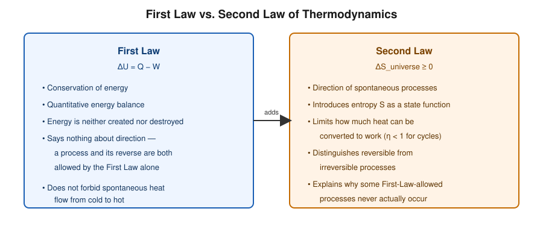
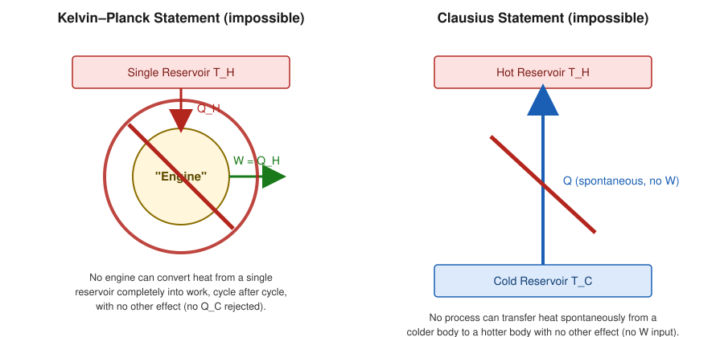
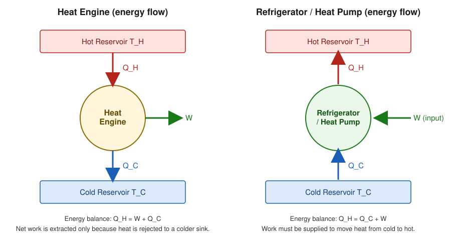
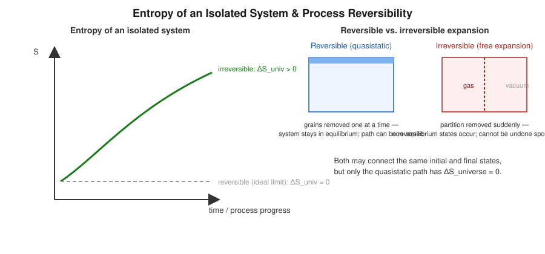

# Second Law of Thermodynamics

## Learning Objectives

By the end of this section you should be able to:

- State the Kelvin–Planck and Clausius statements of the Second Law and show they are equivalent.
- Explain why the First Law alone cannot determine the direction of a natural process.
- Define entropy $S$ for reversible heat exchange and state the Clausius inequality.
- Distinguish clearly between heat, temperature, internal energy, and entropy.

## Introduction

The First Law of Thermodynamics ($\Delta U = Q - W$) is a statement of energy conservation: it tracks *how much* energy moves between a system and its surroundings, but it places no restriction on the *direction* in which a process can proceed. Experience shows that many energetically-allowed processes never happen spontaneously — a cup of hot tea cools down in a room, never the reverse; gas expands freely to fill a vacuum, never spontaneously recompresses itself. The **Second Law of Thermodynamics** supplies the missing directional principle.

## Definition

The Second Law has several historically independent but logically equivalent statements. The two classical ones are:

**Kelvin–Planck statement:**
> It is impossible to construct a device that, operating in a cycle, produces no effect other than the extraction of heat from a single reservoir and the performance of an equivalent amount of work.

**Clausius statement:**
> It is impossible to construct a device that, operating in a cycle, produces no effect other than the transfer of heat from a colder body to a hotter body.

For contrast, the *allowed* energy-flow patterns for a real heat engine and a real refrigerator/heat pump are shown below — both always exchange heat with **two** reservoirs and involve work:

## Physical Meaning

Both statements forbid a particular kind of "free lunch":

- Kelvin–Planck forbids a heat engine with 100% efficiency (no engine can convert heat completely into work, cycle after cycle, without rejecting some heat to a colder sink).
- Clausius forbids heat flowing "uphill" (from cold to hot) without external work being supplied.

**Equivalence.** The two statements can be shown to be logically equivalent: if a Clausius-violating device existed, it could be coupled to an ordinary heat engine to build a Kelvin–Planck-violating device, and vice versa. Violating one violates the other, so they are two faces of the same underlying law.

## Mathematical Formulation

For any reversible infinitesimal heat exchange $\delta Q_{\mathrm{rev}}$ at absolute temperature $T$, the **entropy** change of the system is defined as

$$
dS=\frac{\delta Q_{\mathrm{rev}}}{T}
$$

where:

- $dS$ — infinitesimal change in entropy (J/K)
- $\delta Q_{\mathrm{rev}}$ — infinitesimal heat transferred *reversibly* (J)
- $T$ — absolute temperature at which the transfer occurs (K)

For any cyclic process (reversible or not), the **Clausius inequality** holds:

$$
\oint \frac{\delta Q}{T}\leq0
$$

with equality holding if and only if the cycle is reversible.

For an **isolated system** (no heat or work crosses its boundary), the Second Law takes the compact form

$$
\Delta S \geq 0
$$

with equality only in the reversible limit.

## Derivation

**From Clausius inequality to entropy as a state function.**

Consider a system taken from state 1 to state 2 by a reversible path $R_1$, and back from 2 to 1 by a different reversible path $R_2$. This forms a reversible cycle, so

$$
\oint \frac{\delta Q_{\mathrm{rev}}}{T} = \int_1^2 \frac{\delta Q_{\mathrm{rev}}}{T}\bigg|_{R_1} + \int_2^1 \frac{\delta Q_{\mathrm{rev}}}{T}\bigg|_{R_2} = 0
$$

so

$$
\int_1^2 \frac{\delta Q_{\mathrm{rev}}}{T}\bigg|_{R_1} = -\int_2^1 \frac{\delta Q_{\mathrm{rev}}}{T}\bigg|_{R_2} = \int_1^2 \frac{\delta Q_{\mathrm{rev}}}{T}\bigg|_{R_2}
$$

The integral $\int_1^2 \delta Q_{\mathrm{rev}}/T$ is therefore **independent of the reversible path taken** — it depends only on the end states. This is precisely the defining property of a state function, which is why entropy $S$ can be assigned a definite value at each equilibrium state (up to an additive constant, fixed later by the Third Law).

**From the Clausius inequality to $\Delta S \geq 0$ for an isolated system.**

For any cycle (reversible or irreversible) between states 1 and 2, followed by a reversible return path:

$$
\int_1^2 \frac{\delta Q}{T} + \int_2^1 \frac{\delta Q_{\mathrm{rev}}}{T} \leq 0
$$

Using $\int_2^1 \delta Q_{\mathrm{rev}}/T = -(S_2 - S_1)$:

$$
\int_1^2 \frac{\delta Q}{T} \leq S_2 - S_1
$$

If the process is adiabatic ($\delta Q = 0$, as is automatically true for an isolated system), this reduces to

$$
S_2 - S_1 \geq 0 \quad\Longrightarrow\quad \Delta S \geq 0
$$

which is the entropy statement of the Second Law.

## Important Equations

$$
dS=\frac{\delta Q_{\mathrm{rev}}}{T}, \qquad \oint \frac{\delta Q}{T}\leq0, \qquad \Delta S_{\text{isolated}} \geq 0
$$

## Physical Interpretation

- **Heat** ($Q$) is energy in transit due to a temperature difference — it is *not* a state function (path-dependent, $\delta Q$).
- **Temperature** ($T$) is an intensive state variable measuring the tendency of a system to transfer heat.
- **Internal energy** ($U$) is a state function representing the total microscopic energy content of the system.
- **Entropy** ($S$) is a state function measuring the number of microscopic configurations consistent with a macrostate (statistically), or equivalently, accumulated $\delta Q_{\mathrm{rev}}/T$ (classically). Unlike $U$, entropy of an isolated system never decreases.

Confusing these four quantities is the single most common source of error at this level — always ask "is this energy in transit, a state property, or a measure of disorder/available microstates?"

## Worked Examples

### Problem 1 — Direction check with the Kelvin–Planck statement

**Given:** A proposed engine claims to absorb $500\ \text{J}$ of heat from a single reservoir at $400\ \text{K}$ and convert it entirely into work, rejecting no heat anywhere.

**Required:** Determine whether this is physically possible.

**Relevant Principle:** Kelvin–Planck statement.

**Formula:** $\eta = W/Q_H \leq 1$, with equality forbidden for a cyclic device with a single reservoir.

**Derivation/Setup:** The claimed process uses one reservoir only and converts $Q_H$ completely to $W$, i.e. $\eta = 1$.

**Calculation:** Since the device produces no other effect (no $Q_C$ rejected), $\eta = 500/500 = 1$.

**Final Answer:** Impossible — this directly violates the Kelvin–Planck statement.

**Physical Meaning:** Any cyclic heat engine *must* reject some heat to a cooler reservoir; $\eta = 1$ is unattainable in a cycle.

### Problem 2 — Entropy change for reversible isothermal heat transfer

**Given:** $200\ \text{J}$ of heat is transferred reversibly to a system at a constant temperature of $250\ \text{K}$.

**Required:** Find $\Delta S$ of the system.

**Relevant Principle:** $dS = \delta Q_{\mathrm{rev}}/T$.

**Formula:** $\Delta S = Q_{\mathrm{rev}}/T$ (T constant).

**Calculation:**

$$
\Delta S = \frac{200\ \text{J}}{250\ \text{K}} = 0.8\ \text{J/K}
$$

**Final Answer:** $\Delta S = 0.8\ \text{J/K}$.

**Physical Meaning:** Entropy increases because heat flows *into* the system; the same magnitude of heat flowing out at the same temperature would decrease entropy by the same amount.

### Problem 3 — Applying $\Delta S \geq 0$ to an isolated system

**Given:** Two identical blocks, one at $350\ \text{K}$ and one at $250\ \text{K}$, are placed in contact inside a perfectly insulated (isolated) enclosure and allowed to reach a common final temperature.

**Required:** Argue, without doing the full calculation, whether $\Delta S_{\text{total}}$ is positive, negative, or zero.

**Relevant Principle:** Second Law for isolated systems, $\Delta S \geq 0$.

**Derivation/Setup:** Heat flows spontaneously and irreversibly from the hot block to the cold block until thermal equilibrium is reached.

**Calculation:** Because the process is spontaneous and irreversible (finite temperature difference drives the heat flow) and the composite system is isolated, the Second Law requires $\Delta S_{\text{total}} > 0$.

**Final Answer:** $\Delta S_{\text{total}} > 0$.

**Physical Meaning:** The entropy gained by the cold block (heated at lower $T$, so a larger $\delta Q/T$) exceeds the entropy lost by the hot block (cooled at higher $T$, smaller $\delta Q/T$ per unit heat), giving a net positive entropy change — consistent with irreversibility.

## Conceptual Questions

1. Why does the First Law fail to explain why heat never spontaneously flows from a cold body to a hot one?
2. Show qualitatively why a Clausius-violating refrigerator, combined with an ordinary heat engine, would violate the Kelvin–Planck statement.
3. Is entropy conserved in a reversible adiabatic process? Justify using $dS = \delta Q_{\mathrm{rev}}/T$.
4. Why is $\delta Q$ (heat) not a state function while $S$ (entropy) is?

## Common Mistakes

- Writing $\Delta S \geq 0$ for *any* system — this only holds for an **isolated** system (or the universe as a whole); a system's own entropy can decrease if heat leaves it.
- Confusing $Q$ (path-dependent) with $S$ (state function).
- Applying $dS = \delta Q/T$ using an *irreversible* $\delta Q$ directly — the formula requires the heat to be exchanged reversibly, or an equivalent reversible path must be constructed.
- Treating the Kelvin–Planck and Clausius statements as unrelated rather than logically equivalent.

## Exam Essentials

### Important Definitions
- Entropy, reversible/irreversible process, isolated system.

### Important Laws and Theorems
- Kelvin–Planck statement; Clausius statement; their equivalence.

### Must-Know Equations
$$dS=\frac{\delta Q_{\mathrm{rev}}}{T}, \qquad \oint \frac{\delta Q}{T}\leq0, \qquad \Delta S_{\text{isolated}}\geq0$$

### Important Derivations
- Entropy as a state function from the Clausius inequality.
- $\Delta S \geq 0$ for an isolated adiabatic system.

### Conceptual Questions
- See "Conceptual Questions" above.

### Numerical Questions
- See "Worked Examples" above.

### Common Exam Mistakes
- See "Common Mistakes" above.

### One-Minute Revision
Second Law adds *direction* to the energy accounting of the First Law. Two equivalent classical statements (Kelvin–Planck: no 100%-efficient cyclic engine; Clausius: no spontaneous cold→hot heat flow) both forbid different "free lunches." Entropy, defined via $dS = \delta Q_{\mathrm{rev}}/T$, is a state function that never decreases for an isolated system.

## Summary

The Second Law introduces directionality into thermodynamics through two equivalent classical statements and through the state function entropy. Reversible heat exchange defines $dS$; the Clausius inequality generalizes this to all cycles; and for isolated systems this reduces to the compact and powerful statement $\Delta S \geq 0$.

## References

- Zemansky, M. W. & Dittman, R. H., *Heat and Thermodynamics*.
- Halliday, D., Resnick, R. & Walker, J., *Fundamentals of Physics*.
- Schroeder, D. V., *An Introduction to Thermal Physics*.
