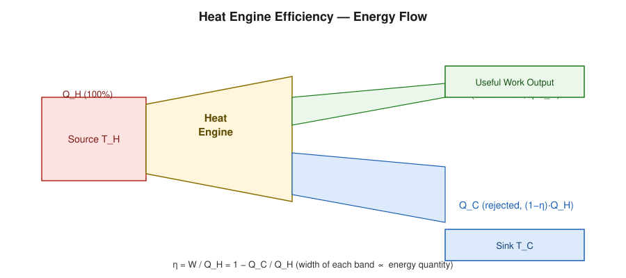

# Efficiency of Heat Engines

## Learning Objectives

- Derive thermal efficiency from the First Law applied to a cyclic heat engine.
- Distinguish heat input, work output, and rejected heat.
- Explain real-engine limitations that keep efficiency well below the theoretical maximum.

## Introduction

A **heat engine** is any device that operates in a cycle, absorbs heat from a hot source, converts part of it into net work, and rejects the remainder to a cold sink. Cars, steam turbines, and gas turbines are all heat engines. The **thermal efficiency** quantifies how much of the absorbed heat is converted to useful work.

## Definition

The thermal efficiency of a heat engine is

$$
\eta=\frac{W}{Q_H}
$$

where:

- $\eta$ — thermal efficiency (dimensionless, often expressed as %)
- $W$ — net work output per cycle (J)
- $Q_H$ — heat absorbed from the hot reservoir per cycle (J)

## Physical Meaning

Because the engine operates in a **cycle**, its internal energy returns to the same value after each cycle ($\Delta U_{\text{cycle}} = 0$). By the First Law applied over one cycle:

$$
\Delta U_{\text{cycle}} = Q_H - Q_C - W = 0 \quad\Rightarrow\quad W = Q_H - Q_C
$$

where $Q_C$ is the heat rejected to the cold reservoir. Substituting into $\eta = W/Q_H$ gives the equivalent, frequently used form:

$$
\eta=1-\frac{Q_C}{Q_H}
$$

The Second Law (Kelvin–Planck) guarantees $Q_C > 0$ always, so $\eta < 1$ strictly for any real cyclic engine.

## Mathematical Formulation

$$
\eta=\frac{W}{Q_H}=1-\frac{Q_C}{Q_H}
$$

## Derivation

Starting from the First Law for a closed cyclic process:

$$
\oint dU = 0 = Q_{\text{net}} - W_{\text{net}}
$$

Splitting net heat into what is absorbed ($Q_H$, taken positive) and what is rejected ($Q_C$, taken positive as a magnitude):

$$
Q_{\text{net}} = Q_H - Q_C
$$

so

$$
W = Q_H - Q_C
$$

Dividing through by $Q_H$:

$$
\frac{W}{Q_H} = 1 - \frac{Q_C}{Q_H} \quad\Longrightarrow\quad \eta = 1-\frac{Q_C}{Q_H}
$$

## Important Equations

$$
\eta=\frac{W}{Q_H}, \qquad \eta = 1-\frac{Q_C}{Q_H}, \qquad W = Q_H - Q_C
$$

## Physical Interpretation

No real engine reaches $\eta = 1$: friction, turbulence, finite-rate (non-quasistatic) heat transfer, and other dissipative effects all reduce efficiency below even the reversible (Carnot) limit discussed in the next section. Real engines (internal combustion, steam) typically achieve $\eta \sim 0.25$–$0.45$, well below the Carnot bound for their operating temperatures.

## Worked Examples

### Problem 1 — Basic efficiency from heat quantities

**Given:** An engine absorbs $Q_H = 800\ \text{J}$ and rejects $Q_C = 500\ \text{J}$ per cycle.

**Required:** Efficiency $\eta$ and work output $W$.

**Formula:** $\eta = 1 - Q_C/Q_H$; $W = Q_H - Q_C$.

**Calculation:**

$$
W = 800 - 500 = 300\ \text{J}, \qquad \eta = 1 - \frac{500}{800} = 0.375
$$

**Final Answer:** $W = 300\ \text{J}$, $\eta = 37.5\%$.

**Physical Meaning:** Just over a third of the absorbed heat becomes useful work; the rest is rejected to the sink.

### Problem 2 — Finding rejected heat from efficiency

**Given:** An engine with $\eta = 30\%$ absorbs $Q_H = 1200\ \text{J}$ per cycle.

**Required:** $Q_C$ and $W$.

**Formula:** $\eta = 1 - Q_C/Q_H \Rightarrow Q_C = Q_H(1-\eta)$.

**Calculation:**

$$
Q_C = 1200(1-0.30) = 840\ \text{J}, \qquad W = Q_H - Q_C = 1200-840=360\ \text{J}
$$

**Final Answer:** $Q_C = 840\ \text{J}$, $W = 360\ \text{J}$.

**Physical Meaning:** Lower efficiency means a larger fraction of $Q_H$ must be rejected as waste heat.

### Problem 3 — Power output given efficiency and heat input rate

**Given:** An engine operates at $\eta = 25\%$ and absorbs heat at a rate of $2000\ \text{W}$ from the source.

**Required:** Power output (rate of doing work).

**Formula:** $P_{\text{out}} = \eta \times P_{\text{in}}$.

**Calculation:**

$$
P_{\text{out}} = 0.25 \times 2000 = 500\ \text{W}
$$

**Final Answer:** $500\ \text{W}$.

**Physical Meaning:** Efficiency scales directly to power when heat is supplied continuously rather than per discrete cycle.

### Problem 4 — Challenge: finding required $Q_H$ for a target work output

**Given:** A target work output of $W = 750\ \text{J}$ per cycle is required from an engine of efficiency $\eta = 0.42$.

**Required:** $Q_H$ and $Q_C$.

**Formula:** $\eta = W/Q_H \Rightarrow Q_H = W/\eta$; $Q_C = Q_H - W$.

**Calculation:**

$$
Q_H = \frac{750}{0.42} = 1785.7\ \text{J}, \qquad Q_C = 1785.7 - 750 = 1035.7\ \text{J}
$$

**Final Answer:** $Q_H \approx 1786\ \text{J}$, $Q_C \approx 1036\ \text{J}$.

**Physical Meaning:** Achieving a fixed work output at lower efficiency demands proportionally more heat input and rejects proportionally more waste heat.

## Conceptual Questions

1. Why is $\eta = 1$ impossible for *any* cyclic heat engine, regardless of design?
2. If an engine's $Q_C$ were reduced to zero while keeping $Q_H$ fixed, what law would be violated?
3. Explain physically why real engines have friction- and heat-transfer-related losses that push $\eta$ below the theoretical maximum.

## Common Mistakes

- Using $\eta = W/Q_C$ instead of $\eta = W/Q_H$.
- Forgetting the $\Delta U_{\text{cycle}} = 0$ condition, which is what makes $W = Q_H - Q_C$ valid only for a *complete cycle*, not an arbitrary process.
- Treating efficiency as if it could reach or exceed 100% without violating the Second Law.

## Exam Essentials

### Important Definitions
Thermal efficiency, heat input, work output, rejected heat.

### Important Laws and Theorems
First Law applied to a cycle; Kelvin–Planck implication that $Q_C > 0$.

### Must-Know Equations
$$\eta=\frac{W}{Q_H}=1-\frac{Q_C}{Q_H}$$

### Important Derivations
Efficiency derived from $\Delta U_{\text{cycle}} = 0$.

### Conceptual Questions
See above.

### Numerical Questions
See Worked Examples.

### Common Exam Mistakes
See Common Mistakes.

### One-Minute Revision
For any cyclic engine, $W = Q_H - Q_C$ (First Law over a cycle) and $\eta = W/Q_H = 1 - Q_C/Q_H$. The Second Law guarantees $Q_C > 0$, so $\eta < 1$ always.

## Summary

Heat engine efficiency follows directly from applying the First Law to a full thermodynamic cycle. While the formula is simple, its physical content — that some heat must always be rejected — is a direct consequence of the Second Law and sets the stage for finding the *maximum possible* efficiency via the Carnot cycle.

## References

- Zemansky, M. W. & Dittman, R. H., *Heat and Thermodynamics*.
- Halliday, D., Resnick, R. & Walker, J., *Fundamentals of Physics*.
- Schroeder, D. V., *An Introduction to Thermal Physics*.
