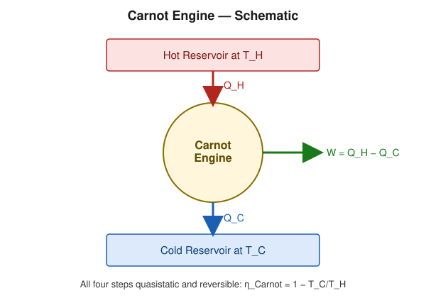
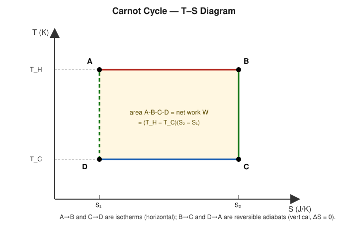

# Carnot's Cycle and Carnot's Engine

## Learning Objectives

- Describe the four processes of the Carnot cycle and their order.
- Derive the Carnot efficiency $\eta_C = 1 - T_C/T_H$.
- Explain why temperatures must be expressed in Kelvin in the Carnot formula.

## Introduction

The **Carnot cycle**, proposed by Sadi Carnot in 1824, is an idealized thermodynamic cycle that establishes the *maximum possible efficiency* any heat engine can achieve while operating between two fixed temperatures. No real engine can beat a Carnot engine operating between the same two reservoirs.

## Definition

The Carnot cycle for an ideal gas consists of four reversible processes, performed in sequence:

1. **A → B: Isothermal expansion** at $T_H$ — gas absorbs $Q_H$ from the hot reservoir.
2. **B → C: Adiabatic expansion** — gas cools from $T_H$ to $T_C$ with no heat exchange.
3. **C → D: Isothermal compression** at $T_C$ — gas rejects $Q_C$ to the cold reservoir.
4. **D → A: Adiabatic compression** — gas warms from $T_C$ back to $T_H$, closing the cycle.

The same cycle is often drawn on **T–S axes**, where the isotherms become horizontal lines and the reversible adiabats become vertical lines — making the net work (area of the loop) especially easy to read off as $(T_H-T_C)(S_2-S_1)$:

## Physical Meaning

The enclosed area of the P–V loop equals the net work done per cycle, $W = Q_H - Q_C$. Because all four steps are reversible, the Carnot cycle achieves the theoretical maximum efficiency for given $T_H, T_C$ — any irreversibility (friction, finite-rate heat transfer) can only lower efficiency, never raise it (see Carnot's Theorem).

## Mathematical Formulation

$$
\eta_C=1-\frac{T_C}{T_H}
$$

where $T_H$ and $T_C$ **must be in Kelvin** (absolute temperature).

## Derivation

For $n$ moles of ideal gas, using $PV = nRT$ and $C_V$ for the adiabatic legs:

**Step A→B (isothermal at $T_H$):** Since $\Delta U = 0$ (constant $T$ for ideal gas), $Q_H = W_{AB} = nRT_H \ln(V_B/V_A)$.

**Step C→D (isothermal at $T_C$):** Similarly, $Q_C = -W_{CD} = nRT_C \ln(V_C/V_D)$ (heat rejected, magnitude).

**Steps B→C and D→A (adiabatic):** Using $TV^{\gamma-1} = \text{const}$:

$$
T_H V_B^{\gamma-1} = T_C V_C^{\gamma-1} \qquad\text{and}\qquad T_H V_A^{\gamma-1} = T_C V_D^{\gamma-1}
$$

Dividing these two relations:

$$
\frac{V_B^{\gamma-1}}{V_A^{\gamma-1}} = \frac{V_C^{\gamma-1}}{V_D^{\gamma-1}} \quad\Longrightarrow\quad \frac{V_B}{V_A} = \frac{V_C}{V_D}
$$

This lets the logarithms cancel when forming the ratio $Q_C/Q_H$:

$$
\frac{Q_C}{Q_H} = \frac{T_C \ln(V_C/V_D)}{T_H \ln(V_B/V_A)} = \frac{T_C}{T_H}
$$

Substituting into $\eta = 1 - Q_C/Q_H$:

$$
\eta_C = 1-\frac{T_C}{T_H}
$$

**Why Kelvin is required:** the derivation above uses $TV^{\gamma-1} = \text{const}$ and $PV=nRT$, both of which are valid only for absolute temperature. Using Celsius would give incorrect (and even negative or infinite) efficiencies, since $T=0\,^\circ\text{C} \neq 0$ on the absolute scale — the ratio $T_C/T_H$ has no valid physical meaning unless both are measured from absolute zero.

## Important Equations

$$
\eta_C=1-\frac{T_C}{T_H}, \qquad \frac{Q_C}{Q_H}=\frac{T_C}{T_H}, \qquad W = Q_H - Q_C
$$

## Physical Interpretation

$\eta_C$ depends **only** on the two reservoir temperatures, not on the working substance or engine design. It increases as $T_H$ rises or $T_C$ falls, and approaches 1 only as $T_C \to 0\ \text{K}$ (unreachable per the Third Law) or $T_H \to \infty$.

## Worked Examples

### Problem 1 — Basic Carnot efficiency

**Given:** $T_H = 600\ \text{K}$, $T_C = 300\ \text{K}$.

**Formula:** $\eta_C = 1 - T_C/T_H$.

**Calculation:** $\eta_C = 1 - 300/600 = 0.5$.

**Final Answer:** $\eta_C = 50\%$.

**Physical Meaning:** Even the theoretical maximum lets only half the heat become work here — the rest must be rejected by the Second Law.

### Problem 2 — Using Celsius correctly

**Given:** $T_H = 227\,^\circ\text{C}$, $T_C = 27\,^\circ\text{C}$.

**Required:** $\eta_C$.

**Formula:** Convert to Kelvin first: $T(\text{K}) = T(^\circ\text{C}) + 273$.

**Calculation:** $T_H = 500\ \text{K}$, $T_C = 300\ \text{K}$, so $\eta_C = 1 - 300/500 = 0.4$.

**Final Answer:** $\eta_C = 40\%$.

**Physical Meaning:** Using the Celsius values directly ($1 - 27/227 = 0.881$) would give a badly wrong answer — this is the classic Kelvin-conversion pitfall.

### Problem 3 — Finding $Q_C$ and $W$ for a Carnot engine

**Given:** A Carnot engine operates between $T_H = 500\ \text{K}$ and $T_C = 350\ \text{K}$, absorbing $Q_H = 2000\ \text{J}$ per cycle.

**Required:** $Q_C$ and $W$.

**Formula:** $Q_C = Q_H (T_C/T_H)$; $W = Q_H - Q_C$.

**Calculation:**

$$
Q_C = 2000 \times \frac{350}{500} = 1400\ \text{J}, \qquad W = 2000 - 1400 = 600\ \text{J}
$$

**Final Answer:** $Q_C = 1400\ \text{J}$, $W = 600\ \text{J}$.

**Physical Meaning:** Here $\eta_C = 600/2000 = 0.30$, consistent with $1 - T_C/T_H = 1 - 0.7 = 0.30$.

### Problem 4 — Challenge: required $T_H$ for a target efficiency

**Given:** A Carnot engine must achieve $\eta_C = 0.60$ while rejecting heat to a sink at $T_C = 280\ \text{K}$.

**Required:** Minimum $T_H$.

**Formula:** $\eta_C = 1 - T_C/T_H \Rightarrow T_H = T_C/(1-\eta_C)$.

**Calculation:**

$$
T_H = \frac{280}{1-0.60} = \frac{280}{0.40} = 700\ \text{K}
$$

**Final Answer:** $T_H = 700\ \text{K}$.

**Physical Meaning:** Achieving higher efficiency at a fixed sink temperature requires a correspondingly hotter source — this is why real power plants push for the highest safely attainable source temperatures.

## Conceptual Questions

1. Why does $\eta_C$ depend only on temperatures and not on the gas used or the size of the engine?
2. What would $\eta_C = 1$ require, and why is it physically unattainable?
3. Sketch (conceptually) how $\eta_C$ changes as $T_C \to T_H$.

## Common Mistakes

- Plugging Celsius temperatures directly into $\eta_C = 1 - T_C/T_H$.
- Confusing the *actual* efficiency of a real engine with the *Carnot* (maximum possible) efficiency at the same reservoir temperatures.
- Forgetting that all four Carnot steps must be reversible — an irreversible cycle using the same P–V extremes would have lower efficiency.

## Exam Essentials

### Important Definitions
Isothermal/adiabatic legs of the Carnot cycle; reversible cycle.

### Important Laws and Theorems
Carnot efficiency depends only on reservoir temperatures.

### Must-Know Equations
$$\eta_C=1-\frac{T_C}{T_H}, \qquad \frac{Q_C}{Q_H}=\frac{T_C}{T_H}$$

### Important Derivations
Full derivation of $\eta_C$ from isothermal work integrals and the adiabatic relation $TV^{\gamma-1}=\text{const}$.

### Conceptual Questions
See above.

### Numerical Questions
See Worked Examples.

### Common Exam Mistakes
See Common Mistakes.

### One-Minute Revision
Carnot cycle = isothermal expansion → adiabatic expansion → isothermal compression → adiabatic compression, all reversible. $\eta_C = 1-T_C/T_H$ with T in Kelvin; this is the theoretical ceiling for any engine between the same two reservoirs.

## Summary

The Carnot cycle combines two isotherms and two adiabats to produce the maximum possible efficiency between two fixed temperatures, $\eta_C = 1 - T_C/T_H$. Its purely temperature-dependent form — independent of working substance — makes it the universal benchmark against which all real engines are measured.

## References

- Zemansky, M. W. & Dittman, R. H., *Heat and Thermodynamics*.
- Halliday, D., Resnick, R. & Walker, J., *Fundamentals of Physics*.
- Schroeder, D. V., *An Introduction to Thermal Physics*.
