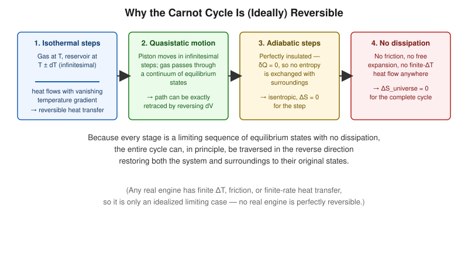

# Carnot Cycle as a Reversible Cycle

## Learning Objectives

- Identify the physical conditions that make each of the four Carnot steps reversible.
- Explain quasistatic processes and their connection to reversibility.
- State the entropy condition satisfied by a reversible cycle.

## Introduction

Reversibility is the defining *idealization* of the Carnot cycle. A reversible process is one that can be exactly reversed, restoring both the system and its surroundings to their original states, with no net change anywhere in the universe. Real processes are never perfectly reversible, but the Carnot cycle serves as the theoretical limiting case.

## Definition

A process is **reversible** if it proceeds through a continuous sequence of equilibrium (or near-equilibrium) states, with no dissipative effects (friction, turbulence, unrestrained expansion) and no finite-temperature-difference heat transfer. Such a process is also called **quasistatic** when it additionally proceeds infinitely slowly relative to the system's internal relaxation time.

## Physical Meaning

Each of the four Carnot steps is reversible under idealized conditions:

1. **Isothermal steps:** heat is exchanged with a reservoir whose temperature differs from the system's by only an infinitesimal amount $dT$, so the direction of heat flow could, in principle, be reversed by an infinitesimal change in conditions.
2. **Adiabatic steps:** the system is perfectly insulated, so $\delta Q = 0$ and $dS = 0$ for the step — no entropy is generated or exchanged.
3. **All steps are quasistatic:** the piston moves in infinitesimal increments, so the gas is always arbitrarily close to internal equilibrium.
4. **No dissipation:** by assumption, there is no friction and no free (unrestrained) expansion anywhere in the cycle.

## Mathematical Formulation

For the reversible Carnot cycle, the Clausius integral vanishes exactly:

$$
\oint \frac{\delta Q_{\mathrm{rev}}}{T} = 0
$$

which is consistent with entropy being a state function returning to its initial value after a full cycle. Correspondingly,

$$
\Delta S_{\text{universe, Carnot cycle}} = 0
$$

## Derivation

Decompose the cyclic Clausius integral into the four legs:

$$
\oint \frac{\delta Q_{\mathrm{rev}}}{T} = \int_A^B \frac{\delta Q}{T_H} + \int_B^C \frac{\delta Q}{T} + \int_C^D \frac{\delta Q}{T_C} + \int_D^A \frac{\delta Q}{T}
$$

The adiabatic legs (B→C, D→A) contribute zero since $\delta Q = 0$ throughout. The isothermal legs contribute:

$$
\int_A^B \frac{\delta Q}{T_H} = \frac{Q_H}{T_H}, \qquad \int_C^D \frac{\delta Q}{T_C} = -\frac{Q_C}{T_C}
$$

(negative because heat leaves the system on C→D). From the Carnot-efficiency derivation, $Q_C/Q_H = T_C/T_H$, i.e. $Q_H/T_H = Q_C/T_C$. Therefore:

$$
\oint \frac{\delta Q_{\mathrm{rev}}}{T} = \frac{Q_H}{T_H} - \frac{Q_C}{T_C} = 0
$$

confirming the cycle is consistent with zero net entropy production — the hallmark of reversibility.

## Important Equations

$$
\oint \frac{\delta Q_{\mathrm{rev}}}{T} = 0, \qquad \Delta S_{\text{universe}} = 0 \ \text{(reversible cycle)}
$$

## Physical Interpretation

Reversibility is an idealization: any real engine has some friction, finite-rate heat transfer, or turbulence, producing $\Delta S_{\text{universe}} > 0$ and correspondingly lower efficiency than $\eta_C$. The reversible Carnot cycle is therefore a theoretical ceiling, useful precisely because it is unattainable — it tells us how much room for improvement any real engine still has.

## Worked Examples

### Problem 1 — Verifying zero net entropy change

**Given:** A Carnot engine has $Q_H = 900\ \text{J}$ at $T_H = 450\ \text{K}$, and rejects $Q_C$ at $T_C = 300\ \text{K}$.

**Required:** Verify $\oint \delta Q/T = 0$.

**Formula:** $Q_C = Q_H(T_C/T_H)$; check $Q_H/T_H = Q_C/T_C$.

**Calculation:**

$$
Q_C = 900 \times \frac{300}{450} = 600\ \text{J}
$$
$$
\frac{Q_H}{T_H} = \frac{900}{450} = 2\ \text{J/K}, \qquad \frac{Q_C}{T_C} = \frac{600}{300} = 2\ \text{J/K}
$$

**Final Answer:** Both equal $2\ \text{J/K}$, so $\oint \delta Q/T = 2 - 2 = 0$.

**Physical Meaning:** The entropy given up by the hot reservoir exactly equals the entropy received by the cold reservoir — no net entropy is created, confirming reversibility.

### Problem 2 — Irreversible variant contrast

**Given:** A real (irreversible) engine operating between the same $T_H = 450\ \text{K}$, $T_C = 300\ \text{K}$ absorbs $Q_H = 900\ \text{J}$ but rejects $Q_C' = 650\ \text{J}$ (more than the reversible case) due to internal losses.

**Required:** Net entropy change of the universe per cycle.

**Formula:** $\Delta S_{\text{universe}} = Q_C'/T_C - Q_H/T_H$.

**Calculation:**

$$
\Delta S_{\text{universe}} = \frac{650}{300} - \frac{900}{450} = 2.1\overline{6} - 2 = 0.1\overline{6}\ \text{J/K}
$$

**Final Answer:** $\Delta S_{\text{universe}} \approx +0.17\ \text{J/K} > 0$.

**Physical Meaning:** The positive entropy production confirms the irreversibility, and correspondingly this engine's efficiency, $\eta = (900-650)/900 = 27.8\%$, is lower than $\eta_C = 1-300/450 = 33.3\%$.

## Conceptual Questions

1. Why can't a process with friction be reversible, even if it is otherwise quasistatic?
2. What does $\oint \delta Q_{\mathrm{rev}}/T = 0$ imply about entropy as a state function?
3. Is an adiabatic process automatically reversible? Explain the distinction between "adiabatic" and "reversible adiabatic (isentropic)."

## Common Mistakes

- Assuming any adiabatic process is automatically reversible — a *free* adiabatic expansion (into vacuum) is irreversible despite $\delta Q = 0$.
- Treating "quasistatic" and "reversible" as strictly synonymous — quasistatic is necessary but dissipation-free conditions are also required for full reversibility.
- Forgetting that reversibility requires *both* the system and the surroundings to return to their initial states.

## Exam Essentials

### Important Definitions
Reversible process, quasistatic process, dissipative effect.

### Important Laws and Theorems
$\oint \delta Q_{\mathrm{rev}}/T = 0$ for any reversible cycle.

### Must-Know Equations
$$\oint \frac{\delta Q_{\mathrm{rev}}}{T}=0, \qquad \Delta S_{\text{universe}}=0$$

### Important Derivations
Leg-by-leg evaluation of the Clausius integral for the Carnot cycle.

### Conceptual Questions
See above.

### Numerical Questions
See Worked Examples.

### Common Exam Mistakes
See Common Mistakes.

### One-Minute Revision
Reversibility requires quasistatic motion, infinitesimal driving temperature differences, and zero dissipation. The Carnot cycle satisfies all three idealized conditions, giving $\oint \delta Q_{\mathrm{rev}}/T = 0$ and $\Delta S_{\text{universe}} = 0$ — the theoretical benchmark no real cycle can beat.

## Summary

Each leg of the Carnot cycle is reversible under idealized conditions: infinitesimal temperature gradients for the isotherms, perfect insulation for the adiabats, and quasistatic, dissipation-free motion throughout. This reversibility is what allows the Carnot cycle to achieve the maximum possible efficiency, formalized next in Carnot's Theorem.

## References

- Zemansky, M. W. & Dittman, R. H., *Heat and Thermodynamics*.
- Halliday, D., Resnick, R. & Walker, J., *Fundamentals of Physics*.
- Schroeder, D. V., *An Introduction to Thermal Physics*.
