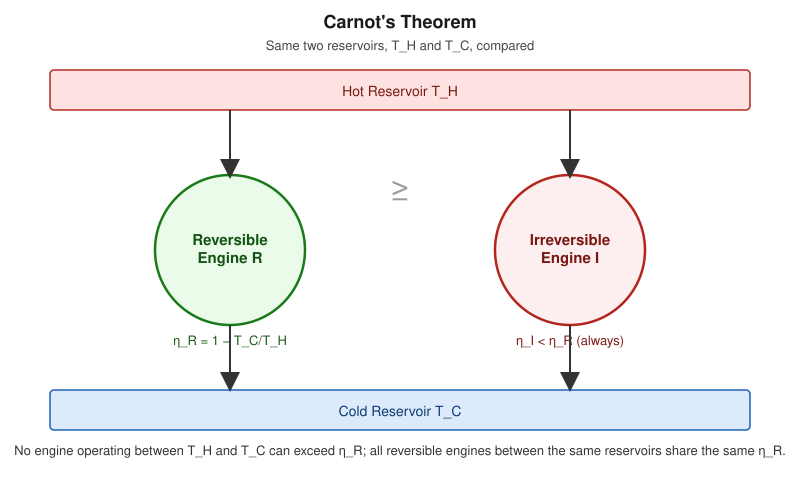

# Carnot's Theorem

## Learning Objectives

- State Carnot's theorem precisely.
- Prove it using a proof-by-contradiction argument based on the Second Law.
- Understand its corollary: all reversible engines between the same reservoirs share the same efficiency.

## Introduction

Carnot's theorem formalizes the special status of the Carnot cycle: it is not merely *an* efficient cycle, but provably the *most* efficient cycle possible between two given temperatures. This is a rigorous consequence of the Second Law, not an empirical observation.

## Definition

**Carnot's Theorem:**
> No engine operating between two given thermal reservoirs can be more efficient than a reversible (Carnot) engine operating between the same two reservoirs.

**Corollary:**
> All reversible engines operating between the same two reservoirs have exactly the same efficiency, $\eta_C = 1 - T_C/T_H$, independent of the working substance or engine design.

## Physical Meaning

If an engine *more* efficient than a Carnot engine existed, it could be used to drive a reversed Carnot engine (acting as a refrigerator) using less work than the Carnot engine would deliver, resulting in a net transfer of heat from cold to hot with no external work input — a direct violation of the Clausius statement.

## Mathematical Formulation

For any engine $I$ (reversible or not) and any reversible engine $R$, both operating between $T_H$ and $T_C$:

$$
\eta_I \leq \eta_R = 1-\frac{T_C}{T_H}
$$

with equality only if $I$ is itself reversible.

## Derivation

**Proof by contradiction.** Suppose an engine $I$ exists with $\eta_I > \eta_R$, both operating between the same $T_H$ and $T_C$, and both absorbing the same heat $Q_H$ from the hot reservoir.

Since $\eta_I > \eta_R$, engine $I$ produces more work: $W_I > W_R$.

Now run the reversible engine $R$ *backward* as a refrigerator, driven by the work output of $I$. Since $R$ is reversible, running it backward requires exactly $W_R$ of work input to pump $Q_C^{(R)}$ from the cold reservoir back to the hot reservoir, delivering $Q_H$ to the hot side.

Because $W_I > W_R$, engine $I$ supplies more than enough work to drive $R$ in reverse, leaving a surplus work $W_I - W_R > 0$.

Consider the combined system ($I$ + reversed $R$) over one cycle:

- Heat $Q_H$ is absorbed from the hot reservoir by $I$, and exactly $Q_H$ is returned to the hot reservoir by reversed $R$ — **net heat exchange with the hot reservoir is zero.**
- Net work output of the combined system is $W_I - W_R > 0$.
- By the First Law, this net work must equal net heat absorbed from the cold reservoir: $Q_C^{(R)} - Q_C^{(I)} = W_I - W_R > 0$.

So the combined device extracts a net *positive* amount of heat from a single reservoir (the cold one) and converts it entirely into work, with the hot reservoir unaffected — **this directly violates the Kelvin–Planck statement.**

Since the Second Law forbids this, the assumption $\eta_I > \eta_R$ must be false. Hence:

$$
\eta_I \leq \eta_R
$$

**Corollary proof:** If $I$ is itself reversible, the same argument can be run with $I$ and $R$'s roles swapped, giving $\eta_R \leq \eta_I$ as well. Combined with $\eta_I \leq \eta_R$, this forces $\eta_I = \eta_R$ — all reversible engines between the same two reservoirs must have identical efficiency.

## Important Equations

$$
\eta_I \leq \eta_R = 1-\frac{T_C}{T_H} \qquad (\text{equality iff } I \text{ reversible})
$$

## Physical Interpretation

Carnot's theorem is what makes $\eta_C = 1-T_C/T_H$ a **universal** bound: it applies to steam engines, gas turbines, or any conceivable heat engine, regardless of working fluid, because the proof relies only on the Second Law, not on any specific substance's properties.

## Worked Examples

### Problem 1 — Checking a claimed efficiency against the Carnot bound

**Given:** An engine claims $\eta = 70\%$ while operating between $T_H = 600\ \text{K}$ and $T_C = 300\ \text{K}$.

**Required:** Determine whether this claim is physically possible.

**Formula:** $\eta_C = 1-T_C/T_H$; compare to claimed $\eta$.

**Calculation:**

$$
\eta_C = 1 - \frac{300}{600} = 0.5 = 50\%
$$

Claimed $\eta = 70\% > \eta_C = 50\%$.

**Final Answer:** Impossible — violates Carnot's theorem.

**Physical Meaning:** No engine, regardless of design, can exceed the Carnot efficiency for the same reservoir temperatures.

### Problem 2 — Comparing two reversible engines with different working substances

**Given:** Two reversible engines, one using an ideal gas and one using a different working substance, both operate between $T_H = 500\ \text{K}$ and $T_C = 250\ \text{K}$.

**Required:** Compare their efficiencies.

**Relevant Principle:** Corollary of Carnot's theorem.

**Calculation:** Both efficiencies equal $\eta_C = 1 - 250/500 = 0.5$, regardless of working substance.

**Final Answer:** Both engines have identical efficiency, $50\%$.

**Physical Meaning:** Efficiency of a reversible engine is a property of the *reservoir temperatures alone*, not of engine design or material — this is precisely what makes absolute (thermodynamic) temperature scales possible.

## Conceptual Questions

1. Why does combining a hypothetical super-efficient engine with a reversed Carnot engine lead to a Kelvin–Planck violation?
2. Why must the corollary (equal efficiency for all reversible engines) follow once the main theorem is established?
3. Does Carnot's theorem say anything about *how* to build an efficient engine, or only about the *upper bound* on efficiency?

## Common Mistakes

- Thinking Carnot's theorem is an empirical/engineering claim rather than a strict logical consequence of the Second Law.
- Forgetting the proof requires comparing engines operating between the *same* two reservoirs.
- Assuming the theorem implies real irreversible engines can approach $\eta_C$ arbitrarily closely in practice — in reality, engineering constraints (heat-transfer rates, materials) keep real efficiencies well below $\eta_C$.

## Exam Essentials

### Important Definitions
Reversible engine, irreversible engine, thermodynamic (absolute) temperature scale.

### Important Laws and Theorems
Carnot's theorem and its corollary.

### Must-Know Equations
$$\eta_I \leq \eta_R = 1-\frac{T_C}{T_H}$$

### Important Derivations
Proof by contradiction using a combined engine + reversed-refrigerator system to derive a Kelvin–Planck violation.

### Conceptual Questions
See above.

### Numerical Questions
See Worked Examples.

### Common Exam Mistakes
See Common Mistakes.

### One-Minute Revision
Carnot's theorem: no engine beats a reversible engine between the same two reservoirs; all reversible engines between those reservoirs share the same efficiency. Proved by contradiction — a hypothetical super-efficient engine, combined with a reversed Carnot engine, would violate Kelvin–Planck.

## Summary

Carnot's theorem elevates $\eta_C = 1-T_C/T_H$ from "one particular cycle's efficiency" to a universal upper bound for *any* engine operating between two reservoirs, proven directly from the Second Law via a contradiction argument. Its corollary underlies the definition of the thermodynamic temperature scale itself.

## References

- Zemansky, M. W. & Dittman, R. H., *Heat and Thermodynamics*.
- Halliday, D., Resnick, R. & Walker, J., *Fundamentals of Physics*.
- Schroeder, D. V., *An Introduction to Thermal Physics*.
