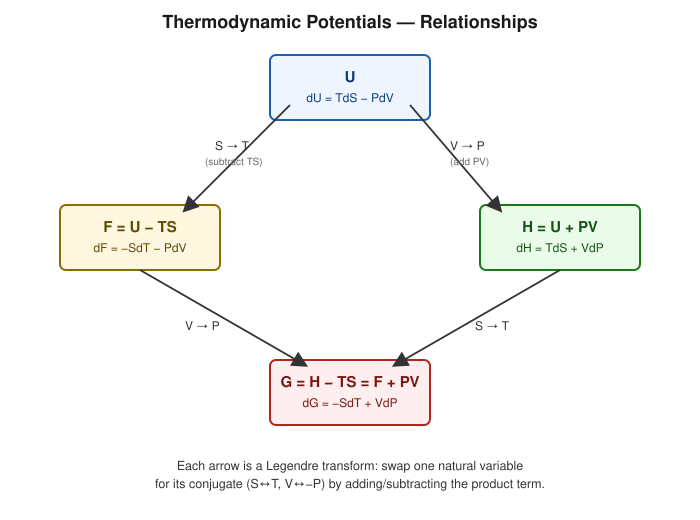

# Thermodynamic Functions

## Learning Objectives

- Define the four principal thermodynamic potentials: $U$, $H$, $F$, $G$.
- Understand natural variables and Legendre transformations at an introductory level.
- Explain the physical use-case of each potential.

## Introduction

State functions such as internal energy are not the only useful bookkeeping quantities in thermodynamics. Depending on which variables are experimentally controlled (volume vs. pressure, entropy vs. temperature), a differently-constructed **thermodynamic potential** makes the analysis of equilibrium and spontaneity far simpler. These four functions — internal energy $U$, enthalpy $H$, Helmholtz free energy $F$, and Gibbs free energy $G$ — are related by systematic transformations.

## Definition

- **Internal Energy** $U$: total microscopic energy content.
- **Enthalpy** $H = U + PV$: useful at constant pressure (e.g. open, atmospheric-pressure systems).
- **Helmholtz Free Energy** $F = U - TS$ (sometimes $A$): useful at constant temperature and volume; gives maximum extractable work at constant $T,V$.
- **Gibbs Free Energy** $G = H - TS = F + PV$: useful at constant temperature and pressure; gives maximum non-expansion work and governs spontaneity for most laboratory/chemical conditions.

## Physical Meaning

Each potential is constructed so that, when held at its **natural variables**, its differential form is simplest and its sign directly indicates the direction of spontaneous change:

| Potential | Definition | Differential | Natural Variables | Main Use |
|---|---|---|---|---|
| Internal Energy $U$ | — | $dU = TdS - PdV$ | $S, V$ | Energy conservation, isolated systems |
| Enthalpy $H$ | $U+PV$ | $dH = TdS + VdP$ | $S, P$ | Constant-pressure processes (heat of reaction) |
| Helmholtz $F$ | $U-TS$ | $dF = -SdT - PdV$ | $T, V$ | Constant $T,V$; max. work extractable |
| Gibbs $G$ | $H-TS$ | $dG = -SdT + VdP$ | $T, P$ | Constant $T,P$; spontaneity, phase equilibrium |

## Mathematical Formulation

$$
H=U+PV \qquad F=U-TS \qquad G=H-TS
$$

## Derivation

**State functions and exact differentials.** A quantity is a *state function* if its differential is *exact* — i.e. its value depends only on the current state, not on the path taken to reach it. Mathematically, $dU$ is exact because

$$
\oint dU = 0
$$

for any cyclic process, which is guaranteed by the First Law. By contrast, $\delta Q$ and $\delta W$ individually are *inexact* differentials (they depend on path), even though their difference $dU = \delta Q - \delta W$ is exact.

**Constructing $H$, $F$, $G$ via Legendre transforms.** Starting from the combined First and Second Law for a reversible process,

$$
dU = TdS - PdV
$$

Each new potential swaps one *extensive* natural variable for its conjugate *intensive* variable by subtracting (or adding) the product term:

$$
H \equiv U + PV \quad\Rightarrow\quad dH = dU + PdV + VdP = TdS - PdV + PdV + VdP = TdS + VdP
$$

$$
F \equiv U - TS \quad\Rightarrow\quad dF = dU - TdS - SdT = TdS - PdV - TdS - SdT = -SdT - PdV
$$

$$
G \equiv H - TS \quad\Rightarrow\quad dG = dH - TdS - SdT = TdS + VdP - TdS - SdT = -SdT + VdP
$$

This procedure — replacing an extensive variable with its conjugate intensive variable in the "natural variable list" — is a **Legendre transformation**, familiar from classical mechanics (e.g. the transition from the Lagrangian to the Hamiltonian).

## Important Equations

$$
dU=TdS-PdV, \quad dH=TdS+VdP, \quad dF=-SdT-PdV, \quad dG=-SdT+VdP
$$

## Physical Interpretation

- $F$ is called "free energy" because $-dF$ equals the maximum work extractable at constant $T$ (the rest of $U$'s change is "bound" as $TS$, unavailable as work).
- $G$ plays the analogous role at constant $T, P$ and is the quantity that determines the direction of spontaneous chemical/phase change under typical laboratory conditions: a process at constant $T,P$ proceeds spontaneously if $\Delta G < 0$.
- Choosing the right potential for the constraints of your problem (constant $V$ vs. constant $P$; constant $S$ vs. constant $T$) dramatically simplifies the mathematics of equilibrium.

## Worked Examples

### Problem 1 — Computing $H$ from $U$

**Given:** A gas has $U = 500\ \text{J}$, $P = 2\times10^5\ \text{Pa}$, $V = 0.01\ \text{m}^3$.

**Required:** $H$.

**Formula:** $H = U + PV$.

**Calculation:**

$$
H = 500 + (2\times10^5)(0.01) = 500 + 2000 = 2500\ \text{J}
$$

**Final Answer:** $H = 2500\ \text{J}$.

**Physical Meaning:** $H$ accounts for the "flow work" $PV$ needed to make room for the system in a constant-pressure surrounding — useful for open, atmospheric systems.

### Problem 2 — Computing $F$ and $G$

**Given:** $U = 1000\ \text{J}$, $T = 300\ \text{K}$, $S = 2\ \text{J/K}$, $P = 1\times10^5\ \text{Pa}$, $V = 0.005\ \text{m}^3$.

**Required:** $F$ and $G$.

**Formula:** $F = U - TS$; $G = F + PV$.

**Calculation:**

$$
F = 1000 - (300)(2) = 1000-600=400\ \text{J}
$$
$$
G = 400 + (1\times10^5)(0.005) = 400+500=900\ \text{J}
$$

**Final Answer:** $F = 400\ \text{J}$, $G = 900\ \text{J}$.

**Physical Meaning:** Only $400\ \text{J}$ of the internal energy is "free" (extractable as work) at this temperature; the rest ($TS = 600\ \text{J}$) is unavailable, being tied up in entropy.

### Problem 3 — Spontaneity check using $\Delta G$

**Given:** A constant-temperature, constant-pressure process has $\Delta H = -50\ \text{kJ}$ and $\Delta S = -100\ \text{J/K}$ at $T = 298\ \text{K}$.

**Required:** Is the process spontaneous?

**Formula:** $\Delta G = \Delta H - T\Delta S$.

**Calculation:**

$$
\Delta G = -50{,}000 - (298)(-100) = -50{,}000 + 29{,}800 = -20{,}200\ \text{J}
$$

**Final Answer:** $\Delta G = -20.2\ \text{kJ} < 0$ — spontaneous.

**Physical Meaning:** Even though entropy decreases (unfavorable), the large negative enthalpy change dominates, giving an overall spontaneous process at this temperature.

## Conceptual Questions

1. Why is $\delta Q$ not a state function, while $H$, $F$, and $G$ are, even though all involve heat-related quantities?
2. What determines which potential ($U$, $H$, $F$, or $G$) is most convenient for a given experimental setup?
3. Physically, why is $F$ (not $U$) the "maximum extractable work" at constant $T, V$?

## Common Mistakes

- Forgetting the natural variables of each potential and misapplying formulas for the wrong constraints (e.g. using $\Delta G$ criteria for a constant-volume process).
- Confusing extensive ($S$, $V$) with intensive ($T$, $P$) natural variables.
- Treating $F$ and $G$ as always negative in magnitude — sign depends on the specific system and reference state.

## Exam Essentials

### Important Definitions
Internal energy, enthalpy, Helmholtz free energy, Gibbs free energy, natural variables, Legendre transform.

### Important Laws and Theorems
State functions have exact differentials; $\oint dU = 0$.

### Must-Know Equations
$$H=U+PV, \quad F=U-TS, \quad G=H-TS$$
$$dU=TdS-PdV, \ dH=TdS+VdP, \ dF=-SdT-PdV, \ dG=-SdT+VdP$$

### Important Derivations
Legendre transform construction of $H$, $F$, $G$ from $U$.

### Conceptual Questions
See above.

### Numerical Questions
See Worked Examples.

### Common Exam Mistakes
See Common Mistakes.

### One-Minute Revision
Four potentials, four natural-variable pairs: $U(S,V)$, $H(S,P)$, $F(T,V)$, $G(T,P)$. Each is built from $U$ by a Legendre transform that swaps an extensive variable for its intensive conjugate. $G$ governs spontaneity at constant $T,P$ (most common lab condition): $\Delta G < 0 \Rightarrow$ spontaneous.

## Summary

The thermodynamic potentials $U$, $H$, $F$, $G$ are systematically related state functions, each tailored to a different pair of controlled variables via Legendre transformation. Together they underpin equilibrium analysis across mechanical, thermal, and chemical thermodynamics, and set up the machinery (mixed partial derivatives of these potentials) behind the Maxwell relations.

## References

- Zemansky, M. W. & Dittman, R. H., *Heat and Thermodynamics*.
- Halliday, D., Resnick, R. & Walker, J., *Fundamentals of Physics*.
- Schroeder, D. V., *An Introduction to Thermal Physics*.
