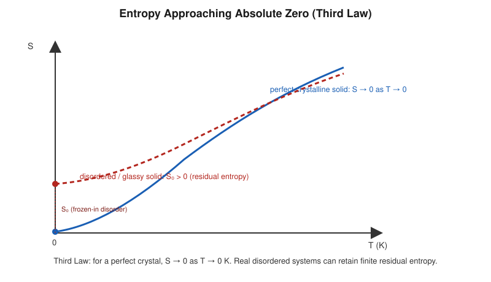

# Third Law of Thermodynamics

## Learning Objectives

- State the Nernst heat theorem and the Planck formulation of the Third Law.
- Explain the perfect-crystal condition and its role in defining absolute entropy.
- Understand why absolute zero is unattainable in a finite number of steps.

## Introduction

While the First and Second Laws describe energy conservation and the direction of spontaneous change, neither fixes the *zero point* of entropy. The **Third Law of Thermodynamics** provides that reference point, stating how entropy behaves as temperature approaches absolute zero.

## Definition

**Nernst heat theorem (1906):** As temperature approaches absolute zero, the entropy change of any isothermal process involving condensed phases approaches zero:

$$
\lim_{T\to0} \Delta S = 0
$$

**Planck formulation (stronger form):** The entropy of a perfect crystalline substance approaches a universal constant, taken to be zero, as temperature approaches absolute zero:

$$
S \rightarrow 0 \quad \text{as} \quad T \rightarrow 0
$$

for a perfect crystal in internal equilibrium.

These are related but distinct: Nernst's original statement concerns *changes* in entropy near $T=0$; Planck's stronger statement fixes the *absolute value* of entropy to zero for an ideal perfect crystal, enabling the assignment of **absolute entropies**.

## Physical Meaning

A **perfect crystal** has a single, unique, non-degenerate ground-state microscopic arrangement. By the statistical (Boltzmann) definition of entropy, $S = k_B \ln \Omega$, a system with only $\Omega = 1$ accessible microstate has $S = 0$. As $T \to 0$, a system relaxes toward its unique ground state (assuming perfect equilibration is achievable), so $S \to 0$.

Real substances, however, can become kinetically "frozen" into a disordered configuration before reaching the true ground state (e.g., glasses, some crystalline mixtures), retaining a **residual entropy** $S_0 > 0$ even at $T \to 0$ — this does not violate the Third Law, since the Law strictly applies to true internal equilibrium, which such frozen-in disordered states have not reached.

## Mathematical Formulation

$$
S(T\to0) \to 0 \quad \text{(perfect crystal, true equilibrium)}
$$

**Unattainability corollary:** absolute zero cannot be reached by any finite sequence of thermodynamic operations (e.g. adiabatic demagnetization steps), because each successive isothermal-then-adiabatic cooling cycle yields diminishing temperature reduction as $T\to0$, approaching but never reaching $T=0$ in a finite number of steps.

## Derivation

**Consequence for heat capacity.** Using $dS = \frac{C}{T}dT$ at constant $V$ (or $P$), integrating from $0$ to $T$:

$$
S(T) - S(0) = \int_0^T \frac{C_V}{T'}\,dT'
$$

For this integral to converge (avoid a logarithmic divergence as $T'\to0$), the heat capacity itself must vanish as $T\to0$:

$$
C_V \to 0 \quad \text{as} \quad T \to 0
$$

This is a direct, experimentally verifiable prediction of the Third Law, confirmed by observations that heat capacities of solids do vanish (following, e.g., the Debye $T^3$ law at low temperature) as $T\to0$.

**Sketch of unattainability.** Consider a magnetic-cooling cycle: an isothermal magnetization step (removes entropy by aligning spins, releasing heat to a bath) followed by an adiabatic demagnetization step (temperature drops as the system re-randomizes at constant $S$). Because different entropy-vs-temperature curves for different applied fields must converge to the *same* zero-entropy point as $T\to0$ (per the Third Law), each successive cycle produces a smaller temperature decrease — an infinite number of cycles would be required to reach exactly $T=0$.

## Important Equations

$$
S\to0 \ \text{as} \ T\to0 \ (\text{perfect crystal}); \qquad C_V \to 0 \ \text{as} \ T\to0
$$

## Physical Interpretation

The Third Law is what allows chemists and physicists to tabulate **absolute (not just relative) entropies** for substances — a capability the First and Second Laws alone do not provide, since they only ever constrain entropy *differences*.

## Worked Examples

### Problem 1 — Consequence for heat capacity near $T=0$

**Given:** A material's heat capacity is modeled as $C_V = aT^3$ (Debye-like) for small $T$.

**Required:** Show $S(T)$ remains finite as $T\to0$, consistent with the Third Law.

**Formula:** $S(T) = \int_0^T \frac{C_V}{T'}dT'$.

**Calculation:**

$$
S(T) = \int_0^T \frac{aT'^3}{T'}dT' = \int_0^T aT'^2\,dT' = \frac{aT^3}{3}
$$

**Final Answer:** $S(T) = \dfrac{aT^3}{3} \to 0$ as $T\to0$.

**Physical Meaning:** The $T^3$ dependence of $C_V$ ensures the entropy integral converges cleanly to zero, consistent with the Third Law — unlike a constant $C_V$, which would give a divergent (logarithmic) entropy as $T\to0$.

### Problem 2 — Residual entropy interpretation

**Given:** A glassy solid is measured to have $S(0) = 5.8\ \text{J/(mol·K)}$ rather than zero.

**Required:** Explain this observation in light of the Third Law.

**Relevant Principle:** Residual entropy from frozen-in disorder.

**Calculation:** No numerical calculation needed — this is a conceptual application.

**Final Answer:** The non-zero $S(0)$ reflects residual configurational disorder (the glass did not reach a unique, ordered ground state), not a violation of the Third Law.

**Physical Meaning:** The Third Law applies strictly to true equilibrium perfect crystals; kinetically trapped disordered states are a distinct physical situation the Law does not forbid.

### Problem 3 — Entropy change between two low temperatures

**Given:** For a solid with $C_V = bT^3$, find the entropy change between $T_1 = 2\ \text{K}$ and $T_2 = 10\ \text{K}$, with $b = 0.002\ \text{J/(K}^4\text{)}$.

**Formula:** $\Delta S = \dfrac{b}{3}(T_2^3 - T_1^3)$.

**Calculation:**

$$
\Delta S = \frac{0.002}{3}\left(10^3 - 2^3\right) = \frac{0.002}{3}(1000-8) = \frac{0.002 \times 992}{3} \approx 0.661\ \text{J/K}
$$

**Final Answer:** $\Delta S \approx 0.66\ \text{J/K}$.

**Physical Meaning:** Even near absolute zero, entropy changes remain well-defined and calculable once the low-temperature form of $C_V$ is known — a direct practical payoff of the Third Law.

## Conceptual Questions

1. Distinguish the Nernst heat theorem from the Planck formulation of the Third Law.
2. Why must $C_V \to 0$ as $T\to0$ for the entropy integral to remain finite?
3. Does residual entropy in glasses violate the Third Law? Explain why or why not.
4. Why is reaching exactly $T = 0\ \text{K}$ physically impossible in finitely many steps?

## Common Mistakes

- Stating the Third Law simply as "entropy is zero at absolute zero" without the perfect-crystal / true-equilibrium qualification.
- Treating residual entropy as a counterexample that disproves the Third Law, rather than a case outside its strict conditions.
- Forgetting that the Third Law's unattainability corollary is about reaching $T=0$ in a *finite* number of steps, not a claim that $T=0$ is meaningless.

## Exam Essentials

### Important Definitions
Perfect crystal, residual entropy, absolute entropy, unattainability of absolute zero.

### Important Laws and Theorems
Nernst heat theorem; Planck formulation of the Third Law.

### Must-Know Equations
$$S\to0 \text{ as } T\to0 \ (\text{perfect crystal}), \qquad C_V\to0 \text{ as } T\to0$$

### Important Derivations
Entropy integral $S(T) = \int_0^T C_V/T'\,dT'$ and its convergence condition.

### Conceptual Questions
See above.

### Numerical Questions
See Worked Examples.

### Common Exam Mistakes
See Common Mistakes.

### One-Minute Revision
Third Law: $S\to0$ as $T\to0$ for a perfect crystal in true equilibrium (Planck); entropy changes near $T=0$ vanish (Nernst). Implies $C_V\to0$ as $T\to0$ and that absolute zero is unattainable in finitely many steps. Enables absolute (not just relative) entropy tabulation.

## Summary

The Third Law fixes the zero point of entropy for a perfect crystal at absolute zero, enabling absolute entropy values, predicting vanishing heat capacities at low temperature, and establishing the practical unattainability of $T=0$. Its careful qualifications (true equilibrium, perfect crystal) distinguish it from loosely-stated popular versions.

## References

- Zemansky, M. W. & Dittman, R. H., *Heat and Thermodynamics*.
- Halliday, D., Resnick, R. & Walker, J., *Fundamentals of Physics*.
- Schroeder, D. V., *An Introduction to Thermal Physics*.
