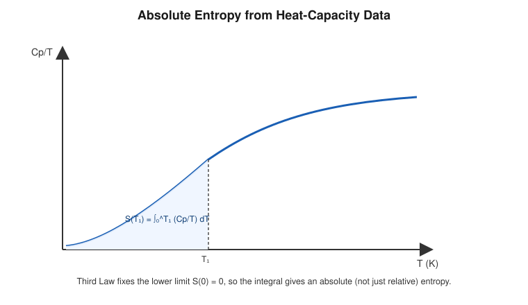

# Applications of the Third Law of Thermodynamics

## Learning Objectives

- Compute absolute entropy from heat-capacity data using the Third Law reference point.
- Describe low-temperature physical behavior predicted by the Third Law.
- Identify chemical-thermodynamics applications of absolute entropy.

## Introduction

The practical value of the Third Law lies in what it enables: assigning definite, tabulable **absolute entropy values** to substances, rather than only entropy *differences*. This underlies standard thermodynamic tables used throughout physics, chemistry, and engineering.

## Definition

The **standard molar entropy** $S^\circ$ of a substance is its absolute entropy at a reference temperature (conventionally $298.15\ \text{K}$) and standard pressure, computed by integrating heat-capacity data from $T=0$ (where $S=0$ by the Third Law) up to the reference temperature, including any phase-transition contributions.

## Physical Meaning

Because $S(0) = 0$ is fixed by the Third Law, the entropy at any temperature $T_1$ is simply the accumulated $\int C_p/T\,dT$ from zero up to $T_1$ (plus any $\Delta H_{\text{transition}}/T_{\text{transition}}$ terms for phase changes along the way), without any arbitrary additive constant.

## Mathematical Formulation

$$
S(T_1) = \int_0^{T_1} \frac{C_p}{T}\,dT \ \ (\text{plus phase-transition entropy terms})
$$

## Derivation / Applications

**1. Absolute entropy calculation from heat-capacity data.**

For a substance with no phase transitions between $0$ and $T_1$:

$$
S(T_1) = \int_0^{T_1} \frac{C_p(T)}{T}\,dT
$$

This is usually evaluated numerically or graphically from measured $C_p/T$ vs. $T$ data (the area under the curve up to $T_1$, as shown in the accompanying figure).

If the substance undergoes phase transitions (e.g., solid→liquid at $T_m$, liquid→gas at $T_b$) between $0$ and $T_1$, each contributes an additional entropy term:

$$
S(T_1) = \int_0^{T_m}\frac{C_p^{\text{solid}}}{T}dT + \frac{\Delta H_{\text{fus}}}{T_m} + \int_{T_m}^{T_b}\frac{C_p^{\text{liquid}}}{T}dT + \frac{\Delta H_{\text{vap}}}{T_b} + \int_{T_b}^{T_1}\frac{C_p^{\text{gas}}}{T}dT
$$

**2. Low-temperature behavior.** The Third Law predicts (and experiment confirms) that near $T=0$:

- Heat capacities of solids vanish as $T\to0$ (Debye $T^3$ law for non-metals; linear-in-$T$ electronic contribution dominates in metals at very low $T$).
- Thermal expansion coefficients vanish as $T\to0$.
- These low-temperature limits are used to calibrate and extrapolate experimental thermodynamic data safely to $T=0$.

**3. Chemical thermodynamics applications.** Standard molar entropies $S^\circ$, computed via the Third Law integral, allow the calculation of reaction entropy changes:

$$
\Delta S^\circ_{\text{rxn}} = \sum \nu_i S^\circ_{\text{products}} - \sum \nu_i S^\circ_{\text{reactants}}
$$

which, combined with $\Delta H^\circ_{\text{rxn}}$, gives $\Delta G^\circ_{\text{rxn}} = \Delta H^\circ_{\text{rxn}} - T\Delta S^\circ_{\text{rxn}}$ and hence the spontaneity and equilibrium constant of the reaction.

## Important Equations

$$
S(T_1) = \int_0^{T_1} \frac{C_p}{T}dT, \qquad \Delta S^\circ_{\text{rxn}} = \sum \nu_i S^\circ_{\text{products}} - \sum \nu_i S^\circ_{\text{reactants}}
$$

## Physical Interpretation

Without the Third Law's zero-point fix, thermodynamic tables could only list entropy *differences* relative to an arbitrary reference state, making cross-comparison between different substances and reactions ambiguous. The Third Law removes this ambiguity, at the cost of requiring careful attention to whether a substance's low-temperature state is truly a perfect, equilibrated crystal (residual entropy corrections are sometimes needed for real substances).

## Worked Examples

### Problem 1 — Absolute entropy for a $T^3$ heat-capacity solid up to low $T$

**Given:** $C_p = kT^3$ for a solid at low temperature, with $k = 1.9\times10^{-4}\ \text{J/(mol·K}^4\text{)}$.

**Required:** $S$ at $T=15\ \text{K}$.

**Formula:** $S = \int_0^{T} kT'^2\,dT' = \dfrac{kT^3}{3}$.

**Calculation:**

$$
S = \frac{(1.9\times10^{-4})(15)^3}{3} = \frac{(1.9\times10^{-4})(3375)}{3} \approx 0.2138\ \text{J/(mol·K)}
$$

**Final Answer:** $S \approx 0.214\ \text{J/(mol·K)}$.

**Physical Meaning:** This gives the absolute entropy contribution from the low-temperature (Debye) region, which forms the starting segment of the full $S(298\ \text{K})$ calculation.

### Problem 2 — Including a phase-transition contribution

**Given:** A substance has entropy $60\ \text{J/(mol·K)}$ just below its melting point $T_m = 350\ \text{K}$, with $\Delta H_{\text{fus}} = 8000\ \text{J/mol}$.

**Required:** Entropy just above the melting point.

**Formula:** $S_{\text{after}} = S_{\text{before}} + \Delta H_{\text{fus}}/T_m$.

**Calculation:**

$$
S_{\text{after}} = 60 + \frac{8000}{350} = 60 + 22.86 = 82.86\ \text{J/(mol·K)}
$$

**Final Answer:** $S_{\text{after}} \approx 82.9\ \text{J/(mol·K)}$.

**Physical Meaning:** Melting sharply increases entropy (increased configurational disorder in the liquid), and this jump must be added explicitly when building up absolute entropy through a phase transition.

### Problem 3 — Reaction entropy from standard molar entropies

**Given:** For a reaction $A \rightarrow B$, $S^\circ_A = 130\ \text{J/(mol·K)}$, $S^\circ_B = 145\ \text{J/(mol·K)}$.

**Required:** $\Delta S^\circ_{\text{rxn}}$.

**Formula:** $\Delta S^\circ_{\text{rxn}} = S^\circ_{\text{products}} - S^\circ_{\text{reactants}}$.

**Calculation:**

$$
\Delta S^\circ_{\text{rxn}} = 145 - 130 = 15\ \text{J/(mol·K)}
$$

**Final Answer:** $\Delta S^\circ_{\text{rxn}} = +15\ \text{J/(mol·K)}$.

**Physical Meaning:** The positive value indicates the products are more disordered than the reactants — this entropy term feeds directly into $\Delta G^\circ = \Delta H^\circ - T\Delta S^\circ$ for spontaneity analysis.

## Conceptual Questions

1. Why is a phase-transition term ($\Delta H_{\text{trans}}/T_{\text{trans}}$) added separately rather than included in the $\int C_p/T\,dT$ integral?
2. Why does the Third Law make absolute entropy tables possible, whereas the First and Second Laws alone would not?
3. How does the vanishing of $C_p$ as $T\to0$ practically affect the extrapolation of experimental entropy data to $T=0$?

## Common Mistakes

- Omitting phase-transition entropy terms when integrating $C_p/T$ across a melting or boiling point.
- Forgetting that $S^\circ$ values in tables are *absolute*, not relative, precisely because of the Third Law reference.
- Applying room-temperature $C_p$ values down to $T=0$ instead of using the correct low-temperature (e.g., Debye $T^3$) form.

## Exam Essentials

### Important Definitions
Standard molar entropy, absolute entropy, phase-transition entropy contribution.

### Important Laws and Theorems
Third-Law-based absolute entropy integral.

### Must-Know Equations
$$S(T_1)=\int_0^{T_1}\frac{C_p}{T}dT, \qquad \Delta S^\circ_{\text{rxn}}=\sum\nu_iS^\circ_{\text{products}}-\sum\nu_iS^\circ_{\text{reactants}}$$

### Important Derivations
Piecewise entropy integration across phase transitions.

### Conceptual Questions
See above.

### Numerical Questions
See Worked Examples.

### Common Exam Mistakes
See Common Mistakes.

### One-Minute Revision
Third Law fixes $S(0)=0$, so absolute entropy at any $T$ is $\int_0^T C_p/T\,dT$ plus phase-transition terms. This underlies standard molar entropy tables and reaction-entropy calculations used throughout chemical thermodynamics.

## Summary

The practical payoff of the Third Law is the ability to compute and tabulate absolute entropies from heat-capacity measurements, including phase-transition contributions. These absolute entropies feed directly into free-energy and spontaneity calculations across physics and chemistry.

## References

- Zemansky, M. W. & Dittman, R. H., *Heat and Thermodynamics*.
- Halliday, D., Resnick, R. & Walker, J., *Fundamentals of Physics*.
- Schroeder, D. V., *An Introduction to Thermal Physics*.
