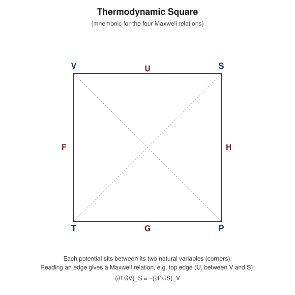

# Maxwell's Mathematical Relations in Thermodynamics

## Learning Objectives

- Derive all four Maxwell relations from the four thermodynamic potentials.
- Apply the equality of mixed partial derivatives correctly.
- Use a Maxwell relation to compute an otherwise hard-to-measure quantity.

## Introduction

The four thermodynamic potentials $U, H, F, G$ each have exact differentials, meaning their mixed second partial derivatives are independent of the order of differentiation. Applying this mathematical fact to each potential yields four **Maxwell relations** — non-trivial connections between the derivatives of $P$, $V$, $T$, $S$ that let hard-to-measure quantities (like $(\partial S/\partial V)_T$) be replaced by easier-to-measure ones (like $(\partial P/\partial T)_V$).

## Definition

For a function $f(x,y)$ with exact differential $df = M\,dx + N\,dy$, exactness requires

$$
\left(\frac{\partial M}{\partial y}\right)_x = \left(\frac{\partial N}{\partial x}\right)_y
$$

(equality of mixed partial derivatives, i.e. $\partial^2 f/\partial x\partial y = \partial^2 f/\partial y\partial x$). Applying this test to each of $dU$, $dH$, $dF$, $dG$ produces one Maxwell relation per potential.

## Physical Meaning

Each Maxwell relation equates a derivative that is hard to measure directly (typically involving entropy) to one built entirely from $P$, $V$, $T$ — quantities measurable with ordinary mechanical/thermal instruments. This is what makes the relations practically valuable, not merely a mathematical curiosity.

## Mathematical Formulation

Starting potentials and their differentials:

$$
dU=TdS-PdV \qquad dH=TdS+VdP \qquad dF=-SdT-PdV \qquad dG=-SdT+VdP
$$

## Derivation

### Relation 1 — from $U(S,V)$

1. **Potential:** $U$.
2. **Differential:** $dU = TdS - PdV$.
3. **Natural variables:** $S, V$. So $T = (\partial U/\partial S)_V$ and $-P = (\partial U/\partial V)_S$.
4. **Partial derivatives:** Differentiate $T$ with respect to $V$ at constant $S$, and $-P$ with respect to $S$ at constant $V$:

$$
\left(\frac{\partial T}{\partial V}\right)_S = \frac{\partial^2 U}{\partial V\partial S}, \qquad \left(\frac{\partial(-P)}{\partial S}\right)_V = \frac{\partial^2 U}{\partial S\partial V}
$$

5. **Equality of mixed derivatives:** $\dfrac{\partial^2 U}{\partial V\partial S} = \dfrac{\partial^2 U}{\partial S\partial V}$.

6. **Relation obtained:**

$$
\boxed{\left(\frac{\partial T}{\partial V}\right)_S = -\left(\frac{\partial P}{\partial S}\right)_V}
$$

7. **Meaning:** How temperature changes with volume during a reversible adiabatic (isentropic) process equals minus how pressure changes with entropy at fixed volume.

8. **Application:** Used to relate adiabatic cooling-on-expansion behavior to $(\partial P/\partial S)_V$, relevant in isentropic gas-dynamics and cryogenic expansion analysis.

---

### Relation 2 — from $H(S,P)$

1. **Potential:** $H$.
2. **Differential:** $dH = TdS + VdP$.
3. **Natural variables:** $S, P$. So $T = (\partial H/\partial S)_P$ and $V = (\partial H/\partial P)_S$.
4. **Partial derivatives:**

$$
\left(\frac{\partial T}{\partial P}\right)_S = \frac{\partial^2 H}{\partial P\partial S}, \qquad \left(\frac{\partial V}{\partial S}\right)_P = \frac{\partial^2 H}{\partial S\partial P}
$$

5. **Equality of mixed derivatives** gives:

$$
\boxed{\left(\frac{\partial T}{\partial P}\right)_S = \left(\frac{\partial V}{\partial S}\right)_P}
$$

6. **Meaning:** Temperature change with pressure at constant entropy equals volume change with entropy at constant pressure.

7. **Application:** Directly relevant to the **Joule–Thomson effect** and isentropic throttling processes, where $(\partial T/\partial P)_S$ characterizes adiabatic temperature changes upon pressure drop.

---

### Relation 3 — from $F(T,V)$

1. **Potential:** $F$.
2. **Differential:** $dF = -SdT - PdV$.
3. **Natural variables:** $T, V$. So $-S = (\partial F/\partial T)_V$ and $-P = (\partial F/\partial V)_T$.
4. **Partial derivatives:**

$$
\left(\frac{\partial(-S)}{\partial V}\right)_T = \frac{\partial^2 F}{\partial V\partial T}, \qquad \left(\frac{\partial(-P)}{\partial T}\right)_V = \frac{\partial^2 F}{\partial T\partial V}
$$

5. **Equality of mixed derivatives** gives $-\left(\dfrac{\partial S}{\partial V}\right)_T = -\left(\dfrac{\partial P}{\partial T}\right)_V$, i.e.:

$$
\boxed{\left(\frac{\partial S}{\partial V}\right)_T = \left(\frac{\partial P}{\partial T}\right)_V}
$$

6. **Meaning:** How entropy changes with volume at constant temperature equals how pressure changes with temperature at constant volume.

7. **Application:** This is the most widely used Maxwell relation — it lets $(\partial S/\partial V)_T$ (hard to measure) be replaced by $(\partial P/\partial T)_V$ (directly measurable), essential for deriving the thermodynamic equation of state $\left(\dfrac{\partial U}{\partial V}\right)_T = T\left(\dfrac{\partial P}{\partial T}\right)_V - P$.

---

### Relation 4 — from $G(T,P)$

1. **Potential:** $G$.
2. **Differential:** $dG = -SdT + VdP$.
3. **Natural variables:** $T, P$. So $-S = (\partial G/\partial T)_P$ and $V = (\partial G/\partial P)_T$.
4. **Partial derivatives:**

$$
\left(\frac{\partial(-S)}{\partial P}\right)_T = \frac{\partial^2 G}{\partial P\partial T}, \qquad \left(\frac{\partial V}{\partial T}\right)_P = \frac{\partial^2 G}{\partial T\partial P}
$$

5. **Equality of mixed derivatives** gives $-\left(\dfrac{\partial S}{\partial P}\right)_T = \left(\dfrac{\partial V}{\partial T}\right)_P$, i.e.:

$$
\boxed{\left(\frac{\partial S}{\partial P}\right)_T = -\left(\frac{\partial V}{\partial T}\right)_P}
$$

6. **Meaning:** How entropy changes with pressure at constant temperature equals minus the thermal expansion behavior (volume change with temperature at constant pressure).

7. **Application:** Connects isothermal entropy change under compression directly to the measurable thermal expansion coefficient $\alpha = \frac{1}{V}\left(\dfrac{\partial V}{\partial T}\right)_P$, useful in compressibility and material-property studies.

## Important Equations

$$
\left(\frac{\partial T}{\partial V}\right)_S=-\left(\frac{\partial P}{\partial S}\right)_V \qquad
\left(\frac{\partial T}{\partial P}\right)_S=\left(\frac{\partial V}{\partial S}\right)_P
$$
$$
\left(\frac{\partial S}{\partial V}\right)_T=\left(\frac{\partial P}{\partial T}\right)_V \qquad
\left(\frac{\partial S}{\partial P}\right)_T=-\left(\frac{\partial V}{\partial T}\right)_P
$$

## Physical Interpretation

The Maxwell relations are a direct mathematical consequence of entropy and the potentials being state functions — no new physics is added beyond the First and Second Laws. Their power lies entirely in trading an experimentally awkward entropy-derivative for a mechanically/thermally measurable $P$-$V$-$T$ derivative.

## Worked Examples

### Problem 1 — Applying the $F$-relation to an ideal gas

**Given:** For an ideal gas, $PV = nRT$.

**Required:** Evaluate $(\partial S/\partial V)_T$ using the Maxwell relation from $F$.

**Formula:** $(\partial S/\partial V)_T = (\partial P/\partial T)_V$.

**Calculation:** From $P = nRT/V$: $(\partial P/\partial T)_V = nR/V$.

**Final Answer:** $(\partial S/\partial V)_T = nR/V$.

**Physical Meaning:** Isothermal expansion increases entropy at a rate $nR/V$ per unit volume — consistent with the earlier direct result $\Delta S = nR\ln(V_2/V_1)$ for isothermal expansion (integrate $nR/V$ over $V$).

### Problem 2 — Joule–Thomson relation via the $H$-relation

**Given:** For a real gas obeying $PV = nRT + \alpha P$ (a simple correction, $\alpha$ constant), use the $H$-based Maxwell relation to find $(\partial T/\partial P)_S$.

**Formula:** $(\partial T/\partial P)_S = (\partial V/\partial S)_P$; alternatively use $V = nRT/P + \alpha$.

**Calculation:** Since the direct route requires additional information (heat capacity) to convert $(\partial V/\partial S)_P$ fully into measurable quantities, this problem illustrates the *setup*: from $V = nRT/P + \alpha$, $(\partial V/\partial T)_P = nR/P$, which enters the full Joule–Thomson coefficient formula $\mu_{JT} = \frac{1}{C_p}\left[T\left(\frac{\partial V}{\partial T}\right)_P - V\right]$.

**Final Answer:** $\left(\dfrac{\partial V}{\partial T}\right)_P = \dfrac{nR}{P}$, feeding into $\mu_{JT} = \dfrac{1}{C_p}\left[\dfrac{nRT}{P} - V\right] = \dfrac{-\alpha}{C_p}$.

**Physical Meaning:** This shows explicitly how a Maxwell-relation-derived quantity plugs into the practical Joule–Thomson coefficient, which determines whether a real gas cools or warms on throttling.

### Problem 3 — Numerical evaluation of $(\partial S/\partial P)_T$

**Given:** A solid has thermal expansion coefficient $\alpha = 5\times10^{-5}\ \text{K}^{-1}$ and volume $V = 2\times10^{-4}\ \text{m}^3$ at $T=300\ \text{K}$.

**Required:** $(\partial S/\partial P)_T$.

**Formula:** $(\partial S/\partial P)_T = -(\partial V/\partial T)_P = -\alpha V$.

**Calculation:**

$$
\left(\frac{\partial S}{\partial P}\right)_T = -(5\times10^{-5})(2\times10^{-4}) = -1\times10^{-8}\ \text{m}^3/\text{K} \ \ (\text{i.e., J/(K·Pa)})
$$

**Final Answer:** $(\partial S/\partial P)_T \approx -1.0\times10^{-8}\ \text{J/(K·Pa)}$.

**Physical Meaning:** A positive thermal expansion coefficient (typical solids expand when heated) implies entropy *decreases* slightly under isothermal compression — squeezing the solid reduces its accessible configurations.

## Conceptual Questions

1. Why must equality of mixed partial derivatives hold for any state function, and why does this fact alone generate all four Maxwell relations?
2. Explain, in your own words, why $(\partial S/\partial V)_T = (\partial P/\partial T)_V$ is more experimentally useful than measuring $(\partial S/\partial V)_T$ directly.
3. Which Maxwell relation is most directly relevant to the Joule–Thomson throttling process, and why?

## Common Mistakes

- Mixing up which variable is held constant on each side of a Maxwell relation (the subscript matters).
- Forgetting the sign flip in the relations derived from $U$ (first relation) and $G$ (fourth relation), which arise from the minus signs in $dU = TdS - PdV$ and $dG=-SdT+VdP$.
- Applying an ideal-gas-only Maxwell relation result to a real (non-ideal) gas without re-deriving from the actual equation of state.

## Exam Essentials

### Important Definitions
Exact differential, mixed partial derivative, Maxwell relation.

### Important Laws and Theorems
Equality of mixed partial derivatives applied to $U$, $H$, $F$, $G$.

### Must-Know Equations
$$\left(\frac{\partial T}{\partial V}\right)_S=-\left(\frac{\partial P}{\partial S}\right)_V, \quad \left(\frac{\partial T}{\partial P}\right)_S=\left(\frac{\partial V}{\partial S}\right)_P$$
$$\left(\frac{\partial S}{\partial V}\right)_T=\left(\frac{\partial P}{\partial T}\right)_V, \quad \left(\frac{\partial S}{\partial P}\right)_T=-\left(\frac{\partial V}{\partial T}\right)_P$$

### Important Derivations
Step-by-step derivation of all four relations from $U, H, F, G$.

### Conceptual Questions
See above.

### Numerical Questions
See Worked Examples.

### Common Exam Mistakes
See Common Mistakes.

### One-Minute Revision
Every Maxwell relation comes from equality of mixed partials applied to one of $U,H,F,G$. The $F$-derived relation, $(\partial S/\partial V)_T=(\partial P/\partial T)_V$, is the most commonly used, converting a hard-to-measure entropy derivative into an easily measurable $P$-$V$-$T$ derivative.

## Summary

The four Maxwell relations are direct mathematical consequences of $U$, $H$, $F$, $G$ being state functions with exact differentials. Each pairs an entropy-derivative with a mechanically measurable $P$-$V$-$T$ derivative, providing essential tools for real-gas analysis, the Joule–Thomson effect, and general equation-of-state work — while introducing no new physical content beyond the First and Second Laws.

## References

- Zemansky, M. W. & Dittman, R. H., *Heat and Thermodynamics*.
- Halliday, D., Resnick, R. & Walker, J., *Fundamentals of Physics*.
- Schroeder, D. V., *An Introduction to Thermal Physics*.
