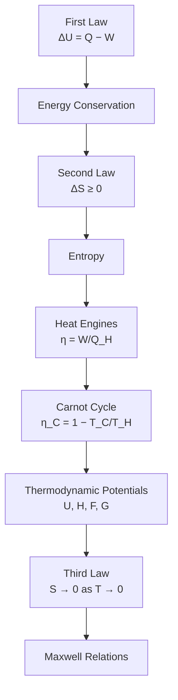

# PHY-103 — Thermodynamics

## Chapter Overview

This chapter covers the full PHY-103 Thermodynamics syllabus in two parts.

**Part 1** builds the fundamentals: systems, internal energy, the First Law, thermodynamic processes, and reversibility basics.

**Part 2** covers the Second Law, heat engines, the Carnot cycle, thermodynamic potentials, the Third Law, and Maxwell's relations.

## Complete Topic Index

### Part 1 — Foundations

1. [System & Thermodynamic Functions](01_system_and_thermodynamic_functions.md)
2. [Internal Energy](02_internal_energy.md)
3. [Work Done by a Gas at Constant Pressure](03_work_done_by_gas_at_constant_pressure.md)
4. [First Law of Thermodynamics](04_first_law_of_thermodynamics.md)
5. [Thermodynamic Processes](05_thermodynamic_processes.md)
6. [Mechanical Equivalent of Heat](06_mechanical_equivalent_of_heat.md)
7. [Cyclic Process](07_cyclic_process.md)
8. [Generalization of the Equation for the Difference Between Two Specific Heats of a Gas](08_difference_between_specific_heats_of_gas.md)
9. [Reversible and Irreversible Processes](09_reversible_and_irreversible_processes.md)

### Part 2 — Second Law, Carnot Cycle & Beyond

10. [Second Law of Thermodynamics](10_second_law_of_thermodynamics.md)
11. [Distinction Between the First and Second Laws](11_first_law_vs_second_law.md)
12. [Efficiency of Heat Engines](12_efficiency_of_heat_engines.md)
13. [Carnot's Cycle and Carnot's Engine](13_carnot_cycle_and_engine.md)
14. [Carnot Cycle as a Reversible Cycle](14_reversibility_of_carnot_cycle.md)
15. [Carnot's Theorem](15_carnots_theorem.md)
16. [Thermodynamic Functions](16_thermodynamic_functions.md)
17. [Third Law of Thermodynamics](17_third_law_of_thermodynamics.md)
18. [Applications of the Third Law](18_applications_of_third_law.md)
19. [Maxwell's Thermodynamic Relations](19_maxwells_thermodynamic_relations.md)

### Reference

- [Formula Sheet — Part 1](formulas.md)
- [Glossary — Part 1](glossary.md)
- [Formula Sheet — Part 2](formulas_part2.md)

## Prerequisite Concepts

- Basic kinetic theory of gases (from PHY-103's Kinetic Theory module).
- The ideal gas equation of state, $PV=nRT$.
- Elementary calculus (integration for work, partial derivatives for state functions).
- Basic mechanics (work-energy concepts, force × displacement).
- For Part 2 specifically: everything in Part 1, especially the First Law, cyclic processes, and reversibility (Topics 4, 7, 9).

## Learning Roadmap / Recommended Study Order

Follow the numbered order below — later topics build directly on earlier ones.

**Part 1:**

1. [System & Thermodynamic Functions](01_system_and_thermodynamic_functions.md) — foundational vocabulary and the concept of state vs path functions.
2. [Internal Energy](02_internal_energy.md) — the microscopic meaning of $U$ and why it is a state function.
3. [Work Done by a Gas at Constant Pressure](03_work_done_by_gas_at_constant_pressure.md) — the general $W=\int P\,dV$ and its isobaric special case.
4. [First Law of Thermodynamics](04_first_law_of_thermodynamics.md) — the central conservation law, $\Delta Q=\Delta U+W$.
5. [Thermodynamic Processes](05_thermodynamic_processes.md) — isothermal, adiabatic, isobaric, isochoric processes compared.
6. [Mechanical Equivalent of Heat](06_mechanical_equivalent_of_heat.md) — Joule's historic experiment linking heat and work.
7. [Cyclic Process](07_cyclic_process.md) — why $\Delta U=0$ over a cycle, and net work as enclosed P–V area.
8. [Difference Between Specific Heats of a Gas](08_difference_between_specific_heats_of_gas.md) — Mayer's relation $C_P-C_V=R$ and the adiabatic index $\gamma$.
9. [Reversible and Irreversible Processes](09_reversible_and_irreversible_processes.md) — the idealization of reversibility, bridging into Part 2's Second Law.

**Part 2:**

10. [Second Law of Thermodynamics](10_second_law_of_thermodynamics.md) — entropy and the direction of spontaneous processes.
11. [Distinction Between the First and Second Laws](11_first_law_vs_second_law.md) — why conservation alone doesn't explain irreversibility.
12. [Efficiency of Heat Engines](12_efficiency_of_heat_engines.md) — $\eta = W/Q_H$ and why $\eta < 1$ always.
13. [Carnot's Cycle and Carnot's Engine](13_carnot_cycle_and_engine.md) — the idealized four-step reversible cycle.
14. [Carnot Cycle as a Reversible Cycle](14_reversibility_of_carnot_cycle.md) — confirming each step satisfies reversibility conditions from Topic 9.
15. [Carnot's Theorem](15_carnots_theorem.md) — no engine between two reservoirs beats a Carnot engine.
16. [Thermodynamic Functions](16_thermodynamic_functions.md) — enthalpy, Helmholtz and Gibbs free energy.
17. [Third Law of Thermodynamics](17_third_law_of_thermodynamics.md) — entropy as $T\to0$.
18. [Applications of the Third Law](18_applications_of_third_law.md) — unattainability of absolute zero and related consequences.
19. [Maxwell's Thermodynamic Relations](19_maxwells_thermodynamic_relations.md) — relations derived from the exactness of thermodynamic potentials.

## Thermodynamics Roadmap



The roadmap is conceptual, not strictly linear — for instance, the thermodynamic potentials and Maxwell relations rest on both the First and Second Laws jointly, and Carnot's theorem (within the Carnot Cycle node) is itself a direct corollary of the Second Law.

## Formula & Reference Resources

- [formulas.md](formulas.md) — consolidated, per-topic formula sheet for Part 1 (Topics 1–9), with variable definitions, units, and conditions of applicability.
- [glossary.md](glossary.md) — alphabetical glossary of all key terms introduced in Part 1.
- [formulas_part2.md](formulas_part2.md) — consolidated formula sheet for Part 2 (Topics 10–19).

## Visual Resources

All diagrams for this chapter (Part 1 and Part 2) live in the shared, repository-level directory `../../assets/`, not inside `01_thermodynamics/`, prefixed `phy103-thermodynamics-`. See any topic file for usage examples, e.g.:

```markdown

```

Part 1 assets include: system/boundary/surroundings diagrams, open/closed/isolated system comparisons, state-vs-path function P–V illustrations, internal-energy microscopic diagrams, P–V work-area diagrams, the First Law energy-flow diagram, individual P–V curves for each named process, the Joule paddle-wheel experiment, the cyclic-process enclosed-area diagram, the $C_P$ vs $C_V$ comparison, and reversible/irreversible P–V comparisons including free expansion.

## Quick Revision Section

**Part 1:**

- **Sign convention (this chapter):** $\Delta Q = \Delta U + W$, with $W$ = work done **by** the system.
- **State functions:** $P$, $V$, $T$, $U$ — path-independent. **Path functions:** $Q$, $W$ — path-dependent.
- **Ideal gas internal energy:** $U=\tfrac32nRT$ (monatomic), $U=\tfrac52nRT$ (diatomic); depends on $T$ only.
- **Work:** $W=\int P\,dV$; at constant $P$, $W=P\Delta V$; geometrically, the area under the P–V curve.
- **Process shortcuts:** isochoric → $W=0$; isothermal (ideal gas) → $\Delta U=0$; adiabatic → $Q=0$; cyclic → $\Delta U=0$.
- **Mayer's relation:** $C_P-C_V=R$; $\gamma=C_P/C_V$ (5/3 monatomic, 7/5 diatomic).
- **Reversibility:** requires quasi-static evolution, infinitesimal driving force, and zero dissipation — an idealization, never perfectly achieved in practice.

**Part 2:**

- **Second Law (Clausius/Kelvin-Planck):** heat does not spontaneously flow cold→hot; no engine converts heat entirely into work in a cycle.
- **Entropy:** $\Delta S \geq 0$ for any process in an isolated system; $=0$ only for reversible processes.
- **Engine efficiency:** $\eta = W/Q_H = 1 - Q_C/Q_H$.
- **Carnot efficiency:** $\eta_C = 1 - T_C/T_H$ — the theoretical maximum between two reservoirs.
- **Carnot's theorem:** no engine operating between two given reservoirs can exceed the Carnot efficiency; all reversible engines between the same two reservoirs share the same efficiency.
- **Third Law:** entropy of a perfect crystal approaches zero as $T\to0$; absolute zero is unattainable in a finite number of steps.

## Notes for Contributors

- Keep sign conventions consistent with $\Delta Q = \Delta U + W$ ($W$ = work done by the system) across every file in this chapter, Part 1 and Part 2 alike.
- New visual assets belong in `../../assets/`, not in a local `assets/` folder — see the repository-wide asset convention.
- When adding a Part 2 file, cross-link it back to the relevant Part 1 prerequisite topic (e.g. link Carnot-cycle reversibility discussions back to Topic 9).

## References

- Zemansky, M. W. & Dittman, R. H., *Heat and Thermodynamics*.
- Halliday, D., Resnick, R. & Walker, J., *Fundamentals of Physics*.
- Schroeder, D. V., *An Introduction to Thermal Physics*.
