# WPE-101 — Class Test Solutions (SET-A)

## Question 1 — Molecular Weight Averages and Polydispersity

### 1(i) Number Average ($M_n$) vs. Weight Average ($M_w$) Molecular Weight

A synthetic polymer is never made of chains of a single, identical length — chain
growth and termination are statistical processes, so any real sample is a mixture
of molecules of many different chain lengths (molar masses). Because of this, a
single "molecular weight" cannot describe the sample; instead we report **statistical
averages** taken over the distribution.

**Number average molecular weight, $M_n$** weights every molecule equally,
regardless of its size — it is the ordinary arithmetic mean of the molecular
weights, counted molecule by molecule:

$$M_n = \frac{\sum_i N_i M_i}{\sum_i N_i}$$

where $N_i$ is the number of moles (or count) of chains with molecular weight
$M_i$. $M_n$ is what colligative-property methods (osmometry, ebulliometry,
cryoscopy, end-group analysis) measure, because these techniques respond to the
*number* of solute particles, not their mass.

**Weight average molecular weight, $M_w$** weights each molecule by its own
mass, so heavier chains contribute more strongly:

$$M_w = \frac{\sum_i N_i M_i^2}{\sum_i N_i M_i}$$

$M_w$ is what light-scattering measures, because larger molecules scatter
light more intensely (scattering intensity scales with $M^2$ roughly).

**Physical picture:** imagine weighing every chain on a "vote" basis ($M_n$ —
one chain, one vote) versus a "mass" basis ($M_w$ — heavier chains get louder
votes). Because a handful of very long chains contain a disproportionate
amount of mass, $M_w$ is always pulled toward higher values than $M_n$
whenever the sample is polydisperse.

<strong>Worked example (simple)</strong>

Two chains, one of $M=100$ and one of $M=10{,}000$ ($N_i=1$ each):

- $M_n = \dfrac{(1)(100)+(1)(10000)}{1+1} = 5050$
- $M_w = \dfrac{(1)(100)^2+(1)(10000)^2}{(1)(100)+(1)(10000)} \approx 9901$

A single very long chain barely moves $M_n$ but dominates $M_w$ — this is the
essence of why $M_w > M_n$ for any polydisperse sample.

---

### 1(ii) Polydispersity and Degree of Polydispersity

**Polydispersity** is the qualitative statement that a polymer sample
contains chains of *different* molecular weights — i.e., it is not
monodisperse. Every real step-growth or chain-growth polymer (except a few
biopolymers like proteins, and specially engineered "living"-polymerized or
fractionated samples) is polydisperse to some degree.

**Degree of polydispersity**, more commonly called the **Polydispersity
Index (PDI)** or **dispersity ($\textit{Đ}$)**, quantifies *how* polydisperse
the sample is:

$$\text{PDI} = \frac{M_w}{M_n}$$

- $\text{PDI} = 1$: perfectly monodisperse (every chain the same length —
  theoretical ideal, closely approached only by anionic "living" polymerization).
- $\text{PDI} > 1$: polydisperse; the further above 1, the broader the
  molecular-weight distribution.
- Typical PDI ranges: living/anionic polymers $\approx 1.01$–$1.1$;
  free-radical polymers $\approx 1.5$–$2.5$; some condensation/branched
  polymers can exceed $5$–$20$.

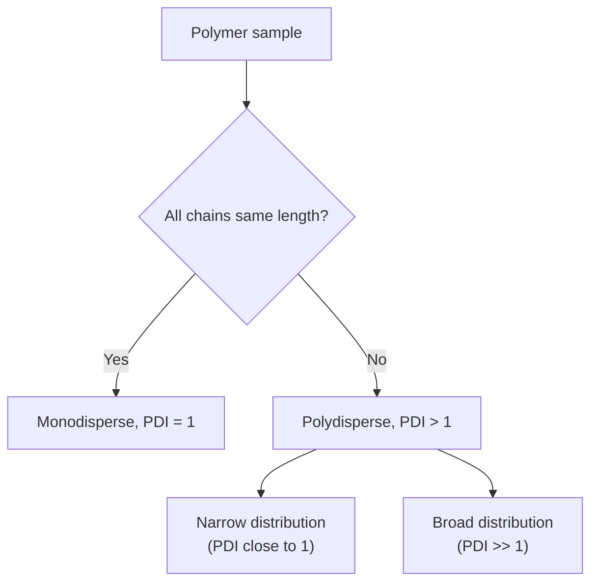

---

### 1(iii) Worked Numerical Problem — $M_n$, $M_w$, $M_v$, $M_z$, PDI

**Given:** three molecular-weight populations, $M_1=10,\ M_2=20,\ M_3=30$,
present in numbers $N_1=6,\ N_2=4,\ N_3=2$.

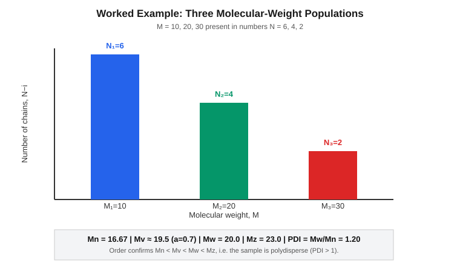

**Step 1 — basic sums**

| $M_i$ | $N_i$ | $N_iM_i$ | $N_iM_i^2$ | $N_iM_i^3$ |
|---|---|---|---|---|
| 10 | 6 | 60 | 600 | 6,000 |
| 20 | 4 | 80 | 1,600 | 32,000 |
| 30 | 2 | 60 | 1,800 | 54,000 |
| **Σ** | **12** | **200** | **4,000** | **92,000** |

**Step 2 — Number average**

$$M_n = \frac{\sum N_iM_i}{\sum N_i} = \frac{200}{12} = 16.67$$

**Step 3 — Weight average**

$$M_w = \frac{\sum N_iM_i^2}{\sum N_iM_i} = \frac{4000}{200} = 20.0$$

**Step 4 — Z average**

The z-average weights each chain by $M_i^3\,N_i$ relative to $M_i^2 N_i$; it
is even more sensitive to the high-molecular-weight tail than $M_w$, and is
what techniques like sedimentation-equilibrium ultracentrifugation measure:

$$M_z = \frac{\sum N_iM_i^3}{\sum N_iM_i^2} = \frac{92000}{4000} = 23.0$$

**Step 5 — Viscosity average**

$M_v$ is what intrinsic-viscosity (Mark–Houwink) measurements give; it needs
the Mark–Houwink exponent $a$, which depends on the polymer–solvent pair and
chain conformation ($a=1$ for a rigid rod, $a\approx0.5$–$0.8$ for typical
flexible coils in good solvent, $a=0$ for a rigid sphere). Taking the common
illustrative value $a = 0.7$:

$$M_v = \left(\frac{\sum N_iM_i^{1+a}}{\sum N_iM_i}\right)^{1/a}$$

| $M_i$ | $N_i$ | $M_i^{1.7}$ | $N_iM_i^{1.7}$ |
|---|---|---|---|
| 10 | 6 | 50.12 | 300.7 |
| 20 | 4 | 162.86 | 651.4 |
| 30 | 2 | 324.39 | 648.8 |
| **Σ** | | | **1600.9** |

$$M_v = \left(\frac{1600.9}{200}\right)^{1/0.7} = (8.005)^{1.4286} \approx 19.5$$

**Step 6 — Polydispersity Index**

$$\text{PDI} = \frac{M_w}{M_n} = \frac{20.0}{16.67} = 1.20$$

**Summary of results**

$$M_n = 16.67 \ < \ M_v \approx 19.5 \ < \ M_w = 20.0 \ < \ M_z = 23.0$$

This ordering — $M_n < M_v < M_w < M_z$ — is the general rule for any
polydisperse sample (with $M_v$'s position between $M_n$ and $M_w$ depending
on $a$; $M_v \to M_w$ as $a \to 1$).

**Proof that $M_w \geq M_n$ (Cauchy–Schwarz argument)**

We want to show $M_w - M_n \geq 0$ for any set of positive $N_i, M_i$, with
equality only when all $M_i$ are equal (monodisperse).

$$M_w - M_n = \frac{\sum N_iM_i^2}{\sum N_iM_i} - \frac{\sum N_iM_i}{\sum N_i}
= \frac{\left(\sum N_i\right)\left(\sum N_iM_i^2\right) - \left(\sum N_iM_i\right)^2}{\left(\sum N_i\right)\left(\sum N_iM_i\right)}$$

The denominator is a product of two positive sums, so it is positive. For the
numerator, apply the **Cauchy–Schwarz inequality** to the vectors
$u_i = \sqrt{N_i}$ and $v_i = \sqrt{N_i}\,M_i$:

$$\left(\sum_i u_iv_i\right)^2 \le \left(\sum_i u_i^2\right)\left(\sum_i v_i^2\right)$$

$$\left(\sum_i N_iM_i\right)^2 \le \left(\sum_i N_i\right)\left(\sum_i N_iM_i^2\right)$$

which is exactly the numerator being $\geq 0$, with **equality if and only
if** $v_i/u_i = M_i$ is the same constant for every $i$ — i.e. the sample is
monodisperse. Since numerator $\geq 0$ and denominator $>0$:

$$M_w - M_n \geq 0 \quad\Longrightarrow\quad M_w \geq M_n$$

with equality only for a perfectly monodisperse polymer. This is equivalent
to the statement that the **variance of the number distribution is
non-negative** — $M_w/M_n - 1$ is in fact proportional to the (number-based)
variance of the distribution divided by $M_n^2$, which is why PDI is
sometimes used directly as a breadth-of-distribution metric.

<strong>Practice check</strong>

Verify: if all three populations instead had $M=20$ (monodisperse, same total
N), recompute $M_n$ and $M_w$ and confirm they are equal, PDI $=1$.

PDI = $M_w / M_n$ = 20 / 16.67 = 1.2

**Prove that $M_w > M_n$:**

Subtract $M_n$ from $M_w$:

$$
M_w - M_n = \frac{\sum N_i M_i^2}{\sum N_i M_i} - \frac{\sum N_i M_i}{\sum N_i}
$$

$$
= \frac{(\sum N_i)(\sum N_i M_i^2) - (\sum N_i M_i)^2}{(\sum N_i M_i)(\sum N_i)}
$$

The numerator is $(\sum N_i)(\sum N_i M_i^2) - (\sum N_i M_i)^2$, which is $\geq 0$ by the **Cauchy–Schwarz inequality** (equality only when all $M_i$ are identical, i.e. a monodisperse sample). Since the denominator is positive, $M_w - M_n \geq 0$, i.e. $\boxed{M_w \geq M_n}$, with strict inequality $M_w > M_n$ for any polydisperse polymer.

In our data: $20 > 16.67$ ✓
---

## Question 2 — Thermal Transitions, Morphology, and Degradation/Stabilization

### 2(i) Glass Transition Temperature ($T_g$) vs. Melting Temperature ($T_m$)

**$T_g$ (Glass Transition Temperature)** is the temperature at which the
**amorphous regions** of a polymer change from a hard, glassy, brittle state
to a soft, rubbery/viscous state. It is not a phase change in the
thermodynamic sense — no latent heat is absorbed and no discontinuity in
volume occurs. Instead, it is a **second-order transition**: there is a
change in *slope* of volume (or enthalpy) vs. temperature, because segmental
(local chain-backbone) motion is "frozen in" below $T_g$ and becomes possible
above it. $T_g$ depends on chain flexibility, free volume, intermolecular
forces, and even on cooling rate (it is measured, not a fixed thermodynamic
constant).

**$T_m$ (Melting Temperature)** applies only to the **crystalline regions**
of a polymer — a fully amorphous polymer has no $T_m$. It is the temperature
at which ordered, crystalline lamellae break down into a disordered melt. It
*is* a **first-order thermodynamic transition**: there is a discontinuous
jump in specific volume and a latent heat of fusion ($\Delta H_f$) is
absorbed, exactly analogous to ice melting.

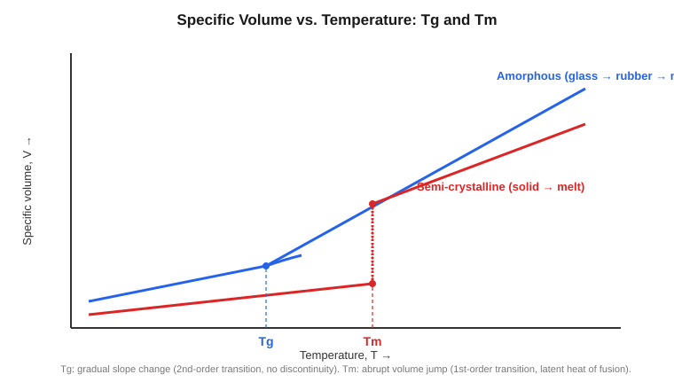

| | $T_g$ | $T_m$ |
|---|---|---|
| Region affected | Amorphous | Crystalline |
| Transition order | Second-order (slope change) | First-order (discontinuous jump) |
| Latent heat | None | Absorbed ($\Delta H_f$) |
| Applies to | All polymers with amorphous content | Only semi-crystalline/crystalline polymers |
| Typical ratio | $T_g \approx (0.5$–$0.8)\,T_m$ (in Kelvin) | — |

A semi-crystalline polymer (e.g. HDPE, isotactic PP) shows **both**
transitions on heating (Tg from its amorphous fraction, Tm from its
crystalline fraction); a fully amorphous polymer (e.g. atactic PS,
PMMA) shows only $T_g$.

---

### 2(ii) Amorphous vs. Crystalline Polymer

**Amorphous polymers** have chains arranged with no long-range positional
order — the chains are randomly coiled and entangled, like cooked spaghetti.
They are typically transparent (no crystallite boundaries to scatter light),
have a single $T_g$ and no sharp $T_m$, soften gradually over a temperature
range, and tend to be more soluble in solvents. Examples: atactic
polystyrene (PS), polymethyl methacrylate (PMMA), polycarbonate (PC).

**Crystalline (in practice, semi-crystalline) polymers** have regions
where chains fold back on themselves in a regular, periodic arrangement
(lamellae), which further organize into larger spherulitic structures.
Between/around these ordered lamellae, amorphous (disordered) material
remains — no bulk polymer is 100% crystalline because entanglements and
chain-end defects prevent perfect packing. Semi-crystalline polymers are
typically translucent-to-opaque (spherulites scatter light), have a sharp
$T_m$ in addition to a $T_g$, higher density, stiffness, and solvent/chemical
resistance than an amorphous version of the same polymer. Examples:
high-density polyethylene (HDPE), isotactic polypropylene (iPP), Nylon-6,6,
PET (in its crystallized form).

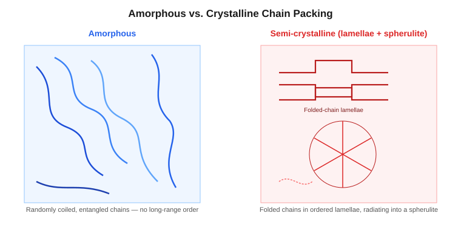

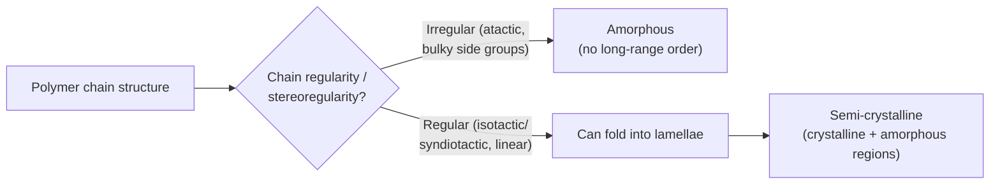

---

### 2(iii) Degree of Crystallinity vs. Crystallisability

These two terms are frequently confused but describe different things:

**Degree of crystallinity ($X_c$)** is a **measured, present-state**
property: the actual fraction (by mass or volume) of a *given sample* that
is currently in the crystalline state, under the processing conditions it
actually experienced:

$$X_c = \frac{\text{mass (or volume) of crystalline phase}}{\text{total mass (or volume) of sample}} \times 100\%$$

It is measured experimentally by DSC (heat of fusion relative to 100%
crystalline reference), X-ray diffraction (crystalline vs. amorphous halo
areas), or density measurements. $X_c$ depends heavily on **processing
history** — cooling rate, annealing time, presence of nucleating agents —
because crystallization is a kinetic process that needs time for chains to
diffuse into ordered lamellae.

**Crystallisability** is an **intrinsic, structural capacity** of the
polymer's molecular architecture to form crystallites *if given the
opportunity* (slow enough cooling, sufficient chain mobility). It depends on
chain regularity, stereoregularity (tacticity), symmetry, absence of bulky
or randomly placed side groups, and intermolecular forces (H-bonding,
polarity) that favor ordered packing. It is a fixed property of the polymer's
chemical structure, not of a particular sample's thermal history.

**The key distinction, illustrated:** isotactic polypropylene has *high
crystallisability* (its regular, stereoregular chains pack easily), but if
it is quenched (cooled extremely fast) it can be trapped in a low
*crystallinity* state, because the chains didn't have time to organize.
Conversely, atactic polypropylene has essentially *zero crystallisability*
(irregular chain structure can never pack into an ordered lattice), so no
amount of slow cooling will raise its crystallinity.

---

### 2(iv) Photo Degradation vs. Oxidative Degradation

**Photo-degradation** is initiated by absorption of **UV/visible light**
(usually by a chromophoric group — carbonyl impurities from processing,
catalyst residues, or the polymer's own weak UV-absorbing bonds). Absorbed
photon energy promotes an electron to an excited state, which then undergoes
homolytic bond cleavage (**Norrish Type I**: α-scission at a carbonyl,
producing two radicals; **Norrish Type II**: intramolecular hydrogen
transfer leading to chain scission without initial radical formation). The
resulting radicals can go on to react with atmospheric oxygen, which is why
photo-degradation and oxidative degradation are often coupled in outdoor
("photo-oxidative") service.

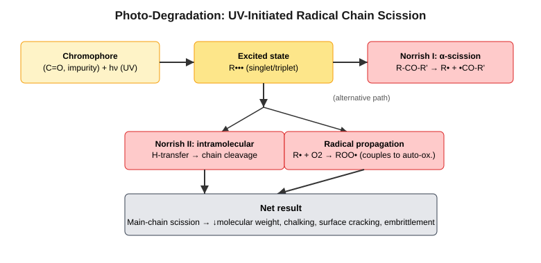

**Oxidative degradation (auto-oxidation)** is a **radical chain reaction
driven by molecular oxygen**, which can be initiated thermally, mechanically
(shear-induced radical formation), by trace metal-ion catalysis, or by
radicals from a prior photo-degradation step. It proceeds through the
classic three-stage radical chain-reaction kinetics:

1. **Initiation:** $RH \rightarrow R\bullet + H\bullet$
2. **Propagation:** $R\bullet + O_2 \rightarrow ROO\bullet$, then
   $ROO\bullet + RH \rightarrow ROOH + R\bullet$ (self-sustaining cycle)
3. **Branching/termination:** hydroperoxides ($ROOH$) are themselves
   thermally or photolytically unstable and decompose to give *more*
   radicals ($RO\bullet$, $\bullet OH$), accelerating (autocatalyzing) the
   reaction — this is why oxidative degradation shows an induction period
   followed by a rapid, self-accelerating decline in properties.

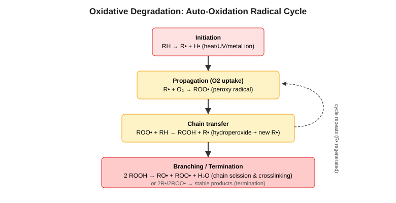

| | Photo-degradation | Oxidative degradation |
|---|---|---|
| Trigger | UV/visible photons | O₂ (thermally/mechanically/photolytically initiated) |
| Key step | Norrish I/II photolysis | Peroxy-radical chain propagation |
| Needs light? | Yes | No (can occur in the dark, thermally) |
| Needs O₂? | Often coupled, not strictly required | Yes, by definition |
| Typical symptom | Surface chalking, yellowing, cracking | Embrittlement, loss of mechanical properties, odor |

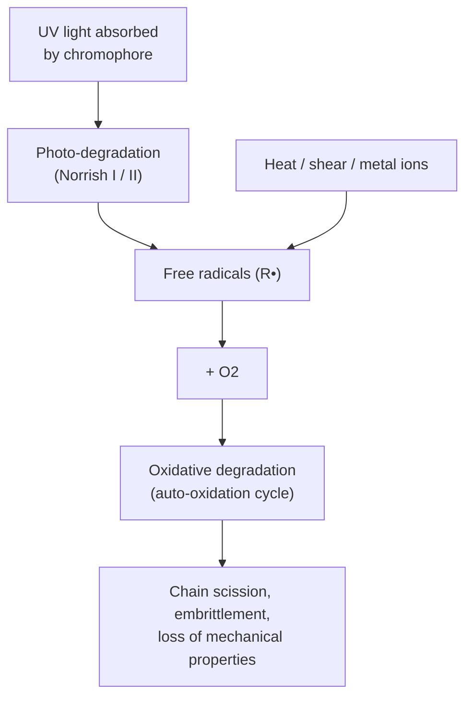

---

### 2(v) Photo-Stabilizer and Anti-Oxidant: Function and Mechanism

**Photo-stabilizers** protect the polymer against UV-initiated degradation,
primarily via two mechanisms:

- **UV absorbers** (e.g. benzotriazoles, benzophenones, hydroxyphenyl
  triazines) work by preferentially absorbing incoming UV photons themselves
  and dissipating the energy harmlessly as heat, via a fast, reversible
  excited-state intramolecular hydrogen-transfer (tautomerization) cycle —
  the absorber molecule returns to its ground state unchanged and can absorb
  again. This prevents the polymer's own chromophores from ever reaching the
  excited state needed for Norrish-type cleavage.
- **HALS (Hindered Amine Light Stabilizers)** do *not* absorb UV directly.
  Instead they interrupt the radical chain via the **Denisov cycle**: the
  amine is oxidized to a stable **nitroxyl radical** ($>N\text{-}O\bullet$),
  which scavenges carbon-centered radicals ($R\bullet$) to form
  $>N\text{-}O\text{-}R$; this species then reacts further to regenerate the
  nitroxyl radical, so a single HALS molecule can scavenge many radicals
  catalytically — this is why HALS remain effective at very low loadings
  (typically 0.1–0.5 wt%) and over long service lifetimes.

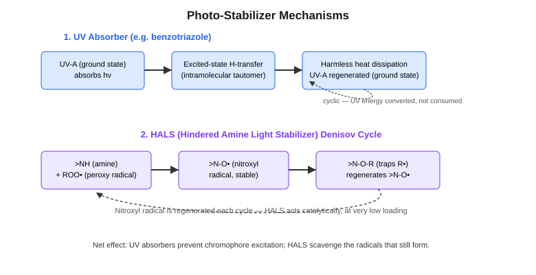

**Anti-oxidants** protect against oxidative (auto-oxidation) degradation,
mainly via two complementary mechanisms:

- **Primary (chain-breaking) anti-oxidants** — typically **hindered
  phenols** (e.g. Irganox 1010) — donate a labile hydrogen atom to a peroxy
  radical: $ROO\bullet + AO\text{-}H \rightarrow ROOH + AO\bullet$. The
  resulting phenoxy radical $AO\bullet$ is stabilized by resonance
  delocalization over the aromatic ring and sterically shielded by bulky
  *tert*-butyl groups at the ortho positions, so it is too unreactive to
  continue the chain — this breaks the propagation cycle.
- **Secondary (peroxide-decomposing) anti-oxidants** — phosphites and
  thioesters — react with hydroperoxides ($ROOH$) *non-radically*, converting
  them to stable alcohols before they can thermally/photolytically split
  into new chain-branching radicals, thereby suppressing the autocatalytic
  branching step.

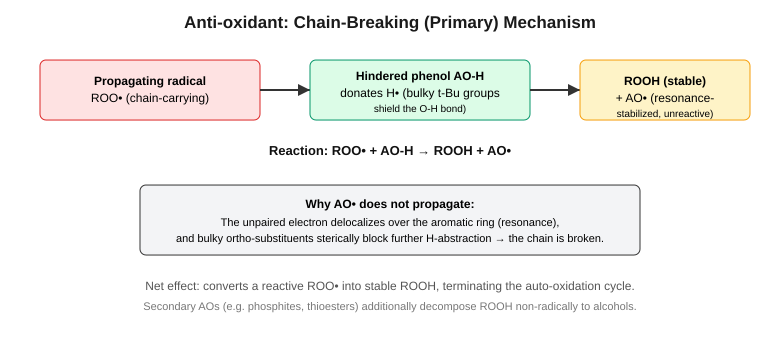

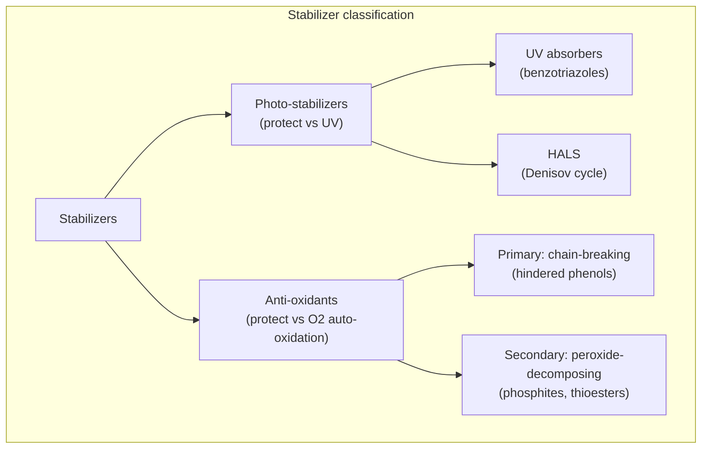

In commercial formulations these are almost always used **together** (a
hindered-phenol/HALS/phosphite package), because they act at different
points of the same overlapping radical network — UV absorbers and HALS
suppress the photo-initiation step, while primary and secondary
anti-oxidants suppress the propagation and branching steps of the resulting
auto-oxidation cycle.

<strong>Self-test questions</strong>

1. Why does $M_w$ always equal or exceed $M_n$, and under what single
   condition are they exactly equal?
2. Why does $T_g$ show no latent heat while $T_m$ does?
3. A polymer sample has high crystallisability but is measured with low
   crystallinity — what processing history would explain this?
4. Why is oxidative degradation described as "auto-catalytic" / self-
   accelerating?
5. Why can HALS be effective at much lower loadings than hindered-phenol
   anti-oxidants?

