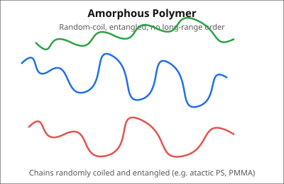
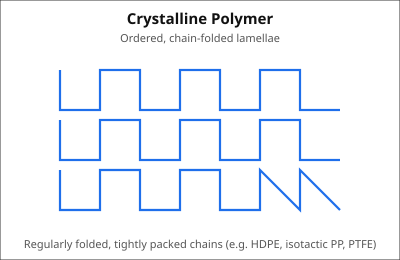
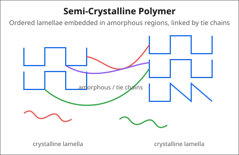

# SET-B — Polymer Chemistry Notes

---

## 1. SET-B

### (i) Practical significance of polymer molecular weight

| Property affected | Effect of increasing MW |
|---|---|
| **Mechanical strength** (tensile, impact) | Increases sharply, then plateaus once chains exceed the **entanglement molecular weight (Mₑ)** |
| **Melt viscosity / processability** | Increases (η ∝ M^3.4 above Mₑ) → harder to mold/extrude |
| **Solubility** | Decreases with increasing MW |
| **Tg, crystallinity** | Rise with MW up to a limiting value, then level off (Fox–Flory: $T_g = T_{g\infty} - K/M_n$) |
| **End-use selection** | Fibers/engineering plastics need **high MW**; adhesives, coatings, low-viscosity resins need **moderate/low MW** |

**Key point:** MW must be high enough for chain **entanglement** (load transfer between chains) but not so high that processing becomes impossible — hence MW is optimized, not simply maximized.

---

### (ii) Techniques of polymerization

Main techniques: **Bulk, Solution, Suspension, Emulsion** polymerization.

#### Suspension Polymerization ("Pearl/Bead polymerization")

| Feature | Description |
|---|---|
| Principle | Water-insoluble monomer dispersed as **fine droplets (0.01–1 mm)** in water by mechanical agitation |
| Initiator | **Monomer-soluble (oil-soluble)**, e.g. benzoyl peroxide — dissolved *inside* each droplet |
| Suspending agent | PVA, gelatin, starch — prevents droplet coalescence |
| Mechanism | Each droplet behaves as an independent **mini bulk-polymerization reactor** |
| Heat control | Excellent (water acts as heat sink) — low viscosity of continuous phase |
| Product | Solid polymer **beads/pearls**, easily filtered and washed |
| Examples | PVC, expandable polystyrene (EPS), PMMA beads |

```
Monomer (oil droplet, contains initiator) ---agitation---> suspended in water
        |
        v
  droplet polymerizes as a mini-bulk reactor → solid polymer bead
```

#### Emulsion Polymerization

| Feature | Description |
|---|---|
| Principle | Monomer emulsified in water using a **surfactant** above its critical micelle concentration (CMC), forming monomer-swollen **micelles** |
| Initiator | **Water-soluble**, e.g. K₂S₂O₈ (potassium persulfate) |
| Mechanism | Radicals form in the aqueous phase → diffuse into monomer-swollen micelles → propagation occurs **inside micelles** (compartmentalized, Smith–Ewart kinetics) |
| Characteristics | High molecular weight **and** high rate simultaneously (radicals are isolated from each other → low termination rate) |
| Product | Colloidal dispersion = **latex** (not directly a solid) |
| Examples | SBR rubber latex, PVAc emulsion, acrylic latex paints |

```
Surfactant + H2O → micelles ⊃ monomer (swollen micelles)
Water-soluble initiator → R• (aqueous phase)
R• diffuses into micelle → propagation inside micelle → polymer particle (latex)
```

---

### (iii) Monodispersity, Polydispersity, Polydispersity Index

- **Monodisperse polymer:** all chains have **identical chain length/molar mass**. Essentially ideal; occurs (nearly) in proteins/biopolymers and living/controlled polymerizations.
- **Polydisperse polymer:** chains have a **distribution of molar masses**, because chain initiation, propagation, and termination are statistical/random events. Almost all synthetic polymers are polydisperse.
- **Polydispersity Index (PDI) / Heterogeneity Index:**

$$
PDI = \dfrac{M_w}{M_n} \ge 1
$$

where $M_w$ = weight-average molar mass, $M_n$ = number-average molar mass.

| PDI value | Meaning |
|---|---|
| PDI = 1 | Perfectly monodisperse |
| PDI > 1 | Polydisperse; larger PDI → broader molar-mass distribution |

---

### (iv) Physical vs Chemical degradation of polymer

#### Physical degradation
Caused by **physical energy input** (heat, mechanical stress, radiation) acting on the polymer, causing chain scission/crosslinking without primary reaction with an external chemical species.

- **Thermal degradation:** high heat → random/end-chain scission, unzipping (depolymerization)
- **Mechanical degradation:** shear, fatigue, ultrasonication → C–C bond rupture
- **Photodegradation (physical route):** UV photons absorbed by chromophores → excited state → homolytic bond cleavage (Norrish Type I/II reactions)

*Result:* embrittlement, loss of MW, reduced mechanical strength, discoloration.

#### Chemical degradation
Involves an actual **chemical reaction of the polymer with an external reagent** (O₂, H₂O, O₃, acids/bases).

**Oxidative degradation (autoxidation, free-radical chain):**

```
RH  --(heat/UV/catalyst)-->  R•                     (initiation)
R•  +  O2                -->  ROO•                   (propagation)
ROO• + RH                -->  ROOH + R•               (propagation)
ROOH                     -->  RO• + •OH               (branching)
R• + R• / ROO• + ROO•    -->  crosslink or scission   (termination)
```

**Hydrolytic degradation** (ester/amide-linked polymers, e.g. polyesters, polyamides):

$$
\text{–CO–O–} \; + \; H_2O \;\; \xrightarrow{H^+/OH^-} \;\; \text{–COOH} \; + \; \text{HO–}
$$

**Ozonolysis** (attacks C=C in rubbers): forms surface cracks ("ozone cracking") via ozonide → carbonyl cleavage products.

---

### (v) Derivation of $M_w = \dfrac{\sum n_i m_i^2}{\sum n_i m_i}$

**Definitions:**
- $n_i$ = number of molecules of species $i$
- $m_i$ = molar mass of species $i$
- Total mass of sample: $W = \sum n_i m_i$
- **Weight fraction** of species $i$: $w_i = \dfrac{n_i m_i}{\sum n_i m_i}$

**Step 1 — Definition of $M_w$:**
$M_w$ is the average molar mass **weighted by mass (not number)** of each species, i.e. each species contributes according to how much it contributes to the total *mass*, not how many molecules there are:

$$
M_w = \sum_i w_i \, m_i
$$

**Step 2 — Substitute weight fraction:**

$$
M_w = \sum_i \left(\frac{n_i m_i}{\sum_i n_i m_i}\right) m_i
$$

**Step 3 — Simplify (denominator is constant w.r.t. the sum index):**

$$
M_w = \frac{\sum_i n_i m_i \cdot m_i}{\sum_i n_i m_i} = \frac{\sum_i n_i m_i^2}{\sum_i n_i m_i}
$$

$$
\boxed{M_w = \dfrac{\sum n_i m_i^{2}}{\sum n_i m_i}}
$$

This is larger than $M_n = \dfrac{\sum n_i m_i}{\sum n_i}$ because $M_w$ gives extra statistical weight to the **larger** molecules (they contribute more mass), hence $M_w \ge M_n$ always.

---

### (vi) Photostabilizers and Antioxidants

#### 4 Photostabilizers

| Name | Structural representation (condensed) | Role |
|---|---|---|
| **UV-P** — 2-(2-Hydroxyphenyl)benzotriazole | Benzotriazole ring fused to a phenol: `HO-C6H3(t-Bu)-C6H3(N3-ring)` (o-OH on phenyl attached to benzotriazole) | **UV absorber**; absorbs UV, dissipates energy as heat via excited-state intramolecular H-transfer |
| **Tinuvin 770 (HALS)** — bis(2,2,6,6-tetramethyl-4-piperidinyl) sebacate | Piperidine ring `>N-CH<` (tetramethyl-substituted) esterified at both ends of sebacic acid: `(CH2)8(CO-O-piperidinyl)2` | **Radical scavenger** (Denisov cycle); traps alkyl/peroxy radicals formed during photo-oxidation |
| **UV-9** — 2-Hydroxy-4-methoxybenzophenone | Benzophenone core: `C6H4(OH)-CO-C6H4(OCH3)` (ortho-OH, para-OCH₃) | **UV absorber**; chelated o-OH allows non-radiative energy dissipation |
| **Nickel dibutyldithiocarbamate** | `Ni[S2C-N(C4H9)2]2` (Ni chelated by two dithiocarbamate ligands) | **Excited-state quencher**; deactivates excited carbonyl states before bond cleavage |

#### 4 Antioxidants

| Name | Structural representation (condensed) | Role |
|---|---|---|
| **BHT** — 2,6-di-*tert*-butyl-4-methylphenol | `(t-Bu)2-C6H2(OH)-CH3` (phenol, 2,6-di-t-Bu, 4-Me) | **Primary AO**; donates phenolic H to ROO•, forms stable resonance-stabilized phenoxy radical, terminates the chain |
| **Irganox 1010** — pentaerythritol tetrakis[3-(3,5-di-*t*-Bu-4-hydroxyphenyl)propionate] | Pentaerythritol core `C(CH2-O-CO-CH2CH2-C6H2(OH)(t-Bu)2)4` (4 hindered-phenol arms) | **Primary AO**; hindered phenolic H-donor, low volatility (high MW) |
| **Tris(nonylphenyl) phosphite (TNPP)** | `P(O-C6H4-C9H19)3` | **Secondary AO**; reduces hydroperoxides ROOH → ROH (non-radically), prevents branching |
| **Dilauryl thiodipropionate (DLTDP)** | `C12H25-O-CO-CH2CH2-S-CH2CH2-CO-O-C12H25` | **Secondary AO**; sulfide sulfur decomposes ROOH → ROH, synergist with phenolic primary AOs |

---

## 2. Polymer Physical Properties

### (i) Relation between Tg and Tm

- **$T_g$ (glass transition temperature):** a **second-order** transition — onset of long-range segmental motion in the **amorphous** regions; no latent heat, only change in heat capacity/expansion coefficient.
- **$T_m$ (melting temperature):** a **first-order** transition — melting of **crystalline** regions; involves latent heat of fusion, sharp thermodynamic transition.
- $T_g$ is **always lower** than $T_m$ for a given polymer, since crystallites are more thermally stable than the disordered regions.

**Empirical (approximate, not universal) rule — Boyer–Beaman rule** (temperatures in Kelvin):

$$
T_g \approx \tfrac{2}{3}\,T_m \quad \text{(symmetrical polymers, e.g. PE)}
$$
$$
T_g \approx \tfrac{1}{2}\,T_m \quad \text{(unsymmetrical polymers, e.g. PP, PVC)}
$$

This is a **rough empirical correlation** for estimation only — actual values depend on chain structure, polarity, and measurement conditions.

---

### (ii) Morphology of amorphous, crystalline, and semi-crystalline polymers

**Amorphous polymer** — chains randomly coiled and entangled, no long-range order:



**Crystalline polymer** — chains regularly folded into ordered lamellae:



**Semi-crystalline polymer** — crystalline lamellae embedded within amorphous matrix, connected by tie chains:



---

### (iii) Crystalline vs Amorphous polymers

| Property | Crystalline | Amorphous |
|---|---|---|
| Chain arrangement | Regular, ordered, chain-folded lamellae | Random, disordered coils |
| Intermolecular order | Long-range order present | Only short-range order |
| Packing / density | Densely packed → **higher density** | Loosely packed → **lower density** |
| Optical | Opaque/translucent (light scattered at crystallite boundaries) | Transparent |
| Thermal transition | Sharp **$T_m$** (first order) | No true $T_m$; only $T_g$ (second order) |
| Mechanical | Stronger, stiffer, higher tensile strength, lower elongation | Softer, more flexible, higher elongation |
| Processing | Higher melting point, narrower/sharper processing window | Broad softening range, easier to process/thermoform |
| Examples | HDPE, isotactic PP, PTFE, Nylon 6,6 | Atactic PS, PMMA, Polycarbonate |

---

### (iv) Tg and Tm values of 4 polymers (approximate, literature-typical values — actual values vary with MW, crystallinity, tacticity, and measurement method)

| Polymer | Repeat unit | Tg (°C) | Tm (°C) |
|---|---|---|---|
| Polyethylene (HDPE) | `[-CH2-CH2-]n` | ≈ −120 | ≈ 130–137 |
| Polypropylene (isotactic) | `[-CH2-CH(CH3)-]n` | ≈ −10 to 0 | ≈ 160–175 |
| Poly(vinyl chloride), PVC | `[-CH2-CHCl-]n` | ≈ 80–87 | ≈ 210 (mostly amorphous in practice — low, imperfect crystallinity) |
| Nylon 6,6 | `[-NH-(CH2)6-NH-CO-(CH2)4-CO-]n` | ≈ 50–60 | ≈ 255–265 |

---

### (v) Importance of Tg and factors influencing Tg

**Importance of $T_g$:**
- Defines the **service-temperature boundary**: below $T_g$ the polymer is hard/glassy/brittle; above $T_g$ it is soft/rubbery/flexible.
- Guides **material selection** — e.g., packaging films need $T_g$ below use temperature (flexible), structural/engineering plastics need $T_g$ above use temperature (rigid).
- Sets **processing temperatures** (extrusion, molding must be done well above $T_g$/$T_m$).
- Governs impact strength, creep resistance, and dimensional stability.

**Factors influencing $T_g$:**

| Factor | Effect on Tg |
|---|---|
| Chain flexibility (e.g. Si–O, C–O backbone) | Flexible backbone → **lower** Tg |
| Backbone rigidity (aromatic rings, double bonds) | Rigid backbone → **higher** Tg |
| Bulky/rigid side groups | Restrict rotation (steric hindrance) → **higher** Tg |
| Intermolecular forces (H-bonding, polarity) | Stronger secondary forces → **higher** Tg |
| Molecular weight | Tg increases with MW, then plateaus: $T_g = T_{g\infty} - K/M_n$ |
| Branching | More free volume → generally **lowers** Tg (unless branches are bulky/rigid) |
| Cross-linking | Restricts segmental motion → **higher** Tg (increases with crosslink density) |
| Crystallinity | Crystallites act as physical anchors/pseudo-crosslinks → can effectively **raise** apparent Tg of the amorphous phase |
| Plasticizers | Increase free volume, act as internal lubricant → **lower** Tg |
| Copolymerization | Tg intermediate between homopolymers, estimated by Fox equation: $\dfrac{1}{T_g} = \dfrac{w_1}{T_{g1}} + \dfrac{w_2}{T_{g2}}$ |
| Tacticity/stereoregularity | Affects packing efficiency; changes crystallizability and hence apparent Tg/Tm behavior |

---

## OR Question

### Why is the Tg of poly(vinyl carbazole) (PVK) higher than that of polyethylene (PE)?

**Repeat units:**

- Polyethylene: `[-CH2-CH2-]n` (simple backbone, only H substituents)
- Poly(vinyl carbazole): `[-CH2-CH(carbazolyl)-]n`, where carbazolyl = a fused tricyclic aromatic **N-heterocycle** attached at every repeat unit

| Factor | Polyethylene | Poly(vinyl carbazole) |
|---|---|---|
| Side group | None (only H) | Bulky, **planar, rigid, fused-aromatic carbazole** ring |
| Steric hindrance | Minimal — free rotation about C–C bonds | Large — carbazole ring severely restricts backbone rotation |
| Intermolecular forces | Weak van der Waals only | Strong **π–π stacking** between carbazole rings + higher polarizability |
| Chain mobility | High — chains move/slide easily at low T | Very low — segmental motion requires much more thermal energy |
| Approx. Tg | ≈ −120 °C | ≈ 200–227 °C |

**Conclusion:** The bulky, rigid, aromatic carbazole side group in PVK sterically blocks free rotation of the backbone and introduces strong π–π stacking interactions between chains, both of which drastically raise the energy needed for segmental motion. PE's simple, flexible, unsubstituted backbone with only weak van der Waals forces allows chain motion at very low temperature, giving it a much lower Tg.

---

### Factors considered when selecting a plasticizer for commercial application

- **Compatibility:** must be miscible with the polymer (matched solubility parameter); poor compatibility causes exudation ("blooming")
- **Permanence / low volatility:** low vapor pressure so it doesn't evaporate over the product's service life
- **Efficiency:** maximum Tg/hardness reduction per unit amount added
- **Thermal stability:** must not decompose at processing temperatures
- **Chemical stability:** resistance to oxidation, hydrolysis, UV degradation
- **Migration/extraction resistance:** should not leach into contacting solvents, food, or skin
- **Toxicity and safety:** essential for food-contact, medical, and toy applications (e.g. regulatory limits on phthalates)
- **Cost-effectiveness:** economic viability for large-scale/commercial use
- **Processing compatibility:** should not interfere with molding/extrusion behavior
- **Effect on mechanical properties:** should improve flexibility without excessive loss of tensile strength
- **Effect on Tg:** must lower Tg to bring the desired service-temperature flexibility
- **Environmental/regulatory compliance:** biodegradability, REACH/RoHS and similar regulations, low ecotoxicity
- Additional practical criteria: color, odor, clarity, and compatibility with other additives
