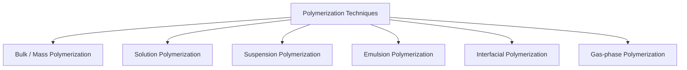
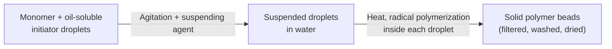
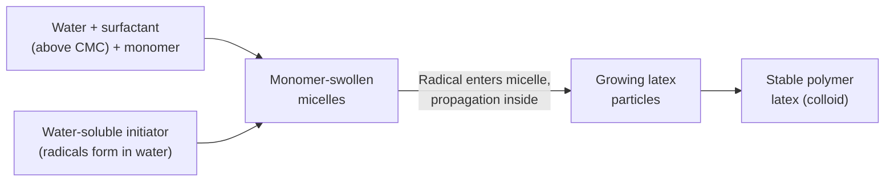
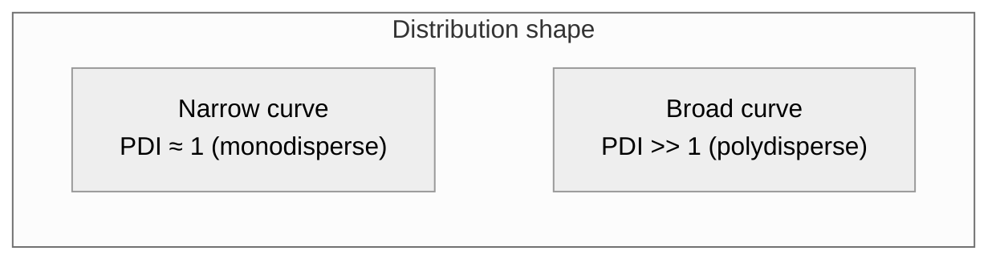
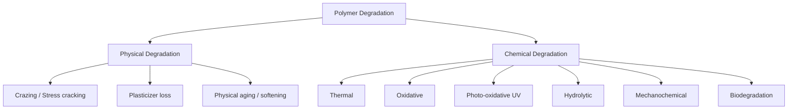
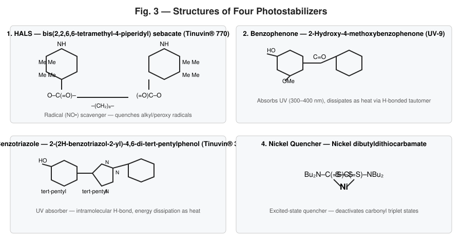
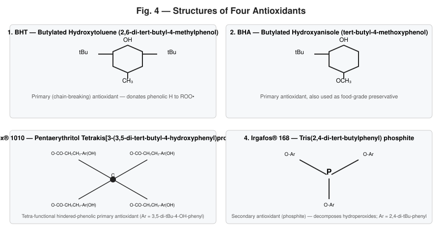
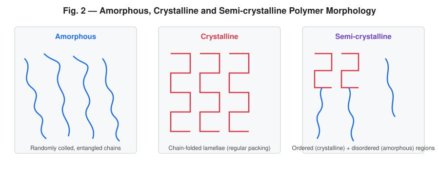
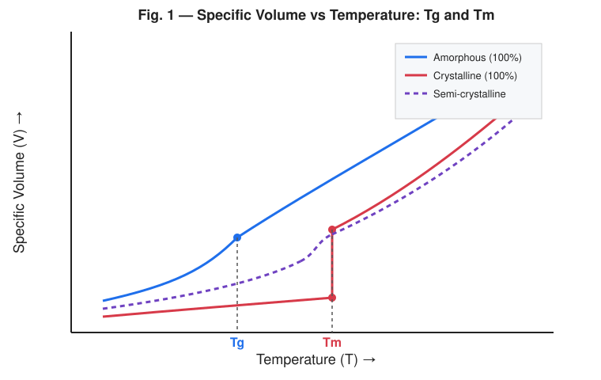

# SET – B: Polymer Science — Answer Script

---

## Q1

### (i) Practical significance of polymer molecular weight

The molecular weight (MW) of a polymer is not a single fixed value (like it is for small molecules) but a **distribution**, and nearly every mechanical, thermal, and processing property of a polymer is governed by it.

| Property affected | Effect of increasing molecular weight |
|---|---|
| Tensile strength, toughness, impact resistance | Increase, then plateau above a critical MW |
| Melt viscosity / processability | Increases sharply (viscosity ∝ M^3.4 above entanglement MW) — harder to mould/extrude |
| Softening point / Tg | Increases and then levels off |
| Solubility | Decreases with increasing MW |
| Crystallinity | Very high MW can hinder chain folding, lowering crystallinity |
| Creep resistance / dimensional stability | Improves |
| Brittleness at low MW | Low-MW polymers are weak and brittle (oligomers behave like waxes/resins) |

**Practical importance:**
1. **Mechanical performance** — properties such as tensile strength and impact strength only become useful above a *critical (threshold) molecular weight*; below it the material is too weak for engineering use.
2. **Processing/fabrication** — MW dictates melt/solution viscosity, hence injection-moulding, extrusion, and spinning conditions (temperature, pressure, shear).
3. **End-use selection** — e.g., low-MW polyethylene waxes are used as coatings, medium-MW as films, ultra-high-MW polyethylene (UHMWPE) as bulletproof vests/artificial joints.
4. **Quality control** — MW and its distribution are used as specifications in polymer manufacturing (via GPC/SEC, viscometry).
5. **Degradation & aging behaviour** — high-MW polymers resist degradation-induced property loss longer than low-MW ones.

---

### (ii) Polymerization techniques — suspension and emulsion polymerization

**Names of common polymerization techniques (by physical method of carrying out the reaction):**

#### Suspension polymerization

- **Principle:** A water-insoluble monomer (containing an oil-soluble initiator) is mechanically dispersed as fine droplets (10–1000 µm) in a continuous aqueous phase, stabilized by a suspending agent (e.g., PVA, gelatin, MC). Each droplet acts as a tiny "bulk polymerization reactor."
- **Mechanism:** Free-radical chain polymerization proceeds *inside each monomer droplet*, exactly as in bulk polymerization, while water (continuous phase) acts as the heat-transfer medium.
- **Product:** Solid polymer beads/pearls (hence also called *bead* or *pearl* polymerization).
- **Examples:** PVC, polystyrene (expandable beads), PMMA beads, ion-exchange resins.

#### Emulsion polymerization

- **Principle:** Monomer is emulsified in water using a **surfactant/emulsifier** above its critical micelle concentration (CMC), forming monomer-swollen **micelles**. A **water-soluble initiator** (e.g., K₂S₂O₈) generates radicals in the aqueous phase.
- **Mechanism:** Radicals formed in water enter monomer-swollen micelles → polymerization occurs *inside the micelles*, which grow into polymer particles (latex particles, 50–500 nm) stabilized by surfactant.
- **Product:** A stable colloidal dispersion called **latex**.
- **Examples:** SBR, polychloroprene (neoprene latex), PVA emulsion (white glue), acrylic latex paints.

**Key differences (Suspension vs Emulsion):**

| Feature | Suspension | Emulsion |
|---|---|---|
| Initiator | Oil-soluble (in monomer) | Water-soluble (in water phase) |
| Particle/droplet size | 10–1000 µm | 50–500 nm |
| Locus of polymerization | Inside monomer droplet | Inside surfactant micelle |
| Stabilizer | Suspending/protective colloid | Surfactant (emulsifier) |
| Product form | Solid beads | Colloidal latex |
| Rate & MW | Lower rate, moderate MW | Higher rate **and** higher MW simultaneously (unique advantage) |

---

### (iii) Monodispersity, polydispersity, and degree of polydispersity

- **Monodisperse polymer:** A (largely hypothetical/idealized) polymer sample in which *all* chains have exactly the same chain length / molecular weight, i.e. **M̄n = M̄w = M̄z**. Living polymerizations (e.g., anionic) and biological macromolecules (proteins) approach this condition.

- **Polydisperse polymer:** Almost all synthetic polymers are polydisperse — the sample contains a **distribution of chain lengths** produced by the random/statistical nature of initiation, propagation, chain transfer, and termination. Hence **M̄w > M̄n** always (except the ideal monodisperse case where they are equal).

- **Degree of polydispersity (Polydispersity Index, PDI):**

$$
\text{PDI} = \frac{\bar{M}_w}{\bar{M}_n}
$$

  where  
  $\bar{M}_n = \dfrac{\sum n_i M_i}{\sum n_i}$ (number-average MW) and $\bar{M}_w = \dfrac{\sum n_i M_i^2}{\sum n_i M_i}$ (weight-average MW).

  - **PDI = 1** → perfectly monodisperse.
  - **PDI > 1** → polydisperse; the further from 1, the broader the MW distribution.
  - Typical PDI: living/anionic polymerization ≈ 1.01–1.2; free-radical polymerization ≈ 1.5–2.5 (can be much broader, 2–20, for condensation/Ziegler–Natta polymers).

**Molecular weight distribution curve:**

---

### (iv) Physical and chemical degradation of polymers

Polymer **degradation** is the deleterious change in chemical structure/properties caused by environmental factors, broadly classed as physical (no bond breaking, or reversible) and chemical (covalent bond scission, irreversible).

#### Physical degradation
Involves changes in **physical state/morphology** without necessarily cleaving the backbone; often reversible.

- **Thermal softening / melting:** loss of dimensional stability above Tg/Tm without chemical change.
- **Crazing and stress cracking:** micro-void/crack formation under stress or solvent action (environmental stress cracking, ESC).
- **Plasticizer loss / migration:** volatilization or leaching of plasticizer → embrittlement.
- **Swelling and dissolution:** solvent absorption disrupts secondary (van der Waals/H-bonding) forces, causing softening, loss of strength.
- **Physical aging:** slow volume relaxation of amorphous polymers below Tg toward equilibrium, making the polymer more brittle over time.

#### Chemical degradation
Involves **covalent bond breaking** in the main chain or side groups — irreversible.

| Type | Cause | Mechanism (brief) |
|---|---|---|
| Thermal degradation | Heat (processing, high-temp service) | Random/chain-end C–C scission, depolymerization, unzipping |
| Oxidative degradation | O₂ (often heat-accelerated) | Radical chain: RH → R• → ROO• → ROOH → chain scission/crosslinking |
| Photo-degradation | UV light | Photon absorption → excited state → Norrish I/II reactions → chain scission |
| Hydrolytic degradation | Water/moisture (esp. condensation polymers: PET, PA, PLA) | Hydrolysis of ester/amide linkages |
| Mechanochemical (mechanical) degradation | Shear/stress during processing | Homolytic C–C bond scission under mechanical stress → mechanoradicals |
| Biodegradation | Microorganisms/enzymes | Enzymatic chain scission (mainly for biodegradable/natural polymers) |
| Ozone degradation | Atmospheric ozone | Attacks C=C in unsaturated elastomers → chain scission, cracking |

Consequences of chemical degradation: chain scission → ↓MW → ↓mechanical strength (embrittlement); or crosslinking → ↑MW → hardening/loss of flexibility; both accompanied by discoloration, odor, and loss of gloss.

---

### (v) Proof that

$$
\bar{M}_w = \frac{\sum n_i m_i^2}{\sum n_i m_i}
$$

**Derivation:**

Consider a polydisperse polymer sample consisting of species of different chain lengths. Let there be $n_i$ moles (or number) of molecules each of molar mass $m_i$, for $i = 1, 2, 3, \dots$

The **weight-average molecular weight** is defined as the average molecular weight weighted by the **mass fraction** ($w_i$) of each species, not by the number fraction (which instead gives $\bar M_n$).

**Step 1 — Mass fraction of species $i$:**

The mass (weight) of species $i$ present is:
$$
W_i = n_i m_i
$$

Total mass of the whole sample:
$$
W = \sum_i W_i = \sum_i n_i m_i
$$

So the mass fraction of species $i$ is:
$$
w_i = \frac{W_i}{W} = \frac{n_i m_i}{\sum_i n_i m_i}
$$

**Step 2 — Definition of weight-average molecular weight:**

By definition, $\bar M_w$ is the mass-fraction-weighted average of $m_i$:

$$
\bar{M}_w = \sum_i w_i\, m_i
$$

**Step 3 — Substitute $w_i$ from Step 1:**

$$
\bar{M}_w = \sum_i \left( \frac{n_i m_i}{\sum_i n_i m_i} \right) m_i
$$

Since $\sum_i n_i m_i$ (the total mass $W$) is a constant with respect to the summation index $i$, it can be taken out of the sum:

$$
\bar{M}_w = \frac{1}{\sum_i n_i m_i} \sum_i n_i m_i \cdot m_i
$$

$$
\boxed{\bar{M}_w = \frac{\sum_i n_i m_i^2}{\sum_i n_i m_i}}
$$

**Hence proved.**

*(Physical interpretation: because $\bar M_w$ weights each species by its mass, not its number, larger/heavier molecules contribute disproportionately more, so $\bar M_w \geq \bar M_n$ always, with equality only for a perfectly monodisperse sample.)*

---

### (vi) Four photostabilizers and four antioxidants — names and structures

**Photostabilizers (UV stabilizers):**

1. **HALS** – bis(2,2,6,6-tetramethyl-4-piperidyl) sebacate (Tinuvin® 770) — radical scavenger
2. **Benzophenone type** – 2-Hydroxy-4-methoxybenzophenone (UV-9) — UV absorber
3. **Benzotriazole type** – 2-(2H-benzotriazol-2-yl)-4,6-di-tert-pentylphenol (Tinuvin® 328) — UV absorber
4. **Nickel quencher** – Nickel dibutyldithiocarbamate — excited-state quencher

**Antioxidants:**

1. **BHT** – Butylated Hydroxytoluene (2,6-di-tert-butyl-4-methylphenol) — primary (chain-breaking) antioxidant
2. **BHA** – Butylated Hydroxyanisole (tert-butyl-4-methoxyphenol) — primary antioxidant
3. **Irganox® 1010** – Pentaerythritol tetrakis[3-(3,5-di-tert-butyl-4-hydroxyphenyl)propionate] — hindered-phenolic primary antioxidant
4. **Irgafos® 168** – Tris(2,4-di-tert-butylphenyl) phosphite — secondary (peroxide-decomposing) antioxidant

> Primary (chain-breaking) antioxidants (BHT, BHA, Irganox 1010) donate a phenolic H-atom to peroxy radicals (ROO•), interrupting the auto-oxidation cycle. Secondary antioxidants (Irgafos 168) decompose hydroperoxides (ROOH) into non-radical products, preventing new radical generation — the two classes are typically used **synergistically** in commercial formulations.

---
---

## Q2

### (i) Relation between Tg and Tm

For many semi-crystalline polymers, an empirical relationship (the **"1/2 to 2/3 rule," Boyer–Beaman rule**) connects the glass transition temperature (Tg) and the crystalline melting temperature (Tm), both expressed in **absolute temperature (Kelvin)**:

$$
\frac{T_g}{T_m} \approx \frac{1}{2} \ \text{to} \ \frac{2}{3}
$$

More specifically:

- For **symmetrical polymers** (monomer unit symmetric about the chain axis, e.g., polyethylene): 
$$T_g \approx \tfrac{1}{2} T_m$$

- For **unsymmetrical polymers** (e.g., polypropylene, PVC, PET): 
$$T_g \approx \tfrac{2}{3} T_m$$

This relation holds because both Tg and Tm are governed by the same underlying factor — **chain flexibility / secondary bonding forces**. A stiffer chain (bulky, polar, or symmetric substituents restricting rotation) raises *both* Tg and Tm together, which is why the ratio stays roughly constant across many polymer families, even though Tg (a second-order, kinetic transition in the amorphous regions) and Tm (a first-order, thermodynamic transition of the crystallites) are fundamentally different types of transitions.

---

### (ii) Diagram of amorphous, crystalline, and semi-crystalline polymer

The corresponding specific-volume vs. temperature behaviour on heating is:

- **100% amorphous polymer** — no Tm; only shows Tg, a gradual **change in slope** (2nd-order transition) of the V–T curve.
- **100% crystalline polymer** (rare in practice) — no Tg; shows a **sharp discontinuity** (step jump in volume) at Tm (1st-order transition).
- **Semi-crystalline polymer** (most real thermoplastics: PE, PP, PET, Nylon) — shows **both** a Tg (from its amorphous regions) **and** a Tm (from its crystalline regions).

---

### (iii) Difference between crystalline and amorphous polymer

| Property | Crystalline Polymer | Amorphous Polymer |
|---|---|---|
| Chain arrangement | Regular, ordered, tightly packed (folded-chain lamellae) | Random, disordered, coiled/entangled |
| Melting behaviour | Sharp, well-defined melting point (Tm) | No true Tm; softens gradually over a range at Tg |
| Transparency | Opaque/translucent (crystallites scatter light) | Usually transparent (e.g., PMMA, PC, PS) |
| Density | Higher (closer chain packing) | Lower |
| Mechanical strength/stiffness | Higher tensile strength, stiffness, wear resistance | Lower strength, but often tougher/more flexible |
| Solvent/chemical resistance | Higher (crystallites resist solvent penetration) | Lower, more easily swollen/dissolved |
| Shrinkage on moulding | Higher (due to crystallization shrinkage) | Lower |
| Examples | HDPE, isotactic PP, Nylon 6,6, PTFE | Atactic PS, PMMA, PC, PVC (unplasticized, amorphous) |
| Formation requirement | Regular structure (stereoregularity, low branching, linear chain) needed | Irregular structure (atactic, bulky/random substituents, high branching) favors it |

*(Note: Very few polymers are 100% crystalline; most "crystalline" polymers are actually **semi-crystalline**, containing both crystalline and amorphous domains — see Fig. 2 above.)*

---

### (iv) Tg and Tm values of 4 polymers

| Polymer | Tg (°C) | Tm (°C) |
|---|---|---|
| Polyethylene (HDPE) | ≈ −120 | ≈ 130–137 |
| Polypropylene (isotactic PP) | ≈ −10 to −20 | ≈ 160–170 |
| Poly(vinyl chloride) (PVC) | ≈ 80–87 | ≈ 210–212 (rarely reached; degrades first) |
| Poly(ethylene terephthalate) (PET) | ≈ 69–80 | ≈ 250–265 |
| *(for reference)* Nylon 6,6 | ≈ 50–60 | ≈ 255–265 |

*(Values vary somewhat with source, molecular weight, and degree of crystallinity/tacticity — the table above gives typical literature ranges.)*

---

### (v) Importance of Tg and factors influencing Tg

**Importance of Tg:**
1. **Defines service temperature range** — below Tg an amorphous polymer (or the amorphous phase of a semi-crystalline polymer) is hard, rigid, and glassy; above Tg it becomes soft, rubbery, and flexible. This decides whether a polymer is used as a rigid plastic or a rubber/elastomer at room temperature.
2. **Processing guide** — moulding, extrusion, thermoforming, and film-blowing temperatures must be set well above Tg (and Tm for crystalline polymers) to allow chain mobility.
3. **Product design** — packaging films need low Tg (flexible at use temperature); structural plastics need high Tg (rigid, dimensionally stable).
4. **Predicts brittleness/impact behaviour** — polymers used near/below their Tg tend to be brittle (e.g., PS at room temperature, Tg ≈ 100 °C, is glassy and brittle).
5. **Quality control** — Tg (via DSC/DMA) is a key specification for polymer identity, blend miscibility, and plasticizer content.

**Factors influencing Tg:**

| Factor | Effect on Tg |
|---|---|
| Chain flexibility / backbone stiffness | Flexible chains (e.g., Si–O, C–O linkages) → low Tg; rigid/aromatic backbones → high Tg |
| Intermolecular forces (polarity, H-bonding) | Stronger secondary forces (polar groups, H-bonds) → higher Tg |
| Bulky/stiff side groups | Bulky, rigid pendant groups (e.g., phenyl in PS) restrict rotation → increase Tg |
| Molecular weight | Tg increases with MW up to a limiting value, then plateaus (Fox–Flory equation: $T_g = T_{g,\infty} - K/\bar M_n$) |
| Crosslinking | Increases Tg (restricts chain mobility) |
| Plasticizers | Lower Tg (increase free volume, chain mobility) |
| Tacticity/stereoregularity | Affects packing; syndiotactic/isotactic vs atactic can shift Tg somewhat |
| Copolymerization | Tg of copolymer lies between the Tg's of homopolymers (often via Fox equation) |
| Branching | Generally lowers Tg slightly (more chain-end free volume) |

---

### OR

#### Why is the Tg of poly(vinyl carbazole) (PVK) higher than that of polyethylene (PE)?

| Factor | Polyethylene (PE) | Poly(N-vinylcarbazole) (PVK) |
|---|---|---|
| Backbone | Simple –CH₂–CH₂– | –CH₂–CH– with a large, rigid **carbazole** (fused tricyclic aromatic) side group |
| Side group | None (H atoms only) | Bulky, planar, rigid, polarizable aromatic carbazole ring |
| Chain flexibility | Very high — free rotation about C–C bonds | Very low — the bulky carbazole ring sterically hinders rotation about the backbone |
| Intermolecular forces | Weak van der Waals only | Stronger dipole and π–π (aromatic stacking) interactions between carbazole units |
| Free volume needed for segmental motion | Small | Large (bulky rings need more space to move) |

Because Tg reflects the temperature at which **long-range segmental (backbone) motion** becomes possible, it is controlled directly by **chain flexibility and intermolecular attraction**:

- PE has an extremely flexible, non-polar, unhindered backbone → very low Tg (≈ −120 °C).
- PVK's bulky, planar, aromatic carbazole side groups **sterically hinder rotation** around the main chain and additionally interact through strong π–π stacking/dipole forces between adjacent aromatic rings, both of which drastically restrict segmental mobility.

Hence PVK requires far more thermal energy to allow chain segments to move, giving it a much higher Tg (≈ 150–220 °C, depending on measurement conditions) compared to PE.

**In short:** *bulky rigid side groups + stronger intermolecular (π–π) forces in PVK → much greater resistance to chain-segment motion → higher Tg than the highly flexible, unhindered PE backbone.*

#### Factors considered for selecting a plasticizer for commercial application

A plasticizer is a low-MW, often high-boiling liquid added to a polymer to increase chain mobility (lower Tg, increase flexibility). Selection criteria include:

1. **Compatibility/miscibility** — solubility parameter of the plasticizer should closely match that of the polymer (per Hildebrand solubility parameter theory), to avoid phase separation ("blooming"/exudation).
2. **Efficiency** — ability to lower Tg significantly at low loading (good plasticizing power per unit weight).
3. **Permanence** — low volatility (high boiling point), low migration rate, and resistance to extraction by water, oils, or solvents in the intended service environment.
4. **Compatibility with processing** — should not decompose or volatilize at processing temperature; should not interfere with stabilizers/additives.
5. **Cost** — economic viability for the target application/volume.
6. **Toxicity and regulatory compliance** — especially critical for food-contact, medical, toy, and childcare applications (e.g., restrictions on phthalates such as DEHP; move toward non-phthalate plasticizers like citrates, adipates).
7. **Color and clarity** — should not discolor or cloud the polymer, especially for transparent products.
8. **Low-temperature flexibility requirement** — application-dependent (e.g., automotive/outdoor products need plasticizers effective at low ambient temperatures).
9. **Flame retardancy / electrical properties** — some plasticizers (e.g., phosphate esters) are chosen additionally for flame-retardant or dielectric properties.
10. **Environmental/biodegradability profile** — increasingly important for "green"/sustainable formulations.

**Common examples:** Di-2-ethylhexyl phthalate (DEHP/DOP), di-isononyl phthalate (DINP), and non-phthalate alternatives such as di-octyl adipate (DOA) and citrate esters — chosen for flexible PVC, cables, films, and food-contact packaging respectively based on the above criteria.

---

*End of Answer Script — SET B*
