# Polymer Chemistry — Complete Exam Answers

## SET-A

### Question 1

#### 1. Number-average ($M_n$) and Weight-average ($M_w$) Molecular Weight

**Definition**

| Quantity | Formula | Meaning |
|---|---|---|
| Number-average MW | $M_n = \dfrac{\sum n_i m_i}{\sum n_i}$ | Average MW weighted by the **number of molecules** of each species |
| Weight-average MW | $M_w = \dfrac{\sum n_i m_i^2}{\sum n_i m_i}$ | Average MW weighted by the **mass fraction** of each species |

**Visual — how weighting differs**

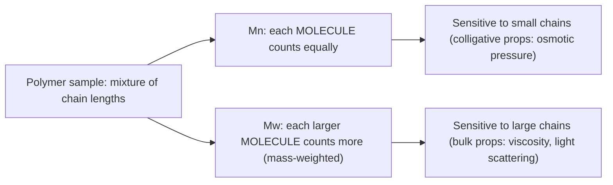

**Example**

Consider polystyrene with two fractions: 100 chains of MW 10,000 g/mol and 100 chains of MW 100,000 g/mol.

- $M_n = \dfrac{(100)(10{,}000)+(100)(100{,}000)}{200} = 55{,}000\ \text{g/mol}$
- $M_w = \dfrac{(100)(10{,}000)^2+(100)(100{,}000)^2}{(100)(10{,}000)+(100)(100{,}000)} \approx 91{,}818\ \text{g/mol}$

Note $M_w > M_n$ — the heavy chains pull the weight-average up much more than the number-average, because the same 100 heavy chains contribute far more **mass** than 100 light chains.

**Short explanation:** $M_n$ is measured by methods sensitive to the *number* of molecules (e.g., end-group titration, osmometry); $M_w$ is measured by methods sensitive to *mass/size* (e.g., static light scattering). They are equal only for a perfectly monodisperse polymer.

> **Quick Revision**
> - $M_n$ = number-weighted average; $M_w$ = mass-weighted average
> - $M_w \geq M_n$ always
> - $M_n$ from osmometry/end-group analysis; $M_w$ from light scattering
> - Example: PS blend above, $M_n=55{,}000$, $M_w\approx91{,}818$
> - $M_n = \sum n_i m_i / \sum n_i$; $M_w = \sum n_i m_i^2/\sum n_i m_i$

---

#### 2. Polydispersity and Degree of Polydispersity

**Definition**

- **Polydispersity**: the existence of a *distribution* of chain lengths/molecular weights in a polymer sample (as opposed to a single uniform MW).
- **Degree of polydispersity (PDI)**: the quantitative measure of that spread, defined as

$$\text{PDI} = \frac{M_w}{M_n}$$

**Visual**

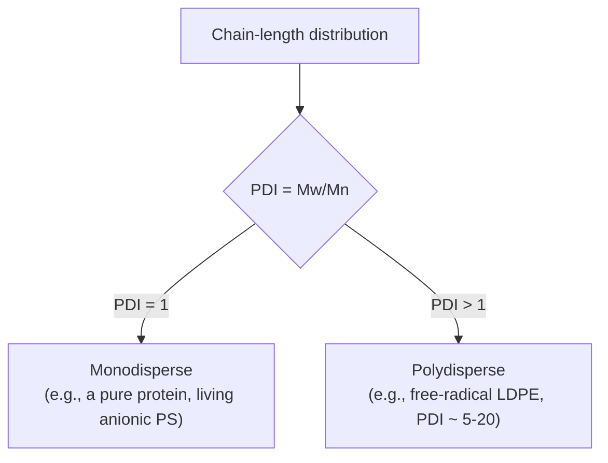

**Example:** Anionic "living" polymerized polystyrene can reach PDI ≈ 1.01–1.05 (nearly monodisperse). Conventional free-radical LDPE typically has PDI ≈ 5–20 because chain initiation, propagation, and termination are statistical and uncontrolled.

**Short explanation:** A PDI of exactly 1 means every chain has identical length (only theoretically achievable). Real industrial polymers always show PDI > 1; a **broader** PDI generally means broader property variation (e.g., wider melting range, more chain-entanglement heterogeneity), while a **narrow** PDI gives more reproducible mechanical/thermal behavior.

> **Quick Revision**
> - Polydispersity = presence of a MW distribution
> - PDI = $M_w/M_n$, quantifies the spread
> - PDI = 1 → monodisperse (ideal/living polymerization)
> - PDI > 1 → polydisperse (conventional free-radical polymerization)
> - Example: living anionic PS (PDI ≈ 1.01–1.05) vs LDPE (PDI ≈ 5–20)

---

#### 3. Numerical: $M_n$, $M_w$, $M_z$, $M_v$ and PDI

**Given data**

| Species $i$ | $m_i$ (MW) | $n_i$ (number) |
|---|---|---|
| 1 | 10 | 6 |
| 2 | 20 | 4 |
| 3 | 30 | 2 |

**Step 1 — Compute the needed sums**

| $i$ | $n_i$ | $m_i$ | $n_i m_i$ | $n_i m_i^2$ | $n_i m_i^3$ |
|---|---|---|---|---|---|
| 1 | 6 | 10 | 60 | 600 | 6,000 |
| 2 | 4 | 20 | 80 | 1,600 | 32,000 |
| 3 | 2 | 30 | 60 | 1,800 | 54,000 |
| **Σ** | **12** | — | **200** | **4,000** | **92,000** |

**Step 2 — Number-average, $M_n$**

$$M_n = \frac{\sum n_i m_i}{\sum n_i} = \frac{200}{12} = 16.67$$

**Step 3 — Weight-average, $M_w$**

$$M_w = \frac{\sum n_i m_i^2}{\sum n_i m_i} = \frac{4000}{200} = 20.00$$

**Step 4 — Z-average, $M_z$**

$$M_z = \frac{\sum n_i m_i^3}{\sum n_i m_i^2} = \frac{92{,}000}{4{,}000} = 23.00$$

**Step 5 — Viscosity-average, $M_v$**

$$M_v = \left(\frac{\sum n_i m_i^{a+1}}{\sum n_i m_i}\right)^{1/a}$$

$M_v$ **cannot be computed from $\{n_i, m_i\}$ alone** — it requires the Mark–Houwink exponent $a$, which is a solvent/polymer/temperature-specific empirical constant (typically $0.5 \le a \le 1.0$) obtained from intrinsic-viscosity calibration, and is **not given** in this problem. The formula is stated above for completeness only.

As $a \to 1$: $M_v \to \dfrac{\sum n_i m_i^2}{\sum n_i m_i} = M_w$.

*Illustrative special case only* (flagged assumption $a=1$, **not the real answer** since $a$ was never given):

$$M_v \Big|_{a=1} = \frac{\sum n_i m_i^2}{\sum n_i m_i} = 20.00 \ (\text{numerically equal to } M_w \text{ under this assumption only})$$

**Step 6 — Prove $M_w > M_n$**

$$M_w - M_n = \frac{\sum n_i m_i^2}{\sum n_i m_i} - \frac{\sum n_i m_i}{\sum n_i}
= \frac{(\sum n_i)(\sum n_i m_i^2) - (\sum n_i m_i)^2}{(\sum n_i m_i)(\sum n_i)}$$

By the **Cauchy–Schwarz inequality**, $(\sum n_i)(\sum n_i m_i^2) \geq (\sum n_i m_i)^2$, with equality **only** when all $m_i$ are equal (monodisperse). Since our sample has three distinct $m_i$ values (10, 20, 30), the inequality is strict:

$$(12)(4000) = 48{,}000 \quad > \quad (200)^2 = 40{,}000$$

So $M_w - M_n > 0 \Rightarrow M_w > M_n$. Numerically: $20.00 > 16.67$. ✓

**Step 7 — Polydispersity Index**

$$\text{PDI} = \frac{M_w}{M_n} = \frac{20.00}{16.67} = 1.20$$

A PDI of 1.20 indicates a **fairly narrow** but non-uniform distribution (not monodisperse).

> **Quick Revision**
> - $M_n = 16.67$, $M_w = 20.00$, $M_z = 23.00$
> - $M_v$ needs Mark–Houwink $a$ — cannot be found from $\{n_i,m_i\}$ alone; equals $M_w$ only if $a=1$ (assumption, not data)
> - $M_w > M_n$ proven via Cauchy–Schwarz; equality only when monodisperse
> - PDI $= M_w/M_n = 1.20$
> - General order: $M_n \le M_v \le M_w \le M_z$

---

### Question 2

#### 1. $T_g$ and $T_m$

**Definitions**

- **Glass transition temperature ($T_g$)**: the temperature at which the **amorphous regions** of a polymer transition between a hard, glassy state and a soft, rubbery state, due to onset of long-range segmental chain motion (not a true phase transition — a second-order-like transition).
- **Melting temperature ($T_m$)**: the temperature at which **crystalline regions** melt into a disordered, amorphous melt (a true first-order thermodynamic transition, applies only to polymers with crystallizable regions).

**Visual — conceptual thermal diagram (specific volume vs. temperature)**

```
Specific
Volume
  │                                          ___________
  │                                    _____/  (liquid/melt)
  │                              _____/
  │                        _____/  ← Tm (sharp, 1st-order)
  │                  _____/
  │            _____/
  │      _____/       (semicrystalline solid)
  │_____/
  │    ↑
  │   Tg (gradual, slope-change, 2nd-order-like)
  └─────────────────────────────────────────────► Temperature
```

**Relation between $T_g$ and $T_m$:** For many semicrystalline polymers, the empirical rule of thumb is

$$\frac{T_g}{T_m} \approx 0.5 \text{ to } 0.75 \ \text{(temperatures in Kelvin)}$$

(≈ 2/3 for symmetric polymers such as PE; ≈ 1/2 for unsymmetric ones). Both scale together because they are governed by the same underlying chain stiffness/intermolecular forces, but only crystalline regions show $T_m$.

**Example values**

| Polymer | $T_g$ (°C) | $T_m$ (°C) |
|---|---|---|
| Polyethylene (HDPE) | −110 | 130–137 |
| Polypropylene (isotactic) | −10 | 160–170 |
| Poly(vinyl chloride) (PVC) | 80–85 | ~210 (decomposes near) |
| Polystyrene (atactic) | 100 | amorphous — no $T_m$ |
| Poly(ethylene terephthalate) (PET) | 70–80 | 250–260 |

**Short explanation:** $T_g$ is always below $T_m$ for a given crystallizable polymer, because it takes less thermal energy to unfreeze local segmental wiggling (glass transition, amorphous domains) than to fully disrupt the ordered 3-D lattice packing of crystallites (melting).

> **Quick Revision**
> - $T_g$: amorphous, gradual, 2nd-order-like; $T_m$: crystalline, sharp, 1st-order
> - Rule of thumb: $T_g/T_m \approx 0.5$–$0.75$ (K)
> - PE: $T_g=-110°C$, $T_m=130°C$; PET: $T_g=75°C$, $T_m=255°C$
> - $T_g < T_m$ always, for the same polymer
> - Only crystalline/semicrystalline polymers show a true $T_m$

---

#### 2. Amorphous and Crystalline Polymer

**Visual — chain packing (ASCII)**

```
AMORPHOUS (random coil, no long-range order)     CRYSTALLINE (folded-chain lamellae, ordered)

   ╱╲╱╲    ╱╲                                      ═══════════
  ╱    ╲╱╲╱  ╲╱╲                                    ═══════════
 ╱  ╲╱╲    ╲╱   ╲                                    ═══════════
╱          ╱╲    ╲                                    ═══════════
   ╲╱╲  ╱╲╱  ╲╱╲╱                                  (chain-folded lamella)
```

| Feature | Amorphous | Crystalline |
|---|---|---|
| Chain arrangement | Random coil, entangled | Ordered, folded-chain lamellae |
| Optical property | Transparent (usually) | Opaque/translucent (light scattering at crystallite boundaries) |
| Thermal transition | $T_g$ only | $T_g$ (residual amorphous fraction) + sharp $T_m$ |
| Density | Lower | Higher (tighter packing) |
| Example | Atactic polystyrene, PMMA | Isotactic polypropylene, HDPE, Nylon-6,6 |

**Short explanation:** True 100% crystallinity is never achieved in bulk polymers because chain entanglements and defects prevent perfect packing everywhere — hence "**semicrystalline**" polymers contain both ordered (crystalline) and disordered (amorphous) domains simultaneously.

> **Quick Revision**
> - Amorphous: random coils, transparent, only $T_g$
> - Crystalline regions: ordered lamellae, only in semicrystalline polymers
> - Example: atactic PS (amorphous) vs isotactic PP (semicrystalline)
> - Real bulk polymers are almost always **semicrystalline**, not 100% either extreme
> - Crystallinity raises density, stiffness, and opacity

---

#### 3. Degree of Crystallinity vs. Crystallizability

These two terms are **commonly confused** and must be kept distinct.

| Term | Meaning |
|---|---|
| **Degree of crystallinity** | The **fraction (%) of a given sample** that is actually in the crystalline state, e.g. "this HDPE sample is 70% crystalline." Measured by DSC (heat of fusion vs. 100%-crystalline reference), density, or X-ray diffraction. It is a **processing- and sample-dependent** quantity — the same polymer can show different crystallinity depending on cooling rate. |
| **Crystallizability** | The **intrinsic structural capacity** of a polymer's molecular architecture to crystallize *at all*, governed by chain regularity/tacticity/symmetry. It is a **material-design property**, independent of any particular processing history. |

**Example distinguishing the two:** Atactic polystyrene has essentially **zero crystallizability** — its random pendant-phenyl placement structurally prevents ordered packing no matter how it is processed (slow-cooled or quenched, it stays amorphous). Isotactic polypropylene, by contrast, **has high crystallizability** (regular stereochemistry allows ordered packing), but its **degree of crystallinity** in any given part can range from ~40% (fast-quenched) to ~70% (slow-cooled/annealed) — same material, different processing, different crystallinity, but crystallizability (the potential) is fixed by its tacticity.

> **Quick Revision**
> - Degree of crystallinity = *how much* of a sample is crystalline (%, sample-specific, DSC/XRD-measured)
> - Crystallizability = *whether/how easily* a polymer's structure can crystallize (intrinsic, chain-regularity dependent)
> - Atactic PS: crystallizability ≈ 0 (irregular, never crystallizes)
> - Isotactic PP: high crystallizability; degree of crystallinity varies 40–70% with cooling rate
> - Do not conflate: one is a capacity, the other is a measured outcome

---

#### 4. Photodegradation and Oxidative Degradation

**Causal chain (both mechanisms)**

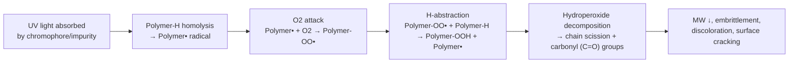

**Radical mechanism (shared core, oxidative branch of both)**

$$\text{Polymer–H} \xrightarrow{h\nu \text{ (UV)}} \text{Polymer}^{\bullet} + \text{H}^{\bullet}$$
$$\text{Polymer}^{\bullet} + \text{O}_2 \rightarrow \text{Polymer–OO}^{\bullet}$$
$$\text{Polymer–OO}^{\bullet} + \text{Polymer–H} \rightarrow \text{Polymer–OOH} + \text{Polymer}^{\bullet}$$
$$\text{Polymer–OOH} \rightarrow \text{Polymer–O}^{\bullet} + {}^{\bullet}\text{OH} \; \rightarrow \; \text{chain scission} + \text{C=O (carbonyl)}$$

| Step | What happens |
|---|---|
| Initiation | UV photon (photodegradation) or heat/trace metal/mechanical stress (thermo-oxidative) breaks a C–H or C–C bond homolytically |
| Propagation | Carbon radical rapidly traps atmospheric O₂ to form a peroxy radical |
| Chain transfer | Peroxy radical abstracts H from a neighboring chain, forming a hydroperoxide and a new radical (self-propagating) |
| Termination/scission | Unstable hydroperoxide decomposes, cleaving the backbone and forming carbonyl (ketone/aldehyde/acid) groups |

| Aspect | Photodegradation | Oxidative (thermo-oxidative) degradation |
|---|---|---|
| Trigger | UV/visible light absorption by chromophores or impurities | Heat, mechanical shear, trace metal catalysts (no light needed) |
| Onset | Requires photon energy ≥ bond dissociation energy | Requires thermal energy / processing temperature |
| Typical site | Surface (limited UV penetration depth) | Bulk (heat penetrates throughout, e.g. during extrusion) |
| Example polymer | Polyethylene mulch film yellowing/cracking outdoors (chain scission → embrittlement) | Polypropylene degrading during melt processing (chain scission → MW drop → reduced melt viscosity) |
| Product evidence | Surface chalking, yellowing, carbonyl index rise (FTIR) | MW loss, odor (aldehydes/ketones), discoloration |

**Short explanation:** Both mechanisms funnel into the **same autoxidation radical cycle** once a radical and O₂ are present — they differ only in *how the initial radical is generated* (photon vs. thermal/mechanical energy).

> **Quick Revision**
> - Shared cycle: Polymer–H → Polymer• → Polymer–OO• → Polymer–OOH → scission + C=O
> - Photodegradation: UV-initiated, surface-concentrated (e.g. outdoor PE film)
> - Oxidative degradation: heat/shear-initiated, bulk (e.g. PP during extrusion)
> - Evidence: MW drop, carbonyl formation (FTIR), embrittlement, discoloration
> - Key equation: Polymer–OO• + Polymer–H → Polymer–OOH + Polymer•

---

#### 5. Function and Mechanism of a Photostabilizer and an Antioxidant

*(Full structural detail for all 4+4 compounds is given under Set-B, Q1.6 below — here only one representative example of each, with mechanism.)*

**Photostabilizer — example: HALS (Hindered Amine Light Stabilizer), e.g. Tinuvin 770**

- **Function:** Does **not** absorb UV; instead scavenges radicals generated *after* photo-initiation, interrupting the oxidative cycle catalytically and regeneratively.
- **Mechanism (Denisov cycle):**

$$>\!\text{N–H} \xrightarrow{\text{oxidation}} >\!\text{N–O}^{\bullet} \xrightarrow{+\text{Polymer}^{\bullet}} >\!\text{N–O–Polymer} \xrightarrow{+\text{ROO}^{\bullet}} >\!\text{N–O}^{\bullet} \; (\text{regenerated})$$

The nitroxyl radical (>N–O•) is continuously regenerated, so a single HALS molecule can quench thousands of radical events — this is why HALS is far more efficient, mass-for-mass, than a simple UV absorber.

**Antioxidant — example: Primary (chain-breaking) antioxidant, e.g. Irganox 1010 (hindered phenol)**

- **Function:** Breaks the radical propagation cycle by donating a phenolic H to a peroxy radical before it can abstract H from the polymer backbone.
- **Mechanism:**

$$\text{Polymer–OO}^{\bullet} + \text{AH (phenol)} \rightarrow \text{Polymer–OOH} + \text{A}^{\bullet} \text{ (resonance-stabilized, unreactive)}$$

The resulting phenoxy radical A• is delocalized over the aromatic ring and hindered by *tert*-butyl groups, so it is too stable/hindered to continue the chain — the propagation cycle is terminated.

> **Quick Revision**
> - Photostabilizer (HALS) — scavenges radicals catalytically via the Denisov nitroxyl cycle, does NOT absorb UV
> - Antioxidant (hindered phenol) — donates H to Polymer–OO•, forms stable non-propagating A•
> - Both interrupt the same autoxidation cycle, at different points
> - HALS regenerates itself → very high efficiency per mole
> - Full 4+4 structures given in Set-B Q1.6

---

## SET-B

### Question 1

#### 1. Practical Significance of Polymer Molecular Weight

Molecular weight (and its distribution) is the single property that most directly governs a polymer's processability and end-use mechanical performance:

- **Mechanical strength:** Tensile strength, toughness, and impact resistance increase with MW up to a plateau (chain entanglement density increases), then level off — e.g. UHMWPE (MW > 3 million g/mol) is used for bulletproof vests/hip implants specifically *because* of its extreme MW.
- **Melt viscosity / processability:** Melt viscosity $\eta \propto M_w^{3.4}$ (above the entanglement MW) — very high-MW polymers are strong but hard to process (require higher temperature/pressure to flow).
- **Solubility:** Lower-MW fractions dissolve more readily; very high-MW polymers may be nearly insoluble/gel-forming.
- **$T_g$:** Rises with MW at low MW, then plateaus (Flory–Fox equation) — low-MW oligomers have depressed $T_g$ due to excess chain-end free volume.
- **Brittleness at low MW:** Below a critical entanglement MW, chains cannot entangle enough to bear load — the material is weak/brittle regardless of chemical structure.

**Example:** Ultra-high-molecular-weight polyethylene (UHMWPE, $M_w \sim 3$–6 million g/mol) vs. ordinary HDPE ($M_w \sim 50{,}000$–300,000 g/mol) — both are chemically "polyethylene," but UHMWPE has vastly superior abrasion/impact resistance purely due to MW, at the cost of being nearly impossible to melt-process (must be processed via ram extrusion/sintering).

> **Quick Revision**
> - Higher MW → higher strength, toughness, melt viscosity (up to entanglement plateau)
> - $\eta \propto M_w^{3.4}$ above entanglement MW
> - Low MW → poor mechanical properties, easier processing, higher solubility
> - Example: UHMWPE vs. HDPE — same chemistry, MW-driven property gap
> - MW distribution (PDI) matters as much as the average value

---

#### 2. Polymerization Techniques; Suspension and Emulsion Polymerization

**Names of common polymerization techniques**

1. Bulk (mass) polymerization
2. Solution polymerization
3. Suspension polymerization
4. Emulsion polymerization

**Process diagrams**

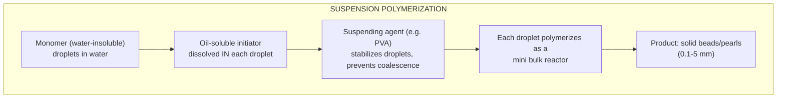

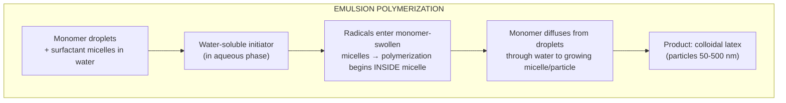

**Components and role of each**

| Component | Suspension | Emulsion |
|---|---|---|
| Continuous medium | Water | Water |
| Monomer | Dispersed as large droplets (mm-scale) | Dispersed as droplets + solubilized in micelles (nm-scale) |
| Initiator | Oil-soluble (e.g. benzoyl peroxide) — dissolves *inside* monomer droplet | Water-soluble (e.g. potassium persulfate) — generates radicals *in the aqueous phase* |
| Stabilizer | Suspending/protective colloid (e.g. poly(vinyl alcohol), gelatin) — prevents droplet coalescence | Surfactant/emulsifier (e.g. sodium lauryl sulfate) — forms micelles that become polymerization loci |
| Locus of polymerization | Inside each monomer droplet (each droplet = independent bulk reactor) | Inside surfactant micelles swollen with monomer |

**Mechanism / particle formation**

- **Suspension:** Mechanical agitation breaks monomer into droplets; suspending agent coats droplet surfaces; polymerization proceeds *within* each droplet exactly as bulk polymerization would, just on a small, heat-manageable scale. Each droplet solidifies into one bead.
- **Emulsion:** Below the critical micelle concentration boundary, surfactant self-assembles into micelles. Water-soluble initiator generates radicals in the water phase; a radical enters a monomer-swollen micelle, initiating polymerization there. As polymer forms, more monomer diffuses in from the larger reservoir droplets (which act only as monomer *reservoirs*, not reaction loci). This is the basis of the classical **Smith–Ewart** kinetic model.

**Heat transfer:** Both use water as the continuous phase, giving excellent heat dissipation (water's high heat capacity) compared to bulk polymerization, which suffers from the Trommsdorff (gel) effect and runaway exotherms in viscous media.

**Product form**

| | Suspension | Emulsion |
|---|---|---|
| Product | Solid beads/pearls, easily filtered | Stable colloidal latex (milky liquid) |
| Particle size | 0.1–5 mm | 0.05–0.5 µm (50–500 nm) |
| Typical MW | Moderate | Very high (compartmentalized radicals reduce termination rate) |

**Advantages / Disadvantages**

| | Suspension | Emulsion |
|---|---|---|
| Advantages | Easy product isolation (filtration), good heat control, relatively pure product (little surfactant residue) | Very high MW achievable, high reaction rate, excellent heat control, direct latex-form use (paints, adhesives) |
| Disadvantages | Product must still be dried; some suspending-agent residue | Surfactant residue affects clarity/electrical properties; latex must be coagulated for solid product |

**Applications & real examples**

- **Suspension:** Poly(vinyl chloride) (PVC) beads, expandable polystyrene (EPS) beads (for foam cups/packaging), PMMA beads.
- **Emulsion:** Styrene–butadiene rubber (SBR) latex, poly(vinyl acetate) latex (wood glue/paints), acrylic latex paints, synthetic rubber (neoprene latex).

**Side-by-side comparison table**

| Feature | Suspension | Emulsion |
|---|---|---|
| Medium | Water (monomer insoluble) | Water (monomer insoluble, surfactant present) |
| Initiator location | Inside monomer droplet (oil-soluble) | Aqueous phase (water-soluble) |
| Particle size | 0.1–5 mm (beads) | 50–500 nm (latex) |
| Product form | Solid beads | Colloidal latex |
| Example polymer | PVC, EPS beads | SBR latex, PVAc latex |

> **Quick Revision**
> - 4 main techniques: bulk, solution, suspension, emulsion
> - Suspension: oil-soluble initiator, droplet = mini-bulk reactor, beads
> - Emulsion: water-soluble initiator, micelle-nucleated, latex, very high MW
> - Both use water for superior heat control vs bulk
> - Suspension → PVC beads; Emulsion → SBR/PVAc latex

---

#### 3. Monodispersity, Polydispersity, Degree of Polydispersity

| Term | Definition | Example |
|---|---|---|
| **Monodisperse** | All polymer chains have (essentially) identical MW; PDI = 1 | Living anionic polymerization of styrene; natural proteins (e.g. insulin) |
| **Polydisperse** | Chains have a range/distribution of MW; PDI > 1 | Free-radical LDPE (PDI 5–20), step-growth Nylon-6,6 (PDI ≈ 2 at high conversion) |
| **Degree of polydispersity (PDI)** | $\text{PDI} = M_w/M_n$; the numerical index quantifying the width of the MW distribution | PDI = 1.20 in the worked numerical above |

**Short explanation:** Chain-growth polymerization with fast, irreversible termination (free radical) inherently produces broad distributions because chains are born and terminated at random times throughout the reaction; step-growth (condensation) polymerization narrows toward the theoretical **most-probable (Flory) distribution**, giving PDI → 2 at complete conversion — never below 2, unlike controlled/living systems which can approach 1.

> **Quick Revision**
> - Monodisperse: PDI = 1 (rare, e.g. living polymerization)
> - Polydisperse: PDI > 1 (typical for industrial polymers)
> - PDI = $M_w/M_n$
> - Free-radical polymerization: PDI ≈ 5–20; step-growth: PDI → 2 (Flory most-probable)
> - Narrower PDI = more uniform, reproducible properties

---

#### 4. Physical and Chemical Degradation of a Polymer

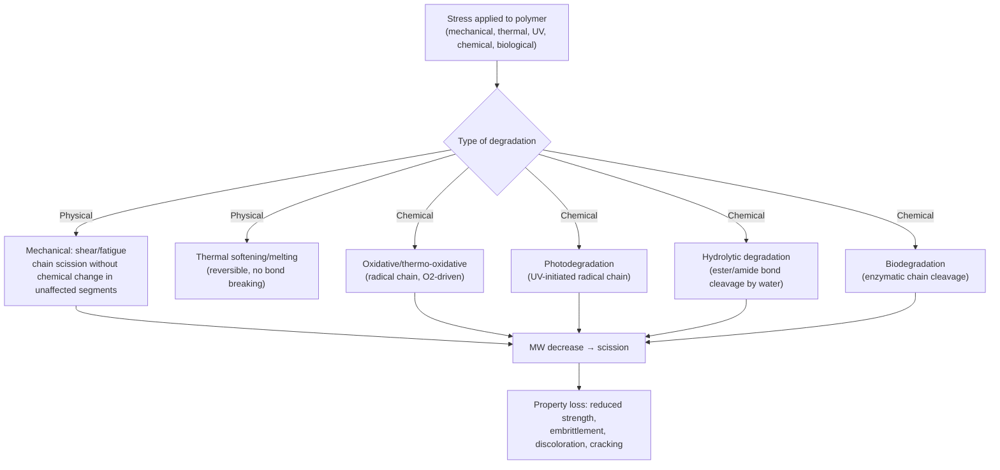

| Type | Cause | Mechanism | Example |
|---|---|---|---|
| **Physical** | Mechanical stress, repeated flexing, freeze-thaw, plasticizer migration/evaporation | No new chemical bonds broken (mostly) — physical property loss from stress-induced micro-cracking, crazing, or loss of a plasticizer changing free volume | PVC cable insulation becoming brittle as plasticizer (DOP) migrates out over years |
| **Chemical — Oxidative** | O₂ + heat/light/metal catalysts | Autoxidation radical cycle: Polymer• → Polymer-OO• → Polymer-OOH → scission + carbonyl | Polypropylene yellowing/embrittling during hot processing |
| **Chemical — Hydrolytic** | Water attacking hydrolyzable backbone linkages | Nucleophilic attack of water on ester/amide C=O, cleaving the chain: $\text{–CO–O–} + \text{H}_2\text{O} \rightarrow \text{–COOH} + \text{HO–}$ | Poly(lactic acid) (PLA) degrading in composting conditions; polyester fabric weakening with repeated hot washing |
| **Chemical — Biological** | Microorganisms/enzymes | Enzymatic hydrolysis or oxidation of backbone by microbial secretions | Starch-blended plastics, PLA, PHA degrading via microbial enzymes in soil |

**Short explanation:** All chemical degradation routes converge on the same outcome — **backbone bond cleavage lowering MW**, which directly reduces entanglement density and therefore mechanical strength (per the MW–strength relationship in Q1 above), while purely physical degradation degrades performance without necessarily lowering MW.

> **Quick Revision**
> - Physical degradation: stress/plasticizer loss, often no bond cleavage
> - Chemical degradation: oxidative, photo-, hydrolytic, biological — all involve bond scission
> - Hydrolytic: –CO–O– + H₂O → –COOH + HO– (esters/amides vulnerable)
> - Example: PVC brittleness (physical, plasticizer loss) vs PLA hydrolysis (chemical)
> - All routes lower MW → lower strength/toughness

---

#### 5. Derivation: $M_w = \dfrac{\sum n_i m_i^2}{\sum n_i m_i}$

**Step 1 — Definition of weight-average MW.** By definition, $M_w$ is the average molecular weight where each species is weighted **by the mass it contributes**, not by the number of molecules:

$$M_w = \sum_i w_i \, m_i$$

where $w_i$ is the **weight fraction** of species $i$.

**Step 2 — Weight (mass) of each species.** If there are $n_i$ molecules of species $i$, each of molar mass $m_i$, the total mass contributed by species $i$ is:

$$W_i = n_i m_i$$

**Step 3 — Weight fraction of species $i$.** The weight fraction is that species' mass divided by the total mass of all species:

$$w_i = \frac{W_i}{\sum_j W_j} = \frac{n_i m_i}{\sum_j n_j m_j}$$

**Step 4 — Weighted average.** Substitute $w_i$ into the Step-1 definition:

$$M_w = \sum_i w_i m_i = \sum_i \left(\frac{n_i m_i}{\sum_j n_j m_j}\right) m_i$$

**Step 5 — Simplify.** Since $\sum_j n_j m_j$ is a constant (doesn't depend on the summation index $i$), pull it out of the sum:

$$M_w = \frac{\sum_i n_i m_i \cdot m_i}{\sum_j n_j m_j} = \frac{\sum_i n_i m_i^2}{\sum_i n_i m_i}$$

**Final form:**

$$\boxed{M_w = \frac{\sum n_i m_i^2}{\sum n_i m_i}}$$

**Physical meaning:** Because the weighting factor is $m_i$ itself (mass, not just count), a chain twice as long contributes **twice the mass** and therefore twice the pull on the average — larger molecules are systematically **over-represented** relative to $M_n$ (which weights purely by molecule count), which is exactly why $M_w > M_n$ for any polydisperse sample.

> **Quick Revision**
> - $M_w$ = mass-fraction-weighted average, not molecule-count-weighted
> - Weight fraction: $w_i = n_i m_i / \sum n_j m_j$
> - Derivation collapses to $M_w = \sum n_i m_i^2/\sum n_i m_i$
> - Larger chains are "over-weighted" — this is why $M_w > M_n$
> - Contrast with $M_n = \sum n_i m_i/\sum n_i$ (pure count-weighting)

---

#### 6. Four Photostabilizers and Four Antioxidants — Names, Structures, Mechanisms

**Photostabilizers**

| # | Name | Structural class | Structure (line notation) | Function/Mechanism | Typical application |
|---|---|---|---|---|---|
| 1 | Tinuvin 770 (bis(2,2,6,6-tetramethyl-4-piperidyl) sebacate) | HALS (Hindered Amine Light Stabilizer) | `–O–C(=O)–(CH2)8–C(=O)–O–` linking two `2,2,6,6-tetramethylpiperidine` rings (cyclic >N–H) | Does not absorb UV; the piperidine N–H is oxidized to nitroxyl (>N–O•), which scavenges carbon/peroxy radicals and is catalytically **regenerated** (Denisov cycle) | Polyolefin films, PP outdoor furniture |
| 2 | Benzophenone (2-hydroxy-4-methoxybenzophenone, "UV-9") | UV absorber | Two phenyl rings joined by `–C(=O)–`, one ring bearing `–OH` (ortho to C=O) and `–OCH3` | Absorbs UV (300–400 nm); intramolecular H-bonded `O–H···O=C` undergoes fast excited-state proton transfer, dissipating the energy as heat instead of bond-breaking | PVC, polyolefins, coatings |
| 3 | Tinuvin P (2-(2H-benzotriazol-2-yl)-4-methylphenol) | UV absorber (benzotriazole) | Benzotriazole ring fused system `–N=N–N<` attached to a phenol ring bearing `–OH` ortho to the triazole N, plus a `–CH3` substituent | Same excited-state intramolecular proton-transfer (ESIPT) UV-dissipation mechanism as benzophenones, but broader UV-A absorption | Polycarbonate, polyester coatings |
| 4 | Nickel bis(octylphenyl) dithiophosphate (Ni-quencher) | Excited-state (energy) quencher | Ni²⁺ center chelated by two `–S–P(=S)(O-octylphenyl)–S–` dithiophosphate ligands | Physically quenches the excited carbonyl/chromophore state before it can homolyze, by resonance energy transfer to the Ni center | Polypropylene fiber/tape (largely legacy use) |

**Mechanism diagrams — UV absorber vs. HALS**

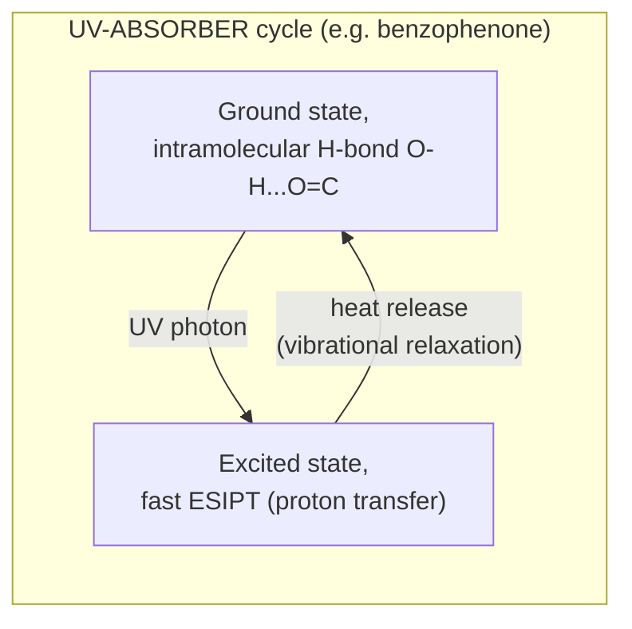

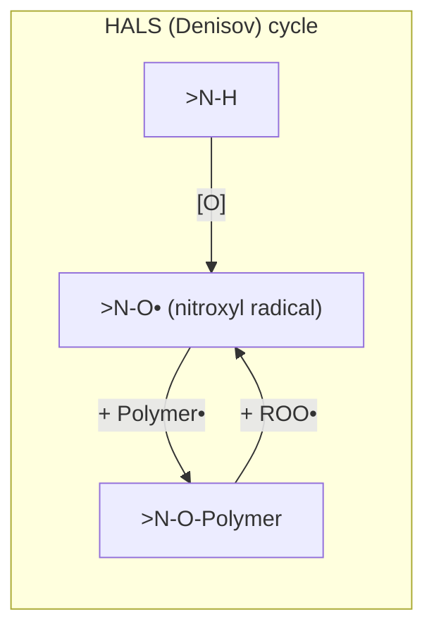

**Antioxidants**

| # | Name | Structural class | Structure (line notation) | Function/Mechanism | Typical application |
|---|---|---|---|---|---|
| 1 | Irganox 1010 (pentaerythritol tetrakis(3-(3,5-di-*tert*-butyl-4-hydroxyphenyl)propionate)) | Primary — hindered phenol | Central `C(CH2–O–C(=O)–CH2CH2–[C6H2(t-Bu)2OH])4` tetraester core | Donates phenolic H to Polymer-OO•, forming a resonance/steric-stabilized phenoxy radical that cannot propagate; **chain-breaking donor (CB-D)** | Polyolefins, engineering plastics (long-term heat stability) |
| 2 | Irganox 1076 (octadecyl 3-(3,5-di-*tert*-butyl-4-hydroxyphenyl)propionate) | Primary — hindered phenol (mono-functional, waxy) | `HO–C6H2(t-Bu)2–CH2CH2–C(=O)–O–C18H37` | Same H-donation mechanism as above, single phenol per molecule; more mobile/compatible due to long alkyl tail | Food-contact polyolefin packaging |
| 3 | Irgafos 168 (tris(2,4-di-*tert*-butylphenyl) phosphite) | Secondary — phosphite (peroxide decomposer) | `P(O–C6H3(t-Bu)2)3` (trivalent P bonded to three hindered-phenyl-O groups) | Reduces hydroperoxides non-radically: `ROOH + P(OAr)3 → ROH + O=P(OAr)3`; prevents ROOH from decomposing into new radicals | Melt-processing stabilizer for PP/PE, often paired with a phenolic |
| 4 | Dilauryl thiodipropionate (DLTDP) | Secondary — thioester (peroxide decomposer) | `C12H25–O–C(=O)–CH2CH2–S–CH2CH2–C(=O)–O–C12H25` | Sulfide sulfur is oxidized by ROOH to a sulfoxide/sulfone, catalytically decomposing many hydroperoxide molecules non-radically | Long-term thermal stabilization of polyolefins, synergist with phenolics |

**Mechanism diagrams — primary (chain-breaking) vs. secondary (peroxide-decomposing) antioxidants**

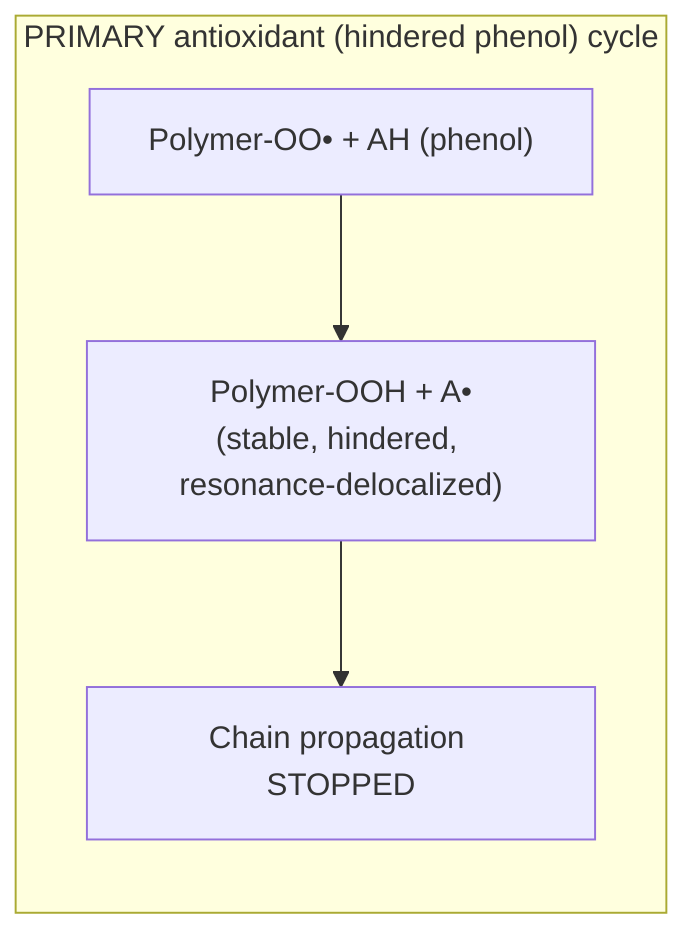

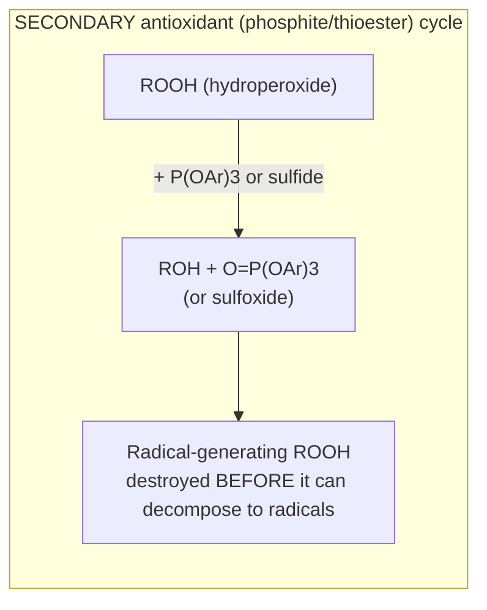

**Distinguishing the four classes**

| Class | Acts on | Mechanism | Example |
|---|---|---|---|
| UV absorber | Incoming UV photons | Absorbs UV, dissipates as heat via ESIPT | Benzophenone-type, Tinuvin P |
| HALS | Radicals (post-initiation) | Catalytic nitroxyl radical-scavenging (Denisov cycle) | Tinuvin 770 |
| Primary (chain-breaking) antioxidant | Peroxy radicals (Polymer-OO•) | H-donation, forms stable non-propagating radical | Irganox 1010, 1076 |
| Secondary (peroxide-decomposing) antioxidant | Hydroperoxides (ROOH) | Non-radical reduction of ROOH to ROH | Irgafos 168, DLTDP |

> **Quick Revision**
> - UV absorbers (benzophenone/benzotriazole): absorb UV, dissipate as heat, ESIPT
> - HALS (Tinuvin 770): catalytic radical scavenger, Denisov nitroxyl cycle, does NOT absorb UV
> - Primary AO (hindered phenols, Irganox 1010/1076): donate H to Polymer-OO•
> - Secondary AO (phosphites/thioesters, Irgafos 168/DLTDP): destroy ROOH non-radically
> - Never confuse photostabilizers (light-triggered protection) with antioxidants (thermal/general oxidative protection) — they are often used together, synergistically

---

### Question 2

#### 1. Relation between $T_g$ and $T_m$

$$\frac{T_g \text{ (K)}}{T_m \text{ (K)}} \approx 0.5 \text{ to } 0.75$$

- **≈ 1/2 rule**: applies to *symmetric* polymers with simple, unsubstituted repeat units (e.g., polyethylene: $T_g$(K)/$T_m$(K) ≈ 163/410 ≈ 0.40, close to the 1/2 boundary).
- **≈ 2/3 rule**: applies to *unsymmetric* polymers with a bulkier or polar repeat unit (e.g., PET: $T_g$(K)/$T_m$(K) ≈ 348/523 ≈ 0.67).

Both temperatures rise and fall together across a polymer series because they share the same underlying physical driver — chain stiffness and intermolecular cohesive forces — but $T_m$ additionally requires the extra energy to disrupt 3-D crystalline lattice register, so $T_m$ is always numerically higher than $T_g$ for the same polymer.

> **Quick Revision**
> - Empirical rule: $T_g/T_m \approx 0.5$ (symmetric chains) to $\approx 0.67$ (unsymmetric chains), Kelvin
> - PE example: $T_g/T_m \approx 0.40$; PET example: $\approx 0.67$
> - Both governed by chain stiffness/cohesive forces; $T_m$ always > $T_g$
> - Useful for estimating an unknown $T_g$ from a known $T_m$ or vice versa
> - Applies only to polymers that have a measurable $T_m$ (semicrystalline)

---

#### 2. Diagram: Amorphous, Crystalline, and Semi-crystalline Chain Packing

```
AMORPHOUS                 CRYSTALLINE (lamella)         SEMI-CRYSTALLINE
(fully random coils)      (fully ordered folds)         (ordered + random mixed)

 ╱╲  ╱╲╱╲                 ═══════════                   ═══════════╲  ╱╲
╱  ╲╱    ╲  ╱╲            ═══════════                   ═══════════ ╲╱  ╲
   ╱╲  ╱╲  ╲╱  ╲          ═══════════                    ╱╲   ═══════════
  ╱    ╲╱      ╲╱         ═══════════                   ╱  ╲ ═══════════╲
                           (chain-folded,                (crystalline lamellae
  no order anywhere        stacked lamellae,              embedded in an
  (e.g. atactic PS)        e.g. single-crystal PE)        amorphous matrix —
                                                           most real polymers,
                                                           e.g. HDPE, PP, Nylon)
```

| Region type | Order | Example polymer |
|---|---|---|
| Fully amorphous | None | Atactic polystyrene, PMMA |
| Fully crystalline (idealized, rare in bulk) | Complete 3-D register | Single-crystal PE lamellae (lab-grown from dilute solution) |
| Semi-crystalline (realistic bulk case) | Mixed ordered + disordered domains | HDPE, isotactic PP, Nylon-6,6, PET |

> **Quick Revision**
> - Amorphous: fully random coils, no lamellae
> - Crystalline: fully ordered, chain-folded lamellae (idealized/rare in bulk)
> - Semi-crystalline: lamellae embedded in amorphous matrix — the realistic case for most commercial polymers
> - Example: atactic PS (amorphous) → HDPE (semicrystalline, ~60-80%) → lab single-crystal PE (near-fully crystalline)
> - Spherulites form when lamellae radiate from a nucleation point in bulk-crystallized semi-crystalline polymers

---

#### 3. Difference between Crystalline and Amorphous Polymer

| Property | Crystalline (or crystalline region) | Amorphous |
|---|---|---|
| Chain order | Regular, 3-D packed lattice | Random coil, no long-range order |
| Optical clarity | Opaque/translucent (light scattering at crystallite/amorphous interfaces) | Transparent (uniform refractive index) |
| Density | Higher (tight packing) | Lower |
| Melting behavior | Sharp $T_m$ (1st-order transition) | No $T_m$; only a gradual $T_g$ |
| Mechanical behavior | Stiffer, higher tensile strength, more brittle | More flexible, lower strength, more ductile/rubbery above $T_g$ |
| Solvent/chemical resistance | Higher (solvent must penetrate ordered domains) | Lower (more free volume for solvent diffusion) |
| Example | HDPE (~70% crystalline) | Atactic polystyrene, PMMA |

> **Quick Revision**
> - Crystalline: ordered, denser, opaque, sharp $T_m$, more solvent-resistant
> - Amorphous: random, less dense, transparent, only $T_g$
> - Example: HDPE (crystalline-dominant, hazy) vs PMMA (fully amorphous, glass-clear)
> - Crystallinity generally raises stiffness/strength but lowers impact toughness/ductility
> - Real polymers mostly fall on a semicrystalline spectrum between these extremes

---

#### 4. $T_g$ and $T_m$ Values of 4 Polymers

| Polymer | $T_g$ (°C) | $T_m$ (°C) |
|---|---|---|
| Polyethylene (HDPE) | −110 | 130–137 |
| Polypropylene (isotactic) | −10 | 160–170 |
| Polystyrene (atactic) | 100 | — (amorphous, no $T_m$) |
| Nylon-6,6 (polyamide) | 50–60 | 260–265 |

> **Quick Revision**
> - PE: $T_g \approx -110°C$, $T_m \approx 135°C$ (very flexible backbone)
> - PP: $T_g \approx -10°C$, $T_m \approx 165°C$ (methyl side group raises both vs PE)
> - PS: $T_g \approx 100°C$, no $T_m$ (atactic, bulky phenyl prevents crystallization)
> - Nylon-6,6: $T_g \approx 55°C$, $T_m \approx 262°C$ (H-bonding raises both sharply)
> - H-bonding/bulky-rigid groups raise both $T_g$ and $T_m$; flexible unsubstituted backbones lower both

---

#### 5. Importance of $T_g$ and Factors Influencing $T_g$

**Importance:** $T_g$ defines the **upper service temperature for glassy/rigid amorphous applications** (e.g. PVC pipe, PS cups) and the **lower service temperature for rubbery/elastomeric applications** (e.g. an elastomer must stay well above its $T_g$ to remain flexible in service — natural rubber, $T_g \approx -70°C$, stays rubbery down to very cold conditions). It governs impact resistance, dimensional stability, and processing-window selection (e.g. injection-molding/annealing temperatures are set relative to $T_g$).

**Factors influencing $T_g$ — mechanism for each**

| Factor | Mechanism (effect on chain mobility) | Direction |
|---|---|---|
| **Chain rigidity / backbone stiffness** | Aromatic rings or double bonds *in* the backbone restrict bond rotation (higher rotational energy barrier) → segments cannot wiggle until higher T | ↑ $T_g$ |
| **Bulky side (pendant) groups** | Large substituents (e.g. phenyl in PS, carbazolyl in PVK) sterically hinder rotation around backbone bonds, raising the rotational energy barrier | ↑ $T_g$ |
| **Intermolecular forces (van der Waals)** | Stronger dispersion forces between chains (e.g. polar C–Cl in PVC) require more thermal energy to overcome inter-chain "stickiness" before segments can move | ↑ $T_g$ |
| **Hydrogen bonding** | Strong directional H-bonds (e.g. amide N–H···O=C in nylons) act as physical crosslinks restricting segmental motion until strongly thermally activated | ↑ $T_g$ (strongly) |
| **Aromaticity in backbone/side group** | Rigid planar ring systems resist both backbone rotation and local conformational change | ↑ $T_g$ |
| **Molecular weight** | Chain ends have extra free volume/mobility (fewer entanglement constraints); more chain ends per unit volume at low MW = more free volume = easier segmental motion | ↑ $T_g$ with rising MW, plateauing (Flory–Fox: $T_g = T_{g,\infty} - K/M_n$) |
| **Branching** | Branches increase free volume locally (less efficient packing) but can also restrict rotation at branch points — net effect is usually a modest $T_g$ decrease from increased free volume | ↓ $T_g$ (generally) |
| **Plasticization** | Small plasticizer molecules insert between chains, increasing free volume and screening inter-chain forces, letting segments move at lower T | ↓ $T_g$ (strongly) |
| **Crosslinking** | Covalent crosslinks physically tie chains together, directly restricting segmental motion regardless of thermal energy input | ↑ $T_g$ (rises with crosslink density) |

> **Quick Revision**
> - $T_g$ sets the service-temperature window (upper limit for rigid plastics, lower limit for rubbers)
> - Rigidity, bulky/aromatic groups, H-bonding, polar forces, crosslinking → raise $T_g$ (less chain mobility)
> - Plasticizers, low MW, branching → lower $T_g$ (more free volume/mobility)
> - Flory–Fox equation: $T_g = T_{g,\infty} - K/M_n$
> - H-bonding is the single strongest $T_g$-raising factor among these (nylons vs polyolefins)

---

#### OR: Why is $T_g$ of Poly(N-vinylcarbazole) Higher than Polyethylene? Plasticizer Selection Criteria

**Why PVK has a much higher $T_g$ than PE**

| | Polyethylene (PE) | Poly(N-vinylcarbazole) (PVK) |
|---|---|---|
| Backbone | `–CH2–CH2–` fully flexible, unsubstituted | `–CH2–CH(carbazolyl)–` with a large fused-tricyclic aromatic pendant group at every other carbon |
| Side group | None (H atoms only) | Bulky, rigid, planar carbazole (dibenzopyrrole) ring system |
| $T_g$ | ≈ −110 °C | ≈ 150–200 °C (reported values commonly ~200 °C) |

**Molecular-level explanation:** In PE, rotation around each backbone C–C bond is essentially unhindered (only small H substituents), so segments can wiggle freely at very low temperature — hence a very low $T_g$. In PVK, the bulky, rigid, planar carbazole group attached to every repeat unit creates severe **steric hindrance to backbone bond rotation**: neighboring carbazole groups physically clash as the chain tries to rotate, and their large size also increases inter-chain packing friction/van der Waals contact area. Both effects raise the energy barrier for the cooperative segmental motion that defines the glass transition, so far more thermal energy is required before PVK's backbone can move — giving it a dramatically higher $T_g$ than the unsubstituted, freely-rotating PE backbone.

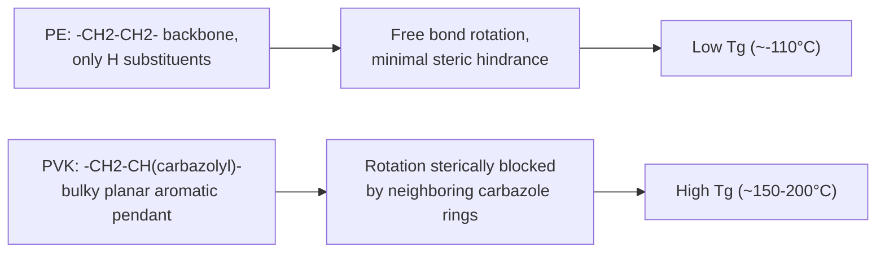

**Factors governing plasticizer selection for commercial applications**

| Requirement | Why it matters |
|---|---|
| **Compatibility (solubility parameter match)** | Plasticizer must be miscible with the polymer at the molecular level or it will phase-separate/exude ("bloom") |
| **Low volatility** | Must not evaporate over the product's service life (loss of plasticizer → progressive embrittlement, the classic aged-PVC problem) |
| **Low migration/extraction** | Must resist migrating into contacting materials (e.g. food, skin) or being leached out by water/solvents |
| **Permanence** | Long-term retention under service conditions (heat, UV, mechanical flexing) |
| **Low toxicity** | Especially critical for food-contact, medical, and toy applications (regulatory limits, e.g. restrictions on certain phthalates like DEHP) |
| **Thermal & chemical stability** | Must not decompose or react during hot processing (extrusion/calendering) |
| **Good processing behavior** | Should lower melt viscosity/processing temperature without degrading the polymer or the equipment |

**Commercial examples:** Di(2-ethylhexyl) phthalate (DOP/DEHP) and dibutyl phthalate (DBP) are classic general-purpose plasticizers for flexible PVC (cable insulation, flooring, tubing); increasing regulatory pressure has driven a shift toward alternatives such as di(2-ethylhexyl) terephthalate (DEHT/DOTP) or citrate esters (e.g. acetyl tributyl citrate) for toxicity-sensitive applications.

> **Quick Revision**
> - PVK's bulky rigid carbazole pendant sterically blocks backbone rotation → much higher $T_g$ than flexible, unsubstituted PE
> - Same principle as "bulky side groups raise $T_g$" from the general factors list
> - Plasticizer selection: compatibility, low volatility, low migration, permanence, low toxicity, thermal/chemical stability, processability
> - Classic example: DOP/DBP in flexible PVC; DOTP/citrates as lower-toxicity alternatives
> - Plasticizer mechanism: inserts between chains → raises free volume → lowers $T_g$ (see Q2.5 table)

---

## Plasticizers — Summary Reference (supporting context for Set-B Q2 OR-part)

**Definition:** A plasticizer is a low-MW, non-volatile additive incorporated into a polymer to increase chain mobility and flexibility, primarily by **lowering $T_g$**.

**Mechanism (free-volume increase)**


**Before/after chain-mobility picture**

```
BEFORE (rigid, unplasticized)        AFTER (flexible, plasticized)

═══════════                          ═  P  ═  P  ═
═══════════      + plasticizer  →    P  ═  P  ═  P
═══════════                          ═  P  ═  P  ═
(tightly packed,                     (chains pushed apart by
low free volume)                     plasticizer "P", higher free volume)
```

**Desirable properties (recap):** compatibility, low volatility, low migration, permanence, low toxicity, thermal/chemical stability, good processing behavior — see full table above.

**Concrete commercial examples:** DOP/DEHP and DBP (flexible PVC — cable, film, flooring); citrate esters and DOTP (low-toxicity/food-contact alternatives).

> **Quick Revision**
> - Plasticizer mechanism: increases free volume → screens inter-chain forces → lowers $T_g$
> - Must be compatible, low-volatility, low-migration, low-toxicity, thermally stable
> - Classic example: DOP in flexible PVC
> - Loss of plasticizer over time = embrittlement (physical degradation, see Set-B Q1.4)
> - Modern trend: shift away from ortho-phthalates (DEHP) toward DOTP/citrates on toxicity grounds
