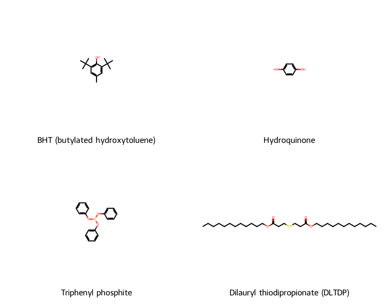
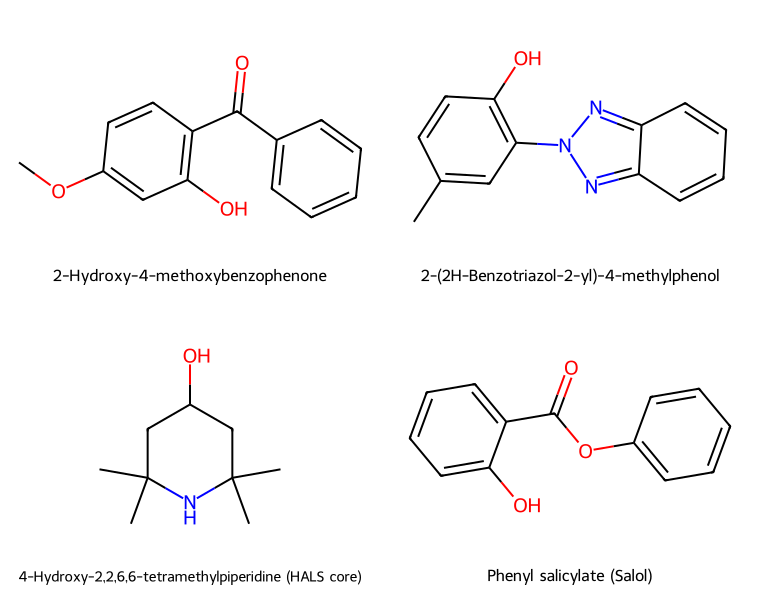
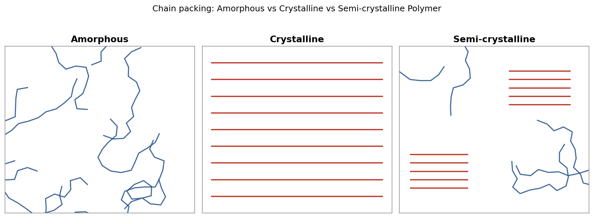

# Polymer Chemistry — Answer Sheet (SET-B)

---

## Q1

### (i) Practical significance of polymer molecular weight (MW)

- **Mechanical strength / toughness** — tensile strength, impact strength increase with MW and level off above a critical value.
- **Melt viscosity & processability** — higher MW → higher melt viscosity → harder to process (extrusion, molding).
- **Solubility & solution viscosity** — lower MW polymers dissolve more easily; used in intrinsic-viscosity–based MW determination.
- **Tg / softening behaviour** — Tg rises with MW until a plateau (chain-end free volume effect).
- **Brittleness** — very low MW polymers are weak and brittle; usable polymers need MW above a threshold.
- Hence MW (and its distribution) is a key **quality-control and design parameter** for selecting a polymer grade for a given application.

---

### (ii) Techniques of polymerization

| Technique | Medium | Initiator location |
|---|---|---|
| Bulk | Monomer only (no solvent) | In monomer |
| Solution | Monomer + solvent | In solution |
| **Suspension** | Monomer droplets in water | Oil-soluble (in monomer droplet) |
| **Emulsion** | Monomer emulsified in water (micelles) | Water-soluble |

**Suspension polymerization:**
Water-insoluble monomer is dispersed as fine droplets (0.01–5 mm) in water using a **suspending/stabilizing agent** (e.g., PVA, starch) with agitation. Initiator is **oil-soluble**, dissolved in the monomer. Each droplet behaves as a tiny bulk-polymerization reactor. Product obtained as **solid beads/granules**. *Example:* PVC, expandable PS beads.

**Emulsion polymerization:**
Monomer is emulsified in water using a **surfactant** (above CMC, forming micelles). Initiator is **water-soluble** (e.g., K₂S₂O₈). Polymerization proceeds mainly inside the monomer-swollen micelles. Product is a stable colloidal dispersion called **latex**. *Example:* SBR, PVA emulsion, acrylic latex paints.

---

### (iii) Monodispersity, Polydispersity, Degree of polydispersity

- **Monodisperse polymer:** All chains have (nearly) the *same* chain length/molecular weight → $M_w = M_n$, so **PDI = 1** (e.g., many natural proteins).
- **Polydisperse polymer:** Chains have a *distribution* of molecular weights (typical of synthetic polymers) → $M_w > M_n$.
- **Degree of polydispersity (PDI / Đ):**

$$
PDI=\dfrac{M_w}{M_n}
$$

Higher PDI → broader MW distribution → wider spread of physical properties.

---

### (iv) Physical vs Chemical degradation of polymers

| Type | Cause | Nature | Examples |
|---|---|---|---|
| **Physical degradation** | Heat, light/UV, mechanical stress/shear, radiation | Chain scission/crosslinking or physical changes (softening, embrittlement, loss of plasticizer) — driven by physical energy input, not necessarily by reaction with an external chemical species | Thermal degradation, photodegradation, mechano-degradation |
| **Chemical degradation** | Reaction with chemical agents in environment | New chemical bonds/functional groups form via chemical attack | **Oxidative** degradation (O₂, autoxidation), **hydrolytic** degradation (H₂O attacks ester/amide links), **ozonolysis** (O₃ attacks C=C), acid/base attack |

---

### (v-a) Proof: $M_w = \dfrac{\sum n_im_i^2}{\sum n_im_i}$

Let $n_i$ = number of molecules (or moles) of species with molecular weight $m_i$.

Mass of species $i$: $w_i = n_i m_i$

Weight fraction of species $i$:
$$
f_i=\dfrac{w_i}{\sum w_i}=\dfrac{n_im_i}{\sum n_im_i}
$$

By definition, the **weight-average molecular weight** is the weight-fraction-weighted mean of $m_i$:

$$
M_w=\sum f_i\,m_i=\sum\left(\dfrac{n_im_i}{\sum n_im_i}\right)m_i
$$

$$
\boxed{M_w=\dfrac{\sum n_im_i^{2}}{\sum n_im_i}}\qquad \blacksquare
$$

---

### (v-b) 4 Photostabilizers and 4 Antioxidants (name + structure)

**Antioxidants** (protect polymer from thermo-oxidative degradation):

1. **BHT** (2,6-di-*tert*-butyl-4-methylphenol) — primary/chain-breaking phenolic antioxidant
2. **Hydroquinone** — phenolic antioxidant/radical scavenger
3. **Triphenyl phosphite** — secondary antioxidant (peroxide decomposer)
4. **Dilauryl thiodipropionate (DLTDP)** — secondary (thioester) peroxide decomposer

**Photostabilizers** (protect against UV/photodegradation):

1. **2-Hydroxy-4-methoxybenzophenone** — UV absorber (benzophenone class)
2. **2-(2H-Benzotriazol-2-yl)-4-methylphenol** — UV absorber (benzotriazole class)
3. **HALS core — 4-Hydroxy-2,2,6,6-tetramethylpiperidine** — hindered amine light stabilizer (traps radicals, regenerates itself)
4. **Phenyl salicylate (Salol)** — UV absorber (salicylate ester class)

---
---

## Q2

### (i) Relation between Tg and Tm

Empirically, for a given polymer:

$$
T_g \approx \tfrac{1}{2}\ \text{to}\ \tfrac{2}{3}\;T_m \quad (\text{temperatures in Kelvin})
$$

- **Symmetrical polymers** (e.g., PE): $T_g/T_m \approx 0.5$
- **Unsymmetrical/1,1-disubstituted polymers** (e.g., PVC, PP): $T_g/T_m \approx 0.66$–$0.75$

Both $T_g$ and $T_m$ rise/fall together with chain stiffness, polarity, and symmetry, since both depend on the same intermolecular/intramolecular forces restricting chain mobility.

---

### (ii) Amorphous, Crystalline, and Semi-crystalline polymer — chain packing

- **Amorphous:** chains randomly coiled/entangled, no long-range order.
- **Crystalline:** chains folded/packed in a regular, ordered lattice.
- **Semi-crystalline:** ordered crystalline regions (**crystallites**) embedded in a disordered amorphous matrix.

---

### (iii) Crystalline vs Amorphous polymer

| Property | Crystalline | Amorphous |
|---|---|---|
| Chain arrangement | Ordered, regular packing | Random, disordered |
| Melting | Sharp melting point ($T_m$) | Softens gradually over $T_g$ range (no sharp $T_m$) |
| Density | Higher (closer packing) | Lower |
| Optical nature | Opaque/translucent (light scattering at crystallite boundaries) | Transparent |
| Mechanical property | Higher rigidity, strength, stiffness | More flexible, lower strength |
| X-ray diffraction | Sharp, well-defined peaks | Broad diffuse halo |
| Solvent/chemical resistance | Higher | Lower |

---

### (iv) Tg and Tm of 4 polymers

| Polymer | $T_g$ (°C) | $T_m$ (°C) |
|---|---:|---:|
| Polyethylene (LDPE) | −120 | 115 |
| Polypropylene (isotactic) | −10 | 165 |
| Poly(vinyl chloride), PVC | 80 | 212 |
| Nylon 6,6 | 50 | 265 |

---

### (v) Importance of Tg & factors influencing Tg

**Importance of $T_g$:**
- Marks transition from **hard/glassy → soft/rubbery** state; defines the **service temperature range** of the material.
- Below $T_g$: rigid, brittle (used as **plastics**, e.g., PS, PMMA at room temp).
- Above $T_g$: flexible, elastic (used as **elastomers**, e.g., rubber at room temp).
- Governs **processing temperature**, impact resistance, dimensional stability, and packaging/storage conditions.

**Factors influencing $T_g$:**
1. **Chain flexibility** — flexible backbone (e.g., –O–, –Si–O–) lowers $T_g$; rigid backbone (aromatic rings) raises it.
2. **Intermolecular forces** — H-bonding, polarity, dipole interactions raise $T_g$ (e.g., nylon > PE).
3. **Molecular weight** — $T_g$ increases with MW, then plateaus (free chain-end volume effect).
4. **Side groups / branching** — bulky, rigid side groups (e.g., phenyl) raise $T_g$; long flexible side chains lower it (internal plasticization).
5. **Crosslinking** — restricts chain motion → raises $T_g$.
6. **Plasticizers** — small molecules that increase free volume → lower $T_g$.
7. **Tacticity/symmetry** — affects packing and chain mobility.

---

### OR — Why is Tg of Poly(vinyl carbazole) higher than Polyethylene?

- **PE:** simple –CH₂–CH₂– backbone, no bulky substituent, free rotation about C–C bonds → high chain flexibility → very **low $T_g$ (≈ −120 °C)**.
- **Poly(N-vinyl carbazole), PVK:** each repeat unit carries a large, rigid, planar **aromatic carbazole** side group.
 - This bulky group causes severe **steric hindrance** to rotation about the backbone bond → chain stiffening.
 - Strong **π–π stacking** between aromatic carbazole units adds extra intermolecular cohesion.
 - Net result: chain segmental mobility is greatly restricted → much **higher $T_g$ (≈ 200 °C)**.

### Factors for selecting a plasticizer for commercial use

- **Compatibility/miscibility** with the polymer (matching solubility parameter).
- **Efficiency** — large $T_g$/flexibility change at low plasticizer loading.
- **Permanence** — low volatility; resistance to migration, exudation, and extraction (by water/solvents/oils).
- **Thermal & UV stability** — should not degrade during processing/service.
- **Low toxicity** — essential for food-contact, medical, toy applications.
- **Good low-temperature flexibility** imparted to the product.
- **Electrical properties** — should not impair insulation performance where required.
- **Cost & availability** for commercial-scale use.
