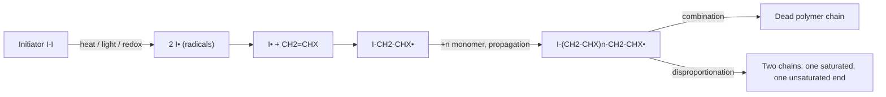
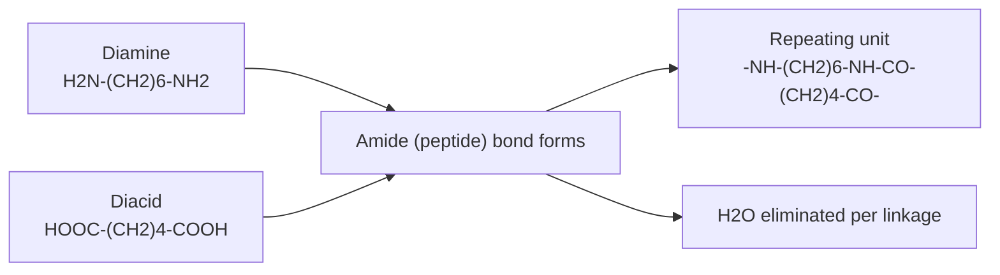
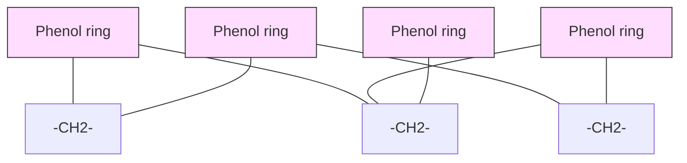
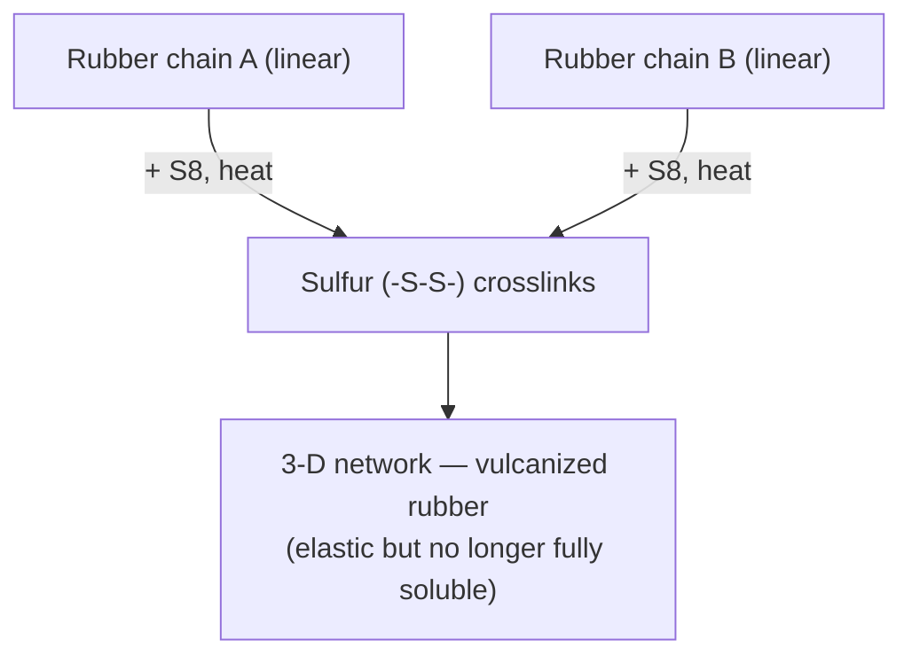

# WPE-101 Polymer Science — Classtest Notes (10 Marks)

## Q1. Distinguish between the following pairs (with examples)

### 1️⃣ Monomer vs Repeating Unit

| | Monomer | Repeating Unit |
|---|---|---|
| **Definition** | The small, simple molecule that undergoes polymerization | The structural unit that actually repeats *inside* the finished polymer chain |
| **State** | Free molecule, exists before reaction | Bonded unit, exists only within the chain |
| **Size vs polymer** | Building block, reacts to lose its double bond/functional group | May be identical to monomer (addition polymers) or smaller than it (condensation polymers, since small molecules like H₂O are eliminated) |
| **Example** | Ethylene, CH₂=CH₂ | —CH₂—CH₂— (in polyethylene) |


> **Key exam line:** In addition polymerization the repeating unit = monomer unit (just the double bond opens up), but in condensation polymerization the repeating unit ≠ monomer, because a small molecule (H₂O, HCl, etc.) is lost at each linkage — e.g., in Nylon-6,6 the repeating unit excludes the water eliminated during amide-bond formation.

---

### 2️⃣ Oligomer vs Degree of Polymerization (DP)

- **Oligomer:** A molecule made of only a *few* repeating units (roughly 10–20 by some definitions, sometimes narrowed to 2–10) — too short to show true "polymer" bulk properties. Dimers, trimers, and tetramers all count as oligomers. Example: a dimer or trimer of ethylene glycol formed as an intermediate before full-length polyester forms.
- **Degree of Polymerization (DP):** A *number*, not a molecule — it is the count "n" of repeating units in one polymer chain.
$$DP = \frac{M_{polymer}}{M_{repeating\ unit}}$$
  Example: if polyethylene has molecular mass 280,000 g/mol and the repeat unit (—CH₂CH₂—) mass is 28 g/mol, DP = 10,000.

**Typical DP values by material** (useful for comparing natural vs synthetic fiber chain lengths):

| Material | Degree of Polymerization (DP) |
|---|---|
| Cotton | ~5000 |
| Nylon 6,6 | ~50–80 |
| Flax | ~18000 |
| Polyester | ~115–140 |

> **Key exam line:** Oligomer describes *how short* a molecule is (a category), while DP is the *numerical measure* of chain length used for any polymer, long or short. The table above shows why natural cellulosic fibers (cotton, flax) have far higher DP than many synthetic condensation polymers like nylon and polyester.

---

### 3️⃣ Retarder vs Inhibitor

| | Retarder | Inhibitor |
|---|---|---|
| **Action** | Slows down the rate of polymerization throughout the reaction | Completely stops/blocks polymerization for an initial "induction period," then reaction proceeds normally |
| **Radical consumption** | Reacts with radicals *slower* than propagation — some polymerization still occurs simultaneously | Reacts with radicals *faster* than propagation — no polymer forms until inhibitor is fully consumed |
| **Rate-time curve** | Gradual, reduced rate from t = 0 | Zero rate initially (flat line), then normal rate after a delay |
| **Example** | Quinone (in small amount); m-nitrobenzene, 3,5-dinitrobenzoic acid | Hydroquinone, DPPH, nitrobenzene, dinitrobenzene; atmospheric O₂ is also a good inhibitor (used to prevent premature polymerization of styrene/MMA during storage) |

**Inhibition reaction (termination by inhibitor):**
$$P^{\bullet} + C_6H_5\text{-}NO_2 \rightarrow C_6H_5\text{-}NO + P\text{-}O\text{-}P \ (\text{dead polymer})$$
$$P^{\bullet} + O^{\bullet}\text{-}O^{\bullet} \rightarrow P\text{-}O\text{-}O^{\bullet}; \quad P\text{-}O\text{-}O^{\bullet} + P^{\bullet} \rightarrow P\text{-}O\text{-}O\text{-}P \ (\text{dead polymer})$$

---

### 4️⃣ Network (Crosslinked) Polymer vs Graft Copolymer

- **Network polymer:** Formed when chains are joined by covalent crosslinks in **three dimensions**, producing one giant interconnected molecule. Rigid, infusible, insoluble. Example: **vulcanized rubber**, **epoxy resin**, **bakelite**, **urea formaldehyde**.
- **Graft copolymer:** A **linear backbone** of one monomer (A) with **branches/side chains** of a different monomer (B) grafted onto it — the backbone and branches are chemically different but it is *not* a crosslinked 3-D network. Schematically: A + B → –A–A–A–A–A– with B branches attached along the main chain. Example: **ABS (Acrylonitrile-Butadiene-Styrene)** — polybutadiene backbone with grafted styrene-acrylonitrile branches.

> **Key exam line:** Both involve "extra" polymer chains attached to a main chain, but a network polymer forms a rigid interconnected 3-D solid via crosslinking, while a graft copolymer is still a soluble/moldable branched molecule made of two *different* monomer types.

---

### 5️⃣ Biological vs Non-biological Polymer

- **Biological (natural/bio) polymer:** Isolated from natural materials, synthesized by living organisms, usually biodegradable. Examples: **cellulose, starch, proteins (keratin, silk fibroin), DNA, natural rubber (cis-1,4-polyisoprene), cotton, jute, flax**.
- **Non-biological (synthetic) polymer:** Synthesized from low molecular weight compounds by man-controlled chemical reactions, often petrochemical-derived and non-biodegradable. Examples: **polyethylene, PVC, nylon, polyester (PET)**.

---

### 6️⃣ Homopolymer vs Copolymer

- **Homopolymer:** Made from **one single type** of monomer repeated. Example: Polyethylene (–CH₂–CH₂–)ₙ, PVC, cellulose.
- **Copolymer:** Made from **two or more different** monomers in the same chain. Example: SBR (Styrene-Butadiene Rubber), Nylon-6,6 (from a diamine + a diacid), acrylic, modacrylic.
  - Copolymers can be **random, alternating, block, or graft**, depending on monomer arrangement.

---

### 7️⃣ Organic vs Inorganic Polymer

- **Organic polymer:** Backbone built mainly of **carbon atoms** (with H, O, N, etc. attached). Examples: polyethylene, PVC, nylon, cellulose, rubber — the vast majority of commercial and textile polymers.
- **Inorganic polymer:** Backbone made of **non-carbon elements** such as Si, P, S, or B — generally contains no carbon atoms in the backbone chain. Examples: **silicones/silicon rubber** (–Si–O–Si– backbone), **polyphosphazenes**, **glass** (a network inorganic polymer of SiO₂).

---

### 8️⃣ Thermoplastic vs Thermosetting Polymer

| | Thermoplastic | Thermosetting |
|---|---|---|
| **Structure** | Linear or branched chains, no crosslinks | Heavily crosslinked 3-D network |
| **Effect of heat** | Softens/melts on heating, hardens on cooling — reversible, can be repeatedly softened and stiffened | Undergoes a chemical change on heating/curing, forming an infusible, insoluble mass — irreversible |
| **Recyclability** | Recyclable, can be remolded | Not recyclable, cannot be remelted or reshaped once set (chars/decomposes instead) |
| **Mechanical behavior** | Generally flexible, lower strength | Rigid, brittle, higher heat/chemical resistance |
| **Example** | Polyethylene, Polypropylene, PVC, Nylon | Bakelite, Epoxy resin, Melamine formaldehyde, Urea formaldehyde, Vulcanized rubber |


---

## Q2. Free Radical Polymerization

**Definition:** Free radical polymerization is a chain-growth (addition) polymerization mechanism in which the active center propagating the chain is a **free radical** — an atom/group with an unpaired electron. It is the most common industrial method for polymerizing vinyl monomers (CH₂=CHX).

It proceeds through **three main stages**:


### Initiators

Initiators are thermally unstable compounds that decompose into free radicals: R–R → 2R•. Azo compounds, peroxides, and hydroperoxides are the main classes used industrially.

| Chemical Name | Chemical Structure | Free Radical Formed |
|---|---|---|
| Hydrogen peroxide | H₂O₂ (HO–OH) | HO• |
| Benzoyl peroxide | C₆H₅–COO–OOC–C₆H₅ | C₆H₅–COO• and C₆H₅• |
| Peracetic acid | CH₃COOOH | CH₃• and CH₃COO• |
| AIBN (azobisisobutyronitrile) | (CH₃)₂C(CN)–N=N–C(CN)(CH₃)₂ | (CH₃)₂C(CN)• (+ N₂) |

### Step 1 — Initiation
Two sub-steps:
1. **Decomposition of initiator** into free radicals under heat, light, or a redox system:
$$I_2 \xrightarrow{\Delta \text{ or } h\nu} 2I^{\bullet}$$
2. **Addition of the radical to the first monomer**, generating a new, larger radical:
$$I^{\bullet} + CH_2=CHX \rightarrow I-CH_2-CHX^{\bullet}$$

### Step 2 — Propagation
The chain radical adds monomer after monomer, very rapidly, extending the chain while the radical "moves" to the newest chain end:
$$I-CH_2-CHX^{\bullet} + CH_2=CHX \rightarrow I-CH_2-CHX-CH_2-CHX^{\bullet}$$
This repeats thousands of times within a fraction of a second — this is the rate-determining "chain-building" stage responsible for high molecular weight.

The incoming monomer can add to the growing chain in different orientations, which affects chain regularity:
- Head-to-tail
- Tail-to-head
- Tail-to-tail
- Head-to-head

### Step 3 — Termination
The reactive radical ends are destroyed by one of **four** paths:
- **Combination (coupling):** Two growing radical chains join, uniting via the lone electron on each, to form one dead chain.
- **Disproportionation:** One radical abstracts a hydrogen atom from another; the H-donating chain is stabilized by forming a double bond, producing one saturated and one unsaturated chain end.
- **Chain transfer:** Growth of one chain stops (forming a dead polymer), while a new free radical capable of starting a fresh chain is simultaneously generated by H-atom (or other atom) abstraction from the initiator, monomer, solvent, or another species present — this affects molecular weight without truly ending the kinetic chain.
- **Termination by inhibitors:** Inhibitors combine with active free radicals to form stable products or inactive radicals, killing chain growth. Hydroquinone, nitrobenzene, dinitrobenzene, and atmospheric O₂ are common examples:
$$P^{\bullet} + C_6H_5\text{-}NO_2 \rightarrow C_6H_5\text{-}NO + P\text{-}O\text{-}P \ (\text{dead polymer})$$
$$P^{\bullet} + O^{\bullet}\text{-}O^{\bullet} \rightarrow P\text{-}O\text{-}O^{\bullet}; \quad P\text{-}O\text{-}O^{\bullet} + P^{\bullet} \rightarrow P\text{-}O\text{-}O\text{-}P$$

### Overall Rate Behaviour
- Initiation is comparatively **slow** (needs energy input to break the initiator).
- Propagation is **fast** (chain grows almost instantaneously once started).
- Termination is fast and radical-radical, so the **rate of polymerization ∝ [Monomer][Initiator]^½**.

### Typical Examples
Polymerized industrially by free radical mechanism: **polyethylene (LDPE, high pressure process), polystyrene, PVC, PMMA (Perspex/acrylic), SBR rubber**.
## Q3. Worked Examples & Chemical Reactions (with Diagrams)

This section extends Q1–Q2 with concrete reaction schemes for each polymer type discussed above. Meant to be appended directly under the Free Radical Polymerization section in `WPE-101/classtest-notes.md`.

---

### 3.1 Addition (Chain-growth) Examples — Free Radical Route

#### (a) Polyethylene (LDPE) from Ethylene

```
Initiation:   R–O–O–R  --Δ-->  2 R–O•
              R–O• + CH2=CH2  -->  R–O–CH2–CH2•

Propagation:  R–O–CH2–CH2• + n CH2=CH2  -->  R–O–(CH2–CH2)n–CH2–CH2•

Termination:  ~CH2–CH2• + •CH2–CH2~  -->  ~CH2–CH2–CH2–CH2~   (combination)
```
Repeating unit: **–(CH₂–CH₂)–**, monomer = repeating unit (true of all addition polymers).

#### (b) Polystyrene from Styrene (C₆H₅–CH=CH₂)

```
CH2=CH(C6H5)  --[peroxide, Δ]-->  –(CH2–CH(C6H5))n–
```
Radical is stabilized by resonance with the phenyl ring, so styrene polymerizes readily by the free-radical route and is a classic textbook example alongside PE.

#### (c) PMMA (Perspex/Acrylic) from Methyl Methacrylate

```
CH2=C(CH3)COOCH3  --[AIBN, Δ]-->  –(CH2–C(CH3)(COOCH3))n–
```

#### (d) PVC from Vinyl Chloride

```
CH2=CHCl  --[peroxide]-->  –(CH2–CHCl)n–
```

**Structures (monomer + repeating unit for each):**


**Mechanism diagram (generic, applies to a–d):**



> **Key exam line:** All four monomers above are vinyl monomers (CH₂=CHX); only the substituent X changes (H, C₆H₅, COOCH₃, Cl), but the initiation–propagation–termination sequence is identical for each — this is why free radical polymerization is described as a general mechanism rather than monomer-specific.

---

### 3.2 Condensation (Step-growth) Examples

#### (a) Nylon-6,6 — from a diamine + a diacid (illustrates repeating unit ≠ monomer)

```
n H2N-(CH2)6-NH2  +  n HOOC-(CH2)4-COOH
        (hexamethylenediamine)      (adipic acid)

   -->  H-[NH-(CH2)6-NH-CO-(CH2)4-CO]n-OH   +   (2n-1) H2O
```



Repeating unit mass < (sum of monomer masses) because one H₂O is lost per amide bond — direct link back to the **Monomer vs Repeating Unit** distinction in Q1.

**Structures (Nylon-6,6 and PET monomers + repeat units):**


#### (b) PET (Polyethylene Terephthalate) — a copolymer via condensation

```
n HOOC-C6H4-COOH  +  n HO-CH2-CH2-OH
    (terephthalic acid)      (ethylene glycol)

  -->  -[O-CH2-CH2-O-CO-C6H4-CO]n-  +  (2n-1) H2O
```

#### (c) Phenol–Formaldehyde (Bakelite) — a Network (Thermosetting) Polymer

```
Step 1 (addition):   C6H5OH + HCHO  -->  HO-C6H4-CH2OH   (methylol phenol)
Step 2 (condensation, heat/acid or base catalyst):
        HO-C6H4-CH2OH + HO-C6H4-CH2OH -->  HO-C6H4-CH2-C6H4-OH  +  H2O
```
Repeated methylene (–CH₂–) bridging between phenol rings in three dimensions produces the rigid, infusible, crosslinked network — this is the chemical basis for the **Network polymer** entry in Q1.4.

**Structures (phenol, formaldehyde, methylol intermediate, bridged fragment):**



*(Each node represents a phenol ring bridged by methylene units in multiple directions — the 3-D crosslink density is what makes bakelite thermosetting and non-recyclable, unlike the linear thermoplastics in 3.1.)*

---

### 3.3 Vulcanization — Network Formation from a Linear Elastomer

Natural rubber (cis-1,4-polyisoprene) is a **linear, biological polymer** (Q1.5) that becomes a **network polymer** (Q1.4) only after crosslinking with sulfur:

```
~CH2-C(CH3)=CH-CH2~  (rubber chain 1)
         |
        S–S            (sulfur crosslink, "vulcanization")
         |
~CH2-C(CH3)=CH-CH2~  (rubber chain 2)
```



**Structures (isoprene, polyisoprene repeat unit, sulfur, crosslinked fragment):**


> **Key exam line:** Vulcanization is the practical demonstration that "network vs linear" is a *processing* distinction, not just a monomer-identity distinction — the same polyisoprene chain can be linear (raw latex) or networked (vulcanized tire rubber) depending on crosslink density.

---

### 3.4 ABS — Graft Copolymer Example (contrast with 3.3's network)

```
Backbone:  ~CH2-CH=CH-CH2~n   (polybutadiene, from butadiene monomer)
                    |
                 (grafting site, residual double bond)
                    |
Branch:    -(CH2-CH(C6H5))-(CH2-CH(CN))-   (styrene-acrylonitrile, SAN, grafted on)
```


**Structures (butadiene, styrene, acrylonitrile, simplified graft fragment):**


This is the reaction-level picture behind the **Network vs Graft copolymer** distinction in Q1.4: ABS branches (SAN) hang off a butadiene backbone without forming an interconnected 3-D solid, so unlike bakelite or vulcanized rubber, ABS remains thermoplastic and moldable.

---

### Quick Reference Table — Reaction Type vs Polymer Type

| Reaction Example | Mechanism | Resulting Structure | Cross-reference (Q1) |
|---|---|---|---|
| Ethylene → PE | Free radical, addition | Linear homopolymer | 1.6 Homopolymer |
| Hexamethylenediamine + adipic acid → Nylon-6,6 | Step-growth, condensation | Linear copolymer, H₂O lost | 1.1 Monomer vs repeating unit |
| Phenol + formaldehyde → Bakelite | Step-growth, condensation | 3-D network | 1.4 Network polymer, 1.8 Thermoset |
| Polyisoprene + S₈ → vulcanized rubber | Post-polymerization crosslinking | Linear → 3-D network | 1.4 Network polymer |
| Butadiene backbone + styrene/acrylonitrile → ABS | Graft (chain-growth branch onto backbone) | Branched, non-network | 1.4 Graft copolymer |

---
*Prepared for WPE-101 (Polymer Science) classtest — BUTEX.*
