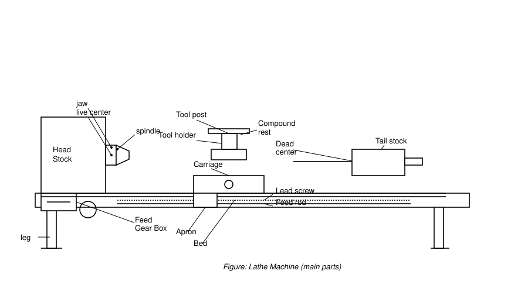
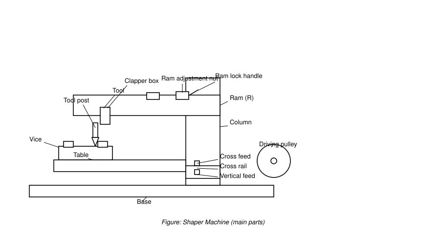
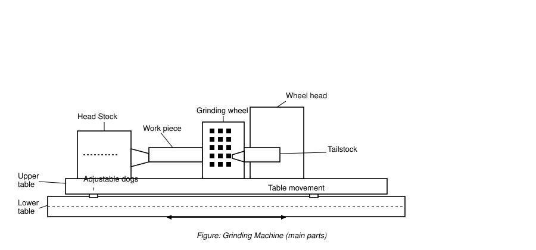

# IPE-102 Practical Report

## Experiment 1 — Study of Lathe Machine and Its Operations

### Aim
To study the main parts, working principle, specifications, and operations of a lathe machine, and to perform the operations practically.

### Introduction
The lathe, known as the "mother of all machines," is the oldest machine tool used in production. It has evolved from a simple rope-turned wood lathe into a general-purpose machine tool used for both production and repair work, owing to the wide variety of operations it can perform.

### Main Parts

| Part | Function |
|---|---|
| Bed | Base on which all other parts are mounted; cast iron/nickel-cast-iron alloy, supported on box-section columns with heavy metal slides (ways). |
| Headstock | Transmits power to lathe parts; supports and aligns the main spindle; houses the speed-change transmission mechanism. |
| Tailstock | Movable casting opposite the headstock on the bed ways; holds the dead center, adjusting screws, and handwheel; can be moved/clamped along the bed. |
| Carriage | Located between headstock and tailstock; supports, guides, and feeds the tool against the job. |
| Saddle | H-shaped casting on top of the lathe ways; supports the cross-slide, compound rest, and tool post. |
| Cross Slide | Female dovetail assembled on the saddle's male dovetail; top surface has T-slots for mounting the tool post or coolant attachment. |
| Compound Rest | Mounted on top of the cross-slide; supports the tool post and cutting tool at various positions; needed for turning angles and boring short tapers. |
| Tool Post | Mounted on the compound rest; holds the cutting tool holder; height of the cutting edge is adjustable by tilting. |
| Apron | Fastened to the saddle, hangs over the front of the bed; contains gears/clutches transmitting motion from the feed rod to the carriage, and the split nut that engages the lead screw for thread cutting. |
| Chuck | Holds workpieces of short length/large diameter or irregular shape that cannot be conveniently mounted between centers. |
| Feed Rod | Power-transmission shaft for precise linear (longitudinal) movement of the carriage. |
| Lead Screw | Used for threading operations, which require simultaneous rotation of the job and linear movement of the tool. |
| Spindle | Hollow shaft; its bore diameter determines the maximum bar stock that can be passed through for chucking. |

### Working Principle
The workpiece rotates between centers, in a chuck, or on a faceplate, while a fixed cutting tool removes the undesired material as chips. The tool is fed parallel to or at right angles to the work axis for straight turning and facing, and at an angle to the axis for machining tapers and angles.

### Specifications

| Item | Value |
|---|---|
| Length (between centers) | e.g. 8″ × 15″ lathe for smaller work |
| Packing dimension | ~15″ swing; 36–48″ between centers |
| Weight | 1500–3500 lb |
| Power | 1–2 HP |
| Speed range | 45–3000 rpm (selectable) |
| Maximum swing over bed | 0–500 mm |
| Max. jaw length (4-jaw chuck) | Diameter 100 mm (3.94″), body thickness 54 mm (2.13″) |

### Operations

| Operation | Purpose |
|---|---|
| Turning | Reduces workpiece diameter by removing material from the outer surface; most common operation. |
| Tapered turning | Machines a cylindrical job to produce a conical surface. |
| Shoulder turning | Turns more than one diameter on a job, producing a stepped "shoulder." |
| Facing | Machines the end of the workpiece, tool fed at right angles to the axis. |
| Thread cutting | Cuts internal/external threads as per requirement. |
| Parting | Cuts deep grooves to separate a portion from the parent material. |
| Chamfering | Bevels the extreme end of a workpiece, usually after knurling/thread cutting. |
| Knurling | Embosses a diamond-shaped rough pattern on the surface using a knurling tool. |
| Drilling | Removes material using a drill bit held stationary in the tailstock. |

### Merits / Demerits
**Merits:** high-quality finished product; high machining speed; saves time; saves money.
**Demerits:** high initial cost; requires highly skilled workers for setup; not economical for small-batch CNC production.

### Applications
Metal-working operations, metal spinning, thermal spraying; automobile industry (crankshaft turning, glass turning, forming screw threads, part reclamation), and general wood/metal turning.

### Precautions
- Do not operate until the controls are understood.
- Never operate with safety guards removed.
- Stop the lathe before measuring, cleaning, oiling, or adjusting.
- Always remove the chuck key after use; clear chips with a brush.

### Result / Conclusion
The main parts, working principle, and operations of the lathe machine were studied, and the listed operations were performed practically. Conventional lathes remain important for small-quantity/repair work alongside modern (CNC) machines.

---

## Experiment 2 — Study of Shaper Machine and Its Operation

### Aim
To study the main parts, working principle, specifications, and operations of a shaper machine, and to perform the operations practically.

### Introduction
A shaper is a production machine that uses a single-point cutting tool. The workpiece is fixed while the tool, carried on the ram, reciprocates: it cuts on the forward stroke and makes no cut on the return stroke. It is used to produce flat and angular surfaces.

### Main Parts

| Part | Function |
|---|---|
| Base | Most important part; carries all the loads of the machine. |
| Column | Supports the ram as it moves forward/backward. |
| Table | Box-like casting with T-slots for clamping work; moves cross-wise (cross-feed rod) and vertically (elevation screw). |
| Cross Rail | Mounted on the column; carries the saddle; moves vertically and horizontally relative to the table. |
| Ram | Reciprocates and carries the tool head with the single-point cutting tool. |
| Tool Post | Positions and manipulates the cutting tool. |
| Tool Head | Holds the cutting tool firmly; provides vertical and angular movement (via clapper box). |
| Vice | Holds and clamps the workpiece firmly; has two jaws. |

### Working Principle
The shaper works on the quick-return motion mechanism. The tool is held by the ram, and the workpiece is fixed on the table. When powered on, the ram reciprocates relative to the table — the cutting tool removes material on the forward stroke and returns without cutting.

### Specifications

| Item | Value |
|---|---|
| Length | Max. 1500 mm; normally ~750 mm |
| Packing dimension | Height 250 mm, depth 465 mm, width 515 mm |
| Weight | ~1250 kg |
| Power | 3 HP |
| Speed range | Max. 140 strokes/min |
| Max. jaw length | ~900 mm |

### Operations

| Operation | Description |
|---|---|
| Vertical cutting | Convenient for machining internal surfaces, keyways, slots, or grooves. |
| Horizontal cutting | Work mounted on the table is moved cross-wise relative to the ram movement. |
| Inclined cutting | Angular cut at any angle other than 90° to the horizontal/vertical plane; work set on the table and vertical slide. |
| Angular cutting | Angular cut produced at any angle other than 90° to the horizontal/vertical plane of the shaper. |

### Merits / Demerits
**Merits:** low tool cost; workpiece easily held; produces flat or angular surfaces.
**Demerits:** cutting speed not very high; only one cutting tool can be fixed at a time.

### Applications
Machining internal splines; producing straight/flat surfaces (horizontal or angular); cutting gear teeth and keyways; producing smooth or rough surfaces and dovetail slides.

### Precautions
- Do not remove cuttings or reach across the table while the ram is moving.
- Do not adjust the machine while it is operating.
- Do not use bolts/nuts with stripped threads to hold down work clamps.
- Do not leave a running shaper unattended.
- Do not use bare hands or compressed air to remove cuttings.

### Result / Conclusion
The construction, working principle, and operations of the shaper machine were studied and performed practically.

---

## Experiment 3 — Study of Grinding Machine and Its Operations

### Aim
To study the main parts, working principle, specifications, and operations of a grinding machine, and to perform the operations practically.

### Introduction
A grinding machine removes material using geometrically non-defined, bonded abrasive cutting edges, with rotational or linear relative movement between tool and workpiece along a defined geometrical path. Material removal occurs via a large number of undefined abrasive grains.

### Main Parts

| Part | Function |
|---|---|
| Bed | Bottom, horizontally situated part of the machine. |
| Column | Vertical pillar carrying the abrasive wheel head. |
| Headstock | Houses the live center; grips the job. |
| Tailstock | Houses the dead center; also provides gripping support to the job. |
| Work Table | Guides and holds the workpiece; on newer machines it replaces the headstock/tailstock arrangement. |
| Grinding Wheel | Main tool; removes unwanted material to achieve the desired smoothness/surface finish; available with various abrasive materials. |
| Effective Motor | Supplies motor power to the grinding wheel via belt and pulley. |
| Job Post | Component where the workpiece is placed. |
| Wheel Guard | Cover over the abrasive wheel; protects the operator from accidents. |
| Cross Feed | Moves the wheel head up/down and left/right. |
| Traversing Wheel | Hand transverse, cross-slide, or vertical feed wheel (three types). |
| Coolant Supply Nozzle | Cools/reduces the temperature generated during grinding. |

### Working Principle
A power-driven grinding wheel spins at the required speed while the bed guides and holds the workpiece. Either the grinding head travels across a fixed workpiece, or the workpiece moves while the wheel stays fixed. Fine positioning is achieved with a vernier-calibrated handwheel or NC/CNC control. Since abrasive material removal generates significant heat, coolant is supplied to cool the workpiece.

### Specifications

| Item | Value |
|---|---|
| Length | Grinding wheel length ~300–400 mm |
| Grinding wheel dimension (D×W×d) | 350 × 32 × 127 mm |
| Weight | ~800 kg |
| Power | ~3 HP |
| Speed range | Max. 3600 rpm; generally 1600–2500 rpm |
| Max. grinding length | ~1000 mm |

### Operations

| Operation | Description |
|---|---|
| Cylinder grinding | Work is mounted and rotated between centers. |
| Taper grinding | Long workpiece: done by swiveling the upper table; short workpiece: wheel head is set to the taper angle. |
| Gear grinding | Done by the generating process or with a form grinding wheel. |
| Thread grinding | Done by the generating process or with a form grinding wheel carrying one or multiple threads. |

### Merits / Demerits
**Merits:** high surface finish and accuracy; can work at high temperatures; less pressure needs to be applied to the work.
**Demerits:** tools are highly expensive; material is removed little by little (time-consuming); operation must be done carefully to avoid damage.

### Applications
Widely used in manufacturing industry for grinding; finishing cylindrical and flat surfaces; grinding a variety of materials.

### Precautions
- Only one person should operate the machine.
- Wear a proper mask for heavy grinding.
- Test the grinding wheel for possible cracks before use.
- Keep hands clear of the wheel.
- Stop all motors before making adjustments.
- The wheel guard must remain fixed in place.

### Result / Conclusion
The grinding machine's construction, working principle, and operations were studied and performed practically. Grinding machines played an important role in the industrial revolution, though the adoption of newer technology remains important.
