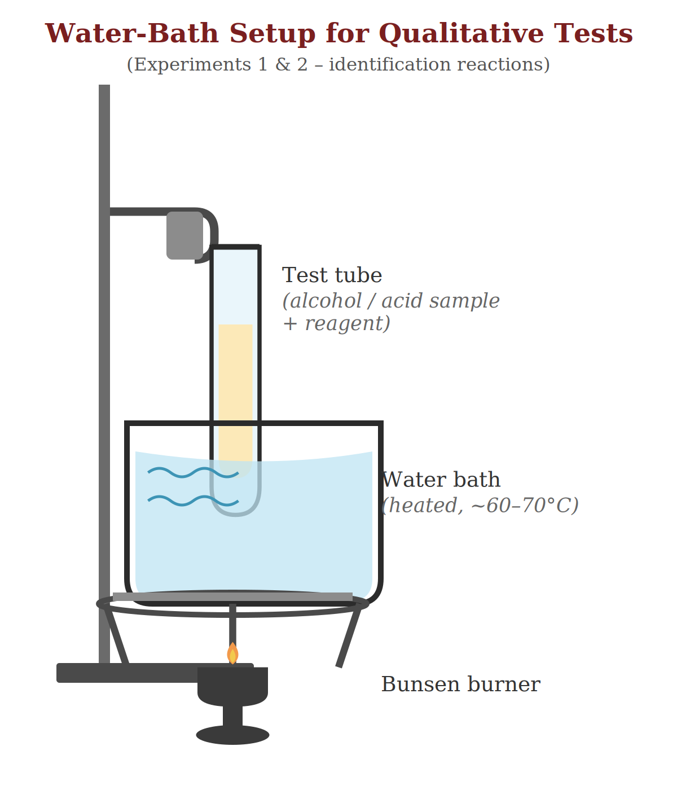
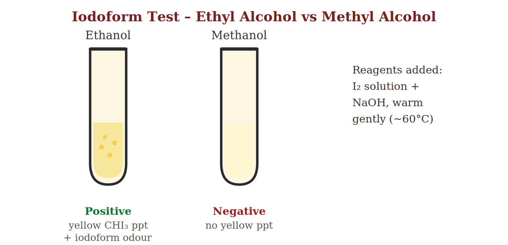
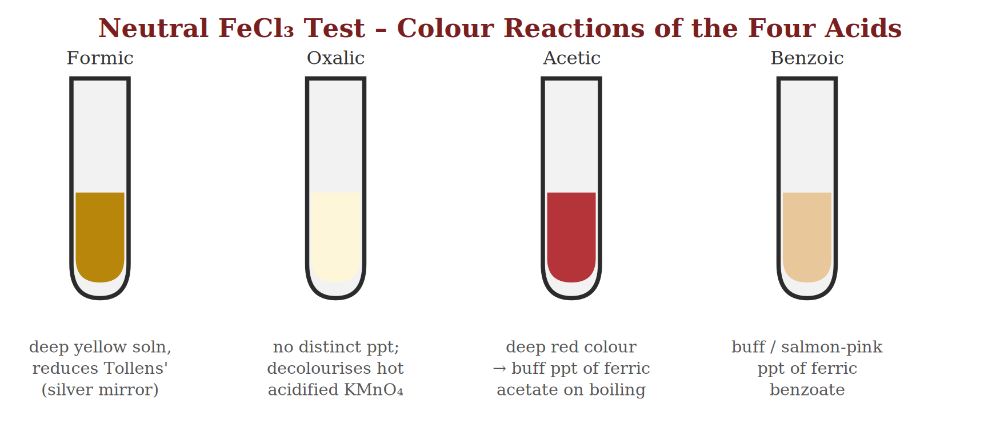
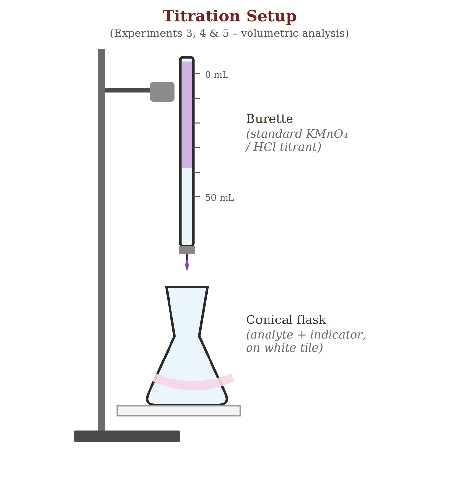
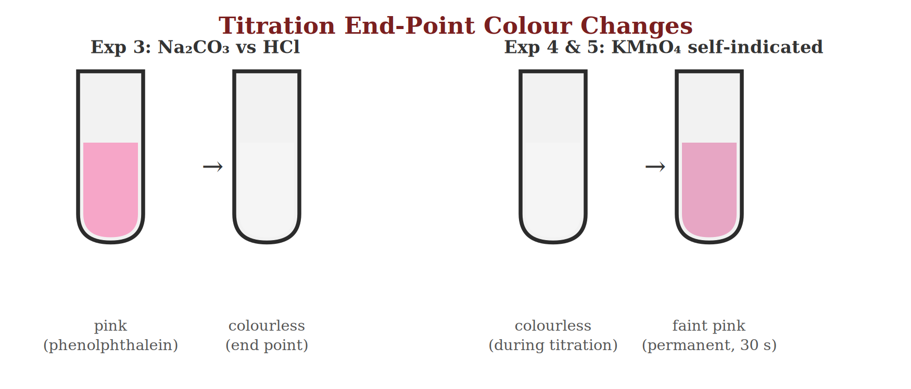

# Applied Chemistry Laboratory Report
### Qualitative Organic Analysis and Volumetric (Redox / Acid–Base) Titrations

**Institution:** Bangladesh University of Textiles (BUTEX) — Department of Fabric Engineering
**Name:** Itachi | **Student ID:** ____________ | **Group/Section:** ____________ | **Date:** ____________

---

## Table of Contents

1. Experiment 1 – Identification of Alcohols (Methyl Alcohol & Ethyl Alcohol)
2. Experiment 2 – Identification of Organic (Carboxylic) Acids
   - 2.1 Formic Acid  2.2 Oxalic Acid  2.3 Acetic Acid  2.4 Benzoic Acid
3. Experiment 3 – Determination of Na₂CO₃ Content of Washing Soda
4. Experiment 4 – Standardization of KMnO₄ Solution with Standard Oxalic Acid
5. Experiment 5 – Estimation of Fe²⁺ (Ferrous Iron) with Standard KMnO₄ Solution

*Each experiment follows the standard format: Experiment No. → Experiment Name → Objective → Theory → Reaction → Apparatus → Required Chemicals → Procedure → Observation → Pre‑Calculation → Calculation → Result → Precautions.*

---

## Experiment 1 – Identification of Alcohols (Methyl Alcohol & Ethyl Alcohol)

### Objective
To identify and distinguish between two unlabelled samples of methyl alcohol (methanol) and ethyl alcohol (ethanol) using characteristic chemical spot tests.

### Theory
Methanol (CH₃OH) and ethanol (C₂H₅OH) are both colourless, volatile, water‑miscible liquids that are neutral to litmus, so simple physical examination cannot tell them apart. They are distinguished by reactions that depend on molecular structure.

Ethanol contains a CH₃–CH(OH)– grouping (a methyl carbinol), which is the structural requirement for the haloform (iodoform) reaction. Methanol lacks this grouping and therefore does not give the reaction. This difference is exploited in the **iodoform test**, the principal confirmatory test used here.

- **Iodoform test:** I₂ in NaOH oxidises the methyl‑carbinol group and iodinates it; the tri‑iodo intermediate is cleaved by base to give a yellow precipitate of iodoform (CHI₃) with an antiseptic smell. Only ethanol (and other methyl carbinols/methyl ketones) gives a positive result.
- **Oxidation test:** controlled oxidation (dil. KMnO₄ or K₂Cr₂O₇/H₂SO₄) converts ethanol → acetaldehyde → acetic acid (vinegar‑like smell), while methanol → formaldehyde → formic acid (pungent smell). Since formic acid retains a reducing –CHO‑type group, the oxidised methanol sample can further reduce Tollens' reagent — an indirect confirmation of methanol.

### Reaction

**Step 1 — hypoiodite formation**
> I₂ + 2NaOH → NaOI + NaI + H₂O

**Step 2 — oxidation of ethanol to acetaldehyde**
> C₂H₅OH + NaOI → CH₃CHO + NaI + H₂O

**Step 3 — iodination**
> CH₃CHO + 3NaOI → CI₃CHO + 3NaOH

**Step 4 — base cleavage (positive with ethanol)**
> CI₃CHO + NaOH → CHI₃↓ (yellow) + HCOONa

**Overall for ethanol:**
> C₂H₅OH + 4I₂ + 6NaOH → CHI₃↓ + HCOONa + 5NaI + 5H₂O

Methanol has no CH₃CH(OH)– group, so Steps 3–4 cannot occur — no yellow precipitate forms.

**Confirmatory oxidation of methanol:**
> 5CH₃OH + 2KMnO₄ + 3H₂SO₄ → 5HCHO + K₂SO₄ + 2MnSO₄ + 8H₂O

*Fig. 1.1 — Water-bath arrangement used for warming the test-tube reaction mixture*

### Apparatus
Test tubes and test-tube stand, dropper/graduated pipette, 250 mL beaker (water bath), tripod stand, wire gauze, Bunsen burner, thermometer, glass rod.

### Required Chemicals
Unknown samples A and B (methanol/ethanol), iodine solution (I₂ in KI), 10% NaOH solution, dilute H₂SO₄, dilute KMnO₄ solution, distilled water.

### Procedure
1. Take about 1 mL of sample A in a clean, dry test tube.
2. Add 2 mL of 10% NaOH solution to it.
3. Add iodine solution drop by drop, with shaking, until a faint permanent colour of iodine persists in the mixture.
4. Warm the test tube gently in a water bath maintained at about 60 °C for 2–3 minutes (Fig. 1.1).
5. Cool the tube under a tap and observe for a yellow, crystalline precipitate with a characteristic (antiseptic) smell.
6. Repeat steps 1–5 with sample B and compare the results.
7. For confirmation, oxidise a fresh portion of each sample with dilute acidified KMnO₄ and note the smell/colour of the product.

*Fig. 1.2 — Observed outcome of the iodoform test on the two samples*

### Observation

| Sample | Observation with I₂/NaOH | Inference |
|---|---|---|
| Sample A | Yellow, crystalline precipitate with antiseptic (iodoform) odour | Ethyl alcohol (ethanol) |
| Sample B | No yellow precipitate obtained | Methyl alcohol (methanol) |

### Pre‑Calculation
This is a qualitative (spot) test; no volumetric or gravimetric pre-calculation is required. Only the presence/absence of the characteristic yellow precipitate and its smell are used as diagnostic criteria.

### Calculation
Not applicable — identification is based entirely on the observed chemical response (positive/negative iodoform test and confirmatory oxidation), not on a numerical result.

### Result
*Sample A was identified as ethyl alcohol (ethanol) — positive iodoform test.*
*Sample B was identified as methyl alcohol (methanol) — negative iodoform test, confirmed by the formaldehyde/formic-acid oxidation product.*

### Precautions
- Use clean, dry test tubes; traces of acetone or ethanol contamination from a previous test give false positives.
- Add iodine solution dropwise only until a faint colour persists — excess iodine masks the precipitate.
- Warm gently; excessive heating volatilises iodine/iodoform and can decompose the precipitate before it is observed.
- Add NaOH before iodine, not the reverse, to ensure hypoiodite forms correctly.
- Never smell reagents or products directly from the mouth of the test tube — waft the vapour gently towards the nose.

---

## Experiment 2 – Identification of Organic (Carboxylic) Acids
*2.1 Formic Acid · 2.2 Oxalic Acid · 2.3 Acetic Acid · 2.4 Benzoic Acid*

### Objective
To identify four given samples as formic acid, oxalic acid, acetic acid and benzoic acid on the basis of general and specific chemical tests.

### Theory
All four compounds contain the –COOH group, so they are weakly acidic, turn blue litmus red, and liberate CO₂ with NaHCO₃ — a common confirmatory test for the carboxylic-acid class as a whole. Distinguishing between them requires tests that respond to the rest of the molecule:

- **Formic acid (HCOOH)** is unique among the four: it possesses an aldehydic (–CHO-like) hydrogen directly on the carboxyl carbon, so it behaves as a mild reducing agent. It reduces Tollens' reagent to metallic silver (silver-mirror test) and Fehling's solution to brick-red Cu₂O, and decolourises bromine water/dilute KMnO₄ in the cold.
- **Oxalic acid (HOOC–COOH)** is a dicarboxylic acid readily oxidised by hot acidified KMnO₄ (the basis of Experiment 4). It also gives a white precipitate of calcium oxalate with CaCl₂, insoluble in acetic acid but soluble in dilute mineral acids.
- **Acetic acid (CH₃COOH)** forms a fruity-smelling ester (ethyl acetate) on warming with ethanol and conc. H₂SO₄, and gives a deep red colouration with neutral FeCl₃ that turns to a buff/reddish-brown precipitate of basic ferric acetate on boiling.
- **Benzoic acid (C₆H₅COOH)** is an aromatic solid that sublimes readily on gentle heating, and gives a buff (salmon-pink) precipitate of ferric benzoate with neutral FeCl₃; sparingly soluble in cold water but dissolves in hot water, recrystallising as needles on cooling.

### Reaction

**Common test (all carboxylic acids):**
> RCOOH + NaHCO₃ → RCOONa + H₂O + CO₂↑ (brisk effervescence)

**2.1 Formic acid — reduces Tollens' reagent:**
> HCOOH + 2[Ag(NH₃)₂]OH → 2Ag↓ (mirror) + (NH₄)₂CO₃ + 2NH₃ + H₂O

**2.2 Oxalic acid — oxidation by acidified KMnO₄ (hot):**
> 5H₂C₂O₄ + 2KMnO₄ + 3H₂SO₄ → K₂SO₄ + 2MnSO₄ + 10CO₂↑ + 8H₂O

**2.3 Acetic acid — esterification and FeCl₃ test:**
> CH₃COOH + C₂H₅OH  --(conc. H₂SO₄)-->  CH₃COOC₂H₅ (fruity ester) + H₂O
>
> 3CH₃COOH + FeCl₃ → Fe(CH₃COO)₃ (deep red) + 3HCl
>
> Fe(CH₃COO)₃ + 2H₂O  --(boil)-->  Fe(OH)₂(CH₃COO)↓ (buff ppt.) + 2CH₃COOH

**2.4 Benzoic acid — FeCl₃ test:**
> 3C₆H₅COOH + FeCl₃ → Fe(C₆H₅COO)₃↓ (buff ppt.) + 3HCl

*Fig. 2.1 — Neutral FeCl₃ colour test used to differentiate the four acids*

### Apparatus
Test tubes and stand, water bath, watch glass (for sublimation), dropper, glass rod, red/blue litmus paper.

### Required Chemicals
Four unknown acid samples, neutral FeCl₃ solution, saturated NaHCO₃ solution, freshly prepared Tollens' reagent (AgNO₃ + dilute NH₄OH), CaCl₂ solution, dilute KMnO₄/dilute H₂SO₄, conc. H₂SO₄, ethanol, distilled water.

### Procedure
1. Test the litmus reaction and solubility of each sample, and confirm the carboxylic-acid class by the NaHCO₃ effervescence test.
2. **Formic acid test:** add a portion of each sample to freshly prepared Tollens' reagent and warm gently in a water bath; a silver mirror on the tube walls indicates formic acid.
3. **Oxalic acid test:** acidify a portion with a few drops of dilute H₂SO₄, warm, and add dilute KMnO₄ dropwise; rapid decolourisation on warming indicates oxalic acid.
4. **Acetic acid test:** add neutral FeCl₃ — a deep red colour that gives a buff/reddish-brown precipitate on boiling indicates acetic acid. Confirm by warming a portion with ethanol and a few drops of conc. H₂SO₄ and noting the fruity ester smell.
5. **Benzoic acid test:** add neutral FeCl₃ — a buff (salmon-pink) precipitate indicates benzoic acid. Confirm by heating a little solid sample gently on a watch glass and observing sublimation.
6. Tabulate the results and assign each sample to formic, oxalic, acetic or benzoic acid.

### Observation

| Test | Formic acid | Oxalic acid | Acetic / Benzoic acid |
|---|---|---|---|
| Litmus | Red (acidic) | Red (acidic) | Red (acidic) |
| NaHCO₃ | Effervescence | Effervescence | Effervescence |
| Tollens' reagent | Silver mirror (+ve) | No mirror | No mirror |
| Hot acidified KMnO₄ | Decolourised | Decolourised (rapid) | Not decolourised in cold |
| Neutral FeCl₃ | Pale yellow (no ppt.) | No characteristic ppt. | Acetic: deep red → buff ppt.; Benzoic: buff ppt. directly |

### Pre‑Calculation
Qualitative identification — no numerical pre-calculation is involved. Each test is interpreted as positive or negative against the standard diagnostic criteria listed above.

### Calculation
Not applicable. (The quantitative estimation of oxalic acid by KMnO₄ titration, which uses this same redox chemistry, is carried out separately in Experiment 4.)

### Result
*The four given samples were identified, on the basis of the tests above, as formic acid, oxalic acid, acetic acid and benzoic acid respectively.*

### Precautions
- Prepare Tollens' reagent immediately before use and discard after the test — on standing it can form explosive silver fulminate.
- Use only neutral FeCl₃ (free of excess HCl); excess acidity suppresses the characteristic colour/precipitate.
- Handle concentrated H₂SO₄ with care; add it slowly and never add water to the acid.
- Heat gently during the sublimation test for benzoic acid to avoid charring.
- Rinse test tubes thoroughly between tests to avoid cross-contamination of results.

---

## Experiment 3 – Determination of Na₂CO₃ Content of Washing Soda

### Objective
To determine the percentage of sodium carbonate (Na₂CO₃) present in a given sample of washing soda by acid–base titration against a standard solution of hydrochloric acid.

### Theory
Washing soda is impure, hydrated sodium carbonate, Na₂CO₃·10H₂O. When titrated with a standard strong acid such as HCl, the reaction occurs in two stages:

**Stage 1 (pH ≈ 8.3, phenolphthalein end point)**
> Na₂CO₃ + HCl → NaHCO₃ + NaCl

**Stage 2 (pH ≈ 3.5–4, methyl orange end point)**
> NaHCO₃ + HCl → NaCl + H₂O + CO₂↑

With phenolphthalein indicator, the colour change (pink → colourless) marks only the first stage (half-neutralisation). To determine the *total* Na₂CO₃ content, the titration is carried out to the methyl-orange end point (yellow → permanent faint pink/orange), representing both stages together:

**Overall reaction used for calculation**
> Na₂CO₃ + 2HCl → 2NaCl + H₂O + CO₂↑

*Fig. 3.1 — Burette-and-conical-flask titration setup used in Experiments 3, 4 and 5*

### Apparatus
Burette (50 mL), pipette (25 mL), conical flask (250 mL), volumetric flask (250 mL), funnel, retort stand with burette clamp, white porcelain tile.

### Required Chemicals
Given washing soda sample (mass taken = 1.325 g), standard HCl solution (0.1 N, previously standardised against Na₂CO₃ or borax), methyl orange indicator, distilled water.

### Procedure
1. Weigh accurately 1.325 g of the given washing soda, dissolve completely in distilled water and make up to exactly 250 mL in a volumetric flask (stock solution).
2. Pipette out 25 mL of this washing soda solution into a clean conical flask.
3. Add 2–3 drops of methyl orange indicator — the solution turns yellow.
4. Rinse and fill the burette with the standard HCl solution; remove air bubbles and note the initial reading.
5. Titrate the washing soda solution with HCl, adding it slowly with constant swirling, until the colour changes sharply from yellow to a permanent faint orange/pink (Fig. 3.2).
6. Note the final burette reading and calculate the volume of HCl used (titre value).
7. Repeat the titration until two or three concordant readings (agreeing within ±0.1 mL) are obtained.

*Fig. 3.2 — Indicator colour changes observed at the titration end points (left pair: Experiment 3)*

### Observation

| Trial | Initial reading (mL) | Final reading (mL) | Volume of HCl used (mL) |
|---|---|---|---|
| 1 | 0.0 | 12.5 | 12.5 |
| 2 | 0.0 | 12.6 | 12.6 |
| 3 | 0.0 | 12.5 | 12.5 |

*Concordant volume of HCl, V₁ = 12.5 mL*

### Pre‑Calculation
Let N₁ = normality of standard HCl = 0.1 N; V₁ = volume of HCl used (titre) = 12.5 mL; V₂ = volume of washing-soda solution taken = 25 mL; N₂ = normality of the washing-soda (Na₂CO₃) solution.

> N₁V₁ = N₂V₂  ⟹  N₂ = (N₁ × V₁) / V₂ = (0.1 × 12.5) / 25 = 0.05 N

### Calculation
1. Strength of Na₂CO₃ solution (g/L) = N₂ × Equivalent weight of Na₂CO₃ = 0.05 × 53 = 2.65 g/L
2. Mass of Na₂CO₃ present in 250 mL stock solution = 2.65 × (250/1000) = 0.6625 g
3. Percentage of Na₂CO₃ in washing soda = (0.6625 / 1.325) × 100 = 50.0 %

### Result
*The percentage of Na₂CO₃ present in the given sample of washing soda = 50.0 % (by mass).*

### Precautions
- Rinse the burette with standard HCl and the pipette with the washing-soda solution before use, to avoid dilution errors.
- Read the burette meniscus at eye level to avoid parallax error.
- Add methyl orange in the minimum number of drops (2–3); excess indicator can mask the sharp colour change.
- Add titrant dropwise near the expected end point and swirl continuously.
- Perform the titration on a white tile placed under the flask for clear colour observation.

---

## Experiment 4 – Standardization of KMnO₄ Solution with Standard Oxalic Acid

### Objective
To standardise an approximately 0.1 N potassium permanganate (KMnO₄) solution by titrating it against a standard solution of oxalic acid.

### Theory
KMnO₄ cannot be used directly as a primary standard because commercial KMnO₄ is never perfectly pure, and its aqueous solutions slowly decompose (catalysed by light and by traces of MnO₂), giving a variable, unstable concentration. It must therefore be standardised against a substance that can be weighed accurately in a pure, stable form — oxalic acid, (COOH)₂·2H₂O, a recognised primary standard.

In hot, dilute-H₂SO₄ medium, KMnO₄ oxidises the oxalate ion completely to CO₂, itself being reduced from Mn⁷⁺ (purple) to Mn²⁺ (almost colourless):

**Overall molecular equation**
> 2KMnO₄ + 5H₂C₂O₄ + 3H₂SO₄ → K₂SO₄ + 2MnSO₄ + 10CO₂↑ + 8H₂O

**Half-reactions:**
> Oxidation:  H₂C₂O₄ → 2CO₂ + 2H⁺ + 2e⁻
>
> Reduction:  MnO₄⁻ + 8H⁺ + 5e⁻ → Mn²⁺ + 4H₂O

The reaction is slow at room temperature but is **autocatalysed** by the Mn²⁺ ions produced as titration proceeds — the first few drops of KMnO₄ decolourise slowly, after which decolourisation becomes rapid. KMnO₄ is self-indicating: the appearance of a permanent faint pink colour (from one drop of excess KMnO₄) marks the end point.

*Fig. 4.1 — Titration assembly (burette charged with KMnO₄, hot oxalic acid in the conical flask)*

### Apparatus
Burette (50 mL), pipette (10 or 25 mL), conical flask (250 mL), water bath or burner with tripod and wire gauze, thermometer, retort stand, white tile.

### Required Chemicals
Standard oxalic acid solution (0.1 N, freshly prepared from AR-grade crystals), KMnO₄ solution (≈ 0.1 N, to be standardised), dilute H₂SO₄ (1:5), distilled water.

### Procedure
1. Pipette out 10 mL of the standard oxalic acid solution into a clean conical flask.
2. Add about 5 mL of dilute H₂SO₄ to acidify the solution.
3. Heat the flask on a water bath to about 60–70 °C (just below boiling, until steam begins to rise) — the reaction is too slow below this range, and oxalic acid may decompose by an alternative pathway above about 85 °C.
4. Fill the burette with the KMnO₄ solution to be standardised and note the initial reading.
5. Titrate the hot oxalic acid solution with KMnO₄, adding it slowly and shaking constantly; allow each drop to decolourise before adding the next, until the reaction visibly speeds up (autocatalysis).
6. Continue titrating until a permanent faint pink colour persists in the solution for at least 30 seconds — this is the end point.
7. Note the final burette reading and repeat the titration to obtain concordant results.

*Fig. 4.2 — Colour change at the KMnO₄ self-indicated end point (right pair)*

### Observation

| Trial | Initial reading (mL) | Final reading (mL) | Volume of KMnO₄ used (mL) |
|---|---|---|---|
| 1 | 0.0 | 9.8 | 9.8 |
| 2 | 0.0 | 9.9 | 9.9 |
| 3 | 0.0 | 9.8 | 9.8 |

*Concordant volume of KMnO₄, V₂ = 9.8 mL*

### Pre‑Calculation
Let N₁ = normality of standard oxalic acid = 0.1 N; V₁ = volume of oxalic acid taken = 10 mL; V₂ = volume of KMnO₄ used (titre) = 9.8 mL; N₂ = normality of the KMnO₄ solution (to be found).

> N₁V₁ = N₂V₂  ⟹  N₂ = (N₁ × V₁) / V₂ = (0.1 × 10) / 9.8 = 0.102 N

### Calculation
1. Normality of KMnO₄ solution, N₂ = (0.1 × 10) / 9.8 = 0.102 N
2. Strength of KMnO₄ solution (g/L) = N₂ × Equivalent weight of KMnO₄ = 0.102 × 31.6 = 3.22 g/L

### Result
*The normality of the given KMnO₄ solution, as standardised against 0.1 N oxalic acid, was found to be N₂ = 0.102 N.*

### Precautions
- The oxalic acid solution must be heated to 60–70 °C before titrating; the reaction is unreliably slow at room temperature and side reactions occur above ≈ 85 °C.
- Add KMnO₄ slowly, drop by drop, especially near the end point, with continuous shaking, until autocatalysis is established.
- Use only dilute H₂SO₄ to acidify — never HCl, since Cl⁻ ions are oxidised by KMnO₄ and would introduce a titration error.
- Rinse the burette with a little KMnO₄ solution before filling; use a burette with a glass stopcock, as KMnO₄ attacks rubber.
- Read the meniscus of the dark purple solution from the top edge (upper meniscus), since the lower meniscus is not visible through the opaque liquid.

---

## Experiment 5 – Estimation of Fe²⁺ (Ferrous Iron) with Standard KMnO₄ Solution

### Objective
To determine the strength (concentration) of ferrous ion, Fe²⁺, in a given solution (e.g. Mohr's salt solution) by titration against the KMnO₄ solution standardised in Experiment 4.

### Theory
In acidic medium, KMnO₄ oxidises Fe²⁺ to Fe³⁺ while itself being reduced to Mn²⁺. Since the KMnO₄ solution has already been standardised against oxalic acid (Experiment 4), it can now be used as a secondary standard titrant to estimate an unknown concentration of Fe²⁺, commonly supplied as Mohr's salt, FeSO₄·(NH₄)₂SO₄·6H₂O, which resists aerial oxidation better than simple ferrous sulphate and is itself a good primary standard for Fe²⁺.

**Overall molecular equation**
> 2KMnO₄ + 10FeSO₄ + 8H₂SO₄ → K₂SO₄ + 5Fe₂(SO₄)₃ + 2MnSO₄ + 8H₂O

**Half-reactions:**
> Oxidation:  Fe²⁺ → Fe³⁺ + e⁻
>
> Reduction:  MnO₄⁻ + 8H⁺ + 5e⁻ → Mn²⁺ + 4H₂O
>
> **Overall ionic equation:**  MnO₄⁻ + 5Fe²⁺ + 8H⁺ → Mn²⁺ + 5Fe³⁺ + 4H₂O

As with oxalic acid, KMnO₄ is self-indicating: the pale green/colourless Fe²⁺ solution turns to a permanent faint pink the moment excess (unreacted) KMnO₄ appears, marking the end point. Unlike the oxalic-acid titration, this titration is carried out **at room temperature**, since heating would accelerate aerial oxidation of Fe²⁺ and give a falsely low (or erratic) result.

*Fig. 5.1 — Titration of Fe²⁺ solution with standardised KMnO₄ from the burette*

### Apparatus
Burette (50 mL), pipette (10 or 25 mL), conical flask (250 mL), retort stand, white tile.

### Required Chemicals
Standardised KMnO₄ solution (from Experiment 4, N₁ = 0.102 N), given Fe²⁺ (Mohr's salt) solution (total volume 100 mL), dilute H₂SO₄, distilled water.

### Procedure
1. Pipette out 10 mL of the given Fe²⁺ solution into a clean conical flask.
2. Add about 5 mL of dilute H₂SO₄ to acidify the solution and suppress hydrolysis of the Fe²⁺ salt.
3. Fill the burette with the standardised KMnO₄ solution and note the initial reading.
4. Titrate the Fe²⁺ solution immediately (without heating) with KMnO₄ from the burette, swirling the flask constantly.
5. Continue the titration until the appearance of a permanent faint pink colour that persists for at least 30 seconds — this is the end point.
6. Note the final burette reading and repeat to obtain concordant titre values.

### Observation

| Trial | Initial reading (mL) | Final reading (mL) | Volume of KMnO₄ used (mL) |
|---|---|---|---|
| 1 | 0.0 | 10.5 | 10.5 |
| 2 | 0.0 | 10.6 | 10.6 |
| 3 | 0.0 | 10.5 | 10.5 |

*Concordant volume of KMnO₄, V₁ = 10.5 mL*

### Pre‑Calculation
Let N₁ = normality of the standardised KMnO₄ solution (from Experiment 4) = 0.102 N; V₁ = volume of KMnO₄ used (titre) = 10.5 mL; V₂ = volume of Fe²⁺ solution taken = 10 mL; N₂ = normality of the Fe²⁺ solution (to be found).

> N₁V₁ = N₂V₂  ⟹  N₂ = (N₁ × V₁) / V₂ = (0.102 × 10.5) / 10 = 0.107 N

### Calculation
1. Normality of Fe²⁺ solution, N₂ = (0.102 × 10.5) / 10 = 0.107 N
2. Strength of Fe²⁺ solution (g/L) = N₂ × Equivalent weight of Fe = 0.107 × 56 = 6.00 g/L
3. Amount of Fe²⁺ present in the given volume, V = 100 mL, = 6.00 × (100/1000) = 0.60 g

### Result
*The strength of the given Fe²⁺ (ferrous) solution was found to be N₂ = 0.107 N, equivalent to 6.00 g/L of Fe²⁺ (≈ 0.60 g of Fe²⁺ in the 100 mL sample).*

### Precautions
- Titrate the Fe²⁺ solution at room temperature — do not heat, as this promotes aerial oxidation of Fe²⁺ to Fe³⁺ before titration, giving a low and inconsistent titre.
- Acidify only with dilute H₂SO₄, never HCl, since Cl⁻ is oxidised by KMnO₄ and would introduce error.
- Titrate promptly after acidifying; do not allow the Fe²⁺ solution to stand exposed to air for long periods.
- Rinse the burette with KMnO₄ solution and the pipette with the Fe²⁺ solution before use.
- Note the end point the instant a permanent faint pink appears — over-titration causes a positive error.
