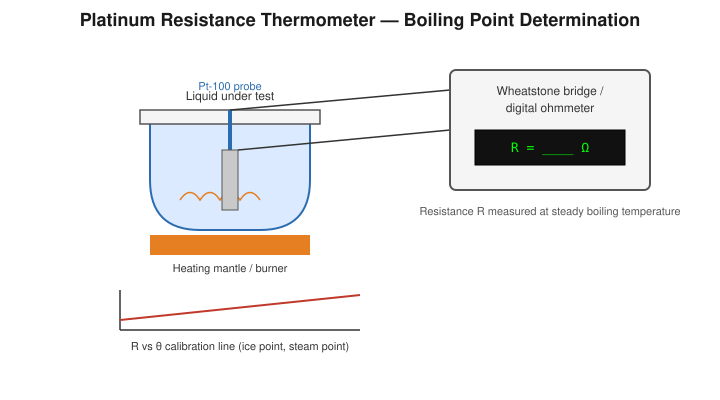

# Determination of the Boiling Point of a Liquid by Platinum Resistance Thermometer

## Aim

To calibrate a platinum resistance thermometer (PRT) using the ice point and steam point of water, and to use it to determine the boiling point of a given liquid.

## Apparatus / Equipment

- Platinum resistance thermometer (Pt-100 type probe)
- Wheatstone bridge (metre-bridge/post-office box) or a digital ohmmeter/multimeter
- Melting (pure) ice and a vessel for the ice bath
- Hypsometer / steam apparatus for producing steam at standard pressure
- Round-bottom flask, heating source (burner or heating mantle), and condenser arrangement, for boiling the given liquid
- Barometer (to record atmospheric pressure, if precise correction is required)
- Connecting leads

## Principle / Theory

The electrical resistance of pure platinum increases smoothly and reproducibly with temperature, making it an accurate secondary standard for thermometry. Over a limited range (ice point to steam point and modestly beyond), the resistance–temperature relation is well approximated by the **linear form**:

$$
R_t = R_0(1+\alpha t)
$$

where $R_0$ is the resistance at $0\,^\circ$C, $R_t$ is the resistance at temperature $t\,^\circ$C, and $\alpha$ is the (average) temperature coefficient of resistance of platinum over that range. (For high-precision work outside this simple range, the full **Callendar–Van Dusen equation**, $R_t=R_0(1+At+Bt^2)$ for $t>0\,^\circ$C, is used instead; this experiment restricts itself to the linear approximation, which is valid between the ice point and moderately above the steam point.)

The thermometer is first **calibrated** using two fixed points of known temperature:

- The **ice point** ($t=0\,^\circ$C): the PRT is immersed in melting pure ice, and its resistance $R_0$ is measured.
- The **steam point** ($t=100\,^\circ$C at standard atmospheric pressure): the PRT is immersed in the steam above boiling water in a hypsometer, and its resistance $R_{100}$ is measured.

From these,
$$
\alpha = \frac{R_{100}-R_0}{100\,R_0}
$$

Once $R_0$ and $\alpha$ are known, the PRT becomes a calibrated instrument: for **any** unknown temperature $t$, measuring the resistance $R_t$ and substituting into the (rearranged) linear relation gives $t$ directly. This calibrated thermometer is then used to find the boiling point of a given liquid by immersing its probe in the vapour just above the boiling liquid and reading the steady resistance $R_t$.

**Symbols**

| Symbol | Meaning | Unit |
|---|---|---|
| $R_0$ | Resistance of the PRT at $0\,^\circ$C (ice point) | Ω |
| $R_{100}$ | Resistance of the PRT at $100\,^\circ$C (steam point) | Ω |
| $\alpha$ | Temperature coefficient of resistance of platinum | °C$^{-1}$ |
| $R_t$ | Resistance of the PRT at the unknown boiling point $t$ | Ω |
| $t$ | Boiling point of the given liquid (at the prevailing pressure) | °C |

## Formula / Working Equation

**Calibration:**
$$
\alpha = \frac{R_{100}-R_0}{100\,R_0}
$$

**Boiling point of the given liquid:**
$$
R_t = R_0(1+\alpha t) \quad\Longrightarrow\quad
\boxed{t = \dfrac{R_t-R_0}{\alpha R_0} = \dfrac{(R_t-R_0)}{(R_{100}-R_0)}\times 100}
$$

## Experimental Setup

The PRT probe is connected, via its leads, to one arm of a Wheatstone bridge (or directly to a digital ohmmeter), so that its resistance can be read at any instant. The probe is first inserted into melting ice for the ice-point reading, then into the steam space of a hypsometer for the steam-point reading, and finally into the vapour space just above the given boiling liquid (in a flask heated steadily, with a condenser to prevent loss of vapour) for the unknown boiling-point reading.

## Diagram / Experimental Arrangement

## Procedure

1. Connect the PRT probe leads to the resistance-measuring bridge/ohmmeter; check for zero error/lead-resistance compensation as per the instrument's instructions.
2. **Ice point:** Pack the vessel with finely crushed, pure melting ice (with a little water) and immerse the PRT bulb fully, avoiding contact with the vessel walls. Wait for a steady reading and record it as $R_0$.
3. **Steam point:** Set up the hypsometer with distilled water and bring it to a steady boil at atmospheric pressure. Insert the PRT into the steam space (not the liquid) and, after the reading has been steady for a few minutes, record it as $R_{100}$. Note the barometric pressure; apply the standard pressure correction to the assumed $100\,^\circ$C reference if the pressure departs appreciably from 760 mmHg.
4. Calculate $\alpha$ from the calibration formula.
5. **Test liquid:** Set up the given liquid in a flask fitted with a reflux condenser, and heat it steadily until it boils under constant (atmospheric) pressure.
6. Insert the PRT into the vapour just above the boiling liquid surface; wait until the resistance reading becomes steady (no drift for several minutes), and record it as $R_t$.
7. Repeat the boiling-point measurement two or three times, allowing the flask to be reheated to a fresh steady boil each time, and take the mean $R_t$.
8. Compute the unknown boiling point $t$ using the working equation.

## Observation Table

**Ice-point resistance, $R_0$** = ______ Ω
**Steam-point resistance, $R_{100}$** = ______ Ω (atmospheric pressure at the time = ______ mmHg)
**Calculated $\alpha$** = ______ °C$^{-1}$

| Trial | Resistance of PRT in vapour of test liquid, $R_t$ (Ω) |
|---|---|
| 1 | |
| 2 | |
| 3 | |
| Mean | |

## Calculations

$$
\alpha = \frac{R_{100}-R_0}{100\,R_0} = \frac{(\_\_\_\_\_)-(\_\_\_\_\_)}{100\times(\_\_\_\_\_)} = \_\_\_\_\_\ ^\circ\text{C}^{-1}
$$

$$
t = \frac{R_t-R_0}{\alpha R_0} = \frac{(\_\_\_\_\_)-(\_\_\_\_\_)}{(\_\_\_\_\_)\times(\_\_\_\_\_)} = \_\_\_\_\_\ ^\circ\text{C}
$$

## Graph

Plot resistance $R$ (y-axis) against temperature $\theta$ (x-axis) using the two calibration points $(0,R_0)$ and $(100,R_{100})$, joined by a straight line (the linear-approximation calibration line).

- **Expected relationship:** a straight line of slope $R_0\alpha$ and intercept $R_0$.
- **Use of the graph:** the measured resistance $R_t$ for the boiling liquid can be located on the $R$-axis and the corresponding temperature read off directly from the calibration line, as a graphical cross-check of the calculated value of $t$.

## Result

The temperature coefficient of resistance of the platinum thermometer was found to be $\alpha = \_\_\_\_\_\ ^\circ\text{C}^{-1}$, and the boiling point of the given liquid, at the prevailing atmospheric pressure, is:

$$
t = \_\_\_\_\_\ ^\circ\text{C}
$$

## Precautions

- Ensure the PRT bulb is fully immersed in the medium (ice/steam/vapour) at each stage, without touching the container walls.
- Use pure, finely crushed, well-drained melting ice for the ice point, and pure (distilled) water for the steam point.
- Wait for the resistance reading to become genuinely steady before recording — the platinum element has a finite thermal response time.
- Insert the PRT into the **vapour**, not the boiling liquid itself, to read the true boiling (saturation) temperature and avoid superheating errors.
- Record the atmospheric pressure and correct the assumed 100 °C reference point if it departs significantly from standard pressure.
- Minimise and, where possible, compensate for the resistance of the connecting leads, which otherwise adds a constant error to every reading.

## Sources / References

- SchoolPhysics — "The platinum resistance thermometer" (Callendar's equation and the linear approximation).
- Standard undergraduate physics laboratory manuals on resistance thermometry and boiling-point determination.
- IEC/EN 60751 platinum resistance thermometer reference data (Callendar–Van Dusen coefficients, for context on the linear approximation's validity range).
