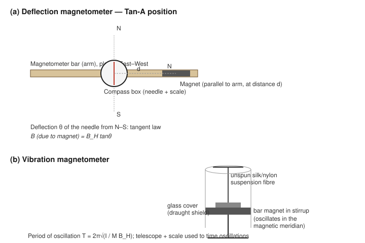

# Determination of the Horizontal Component of the Earth's Magnetic Field and the Magnetic Moment of a Magnet by Magnetometers

## Aim

To determine (i) the magnetic moment $M$ of a given bar magnet and (ii) the horizontal component of the Earth's magnetic field, $B_H$, using a deflection magnetometer (Tan-A position) combined with a vibration magnetometer.

## Apparatus / Equipment

- Deflection magnetometer (compass box at the centre of a graduated wooden bar, with a magnetic needle and scale reading in degrees)
- Vibration magnetometer (torsion-free suspension, stirrup, glass draught-shield, telescope and scale, or a simple viewing arrangement)
- Given bar magnet (mass and dimensions known/measurable)
- Physical balance
- Metre scale
- Stop-watch
- Spirit level

## Principle / Theory

**Two independent relations are needed** to find both $M$ and $B_H$, because a single magnetometer measurement (deflection alone, or the period of oscillation alone) yields only a combination of the two, not each quantity separately.

### (a) Deflection magnetometer — Tan-A position

The deflection magnetometer is first levelled and its arm set along the magnetic east–west direction, with the compass box rotated so that the needle reads zero when there is no external magnet on the bar (this defines the Tan-A position). The given bar magnet, of magnetic moment $M$ and half-length $l$, is then placed on the arm with its axis along the arm (i.e. along the east–west line), at a distance $d$ from the centre of the compass needle, so that the needle deflects through an angle $\theta$.

In this position the magnetic field due to the magnet at the needle lies along the axial line of the magnet and is perpendicular to $B_H$. Its magnitude is

$$
B = \frac{\mu_0}{4\pi}\cdot\frac{2Md}{(d^2 - l^2)^2}
$$

By the tangent law, at equilibrium the resultant of $B$ (east–west) and $B_H$ (north–south) makes the needle deflect by $\theta$ such that

$$
B = B_H \tan\theta
$$

Combining the two relations:

$$
\frac{\mu_0}{4\pi}\cdot\frac{2Md}{(d^2-l^2)^2} = B_H \tan\theta
\quad\Longrightarrow\quad
\frac{M}{B_H} = \frac{4\pi}{\mu_0}\cdot\frac{(d^2-l^2)^2 \tan\theta}{2d}
$$

For a short magnet ($l \ll d$), this reduces to the familiar short-magnet form

$$
\frac{M}{B_H} = \frac{4\pi}{\mu_0}\cdot\frac{d^3\tan\theta}{2}
$$

Either form may be used; the full form (retaining $l$) is used in this manual since $l$ is measured directly on the given magnet.

### (b) Vibration magnetometer

The same bar magnet, suspended horizontally by a torsion-free thread inside the vibration magnetometer box, aligns itself along $B_H$ (the magnetic meridian) and, when slightly disturbed, executes small oscillations in the horizontal plane under the restoring torque due to $B_H$. The period of oscillation is

$$
T = 2\pi\sqrt{\frac{I}{M B_H}}
\quad\Longrightarrow\quad
M B_H = \frac{4\pi^2 I}{T^2}
$$

where $I$ is the moment of inertia of the magnet about the vertical suspension axis. For a bar magnet of mass $m$, length $2l$ and breadth $b$, oscillating about an axis through its centre and perpendicular to its length,

$$
I = \frac{m\left[(2l)^2 + b^2\right]}{12}
$$

### (c) Combining the two measurements

From (a): $\dfrac{M}{B_H} = P$ (a measured quantity)
From (b): $M B_H = Q$ (a measured quantity)

Multiplying and dividing these two equations gives $M$ and $B_H$ separately:

$$
M = \sqrt{P \times Q}, \qquad B_H = \sqrt{\dfrac{Q}{P}}
$$

Here $\mu_0 = 4\pi\times 10^{-7}\ \text{T m A}^{-1}$ is the permeability of free space, $M$ is in A m² (equivalently J/T), and $B_H$ is in tesla (T).

## Formula / Working Equation

$$
\frac{M}{B_H} = \frac{4\pi}{\mu_0}\cdot\frac{(d^2-l^2)^2\tan\theta}{2d}
\qquad\qquad
M B_H = \frac{4\pi^2 I}{T^2}
$$

$$
M = \sqrt{\left(\frac{M}{B_H}\right)\left(M B_H\right)}, \qquad
B_H = \sqrt{\frac{M B_H}{M/B_H}}
$$

## Experimental Setup

The deflection magnetometer bar is placed on a levelled table, free from nearby iron objects and other magnets, and aligned along the magnetic east–west direction using the compass needle itself (the needle points north–south when no magnet is present). The compass box at the centre carries a light aluminium pointer moving over a circular scale divided into four quadrants. The vibration magnetometer is set up separately, well away from the deflection magnetometer and other magnetic disturbances, with its box levelled and aligned so that the magnet, when at rest, lies along the magnetic meridian inside the glass draught-shield.

## Diagram / Experimental Arrangement

## Procedure

### Part A — Deflection magnetometer (Tan-A position)

1. Level the deflection magnetometer base using the spirit level. Remove all magnets and iron objects from the vicinity.
2. Rotate the compass box alone until the pointer reads $0^\circ$–$0^\circ$ on the scale; then rotate the whole instrument (base and box together) until the pointer still reads zero, with the bar now lying along the magnetic east–west direction. The instrument is now set in the Tan-A position.
3. Place the given bar magnet on one arm of the magnetometer with its axis along the arm (parallel to it), at a chosen distance $d$ from the centre of the compass box, with its north pole pointing away from the box.
4. Read both ends of the pointer (to eliminate any small error in the pivot/scale centring) and take the mean as the deflection $\theta$.
5. Reverse the magnet's polarity (turn it end-for-end so the poles are interchanged) at the same distance $d$ and note the deflection again; then move the magnet to the opposite arm (same distance $d$, on the west side if the first reading was on the east side) and repeat both readings. This gives four deflection readings for the same $d$; take their mean.
6. Repeat steps 3–5 for four to five different values of $d$ (each within the range where $\theta$ lies between about $30^\circ$ and $60^\circ$, where the tangent law is most reliably applied), keeping $d$ fixed for all four readings at each distance.
7. Measure the length $2l$ of the given bar magnet with the metre scale.

### Part B — Vibration magnetometer

8. Weigh the bar magnet on the physical balance to obtain its mass $m$; measure its length $2l$ and breadth $b$ with the metre scale/vernier callipers.
9. Suspend the magnet horizontally in the stirrup of the vibration magnetometer, ensuring it hangs freely without touching the sides of the glass tube, and that the suspension thread is untwisted.
10. Align the box so that the magnet, at rest, lies along the magnetic meridian (north–south).
11. Gently rotate the magnet in the horizontal plane through a small angle (not exceeding about $10^\circ$, so that the oscillations remain simple harmonic) and release it to oscillate freely.
12. Allow a few oscillations to settle into a steady swing, then start the stop-watch and count the time for 20 complete oscillations; repeat for a second set of 20 oscillations.
13. Compute the period $T$ as the mean total time divided by the number of oscillations counted.

## Observation Table

**Length of the bar magnet, $2l$ = ______ cm, so $l$ = ______ cm = ______ m**
**Mass of the bar magnet, $m$ = ______ g**
**Breadth of the bar magnet, $b$ = ______ cm = ______ m**

### Table 1 — Deflection magnetometer (Tan-A position)

| Distance $d$ (cm) | $\theta_1$ (°) | $\theta_2$ (°) | $\theta_3$ (°) | $\theta_4$ (°) | Mean $\theta$ (°) | $\tan\theta$ |
|:------------------:|:----------------:|:----------------:|:----------------:|:----------------:|:--------------------:|:--------------:|
|                     |                  |                  |                  |                  |                      |                |
|                     |                  |                  |                  |                  |                      |                |
|                     |                  |                  |                  |                  |                      |                |
|                     |                  |                  |                  |                  |                      |                |

### Table 2 — Vibration magnetometer

| Trial | Number of oscillations $n$ | Time for $n$ oscillations (s) | Period $T = t/n$ (s) |
|:-----:|:----------------------------:|:--------------------------------:|:-----------------------:|
| 1     | 20                            |                                   |                         |
| 2     | 20                            |                                   |                         |

Mean period, $T$ = ______ s

> Example / illustrative reading only — not an experimental result: for $l = 0.05$ m, $d = 0.20$ m, mean $\theta = 21.8^\circ$, and $T = 2.1$ s with $m = 60$ g, $2l = 10$ cm, $b = 1.5$ cm, the working equations below would be evaluated numerically in exactly this way.

## Calculations

**Moment of inertia of the magnet:**

$$
I = \frac{m\left[(2l)^2 + b^2\right]}{12} = \_\_\_\_ \text{ kg m}^2
$$

**From the deflection magnetometer (for each value of $d$), compute:**

$$
\frac{M}{B_H} = \frac{4\pi}{\mu_0}\cdot\frac{(d^2-l^2)^2\tan\theta}{2d} = \_\_\_\_
$$

Take the mean of $M/B_H$ over all distances $d$: $\left(\dfrac{M}{B_H}\right)_{\text{mean}} =$ ______

**From the vibration magnetometer:**

$$
M B_H = \frac{4\pi^2 I}{T^2} = \_\_\_\_
$$

**Combining:**

$$
M = \sqrt{\left(\frac{M}{B_H}\right)_{\text{mean}} \times (M B_H)} = \_\_\_\_ \text{ A m}^2
$$

$$
B_H = \sqrt{\frac{M B_H}{\left(M/B_H\right)_{\text{mean}}}} = \_\_\_\_ \text{ T}
$$

## Graph

Plot $\tan\theta$ (y-axis) against $\dfrac{2d}{(d^2-l^2)^2}$ (x-axis) using the readings of Table 1. From the theory,

$$
\tan\theta = \frac{\mu_0 M}{4\pi B_H}\cdot\frac{2d}{(d^2-l^2)^2}
$$

so the graph should be a straight line through the origin, with slope

$$
\text{slope} = \frac{\mu_0 M}{4\pi B_H} = \frac{M}{B_H}\cdot\frac{\mu_0}{4\pi}
$$

The slope therefore gives $M/B_H$ more reliably than a single reading, by averaging out random errors over several distances; use this graphical value of $M/B_H$ in the combination step above in place of (or alongside) the simple mean.

## Result

Therefore, for the given bar magnet:

$$
M = \_\_\_\_ \text{ A m}^2
$$

$$
B_H = \_\_\_\_ \text{ T}
$$

The determined value of $B_H$ may be compared with the locally expected horizontal component of the Earth's magnetic field (of the order of a few tens of microtesla, depending on geographic location).

## Precautions and Sources of Error

- Keep all other magnets, magnetic materials, and current-carrying wires well away from both magnetometers during observations; nearby iron objects (tables, chairs, tools) can seriously disturb the local field.
- Level both instruments carefully before starting.
- Take deflections only when the pointer has come to rest, and read both ends of the pointer to eliminate error due to the pivot not being exactly at the centre of the scale.
- Keep $\theta$ between about $30^\circ$ and $60^\circ$ by choosing suitable distances $d$, since the tangent law gives the least fractional error in this range.
- Ensure the magnet lies exactly along the arm of the deflection magnetometer (Tan-A) and that the arm itself is exactly along the magnetic east–west line.
- In the vibration magnetometer, keep the amplitude of oscillation small so that the motion remains simple harmonic, and ensure the suspension thread is free of twist and torsion.
- Count oscillations from a fixed reference point (e.g., the instant the magnet crosses the mean position moving in a chosen direction) to reduce timing error.

## Sources / References

- Undergraduate physics laboratory manuals on the deflection magnetometer (Tan-A / Tan-B positions) and vibration magnetometer experiments, as used in standard B.Sc. physics practical courses.
- Virtual/physical laboratory theory and procedure notes on the deflection magnetometer, e.g. the Electricity and Magnetism virtual lab documentation for the deflection magnetometer experiment.
- Standard experimental physics texts covering the combined deflection–vibration magnetometer method for determining $M$ and $B_H$ independently.
