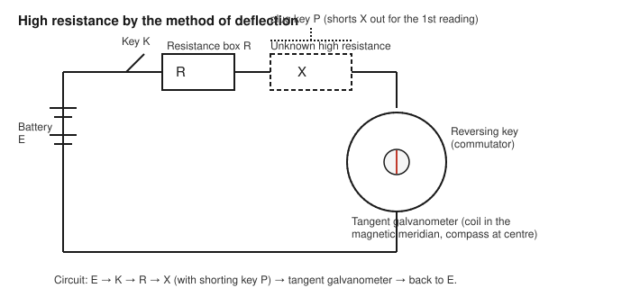

# Determination of a High Resistance by the Method of Deflection

## Aim

To determine the value of a given high resistance $X$ (of the order of several thousand ohms or more) using the method of deflection with a tangent galvanometer.

## Apparatus / Equipment

- Tangent galvanometer (coil of known/fixed dimensions, compass needle at the centre)
- Given high resistance $X$ (unknown, to be determined)
- Resistance box $R$ (0–10,000 Ω or similar range)
- DC battery / battery eliminator
- Plug key
- Commutator (current reversing key)
- Spirit level and compass, for orienting the coil
- Connecting wires

## Principle / Theory

A resistance of the order of kilohms or more cannot be measured conveniently by a simple ammeter–voltmeter (Ohm's law) method, because the current through it is too small to be read accurately on an ordinary ammeter, and because a voltmeter of finite resistance connected across it would itself draw an appreciable fraction of the current, introducing a large loading error. Instead, a **tangent galvanometer** is used, in which the current is not read numerically in amperes but is inferred from the *deflection* of a small compass needle placed at the centre of a vertical circular coil, since, by the tangent law of the galvanometer,

$$
I \propto \tan\theta
$$

where $\theta$ is the steady deflection of the needle from the magnetic meridian. This proportionality (with the coil's magnetic constant, its reduction factor, being the same throughout a given run) is used to *compare* the currents that flow through the circuit with and without the unknown high resistance $X$ inserted, without needing to know the absolute value of the current in amperes at all.

Let $G$ be the effective resistance of the galvanometer coil, and let $E$ be the (constant) EMF of the battery, kept unchanged throughout the experiment.

**First reading (without $X$ in the circuit):** with only the resistance box $R$ (and the galvanometer coil $G$) in the circuit, the current is

$$
I_1 = \frac{E}{R+G} \;\propto\; \tan\theta_1
$$

**Second reading (with $X$ inserted in series):** with the unknown high resistance $X$ now included in series with $R$ and $G$, the current falls to

$$
I_2 = \frac{E}{R+G+X} \;\propto\; \tan\theta_2 \qquad (\theta_2 < \theta_1)
$$

Since the same constant of proportionality connects $I$ and $\tan\theta$ in both cases (same coil, same needle, same battery EMF), the ratio of the currents equals the ratio of the tangents:

$$
\frac{I_1}{I_2} = \frac{\tan\theta_1}{\tan\theta_2} = \frac{R+G+X}{R+G}
$$

Solving for $X$:

$$
X = (R+G)\left(\frac{\tan\theta_1}{\tan\theta_2} - 1\right)
$$

If $G$ is small compared with $R$ and $X$ (as is usually the case for a low-resistance galvanometer coil compared with a high resistance under test), $G$ may be neglected in comparison with $R$, giving the working approximation

$$
X \approx R\left(\frac{\tan\theta_1}{\tan\theta_2} - 1\right)
$$

This manual uses the exact form (retaining $G$, measured separately if required by the instructor) as the primary working equation, with the approximate form noted for cases where $G \ll R$.

## Formula / Working Equation

$$
X = (R+G)\left(\frac{\tan\theta_1}{\tan\theta_2} - 1\right)
$$

where $R$ is the resistance-box value used for the first (reference) reading, $G$ is the galvanometer coil resistance, $\theta_1$ is the deflection without $X$, and $\theta_2$ is the (smaller) deflection with $X$ inserted in series.

## Experimental Setup

The tangent galvanometer is levelled and its coil is set in the magnetic meridian (i.e., in the vertical plane containing the north–south direction), so that the field due to the coil at the needle is perpendicular to the horizontal component of the Earth's field when no current flows and the needle reads zero. The resistance box $R$, the unknown high resistance $X$, the battery, plug key, and a reversing commutator are all connected in series with the galvanometer coil, with $X$ wired through a short-circuiting plug key so that it can be cut in or out of the circuit without disturbing any other connection.

## Diagram / Experimental Arrangement

## Procedure

1. Set up the tangent galvanometer on a level surface, away from other magnets and current-carrying wires. Rotate the coil (with the circuit open) until the compass needle reads $0^\circ$–$0^\circ$ and lies in the plane of the coil; the coil is now in the magnetic meridian.
2. Connect the circuit as shown: battery, key, resistance box $R$, the unknown resistance $X$ (through its own shorting key so it can be bypassed), commutator, and the galvanometer coil, all in series.
3. With $X$ shorted out (bypassed) and a suitable value of $R$ introduced from the resistance box, close the key and note the steady deflection of the galvanometer needle at both ends of the scale; take the mean as $\theta_1$. Choose $R$ so that $\theta_1$ lies between about $30^\circ$ and $60^\circ$.
4. Reverse the current using the commutator and note the deflection again; take the mean of the two sets of readings (direct and reversed current) as the final value of $\theta_1$. This eliminates any small error due to the coil not being exactly in the magnetic meridian.
5. Without changing $R$ or the battery connections, remove the shorting plug so that the unknown high resistance $X$ is now included in the circuit. Note the new, smaller steady deflection $\theta_2$ at both ends of the scale, again with direct and reversed current, and take the mean.
6. Repeat steps 3–5 for three to four different values of $R$, so that a fresh pair of readings $(\theta_1, \theta_2)$ is obtained each time.
7. If required, determine $G$, the resistance of the galvanometer coil, separately (e.g. by the half-deflection method), or use the value supplied with the apparatus.

## Observation Table

**Resistance of the galvanometer coil, $G$ = ______ Ω**

| Trial | $R$ (Ω) | $\theta_1$ direct (°) | $\theta_1$ reversed (°) | Mean $\theta_1$ (°) | $\theta_2$ direct (°) | $\theta_2$ reversed (°) | Mean $\theta_2$ (°) |
|:-----:|:-------:|:------------------------:|:---------------------------:|:----------------------:|:------------------------:|:---------------------------:|:----------------------:|
| 1     |         |                          |                             |                        |                          |                             |                        |
| 2     |         |                          |                             |                        |                          |                             |                        |
| 3     |         |                          |                             |                        |                          |                             |                        |

> Example / illustrative reading only — not an experimental result: for $R = 4000\ \Omega$, $G = 50\ \Omega$, mean $\theta_1 = 45.0^\circ$, mean $\theta_2 = 28.0^\circ$, the working equation below would be applied numerically in exactly this way.

## Calculations

For each trial, compute:

$$
\tan\theta_1 = \_\_\_\_, \qquad \tan\theta_2 = \_\_\_\_
$$

$$
X = (R+G)\left(\frac{\tan\theta_1}{\tan\theta_2} - 1\right) = \_\_\_\_ \ \Omega
$$

Trial 1: $X_1 =$ ______ Ω
Trial 2: $X_2 =$ ______ Ω
Trial 3: $X_3 =$ ______ Ω

Mean value:

$$
X_{\text{mean}} = \frac{X_1 + X_2 + X_3}{3} = \_\_\_\_ \ \Omega
$$

## Result

Therefore, the value of the given high resistance, determined by the method of deflection, is:

$$
X = \_\_\_\_ \ \Omega
$$

## Precautions and Sources of Error

- Set the coil of the tangent galvanometer exactly in the magnetic meridian before starting; check this with the current off, using the needle's rest position.
- Keep all other magnets and current-carrying conductors away from the galvanometer, and use it on a non-magnetic (e.g., wooden) table.
- Choose $R$ for each trial so that $\theta_1$ lies between about $30^\circ$ and $60^\circ$, where the tangent law gives the smallest fractional error for a given error in reading $\theta$.
- Always take the mean of the direct and reversed-current deflections to correct for any residual misalignment of the coil.
- Do not touch or disturb the compass box or coil between the two readings ($\theta_1$ and $\theta_2$) of the same trial; only the shorting key for $X$ should be operated.
- Keep the battery EMF effectively constant during a trial (avoid prolonged current flow that could run the battery down or heat the coil, changing its resistance).
- Read the needle at both ends of the pointer to eliminate any centring error of the scale.

## Sources / References

- Undergraduate physics laboratory manuals on the "measurement of high resistance by the method of deflection using a tangent galvanometer," as used in standard B.Sc./engineering physics practical courses.
- Standard experimental physics texts on tangent-law galvanometers and their use in comparing currents and resistances by deflection.
