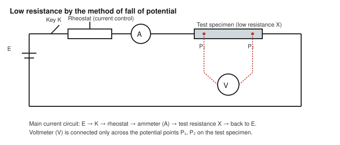

# Determination of the Value of Low Resistance by the Method of Fall of Potential

## Aim

To determine the value of a given low resistance $X$ (of the order of a few ohms or less) by the method of fall of potential.

## Apparatus / Equipment

- Given low resistance / resistance wire $X$
- DC battery / battery eliminator (low EMF, capable of supplying a few amperes)
- Ammeter (0–3 A or similar range, appropriate least count)
- Voltmeter of low range (0–1 V or millivoltmeter, appropriate least count) — or, where available, a potentiometer used as the potential-measuring instrument
- Rheostat for current control
- Plug key
- Commutator (current reversing key)
- Connecting wires (thick, low-resistance copper leads for the main current circuit)

## Principle / Theory

For a resistance of only a few ohms or a fraction of an ohm, the resistance of the connecting leads and of the contacts becomes comparable with the resistance being measured, so a simple two-terminal ammeter–voltmeter connection (as used for medium resistances) gives a result contaminated by lead and contact resistance. The **method of fall of potential** overcomes this by using **four terminals** on the test specimen: two outer "current" terminals, through which the measuring current is passed, and two inner "potential" terminals, across which the potential difference is measured. Because a voltmeter of sufficiently high resistance draws negligible current, the potential difference measured between the inner terminals is very nearly the true potential drop across just that section of the specimen, independent of the resistance of the current leads and of the contacts at the outer terminals.

By Ohm's law, if a steady current $I$ flows through the test resistance $X$ (the section between the potential terminals) and the potential difference across this section is $V$, then

$$
X = \frac{V}{I}
$$

The current is supplied from a battery through a rheostat (for current control) and is measured by an ammeter in the main circuit; the potential drop is measured by a voltmeter (or a potentiometer, for greater accuracy at very low resistances) connected only between the two inner potential terminals of the specimen.

## Formula / Working Equation

$$
X = \frac{V}{I}
$$

where $V$ is the potential difference (fall of potential) between the two potential terminals of the test specimen, and $I$ is the current flowing through it, measured simultaneously.

## Experimental Setup

The test specimen $X$ is fitted with two heavy current terminals at its ends, through which the main circuit current (battery, rheostat, ammeter, key) flows, and two thinner potential terminals at fixed points along its length, between the current terminals, across which the voltmeter is connected. The main current circuit and the voltmeter connections are kept electrically separate except at the specimen itself, so that the voltmeter reads only the potential drop across the segment of the specimen between the two potential terminals, unaffected by the resistance of the thick current leads or the current-terminal contacts.

## Diagram / Experimental Arrangement

## Procedure

1. Connect the circuit as shown: battery, key, rheostat, ammeter, and the current terminals of the test specimen $X$, all in series to form the main current circuit. Connect the voltmeter separately across the two potential terminals of the specimen only.
2. Check all connections for tightness, particularly at the current terminals of the specimen, since a loose contact here introduces an additional, variable resistance in the main circuit (though this does not affect $V$ or $I$ directly, it can cause current instability).
3. With the rheostat set for minimum current, close the key and gradually increase the current to a small, safe value; note the ammeter reading $I$ and the corresponding voltmeter reading $V$ simultaneously.
4. Reverse the current using the commutator and repeat the reading of $I$ and $V$; this checks for and helps eliminate any small thermoelectric EMF at the contacts, which would otherwise introduce a systematic error at very low voltages.
5. Increase the current in suitable steps (using the rheostat) and note $I$ and $V$ at five to six different current settings, always keeping the current within a safe limit for the specimen and the ammeter (avoid excessive heating of the specimen, which would change its resistance).
6. For each setting, take the mean of the direct and reversed-current readings of $V$ (and of $I$, if it differs slightly) before proceeding to calculation.
7. Open the key between readings if the specimen shows any tendency to heat up, to allow it to return to room temperature.

## Observation Table

| Trial | Ammeter reading $I$ (A), direct | Ammeter reading $I$ (A), reversed | Mean $I$ (A) | Voltmeter reading $V$ (V), direct | Voltmeter reading $V$ (V), reversed | Mean $V$ (V) |
|:-----:|:---------------------------------:|:-------------------------------------:|:---------------:|:-------------------------------------:|:----------------------------------------:|:----------------:|
| 1     |                                    |                                        |                 |                                        |                                            |                  |
| 2     |                                    |                                        |                 |                                        |                                            |                  |
| 3     |                                    |                                        |                 |                                        |                                            |                  |
| 4     |                                    |                                        |                 |                                        |                                            |                  |
| 5     |                                    |                                        |                 |                                        |                                            |                  |

> Example / illustrative reading only — not an experimental result: for mean $I = 1.50$ A and mean $V = 0.096$ V, the working equation below would be applied numerically in exactly this way.

## Calculations

For each trial:

$$
X = \frac{V}{I} = \_\_\_\_ \ \Omega
$$

Compute $X$ for all trials and take the mean:

$$
X_{\text{mean}} = \frac{X_1 + X_2 + \dots + X_5}{5} = \_\_\_\_ \ \Omega
$$

## Graph

Plot the mean voltmeter reading $V$ (y-axis) against the mean ammeter reading $I$ (x-axis) for all trials. Since $V = IX$, the graph should be a straight line passing through the origin, and its slope directly gives the resistance:

$$
X = \text{slope of the } V\text{–}I \text{ graph} = \frac{\Delta V}{\Delta I}
$$

Taking $X$ from the slope of a straight-line graph (rather than from a single pair of readings, or even the mean of several separately-calculated ratios) reduces the effect of random reading errors in individual observations, since it uses all the data points together.

## Result

Therefore, the value of the given low resistance, determined by the method of fall of potential, is:

$$
X = \_\_\_\_ \ \Omega \quad \text{(from mean of } V/I\text{)}
$$

$$
X = \_\_\_\_ \ \Omega \quad \text{(from the slope of the } V\text{–}I \text{ graph)}
$$

## Precautions and Sources of Error

- Always connect the voltmeter across the inner potential terminals only, never across the outer current terminals, so that lead and contact resistance are excluded from the measurement.
- Use thick, short leads of low resistance for the main current circuit to minimise unnecessary voltage drop elsewhere in the circuit (this does not affect the result directly, since only $V$ across the specimen and $I$ through it matter, but excessive circuit resistance limits the current available).
- Keep the current small enough that the specimen does not heat up appreciably during a reading, since heating changes its resistance; switch off the key between readings if necessary.
- Take readings with both direct and reversed current and use the mean, to eliminate any small thermoelectric EMF at the metal contacts, which would otherwise bias a low-voltage reading.
- Ensure all terminal connections are clean and tight, particularly at the current terminals, to avoid unstable or drifting current readings.
- Read the ammeter and voltmeter simultaneously, without parallax, and take several sets of readings over a range of currents rather than relying on a single reading.
- Do not confuse this four-terminal method with two-terminal bridge methods (Wheatstone bridge, meter bridge, Carey Foster bridge, Kelvin double bridge); those are separate techniques and are not used in this experiment, though the Kelvin double bridge is built on the same four-terminal principle for still lower resistances.

## Sources / References

- Undergraduate physics laboratory manuals on the "determination of low resistance by the method of fall of potential" (four-terminal / Ohm's-law method), as used in standard B.Sc./engineering physics practical courses.
- Standard experimental physics texts on the measurement of low resistances and the rationale for four-terminal (Kelvin-type) connections.
