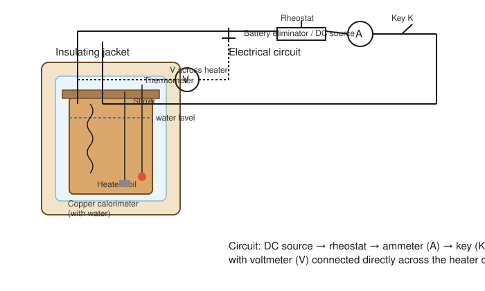

# Determination of the Mechanical Equivalent of Heat by Electrical Calorimeter

## Aim

To determine the mechanical equivalent of heat, $J$, using an electrical calorimeter, by converting a known amount of electrical energy into heat and measuring the corresponding temperature rise of water.

## Apparatus / Equipment

- Electrical (Joule's) calorimeter with copper vessel, insulating jacket, wooden lid, and stirrer
- Immersion heater coil (low resistance, insulated leads)
- Regulated DC power supply / battery eliminator
- Ammeter (0–2 A) and voltmeter (0–10 V), both of suitable range and accuracy class
- Rheostat for current control
- Plug key
- Stop-clock / stop-watch
- Half-degree Celsius thermometer (least count 0.1 °C or 0.2 °C)
- Physical balance / digital balance
- Connecting wires

## Principle / Theory

When electric current $I$ flows through a resistor (heater coil) for time $t$ under a potential difference $V$, the electrical energy dissipated as heat is

$$
W = VIt \quad \text{(joules)}
$$

This electrical energy heats the water and the calorimeter (vessel + stirrer, both of the same material) from an initial temperature $\theta_1$ to a final temperature $\theta_2$. If

- $m_1$ = mass of water taken in the calorimeter (g)
- $m_2$ = mass of the calorimeter and stirrer (g)
- $s_1$ = specific heat of water $= 1\ \text{cal g}^{-1}\,^{\circ}\text{C}^{-1}$
- $s_2$ = specific heat of the calorimeter material (cal g⁻¹ °C⁻¹)
- $\Delta\theta = \theta_2 - \theta_1$ = rise in temperature (°C)

then the heat absorbed by the water and calorimeter, expressed in calories, is

$$
H = (m_1 s_1 + m_2 s_2)\,\Delta\theta
$$

The term $m_2 s_2$ is the **water equivalent** of the calorimeter — the mass of water that would absorb the same heat as the calorimeter for the same temperature rise.

Since the electrical energy $W$ (in joules) and the heat produced $H$ (in calories) represent the same physical process expressed in two different units, the mechanical equivalent of heat is defined as the number of joules of work equivalent to one calorie of heat:

$$
J = \frac{W}{H} = \frac{VIt}{(m_1 s_1 + m_2 s_2)\,\Delta\theta} \qquad \text{(J/cal)}
$$

For a well-lagged calorimeter and a short heating interval, heat lost to the surroundings by radiation and convection is small and is neglected in this experiment; the apparatus is designed (insulating jacket, air gap, close-fitting wooden lid) specifically to minimise this loss.

## Formula / Working Equation

$$
J = \frac{VIt}{(m_1 s_1 + m_2 s_2)(\theta_2 - \theta_1)}
$$

where all symbols are as defined above, $V$ in volts, $I$ in amperes, $t$ in seconds, masses in grams, and specific heats in cal g⁻¹ °C⁻¹.

## Experimental Setup

The electrical calorimeter consists of a copper vessel placed inside an outer insulating jacket, separated by an air gap, to reduce heat exchange with the surroundings. A wooden lid with three holes carries the heater coil, the stirrer, and the thermometer, all dipping into the water. The heater coil is connected in series with an ammeter, a rheostat, a plug key, and the DC source; a voltmeter is connected directly across the heater coil terminals to read the potential difference across it (and not across the whole circuit, so that lead and contact resistances outside the coil are excluded from the measurement). The stirrer is used to keep the water at a uniform temperature throughout the run, and the thermometer bulb is kept fully immersed, close to the heater, without touching the coil or the vessel wall.

## Diagram / Experimental Arrangement

## Procedure

1. Clean and dry the calorimeter vessel. Weigh it empty (with stirrer) using the balance; record this as $m_2$.
2. Fill the calorimeter about two-thirds full with water at a temperature a few degrees below room temperature, so that the final temperature after heating ends a comparable number of degrees above room temperature (this partly compensates for any residual heat exchange with the surroundings). Weigh the calorimeter with water; the difference gives $m_1$, the mass of water.
3. Place the calorimeter in its insulating jacket and fit the lid carrying the heater, stirrer, and thermometer. Ensure the heater coil and thermometer bulb are fully immersed but not touching each other or the vessel.
4. Connect the circuit as shown in the diagram: DC source, rheostat, ammeter, and key in series with the heater coil, and the voltmeter connected across the heater coil terminals.
5. With the key open, stir the water gently and note the initial steady temperature $\theta_1$.
6. Close the key and simultaneously start the stop-clock. Adjust the rheostat to obtain a steady, moderate current (as specified by the instructor) and keep it constant throughout the run by monitoring the ammeter.
7. Stir the water continuously and gently at regular intervals throughout heating to maintain uniform temperature and avoid local overheating near the coil.
8. Note the ammeter reading $I$ and voltmeter reading $V$ at regular intervals; confirm both remain sensibly constant. Record the mean values.
9. Continue heating until the temperature has risen by a reasonable, measurable amount (typically 8–10 °C above $\theta_1$), then open the key and simultaneously stop the clock; record the heating time $t$.
10. Keep stirring for a short while after switching off and note the highest steady temperature reached, $\theta_2$ (the temperature may continue to rise slightly for a few seconds due to heat stored in the coil and vessel walls; record the maximum steady reading).
11. Repeat the experiment for two more sets of readings with a different current each time, keeping other conditions the same.
12. Look up the specific heat of the calorimeter material (copper) from a standard reference, $s_2$, for use in the calculation.

## Observation Table

**Mass of calorimeter + stirrer, $m_2$ = ______ g**
**Mass of water taken, $m_1$ = ______ g**
**Specific heat of calorimeter material, $s_2$ = ______ cal g⁻¹ °C⁻¹**

| Trial | Voltmeter reading $V$ (V) | Ammeter reading $I$ (A) | Time of heating $t$ (s) | Initial temp. $\theta_1$ (°C) | Final temp. $\theta_2$ (°C) | Rise $\Delta\theta$ (°C) |
|:-----:|:--------------------------:|:------------------------:|:-------------------------:|:------------------------------:|:-----------------------------:|:--------------------------:|
| 1     |                             |                           |                            |                                 |                                |                             |
| 2     |                             |                           |                            |                                 |                                |                             |
| 3     |                             |                           |                            |                                 |                                |                             |

> Example / illustrative reading only — not an experimental result: for $V = 4.0$ V, $I = 1.2$ A, $t = 420$ s, $m_1 = 150$ g, $m_2 = 40$ g, $s_2 = 0.095$ cal g⁻¹ °C⁻¹, and $\Delta\theta = 9.0\,^{\circ}\text{C}$, the working equation below would be applied numerically in exactly this way.

## Calculations

For each trial, compute the electrical energy supplied and the heat gained, then $J$:

$$
W = VIt \quad \text{(J)}
$$

$$
H = (m_1 s_1 + m_2 s_2)\,\Delta\theta \quad \text{(cal)}
$$

$$
J = \frac{W}{H} = \frac{VIt}{(m_1 s_1 + m_2 s_2)\,\Delta\theta} \quad \text{(J/cal)}
$$

Trial 1: $J_1 =$ ______ J/cal
Trial 2: $J_2 =$ ______ J/cal
Trial 3: $J_3 =$ ______ J/cal

Mean value:

$$
J_{\text{mean}} = \frac{J_1 + J_2 + J_3}{3} = \_\_\_\_ \text{ J/cal}
$$

## Result

Therefore, the mechanical equivalent of heat, determined by the electrical calorimeter method, is:

$$
J = \_\_\_\_ \text{ J/cal}
$$

The standard accepted value is $J \approx 4.186\ \text{J/cal}$; the percentage deviation of the experimental value from this standard value may be calculated and reported.

## Precautions and Sources of Error

- Keep the calorimeter well lagged and use the insulating jacket properly seated, to minimise heat loss by radiation and convection.
- Stir continuously and gently throughout heating so that the thermometer reads a representative, uniform water temperature.
- Take voltmeter and ammeter readings at the same instant, and check that the current stays sensibly constant during the run; if it drifts, use the mean value.
- Ensure the heater coil is completely and only immersed in water; it must not touch the calorimeter wall or run dry, and its resistance must not change due to overheating.
- Start with the initial water temperature a little below room temperature so that heat gained from and lost to the surroundings roughly compensate over the run.
- Note the maximum steady temperature after switching off, since the water and calorimeter continue to equilibrate for a short time.
- Read the thermometer without parallax and avoid touching its bulb against the coil or vessel.
- Use ammeter and voltmeter of appropriate range so that readings are taken over a good part of the scale, minimising reading error.

## Sources / References

- Undergraduate physics laboratory manuals on the "Joule's electrical calorimeter" / "mechanical equivalent of heat by electrical method" experiment, as used in standard B.Sc./engineering physics practical courses.
- Standard experimental physics practical texts covering calorimetry and the electrical determination of $J$.
- Reference value of $J$ from standard physics data tables ($J \approx 4.186\ \text{J/cal}$, consistent with the modern definition of the calorie).
