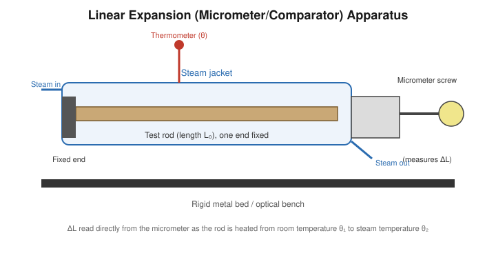

# Determination of the Coefficient of Linear Expansion of a Solid

## Aim

To determine the coefficient of linear expansion (α) of the material of a given solid rod using a linear expansion (steam-jacket / micrometer) apparatus.

## Apparatus / Equipment

- Linear expansion apparatus with steam jacket and micrometer screw gauge (least count 0.01 mm)
- Test rod (glass, brass, copper, or steel), fixed at one end
- Steam generator with rubber delivery tubing
- Thermometer (0–110 °C, least count 0.5 °C)
- Metre scale (to measure rod length)
- Stand, clamp, spirit level

## Principle / Theory

When a solid rod is heated, its length increases nearly linearly with the rise in temperature, provided the temperature range is not too large. If a rod of initial length $L_0$ at temperature $\theta_1$ is heated to a temperature $\theta_2$, its length becomes $L$, where the increase in length $\Delta L = L - L_0$ is found experimentally to be proportional to $L_0$ and to the temperature rise $\Delta T = \theta_2 - \theta_1$.

The constant of proportionality is called the **coefficient of linear expansion**, defined as the fractional increase in length per unit rise in temperature:

$$
\alpha = \frac{1}{L_0}\left(\frac{\partial L}{\partial T}\right)
$$

For a finite, small temperature interval this is written in the working (average) form used in this experiment.

**Symbols**

| Symbol | Meaning | SI unit |
|---|---|---|
| $L_0$ | Initial length of rod at room temperature $\theta_1$ | m |
| $\Delta L$ | Increase in length | m |
| $\theta_1, \theta_2$ | Initial and final temperature | °C |
| $\Delta T = \theta_2-\theta_1$ | Temperature rise | K (or °C) |
| $\alpha$ | Coefficient of linear expansion | K$^{-1}$ |

$\alpha$ is a material property; it is assumed constant over the working temperature range (room temperature to ~100 °C), which is valid for metals to a good approximation.

## Formula / Working Equation

$$
\alpha = \frac{\Delta L}{L_0 \, \Delta T}
$$

## Experimental Setup

The rod is held horizontally inside a double-walled steam jacket. One end of the rod is rigidly fixed against a stop; the other end bears against the spindle of a micrometer screw gauge, so that any expansion of the rod pushes the spindle outward by an amount equal to $\Delta L$. Steam passed through the jacket raises the rod uniformly to steam temperature, while a thermometer inserted into the jacket records the temperature close to the rod.

## Diagram / Experimental Arrangement

## Procedure

1. Measure the length $L_0$ of the rod (between the fixed stop and the micrometer spindle) using a metre scale, at room temperature $\theta_1$.
2. Insert the rod into the apparatus. Ensure the free end touches the micrometer spindle without strain, and the fixed end is firmly against its stop.
3. Note the room temperature $\theta_1$ from the thermometer and record the **initial micrometer reading**, $M_1$ (with due allowance for zero error).
4. Connect the steam generator to the jacket inlet and pass steam continuously, allowing the condensed water to drain from the outlet.
5. Allow the system to reach a **steady state**: the rod is in thermal equilibrium with the steam when the thermometer reading and the micrometer reading both remain constant for 4–5 minutes.
6. Note the steady temperature $\theta_2$ (should be close to, but generally slightly below, 100 °C depending on atmospheric pressure) and the **final micrometer reading**, $M_2$.
7. Compute $\Delta L = M_2 - M_1$ (correcting for any zero error of the micrometer).
8. Repeat the heating–cooling cycle two or three times to check reproducibility of $\Delta L$.
9. Stop the steam supply and allow the apparatus to cool before dismantling.

## Observation Table

**Zero error of micrometer** = ______ mm

| Trial | $L_0$ (m) | $\theta_1$ (°C) | $\theta_2$ (°C) | $M_1$ (mm) | $M_2$ (mm) | $\Delta L$ (mm) | $\Delta T$ (°C) |
|---|---|---|---|---|---|---|---|
| 1 | | | | | | | |
| 2 | | | | | | | |
| 3 | | | | | | | |

## Calculations

For each trial,

$$
\alpha = \frac{\Delta L}{L_0\,\Delta T}
$$

Substituting the observed values (with $\Delta L$ converted to metres):

$$
\alpha = \frac{(\_\_\_\_\_\ \text{m})}{(\_\_\_\_\_\ \text{m})\times(\_\_\_\_\_\ \text{K})} = \_\_\_\_\_\ \text{K}^{-1}
$$

Take the mean of $\alpha$ from all trials:

$$
\alpha_{\text{mean}} = \_\_\_\_\_\ \text{K}^{-1}
$$

## Result

The coefficient of linear expansion of the material of the given rod is:

$$
\alpha = \_\_\_\_\_ \times 10^{-6}\ \text{K}^{-1}
$$

## Precautions

- The rod must be free to expand; it should not be gripped tightly at the micrometer end, or the reading will be affected by mechanical strain.
- Avoid parallax while noting the thermometer and micrometer readings.
- Wait for a truly steady state before recording the final reading — a premature reading underestimates $\Delta L$.
- Keep the micrometer spindle in light, constant contact with the rod throughout (no backlash).
- Ensure the jacket is well insulated so that the rod attains a uniform temperature along its length.
- Do not touch the hot jacket or allow steam to escape near the observer.

## Sources / References

- Searle, G. F. C., *Practical Physics* — standard treatment of linear expansion apparatus.
- University physics laboratory manuals on determination of the coefficient of linear expansion using steam-jacket/micrometer apparatus.
- Worsnop, B. L. and Flint, H. T., *Advanced Practical Physics for Students*.
