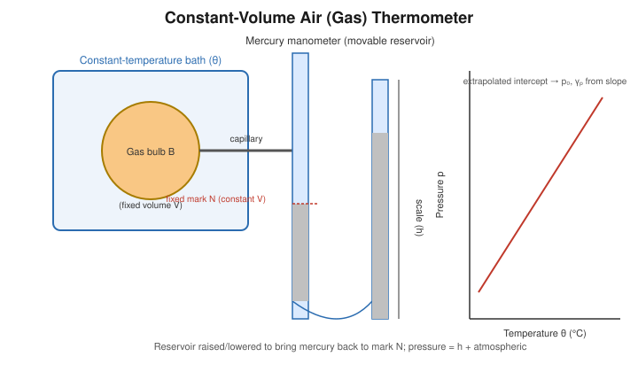

# Determination of the Pressure Coefficient of a Gas at Constant Volume by Constant-Volume Air Thermometer

## Aim

To determine the pressure coefficient of air at constant volume using a constant-volume gas (air) thermometer.

## Apparatus / Equipment

- Constant-volume air thermometer: a gas bulb connected via capillary tubing to a mercury manometer with a movable reservoir limb, mounted on a scale
- Ice bath (melting ice) and a hypsometer (steam apparatus) for the two reference temperatures
- A third constant-temperature bath (e.g. warm water bath with thermometer) for an intermediate/extrapolation check, if required
- Barometer, metre scale, thermometer
- Retort stand and clamps

## Principle / Theory

A **constant-volume gas thermometer** uses the pressure of a fixed mass of gas, kept at a strictly constant volume, as the thermometric property. For an ideal gas at constant volume, pressure increases linearly with absolute temperature (Gay-Lussac's law):

$$
p = p_0\left(1+\gamma_p\, t\right)
$$

where $t$ is the temperature in degrees Celsius, $p_0$ is the pressure at $0\,^\circ$C, and $\gamma_p$ is the **pressure coefficient at constant volume** — the fractional increase in pressure per degree rise in temperature:

$$
\gamma_p = \frac{1}{p_0}\left(\frac{\Delta p}{\Delta T}\right)_{V}
$$

In the apparatus, the gas is enclosed in a bulb of fixed volume connected to a mercury manometer. As the bulb's temperature changes, the gas tends to expand or contract; the movable reservoir limb of the manometer is raised or lowered so that the mercury level in the fixed (bulb-side) limb always returns to a **fixed reference mark**, thereby keeping the gas volume genuinely constant. The pressure of the enclosed gas is then obtained from the **difference in mercury levels** between the two limbs, added to (or subtracted from) the measured atmospheric pressure, depending on the manometer's configuration.

For an ideal gas, $\gamma_p$ is the same as the coefficient of volume expansion at constant pressure and is very close to $1/273.15\ \text{K}^{-1}$; a plot of $p$ against $t$ is a straight line whose backward extrapolation to $p=0$ gives an estimate of absolute zero.

**Symbols**

| Symbol | Meaning | Unit |
|---|---|---|
| $p_0$ | Pressure of the enclosed gas at $0\,^\circ$C (ice point) | Pa (or mmHg) |
| $p_{100}$ | Pressure of the enclosed gas at $100\,^\circ$C (steam point) | Pa (or mmHg) |
| $p$ | Pressure at any general temperature $t$ | Pa (or mmHg) |
| $\gamma_p$ | Pressure coefficient of the gas at constant volume | K$^{-1}$ |
| $V$ | Volume of the gas (held constant, fixed by the reference mark) | m³ |

## Formula / Working Equation

$$
p_{100} = p_0(1+100\,\gamma_p)
$$

$$
\boxed{\gamma_p = \dfrac{p_{100}-p_0}{100\,p_0}}
$$

More generally, for the gas at any measured temperature $t$ and corresponding pressure $p$:

$$
\gamma_p = \frac{p-p_0}{p_0\, t}
$$

## Experimental Setup

The gas bulb is immersed successively in a melting-ice bath and in the steam of a hypsometer, and its constant-volume pressure is read at each. The manometer's movable limb is adjusted each time so that the mercury in the fixed limb sits exactly at the reference mark, ensuring the gas volume never changes during the measurement. The height difference between the mercury columns, combined with the barometric pressure, gives the absolute gas pressure at that temperature.

## Diagram / Experimental Arrangement

## Procedure

1. Note the room temperature and the atmospheric pressure from the barometer.
2. Surround the gas bulb with crushed melting ice so that it attains a steady temperature of $0\,^\circ$C.
3. Adjust the movable reservoir of the manometer until the mercury level in the fixed (bulb-side) limb exactly touches the reference mark, ensuring the gas is at its defined constant volume.
4. Read the levels of mercury in both limbs of the manometer; compute the pressure of the enclosed gas, $p_0$, from the level difference and the atmospheric pressure.
5. Remove the ice bath and surround the bulb with steam from the hypsometer, allowing it to reach a steady $100\,^\circ$C (correcting for pressure if the barometric reading departs from standard, if required).
6. Again adjust the movable reservoir so the fixed-limb mercury level returns exactly to the reference mark; read the manometer and compute $p_{100}$.
7. (Optional, for the graph) Repeat the level-adjustment and pressure measurement at one or two intermediate known temperatures (e.g. a warm-water bath at a measured thermometer reading), always restoring the gas to the same fixed volume before reading.
8. Tabulate $t$ against $p$ for all points measured.

## Observation Table

**Atmospheric pressure** = ______ mmHg &nbsp;&nbsp; **Reference (fixed) volume mark position** = ______

| Bath | Temperature, $t$ (°C) | Mercury level, fixed limb (mm) | Mercury level, movable limb (mm) | Level difference, $h$ (mm) | Gas pressure, $p$ (mmHg) |
|---|---|---|---|---|---|
| Melting ice | 0 | | | | |
| Warm bath (optional) | | | | | |
| Steam | 100 | | | | |

## Calculations

$$
\gamma_p = \frac{p_{100}-p_0}{100\,p_0}
$$

$$
\gamma_p = \frac{(\_\_\_\_\_)-(\_\_\_\_\_)}{100\times(\_\_\_\_\_)} = \_\_\_\_\_\ \text{K}^{-1}
$$

## Graph

Plot gas pressure $p$ (y-axis) against temperature $t$ in °C (x-axis) for all the recorded points.

- **Expected relationship:** a straight line, in accordance with $p = p_0(1+\gamma_p t)$.
- **Meaning of slope and intercept:** the intercept on the $p$-axis (at $t=0$) gives $p_0$; the slope of the line equals $p_0\gamma_p$, from which $\gamma_p$ can be found independently as a graphical check on the calculated value.
- **Extrapolation:** extending the straight line backward to $p=0$ gives the temperature intercept on the $t$-axis, which is an experimental estimate of absolute zero ($\approx -273\,^\circ$C).

## Result

The pressure coefficient of air at constant volume is found to be:

$$
\gamma_p = \_\_\_\_\_\ \text{K}^{-1}
$$

(to be compared with the standard value, $\gamma_p \approx \dfrac{1}{273.15}\ \text{K}^{-1} = 3.66\times10^{-3}\ \text{K}^{-1}$).

## Precautions

- Always bring the mercury level in the fixed limb back exactly to the reference mark before taking a pressure reading, so that the gas volume is genuinely held constant throughout.
- Allow adequate time for the gas bulb to reach thermal equilibrium with the surrounding bath before each reading.
- Avoid any leakage of gas from the bulb or connecting tubing, which would cause a systematic drift in readings.
- Take manometer readings without parallax, and record the ambient temperature/pressure for possible corrections.
- Keep the capillary connecting tube itself outside the bath as far as possible, so that only the bulb's gas (and not the gas in the connecting tube) is at the bath temperature — otherwise a "dead-space" correction becomes necessary.
- Handle mercury carefully and avoid spillage.

## Sources / References

- Standard undergraduate physics laboratory manuals on the constant-volume gas (air) thermometer and the pressure coefficient of gases.
- Gay-Lussac's law and the definition of the pressure coefficient at constant volume — standard thermal-physics textbook treatment.
- Classical treatments of gas thermometry and the extrapolation to absolute zero.
