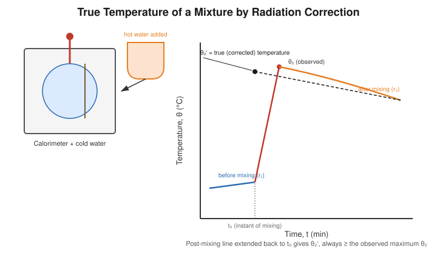

# Determination of the True Temperature of a Mixture by Radiation Correction

## Aim

To determine, by the graphical method, the true (corrected) temperature that a calorimetric mixture would have attained had there been no exchange of heat with the surroundings during the experiment.

## Apparatus / Equipment

- Copper calorimeter with stirrer, in an insulating jacket
- Hot water (or a hot solid, as available) to mix with cold water in the calorimeter
- Sensitive thermometer (0.1 °C least count)
- Stopwatch
- Physical/digital balance
- Graph paper

## Principle / Theory

In every method-of-mixtures experiment, the observed maximum temperature $\theta_2$ read directly on the thermometer is **not** the temperature that would result from an ideal, perfectly insulated mixing process, because the calorimeter is losing heat to (or occasionally gaining heat from) the surroundings throughout the process — both while the temperature is rising and immediately after the maximum is reached. The **true (corrected) temperature of mixture**, $\theta_2'$, is the temperature the system would have shown at the instant of mixing if the process had been instantaneous and heat-loss-free.

This experiment isolates and studies this correction itself, independent of any specific specific-heat determination. A calorimeter containing cold water is monitored as its temperature is raised by adding a known quantity of hot water (or a hot solid); the **temperature–time curve** is recorded continuously — before, during, and after the mixing — and analysed as follows:

1. Before mixing, the calorimeter's temperature changes only slowly, at a small, steady rate $r_1$ (due to its own slight departure from room temperature).
2. During mixing, the temperature rises rapidly to an observed maximum $\theta_2$ at time $t_2$.
3. After the maximum, the calorimeter cools slowly at a steady rate $r_2$ due to loss of heat to the (cooler) surroundings.

Because the *observed* maximum is reached only after some heat has already leaked out during the (finite-duration) rise, the true temperature $\theta_2'$ that would have been reached instantaneously is slightly **higher** than $\theta_2$ (when the surroundings are cooler than the mixture) and is found either by:

- **(a) Rate correction:** adding a small correction $d\theta = \frac{r_2}{2}(t_2-t_0)$ to $\theta_2$, where $(t_2 - t_0)$ is the time taken for the temperature to rise from the start of mixing ($t_0$) to the observed maximum ($t_2$); or
- **(b) Graphical extrapolation:** plotting the full temperature–time curve and extending the steady post-mixing cooling line **backward in time**, as a straight line, to the instant of mixing $t_0$. The temperature at which this extrapolated line intersects $t_0$ is read off as $\theta_2'$.

The graphical method (b) is preferred wherever a good set of post-mixing readings is available, since it does not assume any particular functional form for the loss beyond a locally linear cooling trend.

**Symbols**

| Symbol | Meaning |
|---|---|
| $\theta_2$ | Observed maximum (uncorrected) temperature |
| $\theta_2'$ | True/corrected temperature of mixture |
| $r_1$ | Rate of temperature change before mixing (°C/min) |
| $r_2$ | Rate of cooling after mixing (°C/min) |
| $t_0$ | Instant at which mixing begins |
| $t_2$ | Instant at which the observed maximum occurs |

## Formula / Working Equation

$$
\boxed{\theta_2' = \theta_2 + \frac{r_2}{2}(t_2-t_0)}
$$

or, graphically, $\theta_2'$ = ordinate of the backward-extrapolated post-mixing cooling line at $t=t_0$.

## Experimental Setup

A calorimeter with a known mass of water is suspended inside an enclosure and its temperature recorded continuously with time using a thermometer and stopwatch, while a known mass of hot water (or a pre-heated solid) is added at a noted instant. The resulting full temperature–time record — before, during, and after mixing — is used purely to construct and interpret the correction, rather than to compute a specific heat.

## Diagram / Experimental Arrangement

## Procedure

1. Weigh the calorimeter with stirrer and add a known mass of water a few degrees below room temperature; note this initial temperature.
2. Suspend the calorimeter in its enclosure and start the stopwatch; record the temperature at 1-minute intervals for about 5 minutes to establish the **pre-mixing** trend ($r_1$).
3. At a noted instant $t_0$, quickly add a known mass of hot water (or a pre-heated solid) and stir continuously.
4. Record the temperature at short intervals (e.g. every 15–30 s) as it rises, and note the time $t_2$ and value $\theta_2$ at which the **maximum** is reached.
5. Continue recording the temperature at 1-minute intervals for 8–10 minutes **after** the maximum, to obtain a well-defined **post-mixing** cooling trend ($r_2$).
6. Plot the complete temperature–time graph.
7. Draw a straight line through the post-mixing (cooling) points and extend it backward until it meets the vertical line $t=t_0$; read off the corresponding temperature as $\theta_2'$.
8. Cross-check this graphical value against the value obtained from the rate-correction formula.

## Observation Table

**Mass of calorimeter + stirrer** = ______ kg &nbsp;&nbsp; **Mass of cold water** = ______ kg &nbsp;&nbsp; **Mass of hot water/solid added** = ______ kg

| Time (min) | Temperature (°C) | Remarks (before / during / after mixing) |
|---|---|---|
| | | |
| | | |
| | | |
| | | |
| | | |
| | | |
| | | |

## Calculations

**From the graph:**
$$
\theta_2' \text{ (extrapolated)} = \_\_\_\_\_\ ^\circ\text{C}
$$

**From the rate formula:**
$$
\theta_2' = \theta_2 + \frac{r_2}{2}(t_2-t_0) = \_\_\_\_\_ + \frac{\_\_\_\_\_}{2}(\_\_\_\_\_) = \_\_\_\_\_\ ^\circ\text{C}
$$

## Graph

Plot temperature $\theta$ (y-axis) against time $t$ (x-axis) for the whole run.

- **Expected shape:** a nearly flat pre-mixing segment, a sharp rise during mixing, and a nearly straight, slowly falling post-mixing segment.
- **Use of the graph:** extend the post-mixing straight-line segment backward to the vertical line through the mixing instant $t_0$; its ordinate there is the **true (corrected) temperature** $\theta_2'$ — distinct from, and slightly higher than, the observed maximum $\theta_2$ actually read on the thermometer.

## Result

The observed maximum temperature of the mixture was $\theta_2 = \_\_\_\_\_\ ^\circ$C, and the true (radiation-corrected) temperature of the mixture is:

$$
\theta_2' = \_\_\_\_\_\ ^\circ\text{C}
$$

## Precautions

- Take temperature–time readings at strictly regular, pre-decided intervals throughout — before, during, and after mixing — so that both the pre- and post-mixing trends are well defined.
- Stir continuously and gently for a uniform temperature throughout the calorimeter.
- Make the mixing as rapid as practicable, so that the "during-mixing" interval $(t_2-t_0)$ over which correction is needed is kept small.
- Avoid draughts, direct sunlight, or nearby heat sources that would distort the steady pre- or post-mixing cooling trends.
- Use a thermometer with adequate sensitivity and check it for parallax at each reading.

## Sources / References

- 1911 *Encyclopædia Britannica*, "Calorimetry" — radiation-loss correction and graphical treatment.
- University of Toronto Physics Laboratory — Newton's-law-of-cooling correction technique.
- SchoolPhysics — "The cooling correction", graphical extrapolation method.
