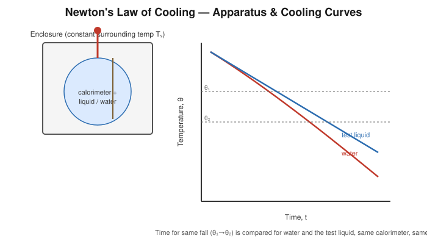

# Determination of the Specific Heat of a Liquid by the Method of Cooling

## Aim

To determine the specific heat capacity of a given liquid by comparing its rate of cooling with that of water, using Newton's law of cooling.

## Apparatus / Equipment

- Copper calorimeter with stirrer, suspended inside a double-walled enclosure (constant-temperature surroundings)
- Given liquid, and water (as the reference liquid of known specific heat)
- Thermometer (0.1 °C least count)
- Stopwatch
- Physical/digital balance
- Heating arrangement to initially warm the liquids a few degrees above the starting temperature

## Principle / Theory

**Newton's law of cooling** states that the rate of loss of heat of a body is proportional to the excess of its temperature over that of the surroundings, provided this excess is small:

$$
\frac{d\theta}{dt} \propto (\theta-\theta_s)
$$

If equal volumes (hence, for the same calorimeter, corresponding masses) of two liquids are heated to the same initial temperature and allowed to cool under **identical conditions** — same calorimeter, same surface area exposed, same surrounding temperature $\theta_s$, same range of temperature fall — then, at any given temperature $\theta$, both lose heat at a rate governed by the *same* proportionality "constant" (which actually depends only on the exposed surface and the temperature excess, not on the nature of the liquid). Hence the heat lost per second by each liquid (together with the calorimeter) is the same function of $(\theta-\theta_s)$, and consequently:

$$
\frac{(m_1 s_1+m s_L)}{(m_1 s_1+m_w s_w)} = \frac{\left(\dfrac{d\theta}{dt}\right)_w}{\left(\dfrac{d\theta}{dt}\right)_L}
$$

Rather than comparing instantaneous rates, it is experimentally more reliable to compare the **time taken** for both liquids to cool through the *same* fixed temperature interval $(\theta_1\rightarrow\theta_2)$ under the same conditions; the ratio of these times replaces the ratio of the rates in the equation above.

**Symbols**

| Symbol | Meaning | SI unit |
|---|---|---|
| $m_1$ | Mass of (empty) calorimeter + stirrer | kg |
| $s_1$ | Specific heat of calorimeter material | J kg⁻¹K⁻¹ |
| $m_w$ | Mass of water taken | kg |
| $m$ | Mass of the given liquid taken (equal volume to water) | kg |
| $s_w$ | Specific heat of water $=4186\ \text{J kg}^{-1}\text{K}^{-1}$ | J kg⁻¹K⁻¹ |
| $s_L$ | Specific heat of the given liquid (to determine) | J kg⁻¹K⁻¹ |
| $t_w, t_L$ | Time taken by water and liquid respectively to cool through the same interval $\theta_1\to\theta_2$ | s |

## Formula / Working Equation

$$
(m_1 s_1 + m\, s_L)\,t_L^{-1} = (m_1 s_1 + m_w s_w)\,t_w^{-1}
$$

$$
\boxed{s_L = \dfrac{(m_1 s_1 + m_w s_w)\,t_L - m_1 s_1\, t_w}{m\, t_w}}
$$

(If the calorimeter's own heat capacity is small compared to that of the liquid it may be neglected as an approximation; the full form above is preferred for accuracy.)

## Experimental Setup

The same calorimeter (with stirrer) is used successively for water and for the test liquid, always filled to the **same volume/level**, so that the exposed cooling surface is identical in both cases. The calorimeter, suspended by non-conducting threads inside a constant-temperature enclosure (e.g. a large vessel of water, or still air in a draught-free box), is allowed to cool freely while its temperature is recorded against time using a stopwatch.

## Diagram / Experimental Arrangement

## Procedure

1. Weigh the empty calorimeter with stirrer to get $m_1$.
2. Fill it with the given liquid up to a fixed mark; weigh to obtain the mass $m$ of liquid taken; note the corresponding volume/level.
3. Heat the liquid (in the calorimeter, with occasional stirring) a few degrees above a convenient starting temperature $\theta_1$ (well above the surrounding temperature $\theta_s$).
4. Suspend the calorimeter inside the constant-temperature enclosure and start the stopwatch; record the temperature at fixed time intervals (e.g. every 30 s to 1 min) with continuous gentle stirring, as it cools.
5. Note the times at which the temperature passes through two fixed reference points, $\theta_1$ and $\theta_2$ (chosen well within the observed range), giving the cooling time $t_L$ for that interval.
6. Empty and dry the calorimeter thoroughly. Refill it to the **same level/volume** with water, so that the mass of water $m_w$ corresponds to the same exposed surface area.
7. Repeat steps 3–5 exactly for water under identical surrounding conditions ($\theta_s$ unchanged), obtaining the cooling time $t_w$ for the *same* temperature interval $\theta_1\to\theta_2$.
8. Plot temperature–time cooling curves for both liquids on the same axes for comparison.

## Observation Table

**Mass of calorimeter + stirrer, $m_1$** = ______ kg &nbsp;&nbsp; **Surrounding temperature, $\theta_s$** = ______ °C
**Mass of liquid, $m$** = ______ kg &nbsp;&nbsp; **Mass of water, $m_w$** = ______ kg
**Chosen interval:** $\theta_1$ = ______ °C, $\theta_2$ = ______ °C

| Time (s) | Temperature of liquid (°C) | Time (s) | Temperature of water (°C) |
|---|---|---|---|
| | | | |
| | | | |
| | | | |
| | | | |

| Quantity | Value |
|---|---|
| Time for liquid to cool $\theta_1\to\theta_2$, $t_L$ | |
| Time for water to cool $\theta_1\to\theta_2$, $t_w$ | |

## Calculations

$$
s_L = \frac{(m_1 s_1 + m_w s_w)\,t_L - m_1 s_1\, t_w}{m\, t_w}
$$

$$
s_L = \frac{[(\_\_\_\_\_)(\_\_\_\_\_)+(\_\_\_\_\_)(4186)](\_\_\_\_\_) - (\_\_\_\_\_)(\_\_\_\_\_)(\_\_\_\_\_)}{(\_\_\_\_\_)(\_\_\_\_\_)} = \_\_\_\_\_\ \text{J kg}^{-1}\text{K}^{-1}
$$

## Graph

Plot temperature $\theta$ (y-axis) against time $t$ (x-axis) for both water and the given liquid on the same graph.

- **Expected relationship:** an exponentially decaying curve for each liquid, both starting from the same $\theta_1$ and cooling towards $\theta_s$.
- **Use of the graph:** read off, for each curve, the time taken to fall from $\theta_1$ to $\theta_2$ ($t_L$ and $t_w$) directly from the graph, which smooths out random timing errors in the raw readings.

## Result

The specific heat capacity of the given liquid, determined by the method of cooling, is:

$$
s_L = \_\_\_\_\_\ \text{J kg}^{-1}\text{K}^{-1}
$$

## Precautions

- Use exactly the same calorimeter, same volume/level of liquid, and the same surrounding temperature for both liquids, so that the exposed surface area and cooling conditions are truly identical.
- Choose the temperature interval $\theta_1\to\theta_2$ well above the surrounding temperature so Newton's law of cooling remains a good approximation.
- Stir gently and continuously so the whole liquid mass cools uniformly (avoid vigorous stirring, which changes the effective surface heat-loss rate).
- Shield the apparatus from draughts and direct radiation.
- Make sure the calorimeter is completely dry before adding the new liquid, to avoid contamination or an incorrect mass.

## Sources / References

- Newton's law of cooling and the comparative-cooling method for specific heat of a liquid — standard undergraduate heat-laboratory treatment.
- SchoolPhysics — "Measurement of specific heat capacities" and cooling-correction background.
- USDA Soil & Water Conservation Research — derivation of Newton's law of cooling from the Stefan–Boltzmann law for small temperature excess.
