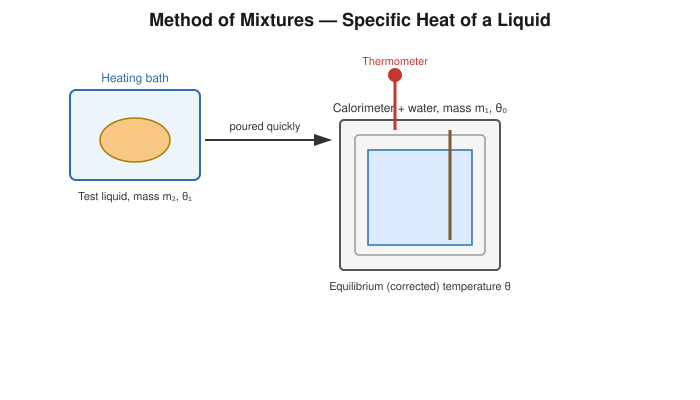
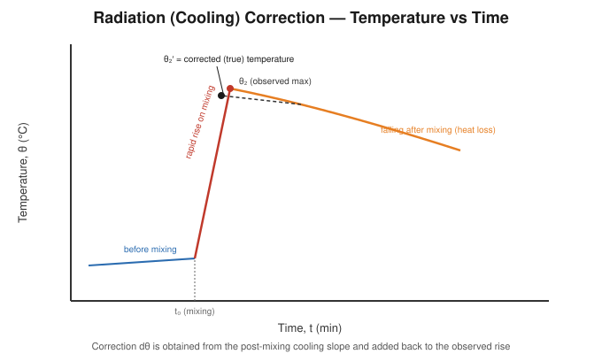

# Determination of the Specific Heat of a Liquid by the Method of Mixtures (with Radiation Correction)

## Aim

To determine the specific heat capacity of a given liquid by the method of mixtures, applying a correction for heat lost by radiation to the surroundings.

## Apparatus / Equipment

- Copper calorimeter with stirrer, in an insulating jacket
- Given liquid (immiscible with water, e.g. an oil, or the given test liquid as specified)
- Heating vessel and burner/hot plate
- Two thermometers (0.1 °C least count)
- Physical/digital balance
- Stopwatch
- Measuring cylinder

## Principle / Theory

Unlike Experiment 4, which compares *rates of cooling*, this experiment applies the direct **method of mixtures**: a known mass of the liquid, heated to a known higher temperature, is poured into a calorimeter containing a known mass of water (or vice-versa) at a lower temperature, and the resulting equilibrium temperature is measured. By conservation of energy, in an ideal (perfectly insulated) system,

$$
\text{Heat lost by the hot liquid} = \text{Heat gained by calorimeter + water}
$$

As in the solid-mixture experiment, the calorimeter continuously exchanges heat with its surroundings whenever its temperature differs from room temperature, so the observed equilibrium (maximum) temperature $\theta_2$ must be corrected for this radiation/convection loss to obtain the true mixture temperature $\theta_2'$, exactly as described for Experiment 3.

**This experiment differs from the cooling method (Experiment 4)** in that it does not rely on comparative cooling rates at all; instead it uses a single mixing event and a heat balance, with the radiation loss during that mixing event corrected directly — making it a distinct experimental technique even though both experiments ultimately determine the same physical quantity.

**Symbols**

| Symbol | Meaning | SI unit |
|---|---|---|
| $m_1$ | Mass of calorimeter + stirrer | kg |
| $s_1$ | Specific heat of calorimeter material | J kg⁻¹K⁻¹ |
| $m_w$ | Mass of water initially in the calorimeter | kg |
| $s_w$ | Specific heat of water $=4186\ \text{J kg}^{-1}\text{K}^{-1}$ | J kg⁻¹K⁻¹ |
| $m$ | Mass of the given liquid (heated and poured in) | kg |
| $s_L$ | Specific heat of the given liquid (to determine) | J kg⁻¹K⁻¹ |
| $\theta_1$ | Initial temperature of calorimeter + water | °C |
| $\theta$ | Initial (higher) temperature of the liquid before pouring | °C |
| $\theta_2$ | Observed maximum temperature after mixing | °C |
| $\theta_2'$ | Corrected (true) temperature of mixture | °C |

## Formula / Working Equation

$$
m\,s_L\,(\theta-\theta_2') = (m_1 s_1 + m_w s_w)(\theta_2'-\theta_1)
$$

$$
\boxed{s_L = \dfrac{(m_1 s_1 + m_w s_w)(\theta_2'-\theta_1)}{m(\theta-\theta_2')}}
$$

with the corrected temperature obtained (as in Experiment 3) from

$$
\theta_2' = \theta_2 + d\theta, \qquad d\theta = \frac{r_2}{2}(t_2-t_0)
$$

where $r_2$ is the post-mixing cooling rate and $(t_2-t_0)$ the time from mixing to the observed maximum, or equivalently from the extrapolated temperature–time graph.

## Experimental Setup

A known mass of the test liquid is heated in a separate vessel to a steady temperature $\theta$ and then poured quickly into a calorimeter containing a known mass of water at temperature $\theta_1$ (a few degrees below room temperature, for the same reason as in Experiment 3). The mixture is stirred and its temperature followed with time before and after pouring.

## Diagram / Experimental Arrangement

## Procedure

1. Weigh the empty calorimeter with stirrer ($m_1$); add a known mass of water $m_w$ (cooled a few degrees below room temperature) and weigh again.
2. In a separate vessel, weigh out a mass $m$ of the given liquid and heat it steadily on a water bath/hot plate to a convenient temperature $\theta$, noting it once steady.
3. Record the calorimeter (water) temperature at 1-minute intervals for about 5 minutes **before** pouring in the hot liquid.
4. Quickly pour the heated liquid into the calorimeter, stirring continuously, taking care to transfer the full measured mass without spillage or loss by evaporation.
5. Record the temperature at short intervals as it rises rapidly; note the **maximum temperature**, $\theta_2$, and the time at which it occurs.
6. Continue recording the temperature at 1-minute intervals for 5–10 minutes **after** the maximum, to determine the post-mixing cooling rate $r_2$.
7. Determine the radiation correction $d\theta$ and the corrected temperature $\theta_2'$, either by the rate formula or by graphical extrapolation of the temperature–time curve back to the instant of mixing.
8. Repeat once more for consistency.

## Observation Table

**Mass of calorimeter + stirrer, $m_1$** = ______ kg &nbsp;&nbsp; **Specific heat of calorimeter material, $s_1$** = ______ J kg⁻¹K⁻¹
**Mass of water, $m_w$** = ______ kg &nbsp;&nbsp; **Mass of liquid, $m$** = ______ kg

**Temperature–time readings**

| Time (min) | Before pouring θ (°C) | Time (min) | After pouring θ (°C) |
|---|---|---|---|
| 0 | | | |
| 1 | | | |
| 2 | | | |
| 3 | | | |
| 4 | | | |

**Key temperatures**

| Quantity | Value |
|---|---|
| Initial temperature of water, $\theta_1$ | |
| Initial temperature of liquid, $\theta$ | |
| Observed maximum temperature, $\theta_2$ | |
| Cooling rate after mixing, $r_2$ (°C/min) | |
| Corrected temperature, $\theta_2'$ | |

## Calculations

$$
d\theta = \frac{r_2}{2}(t_2-t_0) = \_\_\_\_\_\ ^\circ\text{C}, \qquad \theta_2' = \theta_2 + d\theta = \_\_\_\_\_\ ^\circ\text{C}
$$

$$
s_L = \frac{(m_1 s_1 + m_w s_w)(\theta_2'-\theta_1)}{m(\theta-\theta_2')}
$$

$$
s_L = \frac{[(\_\_\_\_\_)(\_\_\_\_\_)+(\_\_\_\_\_)(4186)](\_\_\_\_\_)}{(\_\_\_\_\_)(\_\_\_\_\_)} = \_\_\_\_\_\ \text{J kg}^{-1}\text{K}^{-1}
$$

## Result

The specific heat capacity of the given liquid, corrected for radiation loss, is:

$$
s_L = \_\_\_\_\_\ \text{J kg}^{-1}\text{K}^{-1}
$$

## Precautions

- Pour the heated liquid into the calorimeter as quickly and completely as possible, avoiding splashes or residue left in the heating vessel.
- Start with the calorimeter contents a few degrees below room temperature so the mean temperature during the run is close to ambient.
- Stir continuously, both before and after mixing, for a uniform, well-defined temperature.
- Guard against evaporation loss of the liquid while heating it to $\theta$, which would make the transferred mass uncertain.
- Take temperature–time readings at strictly regular intervals for a reliable radiation correction.
- Shield the calorimeter from draughts during the experiment.

## Sources / References

- 1911 *Encyclopædia Britannica*, "Calorimetry" — method of mixtures and the classical radiation-loss correction.
- University of Toronto Physics Laboratory — cooling-correction procedure for calorimetric method-of-mixtures experiments.
- Standard undergraduate heat laboratory manuals on specific heat of a liquid by method of mixtures.
