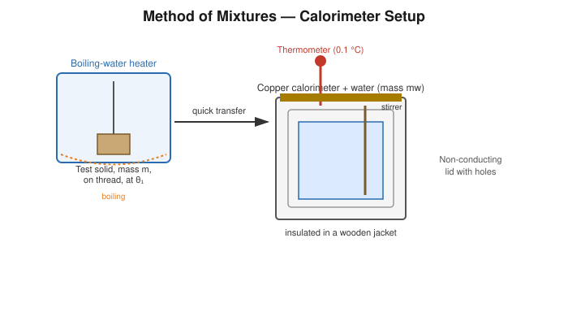

# Determination of the Specific Heat of a Solid by the Method of Mixtures (with Radiation Correction)

## Aim

To determine the specific heat capacity of a given solid (in the form of shots/blocks) by the method of mixtures, applying a correction for heat lost by radiation and convection to the surroundings.

## Apparatus / Equipment

- Copper calorimeter with stirrer, enclosed in a wooden (insulating) jacket
- Given solid specimen (metal shots/blocks) with a thread for suspension
- Heating vessel to boil water, tripod stand and burner
- Two thermometers (0.1 °C least count)
- Physical balance / digital balance
- Stopwatch
- Measuring cylinder

## Principle / Theory

The method of mixtures is based on the **principle of calorimetry**: when a hot body is placed in contact with a cold body inside an insulated (isolated) system, heat flows from the hot body to the cold body until thermal equilibrium is reached, and in the ideal case,

$$
\text{Heat lost by the hot solid} = \text{Heat gained by the calorimeter and water}
$$

In practice, however, the calorimeter is never perfectly insulated: while its temperature is above room temperature, it continuously loses some heat to the surroundings by radiation and convection. If this loss is ignored, the calculated specific heat comes out too high (since the true temperature rise was actually larger than what is measured after some heat has already leaked out). A **radiation correction** is therefore applied to obtain the temperature rise that *would* have occurred if there were no heat exchange with the surroundings.

The correction is estimated using **Newton's law of cooling**, i.e. that the rate of heat loss (and hence rate of temperature fall) is proportional to the excess of temperature over the surroundings. Practically, the temperature of the calorimeter is recorded at fixed time intervals for a few minutes before mixing and for several minutes after the observed maximum temperature is reached. The cooling rate observed *after* the maximum (when the calorimeter is falling back towards room temperature) is used to estimate how much temperature was lost by radiation during the *rise* itself, and this amount is added back to the observed maximum to obtain the **corrected (true) temperature of mixture**, $\theta_2'$.

**Symbols**

| Symbol | Meaning | SI unit |
|---|---|---|
| $m_1$ | Mass of calorimeter + stirrer | kg |
| $s_1$ | Specific heat of calorimeter material (e.g. copper) | J kg⁻¹K⁻¹ |
| $m_2$ | Mass of water in calorimeter | kg |
| $s_w$ | Specific heat of water $=4186\ \text{J kg}^{-1}\text{K}^{-1}$ | J kg⁻¹K⁻¹ |
| $m$ | Mass of the solid specimen | kg |
| $s$ | Specific heat of the solid (to determine) | J kg⁻¹K⁻¹ |
| $\theta_1$ | Initial (room) temperature of calorimeter + water | °C |
| $\theta$ | Temperature of boiling water bath (= initial temperature of solid) | °C |
| $\theta_2$ | Observed maximum temperature after mixing | °C |
| $\theta_2'$ | Corrected (true) temperature of mixture | °C |
| $d\theta$ | Radiation correction, $=\theta_2'-\theta_2$ | °C |

## Formula / Working Equation

Heat balance (using the corrected final temperature):

$$
m\,s\,(\theta-\theta_2') = (m_1 s_1 + m_2 s_w)(\theta_2'-\theta_1)
$$

$$
\boxed{s = \dfrac{(m_1 s_1 + m_2 s_w)(\theta_2'-\theta_1)}{m(\theta-\theta_2')}}
$$

The radiation correction itself is estimated from the post-mixing cooling data as

$$
d\theta = \frac{r_2}{2}\,(t_2-t_0)
$$

where $r_2$ is the rate of fall of temperature (per minute) observed after the maximum, and $(t_2-t_0)$ is the time taken from the instant of mixing to the instant of the observed maximum temperature. (Where a full temperature–time curve is recorded, the more rigorous graphical extrapolation described below may instead be used.)

## Experimental Setup

The solid specimen is suspended by a thread inside a vessel of water that is kept boiling, so that the specimen attains the steady temperature of boiling water. It is then transferred quickly into a calorimeter containing a known mass of water at a temperature a few degrees below room temperature (so that the average temperature during the experiment is close to room temperature, minimising net heat exchange with the surroundings). The mixture is stirred continuously and its temperature recorded at regular time intervals both before and after mixing.

## Diagram / Experimental Arrangement

## Procedure

1. Weigh the empty calorimeter with stirrer ($m_1$); pour in enough water to just cover the solid specimen when it is later dropped in, and weigh again to get $m_2$.
2. Suspend the solid specimen by a thread in the heating vessel and boil the water steadily; note the steam/boiling-water temperature $\theta$ once steady (record barometric conditions if relevant).
3. Cool the calorimeter and water a few degrees below room temperature (e.g. by a few ice pieces, removed before starting) so that its temperature will rise *through* room temperature during the run.
4. Starting a stopwatch, record the calorimeter temperature at 1-minute intervals for about 5 minutes **before** transferring the solid (this establishes the initial, slow, "before-mixing" rate).
5. Quickly transfer the hot solid from the boiling-water bath into the calorimeter, minimising heat loss during transfer, and stir continuously.
6. Continue noting the temperature at short intervals (e.g. every half-minute) as it rises rapidly, and note the **maximum temperature reached**, $\theta_2$, together with the time at which it occurs.
7. Continue recording the temperature at 1-minute intervals for a further 5–10 minutes **after** the maximum, as it falls slowly (this establishes the "after-mixing" cooling rate $r_2$).
8. Tabulate the full temperature–time data and either apply the rate-correction formula, or plot the temperature–time graph and extrapolate the after-mixing cooling line backward to the instant of mixing to read off the corrected temperature $\theta_2'$ directly.
9. Repeat the experiment once more for consistency.

## Observation Table

**Mass of calorimeter + stirrer, $m_1$** = ______ kg &nbsp;&nbsp; **Mass of water, $m_2$** = ______ kg
**Mass of solid, $m$** = ______ kg &nbsp;&nbsp; **Specific heat of calorimeter material, $s_1$** = ______ J kg⁻¹K⁻¹

**Temperature–time readings**

| Time (min) | Before mixing θ (°C) | Time (min) | After mixing θ (°C) |
|---|---|---|---|
| 0 | | | |
| 1 | | | |
| 2 | | | |
| 3 | | | |
| 4 | | | |

**Key temperatures**

| Quantity | Value |
|---|---|
| Room/initial temperature, $\theta_1$ | |
| Boiling-water (solid) temperature, $\theta$ | |
| Observed maximum temperature, $\theta_2$ | |
| Cooling rate after mixing, $r_2$ (°C/min) | |
| Corrected temperature, $\theta_2'$ | |

## Calculations

**Radiation correction:**
$$
d\theta = \frac{r_2}{2}(t_2-t_0) = \_\_\_\_\_\ ^\circ\text{C}, \qquad \theta_2' = \theta_2 + d\theta = \_\_\_\_\_\ ^\circ\text{C}
$$

**Specific heat of solid:**
$$
s = \frac{(m_1 s_1 + m_2 s_w)(\theta_2'-\theta_1)}{m(\theta-\theta_2')}
$$

$$
s = \frac{[(\_\_\_\_\_)(\_\_\_\_\_)+(\_\_\_\_\_)(4186)](\_\_\_\_\_)}{(\_\_\_\_\_)(\_\_\_\_\_)} = \_\_\_\_\_\ \text{J kg}^{-1}\text{K}^{-1}
$$

## Result

The specific heat capacity of the given solid, corrected for radiation loss, is:

$$
s = \_\_\_\_\_\ \text{J kg}^{-1}\text{K}^{-1}
$$

## Precautions

- Transfer the hot solid from the boiling bath to the calorimeter as quickly as possible to minimise heat loss in transit.
- Start with the calorimeter a few degrees below room temperature so the mean temperature during the run is close to ambient, reducing net radiation loss.
- Stir continuously (without splashing) both before and after mixing for uniform temperature.
- Record temperature–time readings at strictly regular intervals for an accurate cooling-rate estimate.
- Ensure the solid is completely dry before weighing and before immersion, so water is not carried over.
- Avoid draughts and direct sunlight/heater radiation falling on the calorimeter during the run.

## Sources / References

- 1911 *Encyclopædia Britannica*, "Calorimetry" — method of mixtures and radiation-loss correction, classical treatment.
- University of Toronto, Physics Laboratory — "Specific Heat and Calorimetry", cooling-correction method using Newton's law of cooling.
- Science Museum (Malta) — description of Regnault-type apparatus for specific heat by mixtures with cooling correction.
