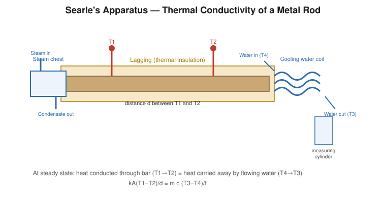

# Determination of the Thermal Conductivity of Metals (Searle's Method)

## Aim

To determine the coefficient of thermal conductivity $k$ of the material of a given metal rod (a good conductor) by Searle's steady-state method.

## Apparatus / Equipment

- Searle's apparatus: a metal (e.g. copper) bar lagged with insulation, fitted with a steam chest at one end and a cooling-water coil at the other
- Four thermometers $T_1, T_2$ (embedded in the bar) and $T_3, T_4$ (in the outflowing and inflowing cooling water)
- Steam generator
- Constant-head arrangement / tap for steady water flow through the coil
- Stopwatch
- Measuring cylinder and beaker
- Vernier calipers (for the bar diameter) and metre scale (for the distance between $T_1$ and $T_2$)

## Principle / Theory

Heat conduction along a bar is governed by **Fourier's law**: the rate of heat flow through a cross-section is proportional to the cross-sectional area and to the temperature gradient along the direction of flow:

$$
\frac{dQ}{dt} = -kA\frac{d\theta}{dx}
$$

where $k$ is the thermal conductivity of the material. In **Searle's method**, one end of a well-lagged metal bar is kept at a steady high temperature by steam, while the other end is continuously cooled by a slow, steady flow of water through a coil. After some time, every point of the bar attains a constant temperature that no longer changes with time — this is the **steady state** — although a temperature gradient still exists along the bar because heat is entering at one end and leaving at the other at the same rate.

At steady state, the heat conducted per second across the bar between two fixed points $T_1$ and $T_2$ (distance $d$ apart) equals the heat carried away per second by the cooling water, provided lateral heat loss through the lagging is negligible:

$$
\underbrace{\frac{kA(T_1-T_2)}{d}}_{\text{conducted through bar}} = \underbrace{\frac{mc(T_3-T_4)}{t}}_{\text{carried by water}}
$$

**Symbols**

| Symbol | Meaning | SI unit |
|---|---|---|
| $A$ | Cross-sectional area of bar, $=\pi D^2/4$ | m² |
| $D$ | Diameter of the bar | m |
| $d$ | Distance between the thermometers $T_1$ and $T_2$ | m |
| $T_1, T_2$ | Steady temperatures at the two points on the bar ($T_1>T_2$) | °C |
| $T_3, T_4$ | Steady temperatures of outgoing and incoming cooling water | °C |
| $m$ | Mass of water collected in time $t$ | kg |
| $c$ | Specific heat capacity of water $= 4186\ \text{J kg}^{-1}\text{K}^{-1}$ | J kg⁻¹K⁻¹ |
| $k$ | Thermal conductivity of the bar material | W m⁻¹K⁻¹ |

## Formula / Working Equation

$$
kA\frac{(T_1-T_2)}{d} = \frac{mc(T_3-T_4)}{t}
$$

$$
\boxed{k = \dfrac{m\,c\,(T_3-T_4)\,d}{A\,t\,(T_1-T_2)}}
$$

## Experimental Setup

The test bar is lagged along its whole length to minimise radial heat loss. One end sits in a steam chest heated by a steam generator; the other end is wound with a copper cooling coil through which water flows at a controlled, steady rate from a constant-head device. Thermometers $T_1$ and $T_2$ are inserted into holes drilled into the bar at two fixed points; $T_3$ measures the temperature of water leaving the coil, and $T_4$ the temperature of water entering it.

## Diagram / Experimental Arrangement

## Procedure

1. Measure the diameter $D$ of the bar with Vernier calipers at several points and take the mean; calculate $A=\pi D^2/4$.
2. Measure the distance $d$ between the holes containing $T_1$ and $T_2$ using a metre scale.
3. Insert thermometers $T_1$, $T_2$ into the bar (using a little mercury or oil in the holes for good thermal contact) and $T_3$, $T_4$ into the water stream at outlet and inlet respectively.
4. Adjust the constant-head apparatus to give a slow, **steady** flow of cooling water through the coil.
5. Start passing steam through the steam chest and allow the apparatus to run undisturbed.
6. Wait until **all four thermometers show no significant change** (within 0.2 °C) over 5–10 minutes — this indicates steady state.
7. Record $T_1, T_2, T_3, T_4$ at steady state.
8. Simultaneously, using a stopwatch, collect the outflowing water in a measuring cylinder/beaker for a measured time interval $t$ (e.g. 5 minutes) and find its mass $m$.
9. Repeat the mass–time collection two or three times to check that the flow rate is indeed steady, and take the mean.
10. After the experiment, allow the bar to cool before removing the thermometers.

## Observation Table

**Diameter of bar, $D$** = ______ m &nbsp;&nbsp; **Area, $A = \pi D^2/4$** = ______ m²
**Distance between $T_1$ and $T_2$, $d$** = ______ m

| Trial | $T_1$ (°C) | $T_2$ (°C) | $T_3$ (°C) | $T_4$ (°C) | Time, $t$ (s) | Mass of water, $m$ (kg) |
|---|---|---|---|---|---|---|
| 1 | | | | | | |
| 2 | | | | | | |
| 3 | | | | | | |

## Calculations

$$
k = \frac{m\,c\,(T_3-T_4)\,d}{A\,t\,(T_1-T_2)}
$$

Substituting values from a trial:

$$
k = \frac{(\_\_\_\_\_)\times 4186\times(\_\_\_\_\_)\times(\_\_\_\_\_)}{(\_\_\_\_\_)\times(\_\_\_\_\_)\times(\_\_\_\_\_)} = \_\_\_\_\_\ \text{W m}^{-1}\text{K}^{-1}
$$

Take the mean value of $k$ over all trials.

## Result

The thermal conductivity of the given metal bar is:

$$
k = \_\_\_\_\_\ \text{W m}^{-1}\text{K}^{-1}
$$

## Precautions

- Lag the bar thoroughly to reduce radial heat loss, which is neglected in the working formula.
- Ensure the water flow rate is slow and steady; a fast flow gives a very small $(T_3-T_4)$ and large percentage error.
- Do not record readings until true steady state is reached — a premature reading is a major source of error.
- Take the mass of water and the corresponding time interval simultaneously and accurately.
- Make good thermal contact between each thermometer bulb and the bar/water (avoid air gaps).
- Keep the steam supply and water flow undisturbed throughout a run.

## Sources / References

- Searle's Bar Method — thermal conductivity theory and apparatus description, University of the West of Scotland lab notes.
- Physics Lab Manuals, University of Hyderabad — Searle's method for thermal conductivity of a good conductor.
- Thermtest thermal-conductivity educational resources — Searle's apparatus derivation.
